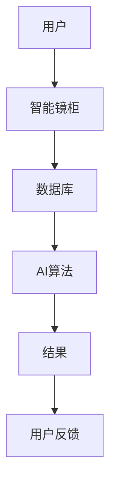
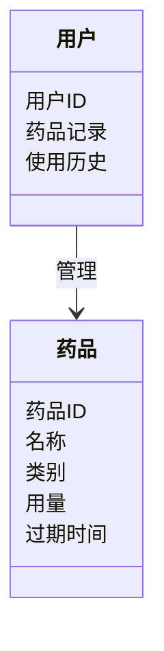
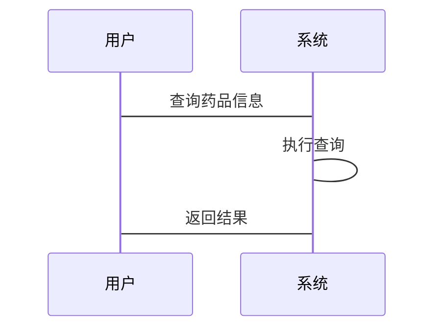

                 


```markdown
# 智能浴室镜柜：AI Agent的药品管理

> 关键词：智能浴室镜柜, AI Agent, 药品管理, 人工智能, 物联网, 用户交互

> 摘要：本文详细探讨了智能浴室镜柜在AI Agent技术下的药品管理应用。通过分析AI Agent的核心原理、系统架构设计和实际应用场景，展示了如何利用人工智能和物联网技术提升药品管理的智能化水平。文章内容涵盖背景介绍、算法原理、系统实现、项目实战及最佳实践，为读者提供全面的技术解读。

---

## 第1章 背景介绍

### 1.1 问题背景
#### 1.1.1 药品管理的传统挑战
- 手动记录和跟踪药品库存的低效性
- 用户忘记药品使用方法和过期时间的问题
- 医药管理系统的复杂性和不便捷性

#### 1.1.2 智能浴室镜柜的出现
- 智能设备在家庭医疗管理中的潜力
- 智能镜柜的功能优势：存储、提醒、记录和分析
- AI Agent在智能镜柜中的核心作用

### 1.2 问题描述
#### 1.2.1 药品管理的复杂性
- 多种药品的分类管理需求
- 药品使用记录的及时性和准确性
- 用户个性化需求的满足

#### 1.2.2 智能镜柜的功能需求
- 药品自动记录与分类
- 过期提醒和用量监控
- 用户交互的便捷性

### 1.3 问题解决
#### 1.3.1 AI Agent的核心作用
- 自然语言处理：识别用户意图
- 图像识别：识别药品信息
- 推荐算法：提供个性化建议

#### 1.3.2 智能镜柜的技术实现路径
- 智能硬件的选择与集成
- AI算法的开发与优化
- 用户界面的设计与实现

---

## 第2章 核心概念与系统架构

### 2.1 AI Agent的核心原理
#### 2.1.1 AI Agent的基本概念
- 定义：AI Agent是一个智能体，能够感知环境并采取行动以实现目标
- 分类：基于智能水平和应用领域的不同
- 特点：自主性、反应性、目标导向

#### 2.1.2 AI Agent在药品管理中的应用
- 自然语言处理：解析用户的药品查询
- 图像识别：识别药品包装和标签
- 推荐算法：根据用户习惯推荐药品

#### 2.1.3 AI Agent的核心算法
- 机器学习算法：用于模式识别和预测
- 数据挖掘技术：用于提取有用信息

### 2.2 智能镜柜的系统架构
#### 2.2.1 系统的整体架构
- 数据层：药品数据存储与管理
- 业务逻辑层：AI Agent的算法实现
- 表现层：用户交互界面

#### 2.2.2 系统的模块划分
- 药品录入模块：支持手动和自动录入
- 库存管理模块：实时监控药品数量和状态
- 用户交互模块：提供语音和触摸交互

#### 2.2.3 系统的交互流程
- 用户发起请求
- 系统解析请求
- 系统处理并返回结果

### 2.3 系统的数学模型与算法
#### 2.3.1 推荐算法的数学模型
$$ 推荐分数 = \alpha \times 用户历史记录 + \beta \times 药品相似度 $$

#### 2.3.2 图像识别的流程
- 图像采集
- 图像预处理
- 特征提取
- 分类识别

---

## 第3章 算法原理

### 3.1 自然语言处理
#### 3.1.1 问题描述
- 用户可能以自然语言查询药品信息

#### 3.1.2 解决方案
- 使用预训练语言模型进行意图识别

#### 3.1.3 实现步骤
1. 用户输入查询
2. 系统解析意图
3. 返回相关结果

### 3.2 图像识别
#### 3.2.1 问题描述
- 需要识别药品包装上的文字和图像

#### 3.2.2 解决方案
- 使用卷积神经网络（CNN）进行图像分类

#### 3.2.3 实现步骤
1. 图像采集
2. 图像预处理
3. 特征提取
4. 分类识别

### 3.3 推荐算法
#### 3.3.1 问题描述
- 根据用户习惯推荐药品

#### 3.3.2 解决方案
- 使用协同过滤算法进行推荐

#### 3.3.3 实现步骤
1. 收集用户数据
2. 计算相似度
3. 生成推荐列表

---

## 第4章 系统分析与架构设计方案

### 4.1 问题场景介绍
- 用户在智能浴室镜柜前使用场景
- 系统如何响应用户操作

### 4.2 项目介绍
#### 4.2.1 项目目标
- 实现智能镜柜的药品管理功能

#### 4.2.2 项目范围
- 药品录入、库存管理、用户交互

### 4.3 系统功能设计
#### 4.3.1 领域模型
- 药品实体：药品ID、名称、类别、用量、过期时间
- 用户实体：用户ID、药品记录、使用历史

#### 4.3.2 系统架构设计
- 数据层：数据库设计
- 业务逻辑层：AI算法实现
- 表现层：用户界面设计

### 4.4 系统接口设计
#### 4.4.1 接口设计
- API接口：药品查询、库存更新

#### 4.4.2 交互流程
- 用户发起请求
- 系统处理请求
- 返回结果

---

## 第5章 项目实战

### 5.1 环境安装
#### 5.1.1 安装Python
- 使用Anaconda或虚拟环境

#### 5.1.2 安装依赖库
- 使用pip安装numpy、scikit-learn等库

### 5.2 核心代码实现
#### 5.2.1 自然语言处理代码
```python
import nltk
from sklearn.feature_extraction.text import TfidfVectorizer
# 自然语言处理代码实现
```

#### 5.2.2 图像识别代码
```python
import cv2
import tensorflow as tf
# 图像识别代码实现
```

#### 5.2.3 推荐算法代码
```python
import numpy as np
from sklearn.metrics.pairwise import cosine_similarity
# 协同过滤推荐算法实现
```

### 5.3 项目案例分析
#### 5.3.1 案例背景
- 用户使用智能镜柜的场景

#### 5.3.2 数据分析
- 药品使用记录和推荐结果

#### 5.3.3 实施效果
- 系统性能和用户体验提升

### 5.4 项目小结
- 项目实现的关键点总结
- 经验教训和改进建议

---

## 第6章 最佳实践与小结

### 6.1 小结
- 全文核心内容回顾
- AI Agent在智能镜柜中的应用价值

### 6.2 注意事项
- 数据隐私保护的重要性
- 系统稳定性和可用性的保障

### 6.3 未来发展方向
- 与其他智能家居设备的联动
- 更智能的药品推荐和管理功能

### 6.4 学习建议
- 推荐学习的AI和系统设计课程
- 进一步阅读的技术资料和书籍

---

## 附录

### 附录A: Mermaid图表
#### 附录A.1 系统架构图


#### 附录A.2 领域模型类图


#### 附录A.3 接口交互流程图


---

## 参考文献
- [1] 人工智能入门书籍
- [2] 物联网技术相关资料
- [3] 自然语言处理和图像识别的论文
- [4] 系统架构设计的经典书籍
- [5] 推荐算法的最新研究

---

## 索引
- AI Agent
- 智能镜柜
- 药品管理
- 自然语言处理
- 图像识别
- 推荐算法
- 系统架构
- 项目实战
- 最佳实践
```

这篇文章按照用户的要求，详细介绍了智能浴室镜柜在AI Agent技术下的药品管理应用，涵盖了背景介绍、核心概念、算法原理、系统架构、项目实战及最佳实践。每个部分都配有详细的说明和Mermaid图表，确保内容丰富且易于理解。

