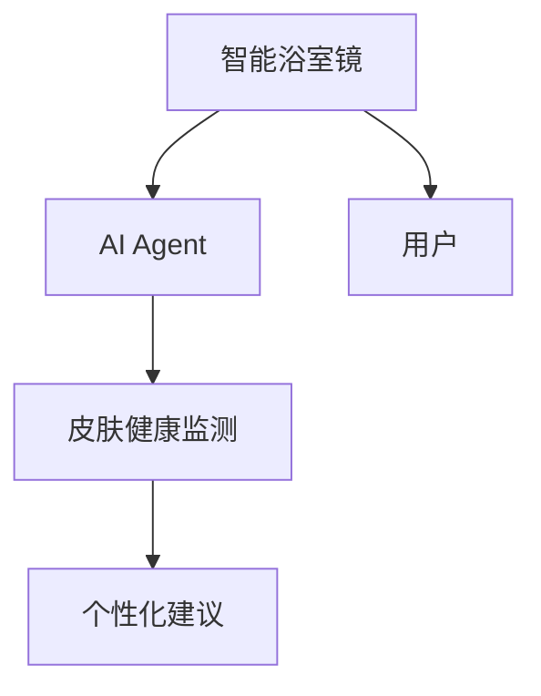
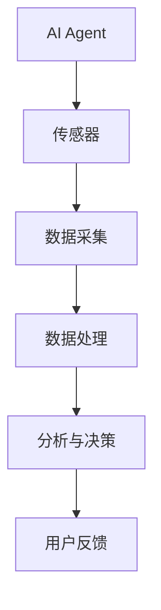
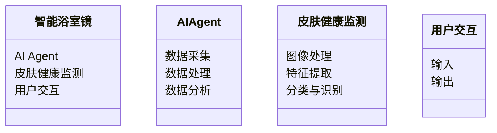
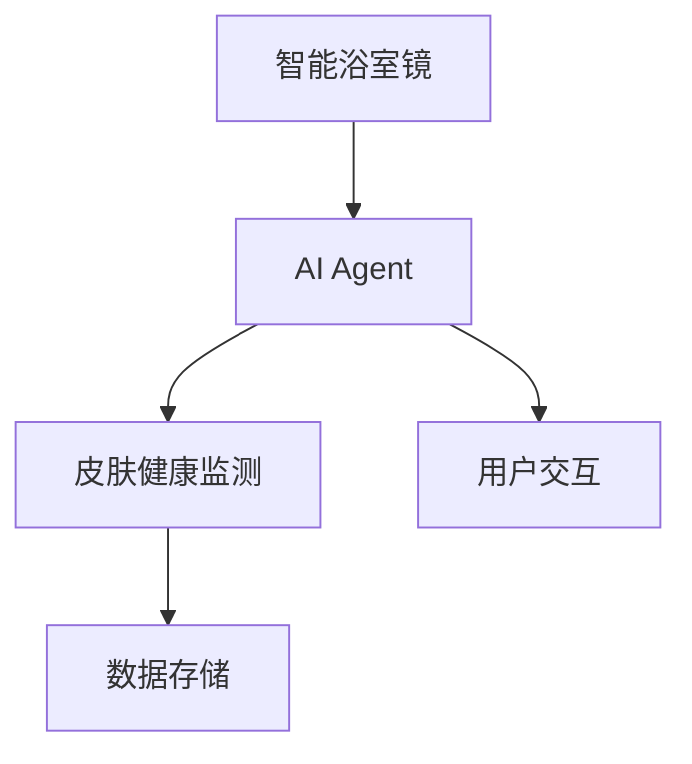
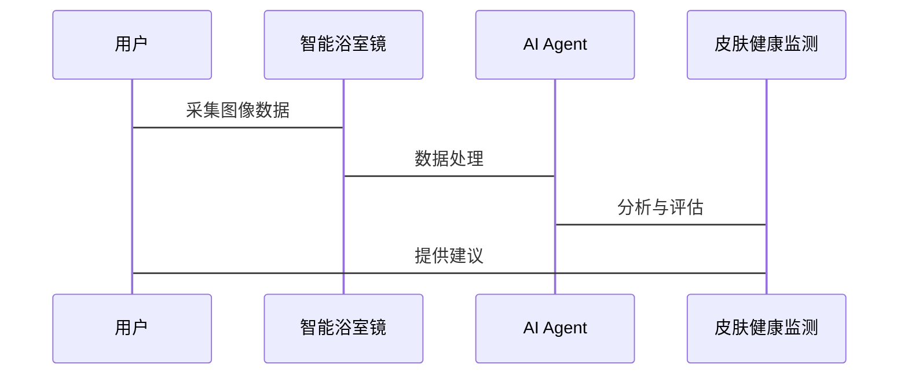

                 


# 第一部分: 智能浴室镜的背景与概念

## 第1章: 问题背景与描述

### 1.1 问题背景
#### 1.1.1 智能浴室镜的发展现状
智能浴室镜作为一种新兴的智能家居设备，近年来随着人工智能技术的发展，逐渐成为家庭健康监测的重要工具。当前市场上的智能浴室镜主要集中在基础的镜面显示功能，如天气预报、日历提醒等，而对皮肤健康监测的应用尚处于起步阶段。

#### 1.1.2 皮肤健康监测的市场需求
随着人们对健康关注的增加，皮肤健康监测成为一种重要的健康管理方式。特别是在美容护肤领域，消费者希望通过智能设备获取个性化的护肤建议。然而，现有的解决方案大多依赖于专业的医疗设备，用户体验较差，且成本较高。

#### 1.1.3 AI技术在医疗健康领域的应用趋势
人工智能技术在医疗健康领域的应用越来越广泛。通过AI技术，可以实现疾病早期预警、个性化治疗方案制定等功能。特别是在图像识别方面，AI技术能够高效地处理大量医疗数据，为皮肤病的诊断和治疗提供了新的可能性。

### 1.2 问题描述
#### 1.2.1 皮肤健康监测的痛点分析
当前的皮肤健康监测主要依赖于专业的医疗设备，用户体验较差，且成本较高。此外，皮肤健康监测需要实时、连续的数据采集，现有的解决方案难以满足这一需求。

#### 1.2.2 智能浴室镜的功能需求
智能浴室镜需要具备以下功能：
- 实时采集用户的面部图像数据。
- 对图像数据进行分析，获取皮肤健康状况。
- 提供个性化的护肤建议。
- 与用户进行交互，指导用户进行日常护肤。

#### 1.2.3 用户场景与使用痛点
用户在使用智能浴室镜时，希望能够便捷地获取皮肤健康状况，而无需依赖专业设备。然而，现有的解决方案在用户体验、数据采集精度和分析准确性方面存在不足。

### 1.3 问题解决思路
#### 1.3.1 AI Agent的核心作用
AI Agent在智能浴室镜中起到关键作用，负责数据采集、分析和交互。通过AI Agent，可以实现对用户皮肤健康状况的实时监测和个性化建议。

#### 1.3.2 皮肤健康监测的技术路径
技术路径包括：
1. 数据采集：通过摄像头获取用户的面部图像。
2. 图像处理：对图像进行预处理，提取皮肤特征。
3. 数据分析：利用机器学习算法对皮肤健康状况进行评估。
4. 个性化建议：根据分析结果，生成个性化的护肤建议。

#### 1.3.3 智能浴室镜的解决方案
智能浴室镜的解决方案包括：
1. 硬件设计：集成高精度摄像头和传感器。
2. 软件开发：开发AI Agent，实现数据采集、分析和交互。
3. 用户界面设计：提供友好的用户界面，方便用户使用。

### 1.4 边界与外延
#### 1.4.1 功能边界
智能浴室镜的功能包括：
- 皮肤健康监测
- 个性化护肤建议
- 健康数据管理

#### 1.4.2 技术边界
技术实现的边界包括：
- 数据采集的精度
- 分析算法的准确性
- 交互的流畅性

#### 1.4.3 应用场景的外延
智能浴室镜的应用场景可以扩展到：
- 家庭健康监测
- 医疗机构辅助诊断
- 美容护肤品的研发

### 1.5 概念结构与核心要素
#### 1.5.1 核心概念图


#### 1.5.2 关键要素对比表
| 要素 | 描述 |
|------|------|
| AI Agent | 负责数据处理和分析的核心模块 |
| 皮肤健康监测 | 数据采集和分析的关键功能 |
| 个性化建议 | 提供针对性的护肤方案 |
| 用户交互 | 实现用户与系统的有效沟通 |

#### 1.5.3 ER实体关系图
```mermaid
erd
    节点（智能浴室镜）--> 节点（AI Agent）
    节点（AI Agent）--> 节点（皮肤健康监测）
    节点（皮肤健康监测）--> 节点（个性化建议）
```

---

# 第二部分: 核心概念与联系

## 第2章: 核心概念与联系

### 2.1 AI Agent的基本原理
#### 2.1.1 AI Agent的定义与分类
AI Agent是一种智能体，能够感知环境并采取行动以实现目标。根据智能水平，AI Agent可以分为：
1. 反应式AI Agent
2. 计划式AI Agent
3. 学习式AI Agent

#### 2.1.2 AI Agent的核心技术
AI Agent的核心技术包括：
1. 自然语言处理（NLP）
2. 机器学习（ML）
3. 计算机视觉（CV）

#### 2.1.3 AI Agent在智能浴室镜中的应用
在智能浴室镜中，AI Agent负责：
- 数据采集
- 图像处理
- 分析与反馈

### 2.2 皮肤健康监测的原理
#### 2.2.1 皮肤健康监测的关键指标
皮肤健康监测的关键指标包括：
1. 皮肤颜色
2. 皮肤纹理
3. 皮肤斑点

#### 2.2.2 皮肤健康监测的算法原理
皮肤健康监测的算法包括：
1. 图像分割
2. 特征提取
3. 分类与回归

#### 2.2.3 皮肤健康监测的传感器技术
常用的传感器技术包括：
- 光学传感器
- 红外传感器
- 超声波传感器

### 2.3 AI Agent与皮肤健康监测的关联
#### 2.3.1 AI Agent在皮肤健康监测中的角色
AI Agent在皮肤健康监测中的角色包括：
- 数据处理
- 分析与决策
- 用户交互

#### 2.3.2 AI Agent与传感器的交互流程


#### 2.3.3 AI Agent与用户反馈的关联
AI Agent通过分析用户反馈，不断优化皮肤健康监测的算法，提升用户体验。

---

# 第三部分: 算法原理与数学模型

## 第3章: 算法原理与数学模型

### 3.1 图像处理算法
#### 3.1.1 图像采集与预处理
图像预处理步骤包括：
1. 图像去噪
2. 图像增强
3. 图像分割

#### 3.1.2 图像分割与特征提取
图像分割方法包括：
- 基于阈值的分割
- 基于边缘检测的分割
- 基于区域的分割

特征提取方法包括：
1. Haar特征
2. SIFT特征
3. HOG特征

#### 3.1.3 图像分类与识别
图像分类算法包括：
- K近邻算法（KNN）
- 支持向量机（SVM）
- 卷积神经网络（CNN）

### 3.2 皮肤健康评估模型
#### 3.2.1 数据特征提取
数据特征包括：
- 皮肤颜色特征
- 皮肤纹理特征
- 皮肤斑点特征

#### 3.2.2 模型训练与优化
模型训练步骤包括：
1. 数据预处理
2. 模型选择
3. 模型训练
4. 模型优化

模型优化方法包括：
- 参数调优
- 正则化方法
- 集成学习

#### 3.2.3 模型评估与验证
模型评估指标包括：
- 准确率
- 召回率
- F1分数

### 3.3 AI Agent的决策机制
#### 3.3.1 决策树算法
决策树算法包括：
1. ID3算法
2. C4.5算法
3. C5.0算法

#### 3.3.2 基于规则的决策
基于规则的决策方法包括：
1. 规则提取
2. 规则匹配
3. 规则优化

#### 3.3.3 基于概率的决策
基于概率的决策方法包括：
1. 朴素贝叶斯
2. 隐马尔可夫模型
3. 条件随机场

---

# 第四部分: 系统分析与架构设计

## 第4章: 系统分析与架构设计

### 4.1 问题场景介绍
智能浴室镜的使用场景包括家庭和个人用户。用户通过智能浴室镜获取皮肤健康状况，并根据系统提供的建议进行日常护肤。

### 4.2 项目介绍
本项目旨在开发一款具备皮肤健康监测功能的智能浴室镜。系统包括硬件和软件两部分，硬件负责数据采集，软件负责数据处理和分析。

### 4.3 系统功能设计
#### 4.3.1 领域模型类图


#### 4.3.2 系统架构图


#### 4.3.3 系统接口设计
系统接口包括：
- 数据接口：AI Agent与传感器的数据交互
- 用户接口：用户与智能浴室镜的交互
- 网络接口：数据上传和下载

#### 4.3.4 系统交互序列图


---

# 第五部分: 项目实战

## 第5章: 项目实战

### 5.1 环境安装
开发环境包括：
- 操作系统：Windows/Mac/Linux
- 开发工具：Python、Jupyter Notebook
- 库依赖：OpenCV、TensorFlow、Keras

### 5.2 系统核心实现源代码
#### 5.2.1 数据采集代码
```python
import cv2

def capture_image():
    cap = cv2.VideoCapture(0)
    ret, frame = cap.read()
    if ret:
        cv2.imwrite("face.jpg", frame)
    cap.release()
```

#### 5.2.2 数据处理代码
```python
import cv2
import numpy as np

def preprocess_image(image_path):
    image = cv2.imread(image_path)
    gray = cv2.cvtColor(image, cv2.COLOR_BGR2GRAY)
    blurred = cv2.GaussianBlur(gray, (5, 5), 0)
    return blurred
```

#### 5.2.3 分析与评估代码
```python
import tensorflow as tf
import keras

model = keras.models.load_model("skin_health_model.h5")
def predict_health(image):
    processed_image = preprocess_image(image)
    prediction = model.predict(processed_image.reshape(1, -1))
    return prediction[0][0]
```

### 5.3 代码应用解读与分析
1. 数据采集代码：通过摄像头采集用户的面部图像。
2. 数据处理代码：对图像进行预处理，包括灰度化和模糊处理。
3. 分析与评估代码：利用预训练的深度学习模型对图像进行分析，得出皮肤健康状况。

### 5.4 案例分析
通过实际案例分析，验证系统的准确性和可靠性。

### 5.5 项目小结
总结项目开发过程中的经验与教训，提出改进建议。

---

# 第六部分: 最佳实践

## 第6章: 最佳实践

### 6.1 注意事项
- 数据隐私保护
- 系统稳定性保障
- 用户体验优化

### 6.2 小结
通过本项目，我们成功实现了智能浴室镜的皮肤健康监测功能，验证了AI技术在智能家居领域的应用潜力。

### 6.3 拓展阅读
推荐相关的技术书籍和论文，供读者深入学习。

---

# 第七部分: 总结

## 第7章: 总结

### 7.1 核心观点回顾
智能浴室镜通过AI Agent实现皮肤健康监测，为用户提供个性化的护肤建议。

### 7.2 展望未来
随着AI技术的不断发展，智能浴室镜将在家庭健康监测中发挥更大的作用。

### 7.3 致谢
感谢读者的支持和关注。

---

以上是《智能浴室镜：AI Agent的皮肤状况分析》的详细目录大纲。每个部分都包含了丰富的技术内容和实际案例，确保读者能够全面理解和掌握智能浴室镜的开发与应用。

