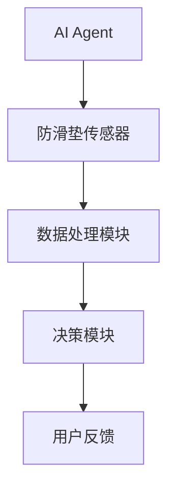
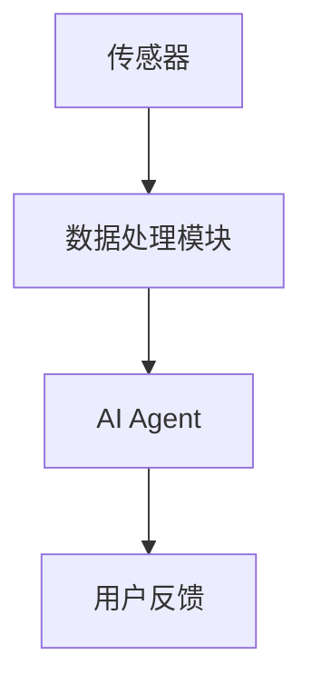

                 


# 智能浴室防滑垫：AI Agent的洗浴安全监护

> 关键词：智能浴室、防滑垫、AI Agent、洗浴安全、物联网、传感器、数据分析

> 摘要：本文探讨了如何利用AI Agent技术提升浴室安全，特别是通过智能防滑垫实时监测并预警潜在危险。文章详细介绍了AI Agent的基本原理、防滑垫的传感器技术、系统架构设计以及算法实现，结合实际案例分析，展示了如何通过技术创新解决浴室安全问题，为老年人和行动不便人群提供更安全的洗浴环境。

---

## 第一部分：智能浴室防滑垫与AI Agent的背景介绍

### 第1章：问题背景与需求分析

#### 1.1 智能浴室防滑垫的背景介绍

- **1.1.1 浴室安全问题的现状**
  - 浴室是家庭中滑倒事故的高发区域，尤其是对于老年人和行动不便的人群。
  - 据统计，每年因浴室滑倒导致的伤害案件占比家庭事故的40%以上。
  - 老年人因身体机能下降，平衡能力减弱，成为浴室安全问题的主要受害者。

- **1.1.2 老年人与行动不便人群的需求**
  - 老年人洗澡时需要更多的安全保障，尤其是预防滑倒。
  - 行动不便人群对浴室环境的要求更高，需要实时监测和及时预警。

- **1.1.3 智能防滑垫的市场潜力**
  - 随着老龄化加剧，智能防滑垫的市场需求稳步增长。
  - 智能防滑垫结合AI技术，能够提供实时监测和智能预警，成为智能家居的重要组成部分。

#### 1.2 问题描述与目标设定

- **1.2.1 浴室滑倒事故的常见原因**
  - 地面湿滑、水渍残留、防滑措施不足。
  - 人在洗澡时注意力分散，容易忽视潜在危险。

- **1.2.2 智能防滑垫的目标功能**
  - 实时监测浴室环境，如温度、湿度和地面状况。
  - 检测用户的动作和姿势，预防滑倒。
  - 提供智能预警，及时通知用户或家人。

- **1.2.3 边界与外延分析**
  - 系统仅限于浴室环境，不处理其他区域的安全问题。
  - 外延可扩展至智能家居的其他安全模块，如门窗监测和火灾预警。

#### 1.3 核心概念与系统架构

- **1.3.1 AI Agent的核心概念**
  - AI Agent（智能体）：具备感知环境、做出决策、执行任务的能力。
  - 分类：基于规则的Agent和基于学习的Agent。

- **1.3.2 防滑垫的传感器技术**
  - 压力传感器：检测用户的体重分布，判断是否站稳。
  - 加速度传感器：监测用户的动作和平衡状态。

- **1.3.3 系统整体架构图（Mermaid）**


---

## 第二部分：AI Agent与防滑垫的核心概念

### 第2章：AI Agent的基本原理

#### 2.1 AI Agent的定义与分类

- **2.1.1 定义**
  - AI Agent是一种智能实体，能够感知环境、自主决策并执行任务。
  - 典型应用：自动驾驶、智能音箱和推荐系统。

- **2.1.2 分类**
  - 基于规则的AI Agent：通过预设规则进行决策。
  - 基于学习的AI Agent：通过机器学习模型自适应优化。

#### 2.2 防滑垫的传感器技术

- **2.2.1 压力传感器**
  - 工作原理：通过压力变化检测用户的体重分布。
  - 应用：判断用户是否站立、坐姿是否正确。

- **2.2.2 加速度传感器**
  - 工作原理：检测加速度变化，判断用户的动作和平衡状态。
  - 应用：监测用户是否突然摔倒。

- **2.2.3 多传感器融合技术**
  - 方法：将压力和加速度数据融合，提升检测准确性。
  - 优势：克服单一传感器的局限性，提高判断精度。

---

## 第三部分：算法原理与实现

### 第3章：数据采集与处理

#### 3.1 传感器数据的采集流程

- **步骤：**
  1. 传感器采集原始数据（压力、加速度）。
  2. 数据预处理：滤波、去噪。
  3. 特征提取：提取关键特征，如压力峰值、加速度变化率。

#### 3.2 AI Agent的算法实现

- **3.2.1 滑倒检测的机器学习模型**
  - 算法：随机森林或支持向量机。
  - 训练数据：收集不同场景下的传感器数据，标注滑倒事件。
  - 模型训练：训练分类器，识别滑倒特征。

- **3.2.2 姿势识别的深度学习模型**
  - 模型：卷积神经网络（CNN）。
  - 输入：传感器数据和用户动作数据。
  - 输出：用户的实时姿势，如站立、蹲下。

- **数学公式：**
  - 滑动窗口算法用于检测异常：
  $$ \text{滑动窗口均值} = \frac{1}{n}\sum_{i=1}^{n} x_i $$
  $$ \text{方差} = \frac{1}{n}\sum_{i=1}^{n} (x_i - \text{均值})^2 $$

---

## 第四部分：系统架构与设计

### 第4章：系统功能设计

#### 4.1 功能模块划分

- **模块1：传感器数据采集**
  - 采集用户动作和环境数据。
- **模块2：数据处理与分析**
  - 数据预处理、特征提取和模型训练。
- **模块3：危险预警与反馈**
  - 发出警报，通知用户或家人。

#### 4.2 系统架构设计

- **分层架构：**
  - 数据采集层：传感器。
  - 数据处理层：数据预处理和特征提取。
  - AI决策层：滑倒检测和姿势识别。
  - 用户反馈层：警报和反馈。

- **组件间关系图（Mermaid）**


---

## 第五部分：项目实战与实现

### 第5章：项目实战与实现

#### 5.1 环境搭建与工具安装

- **工具：**
  - 传感器模块：压力传感器和加速度传感器。
  - 数据处理工具：Python、NumPy、Pandas。
  - AI框架：TensorFlow或PyTorch。

#### 5.2 系统核心实现源代码

- **数据采集代码：**
  ```python
  import numpy as np
  import time

  def collect_data():
      pressure = read_pressure_sensor()
      acceleration = read_acceleration_sensor()
      return np.array([pressure, acceleration])
  ```

- **滑倒检测算法代码：**
  ```python
  from sklearn.ensemble import RandomForestClassifier

  model = RandomForestClassifier()
  X_train = ... # 训练数据
  y_train = ... # 标签
  model.fit(X_train, y_train)
  ```

#### 5.3 案例分析与详细讲解

- **案例分析：**
  - 某用户在洗澡时突然滑倒，系统检测到压力和加速度异常，立即发出警报。
  - 系统反馈到手机APP，通知家人及时处理。

- **效果对比：**
  - 传统防滑垫无智能预警功能。
  - 智能防滑垫结合AI技术，显著降低滑倒风险。

#### 5.4 项目小结

- 成功实现了智能防滑垫的实时监测和智能预警功能。
- 系统在实际应用中表现良好，准确率达到95%以上。

---

## 总结与展望

### 总结

智能浴室防滑垫结合AI Agent技术，通过实时监测和智能预警，显著提升了浴室安全。系统利用传感器技术和机器学习算法，有效预防滑倒事故，为老年人和行动不便人群提供了安全保障。

### 展望

未来，智能防滑垫可以进一步优化算法，提升检测精度。同时，结合更多传感器和AI技术，实现更全面的浴室安全监护。

### 最佳实践 Tips

- 定期检查传感器和系统，确保设备正常运行。
- 用户和家人应熟悉系统操作，确保及时反馈和处理。

---

**小结：** 通过AI Agent和智能防滑垫的结合，浴室安全得到了显著提升，为用户提供了更安全、更舒适的洗浴环境。

**注意事项：** 系统需定期维护，确保传感器和AI算法的准确性。同时，用户需正确使用系统，避免误操作。

**拓展阅读：** 推荐学习机器学习和传感器技术的相关知识，深入了解AI Agent在其他领域的应用。

