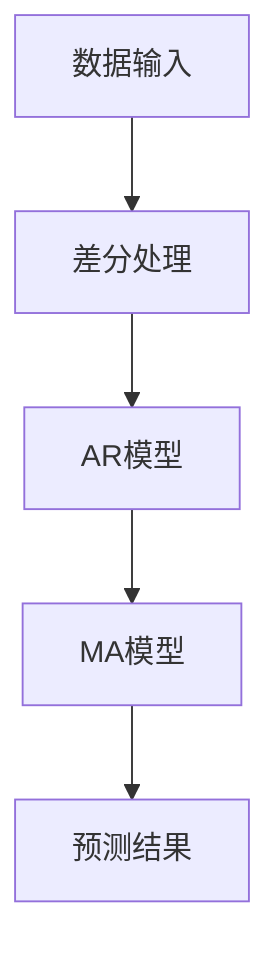
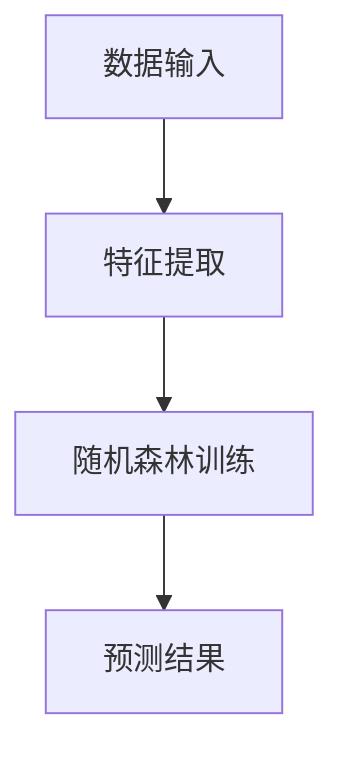
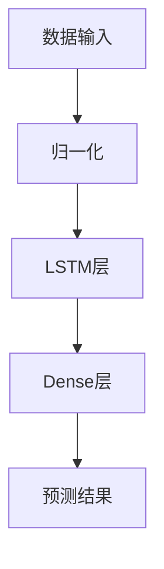
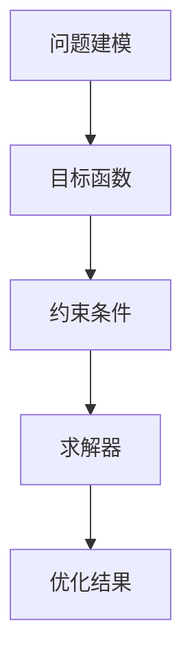
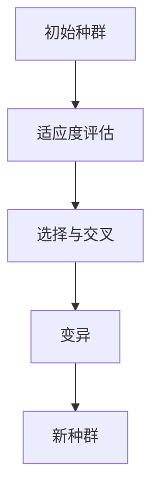
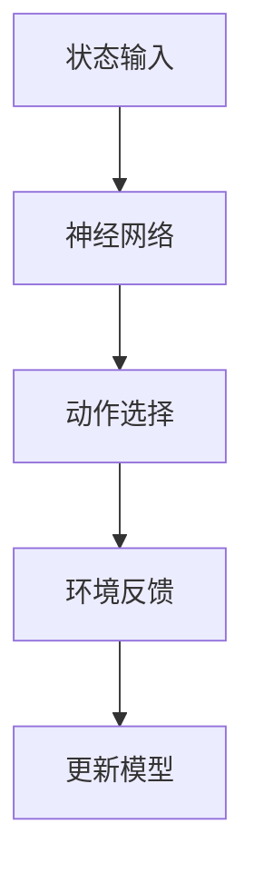
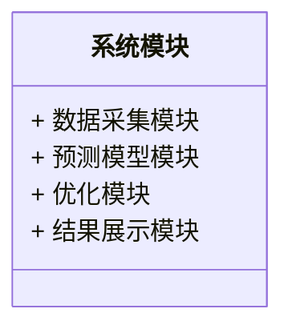
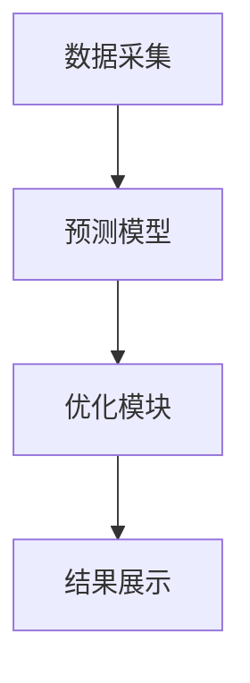
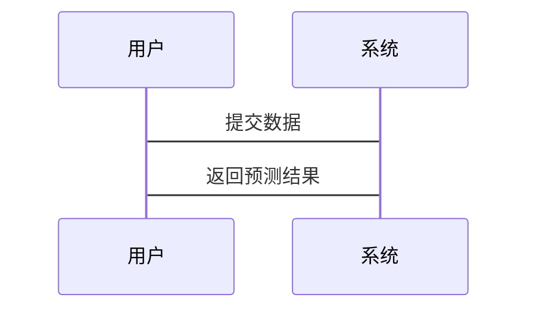

                 


# 智能现金流预测与优化管理平台

> **关键词**：智能现金流预测、人工智能、大数据分析、优化算法、财务管理系统、现金流管理平台、智能技术

> **摘要**：本文深入探讨智能现金流预测与优化管理平台的设计与实现，结合AI和大数据分析技术，提供高效、准确的预测和优化方案。通过系统架构设计、算法原理分析及项目实战，展示如何利用智能技术提升企业现金流管理效率，为企业决策提供有力支持。

---

## 第一章 背景介绍

### 1.1 现金流的重要性

现金流是企业运营的命脉，直接关系到企业的生存与发展。企业需要准确预测未来现金流，以优化资金分配、降低风险并提升盈利能力。

### 1.2 传统方法的局限性

传统现金流预测依赖历史数据和专家经验，但面临数据量不足、预测精度低等问题，难以应对市场波动和复杂变化。

### 1.3 智能技术的应用

人工智能和大数据技术的兴起，为现金流预测带来新机遇。智能模型能处理海量数据，识别复杂模式，显著提升预测准确性。

### 1.4 本书目标

通过理论与实践结合，系统阐述智能现金流预测与优化的方法，为企业提供高效解决方案，助力财务决策。

---

## 第二章 智能现金流预测的核心概念

### 2.1 核心概念解析

智能现金流预测利用AI和大数据，通过机器学习和深度学习模型，分析历史数据和市场趋势，预测未来现金流。

### 2.2 概念对比表

| 特性          | 传统预测方法        | 智能预测方法        |
|---------------|---------------------|--------------------|
| 数据来源      | 历史财务数据        | 历史数据+外部数据   |
| 模型复杂度    | 简单线性模型        | 复杂非线性模型      |
| 预测精度      | 较低                | 较高                |
| 计算效率      | 低                  | 高                  |

### 2.3 ER实体关系图

```mermaid
er
    title 现金流预测实体关系图
    顾客(顾客ID, 交易金额, 交易时间)
    账户(账户ID, 余额, 交易记录)
    预测模型(模型ID, 模型类型, 预测结果)
    流程:
        顾客 -> 账户: 交易影响
        账户 -> 预测模型: 提供数据
        预测模型 -> 账户: 更新预测
```

---

## 第三章 现金流预测的算法原理

### 3.1 时间序列分析

#### 3.1.1 ARIMA模型

ARIMA通过自回归和移动平均预测未来值，适用于具有趋势和季节性的数据。

**公式**：ARIMA(p, d, q)，其中p为自回归阶数，d为差分阶数，q为移动平均阶数。

**流程图**：



**Python代码**：

```python
from statsmodels.tsa.arima_model import ARIMA
import pandas as pd

# 数据加载与训练
data = pd.read_csv('cash_flow.csv')
model = ARIMA(data.cash, order=(5,1,0))
model_fit = model.fit()
```

### 3.2 机器学习模型

#### 3.2.1 随机森林

随机森林通过多棵决策树投票结果预测现金流，适合高维数据。

**流程图**：



**代码示例**：

```python
from sklearn.ensemble import RandomForestRegressor

# 训练数据
X_train = data.drop('target', axis=1)
y_train = data['target']
model = RandomForestRegressor(n_estimators=100)
model.fit(X_train, y_train)
```

### 3.3 深度学习模型

#### 3.3.1 LSTM网络

LSTM擅长时间序列预测，适合捕捉长期依赖关系。

**流程图**：



**代码示例**：

```python
import keras
from keras.layers import LSTM, Dense

model = keras.Sequential()
model.add(LSTM(64, input_shape=(timesteps, features)))
model.add(Dense(1))
model.compile(optimizer='adam', loss='mean_squared_error')
```

---

## 第四章 现金流优化的算法原理

### 4.1 线性规划

线性规划用于优化现金流分配，目标函数和约束条件均为线性。

**公式**：最大化或最小化目标函数，满足线性约束。

**流程图**：



### 4.2 遗传算法

遗传算法模拟自然选择，适用于复杂优化问题。

**流程图**：



**代码示例**：

```python
import numpy as np
from deap import algorithms, base, tools

# 定义适应度函数
def evaluate(individual):
    # 计算现金流优化目标
    return np.sum(individual), 

toolbox = base.Toolbox()
toolbox.register("evaluate", evaluate)
# 其他遗传算法步骤略
```

### 4.3 深度强化学习

深度强化学习结合深度学习和强化学习，适用于动态环境下的优化。

**流程图**：



**代码示例**：

```python
import torch
import torch.nn as nn

# 定义策略网络
class PolicyNet(nn.Module):
    def __init__(self, state_size, action_size):
        super(PolicyNet, self).__init__()
        self.fc1 = nn.Linear(state_size, 128)
        self.fc2 = nn.Linear(128, action_size)
    
    def forward(self, x):
        x = torch.relu(self.fc1(x))
        x = torch.sigmoid(self.fc2(x))
        return x
```

---

## 第五章 系统分析与架构设计

### 5.1 系统功能设计

系统功能包括数据采集、预测模型、优化模块和结果展示。

**类图**：



### 5.2 系统架构设计

采用微服务架构，模块间通过API通信。

**架构图**：



### 5.3 接口设计

使用RESTful API设计模块间的通信接口。

### 5.4 交互设计

用户与系统交互流程：



---

## 第六章 项目实战

### 6.1 环境搭建

安装Python、Jupyter、TensorFlow、Keras等工具。

### 6.2 数据预处理

清洗数据，提取特征，处理缺失值和异常值。

### 6.3 模型训练

使用训练数据训练预测模型，调整参数优化性能。

### 6.4 优化实现

应用优化算法调整现金流分配，提升资金效率。

### 6.5 案例分析

以某企业为例，展示预测与优化的实际效果。

---

## 第七章 总结与展望

### 7.1 总结

智能现金流预测与优化平台利用先进算法，显著提升预测精度和优化效果，为企业财务管理提供有力支持。

### 7.2 未来展望

未来，随着技术进步，智能平台将更加智能化，实时预测和自适应优化将成为可能。

### 7.3 注意事项

实施时需注意数据质量、模型选择和参数调优，确保系统稳定性和预测准确性。

---

**致谢**：感谢读者的支持，欢迎反馈与建议，共同进步。

---

**参考文献**：列出相关文献和工具文档。

---

通过以上内容，文章详细阐述了智能现金流预测与优化管理平台的设计与实现，从理论到实践，为读者提供全面的知识和实用的指导。

