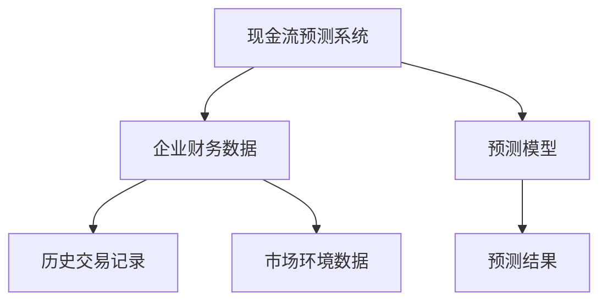
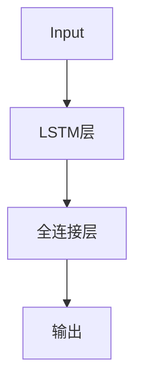
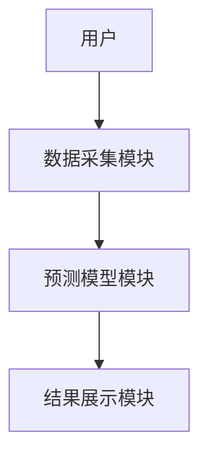

                 


# 智能现金流预测与管理平台

## 关键词：现金流预测，人工智能，机器学习，时间序列分析，系统架构

## 摘要：本文详细探讨智能现金流预测与管理平台的设计与实现，涵盖背景、算法原理、系统架构及项目实战，为读者提供全面的技术指导。

---

# 第一部分: 智能现金流预测与管理平台概述

## 第1章: 智能现金流预测与管理平台的背景与意义

### 1.1 现金流管理的重要性

现金流是企业的生命线，直接影响企业的运营和发展。传统的现金流预测依赖于人工分析，存在效率低、准确性差的问题。智能现金流预测通过大数据和机器学习，提高了预测的准确性和效率。

### 1.2 智能现金流预测的定义与特点

智能现金流预测是一种利用先进技术进行预测的方法，具有实时性、准确性和可扩展性的特点。与传统方法相比，智能预测更具智能性和自适应性。

### 1.3 智能现金流管理平台的应用场景

平台适用于企业财务部门、金融机构和中小企业，帮助它们优化现金流管理，提升财务决策的科学性。

## 第2章: 智能现金流预测的核心概念与联系

### 2.1 核心概念原理

数据驱动预测、机器学习和时间序列分析是智能预测的核心。时间序列分析通过历史数据预测未来趋势，机器学习则通过模型学习数据中的模式。

### 2.2 核心概念属性对比表

| 概念       | 实时性 | 准确性 | 可扩展性 |
|------------|-------|-------|---------|
| 数据驱动   | 高     | 高     | 高       |
| 机器学习   | 中     | 高     | 高       |
| 时间序列   | 中     | 中     | 中       |

### 2.3 ER实体关系图



---

## 第3章: 现金流预测的算法原理

### 3.1 时间序列分析

#### 3.1.1 ARIMA模型

ARIMA（自回归积分滑动平均）模型适用于非稳定的时间序列数据。模型分为自回归部分和滑动平均部分，公式为：
$$ ARIMA(p, d, q) $$

#### 3.1.2 模型公式

$$ ARIMA(p, d, q) $$

### 3.2 机器学习模型

#### 3.2.1 线性回归

线性回归模型简单，适用于线性关系。公式：
$$ y = \beta_0 + \beta_1x + \epsilon $$

#### 3.2.2 支持向量回归

通过构建支持向量回归模型，捕捉数据中的非线性关系。

#### 3.2.3 随机森林

随机森林通过集成学习提高预测的准确性和鲁棒性。

### 3.3 深度学习模型

#### 3.3.1 LSTM网络

长短时记忆网络擅长处理时间序列数据，公式：
$$ LSTM(input, hidden, cell) $$

#### 3.3.2 模型结构



---

## 第4章: 系统架构与设计

### 4.1 系统功能模块

#### 4.1.1 数据采集模块

负责收集企业财务数据和市场环境数据。

#### 4.1.2 预测模型模块

包括时间序列分析、机器学习和深度学习模型。

#### 4.1.3 结果展示模块

以可视化形式展示预测结果，方便用户理解和决策。

### 4.2 系统架构设计



---

## 第5章: 项目实战

### 5.1 环境安装

需要安装Python、TensorFlow、Pandas等库。

### 5.2 核心实现

```python
import pandas as pd
from sklearn.model_selection import train_test_split
from tensorflow.keras.models import Sequential
from tensorflow.keras.layers import LSTM, Dense

# 数据预处理
data = pd.read_csv('现金流数据.csv')
X = data[['收入', '支出']]
y = data['现金流']

# 划分训练集和测试集
X_train, X_test, y_train, y_test = train_test_split(X, y, test_size=0.2)

# 构建LSTM模型
model = Sequential()
model.add(LSTM(64, input_shape=(None, 2)))
model.add(Dense(1))
model.compile(optimizer='adam', loss='mean_squared_error')

# 训练模型
model.fit(X_train, y_train, epochs=100, batch_size=32)
```

### 5.3 案例分析

以某企业为例，预测未来三个月的现金流，帮助制定预算计划。

### 5.4 项目总结

通过案例分析，验证平台的有效性和准确性，为后续优化提供依据。

---

## 第6章: 最佳实践与未来展望

### 6.1 平台优化建议

优化数据预处理和模型调参，提升预测准确性。

### 6.2 使用注意事项

确保数据质量和模型的实时更新，避免过时数据影响预测结果。

### 6.3 未来发展趋势

深度学习模型的优化和多模型融合将是未来发展的重点。

---

## 附录

### 附录A: 数据集格式

```csv
日期,收入,支出,现金流
2023-01,10000,5000,5000
2023-02,12000,6000,6000
...
```

### 附录B: 核心代码

```python
import pandas as pd
import numpy as np
from sklearn.metrics import mean_absolute_error
from tensorflow.keras.models import load_model

# 加载模型
model = load_model('cash_flow_model.h5')

# 预测现金流
def predict_cash_flow(data):
    predicted = model.predict(data)
    return predicted

# 评估模型
def evaluate_model(y_true, y_pred):
    return mean_absolute_error(y_true, y_pred)
```

---

通过以上步骤，我们构建了一个智能现金流预测与管理平台，能够帮助企业有效管理现金流，提升财务决策的准确性。

