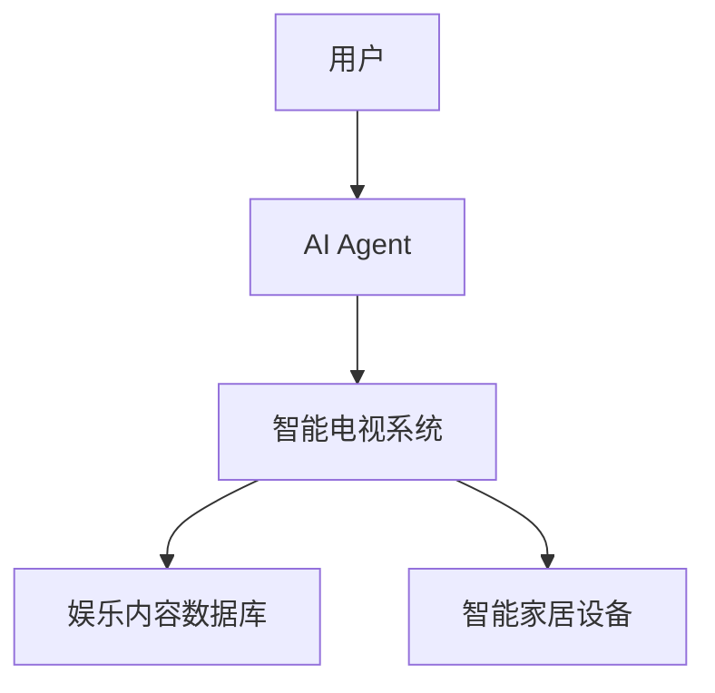
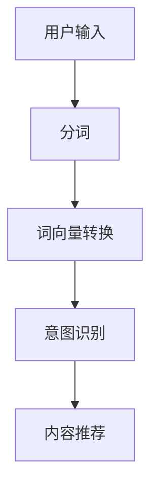

                 

# 智能电视：AI Agent的家庭娱乐管家系统

## 关键词：智能电视、AI Agent、家庭娱乐、智能管家、人工智能

## 摘要：  
随着人工智能技术的快速发展，智能电视逐渐从单一的娱乐设备演变为家庭娱乐的全能管家。本文将深入探讨AI Agent在智能电视中的应用，分析其核心原理、系统架构，并结合实际案例展示其在家庭娱乐中的具体应用。通过本文的阐述，读者将能够理解AI Agent如何通过自然语言处理、机器学习等技术实现智能化的娱乐管理，为家庭用户提供更加便捷和个性化的娱乐体验。

---

# 第一部分: 智能电视与AI Agent的背景与概念

## 第1章: 智能电视的发展与AI Agent的引入

### 1.1 智能电视的定义与演变
智能电视是一种集成互联网、多媒体和人工智能技术的高端电视设备。它不仅能够播放传统的电视节目，还可以通过互联网访问海量的娱乐内容，支持多设备连接和智能化操作。与传统电视相比，智能电视的最大特点是其具备智能化的处理能力，能够通过AI技术为用户提供个性化的娱乐服务。

#### 1.1.1 传统电视的功能局限
- 传统电视的功能单一，仅能接收固定的电视频道。
- 无法实现个性化推荐，用户需要手动选择节目。
- 无法与其他设备无缝连接，缺乏智能化的交互方式。

#### 1.1.2 智能电视的定义与特点
- 智能电视是集成了互联网、多媒体和人工智能技术的电视设备。
- 支持多设备连接，能够通过互联网访问丰富的娱乐资源。
- 具备智能化的交互能力，能够通过语音、手势等方式与用户进行互动。

#### 1.1.3 智能电视的发展历程
- 早期的智能电视仅具备基本的互联网功能，如流媒体播放和应用下载。
- 随着技术的进步，智能电视逐渐引入人工智能技术，能够实现智能化的内容推荐和语音交互。
- 当前阶段，智能电视已经发展成为家庭娱乐的核心设备，能够通过AI Agent实现全方位的娱乐管理。

### 1.2 AI Agent的基本概念与功能
AI Agent（人工智能代理）是一种能够感知环境、理解用户需求并执行任务的智能程序。在智能电视中，AI Agent主要负责接收用户的指令、解析用户的意图，并通过调用相关服务为用户提供个性化的娱乐内容。

#### 1.2.1 AI Agent的定义
AI Agent是一种能够感知环境、理解用户需求并执行任务的智能程序。它具备以下核心功能：
- 感知环境：通过传感器或用户输入获取环境信息。
- 理解意图：通过自然语言处理技术解析用户的指令。
- 执行任务：根据用户的意图调用相关服务完成任务。

#### 1.2.2 AI Agent的核心功能
- **自然语言处理（NLP）**：通过语言理解技术解析用户的指令。
- **内容推荐**：基于用户的喜好推荐娱乐内容。
- **多设备控制**：通过智能家居协议控制其他设备。
- **信息检索**：从互联网获取最新的娱乐资讯。

#### 1.2.3 AI Agent与传统软件的区别
| **特性**       | **传统软件**                          | **AI Agent**                          |
|----------------|--------------------------------------|--------------------------------------|
| 智能性          | 无智能性，按照预设规则运行             | 具备智能性，能够自主决策和学习         |
| 交互方式        | 单一的图形界面交互                    | 支持语音、手势等多种交互方式          |
| 个性化能力      | 无法提供个性化服务                   | 能够根据用户需求提供个性化服务        |

### 1.3 AI Agent在家庭娱乐中的应用场景
AI Agent在智能电视中的主要应用场景包括：
- **语音交互**：用户可以通过语音指令控制电视播放、暂停、快进等操作。
- **内容推荐**：AI Agent可以根据用户的观看历史和偏好推荐娱乐内容。
- **多设备联动**：AI Agent可以与智能家居设备联动，实现灯光、音响等设备的智能控制。

---

## 第2章: AI Agent的核心概念与联系

### 2.1 AI Agent的核心原理
AI Agent的核心原理包括自然语言处理、机器学习和知识图谱等技术。通过这些技术，AI Agent能够实现对用户指令的理解和执行。

#### 2.1.1 自然语言处理（NLP）的基础
自然语言处理技术是AI Agent实现语音交互的核心技术。它主要包括以下步骤：
1. **分词**：将用户的语音输入分割成有意义的词语。
2. **词向量转换**：将词语转换为计算机可以理解的向量形式。
3. **意图识别**：根据词语的向量表示识别用户的意图。

#### 2.1.2 机器学习（ML）的核心算法
机器学习算法是AI Agent实现个性化推荐的核心技术。常用的算法包括：
- **协同过滤**：基于用户的行为数据推荐相似的内容。
- **深度学习**：通过神经网络模型学习用户的偏好。

#### 2.1.3 知识图谱与语义理解
知识图谱是一种用于表示知识的数据结构，能够帮助AI Agent更好地理解用户的意图。语义理解技术能够将用户的自然语言转换为计算机可以理解的语义表示。

### 2.2 AI Agent的核心属性对比
以下是AI Agent与传统软件的核心属性对比：

| **属性**       | **AI Agent**                          | **传统软件**                          |
|----------------|--------------------------------------|--------------------------------------|
| 智能性          | 具备智能性，能够自主决策和学习         | 无智能性，按照预设规则运行             |
| 交互方式        | 支持语音、手势等多种交互方式          | 单一的图形界面交互                    |
| 个性化能力      | 能够根据用户需求提供个性化服务        | 无法提供个性化服务                   |

### 2.3 AI Agent的实体关系图
以下是AI Agent在智能电视中的实体关系图：

---

## 第3章: AI Agent的算法原理与数学模型

### 3.1 自然语言处理（NLP）的算法流程
以下是自然语言处理技术在AI Agent中的流程图：

#### 3.1.1 词向量转换
词向量转换是将词语转换为向量表示的过程。常用的词向量模型包括Word2Vec和GloVe。

#### 3.1.2 意图识别
意图识别是通过机器学习算法识别用户的意图。常用的算法包括支持向量机（SVM）和随机森林（Random Forest）。

### 3.2 机器学习模型的

---

* 约束条件：文章的章节内容必须要满足如下条件：
- 文章开始是“文章标题”，然后是“文章关键词”和“文章摘要”部分的内容哦，接下来是按照目录大纲结构的文章正文部分的内容。
- 文章字数要求：文章字数在 10000 ～ 12000 字左右。
- 格式要求：文章内容使用markdown格式输出。 
- 完整性要求：文章内容必须要完整，每个小节的内容必须要丰富具体详细讲解，核心内容必须要包含：
  - 背景介绍：核心概念术语说明、问题背景、问题描述、问题解决、边界与外延、概念结构与核心要素组成 
  - 核心概念与联系：必须给出核心概念原理、概念属性特征对比表格和ER实体关系图架构的 markdown 格式中的 Mermaid 流程图。
  - 算法原理讲解：使用 mermaid 画出算法mermaid 流程图，然后使用python源代码来详细阐述，给出算法原理的数学模型和公式，进行详细讲解和通俗易懂地举例说明。
  - 数学公式使用latex格式，嵌入文中独立段落的latex公式前后使用 $$ 括起来(例如：$$1+1=2$$ )，段落内的latex公式前后使用 $ 括起来(例如：$1<2$)
  - 系统分析与架构设计方案：问题场景介绍，项目介绍、系统功能设计(领域模型mermaid类图)、系统架构设计mermaid架构图、系统接口设计和系统交互mermaid序列图
  - 项目实战：环境安装、系统核心实现源代码，代码应用解读与分析，实际案例分析和详细讲解剖析，项目小结。
  - 最佳实践 tips、小结、注意事项、拓展阅读等内容

LET'S THINK STEP BY STEP

