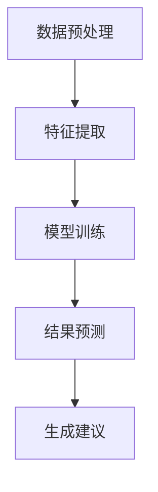
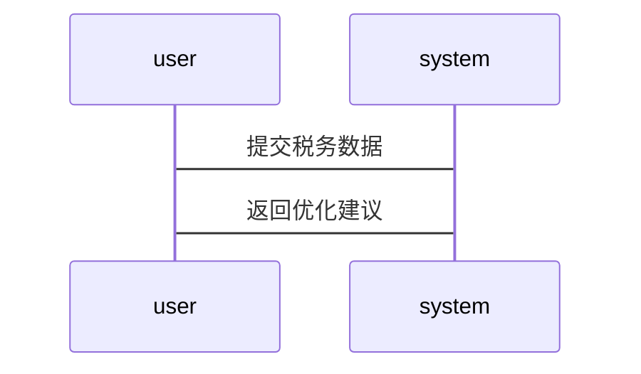

                 


# 智能税收筹划建议系统

> 关键词：智能税收、人工智能、税收筹划、系统设计、机器学习

> 摘要：本文详细介绍了智能税收筹划建议系统的构建过程，从背景介绍到系统设计，从算法原理到项目实战，全面解析了如何利用人工智能技术优化税收筹划过程。文章通过丰富的案例分析和代码实现，展示了智能系统的实际应用价值，并提出了系统设计和实施的最佳实践建议。

---

## 第一部分：背景介绍

### 第1章：智能税收筹划建议系统概述

#### 1.1 税收筹划的基本概念
- 1.1.1 税收筹划的定义与目的
  - 税收筹划是通过合法手段优化税务负担，提高资金利用效率。
  - 目的在于在合法合规的前提下，最大化节省税务支出。

- 1.1.2 智能税收筹划的定义与作用
  - 智能税收筹划是利用人工智能技术，自动化分析税务数据并提供建议。
  - 作用包括提高效率、降低成本、提升决策精准度。

#### 1.2 智能税收系统的背景与意义
- 1.2.1 传统税收筹划的局限性
  - 依赖人工分析，效率低。
  - 数据处理范围有限，难以覆盖复杂场景。

- 1.2.2 智能化税收筹划的必要性
  - 数据量激增，人工难以处理。
  - 个性化需求增加，需要智能化解决方案。

#### 1.3 问题背景与问题描述
- 1.3.1 税收筹划中的主要问题
  - 数据分散，难以整合。
  - 分析复杂，人工效率低。
  - 缺乏实时性，难以应对动态变化。

- 1.3.2 智能系统如何解决这些问题
  - 自动化数据采集与处理。
  - 利用机器学习算法提高分析效率。
  - 实时生成优化建议，提升决策速度。

---

## 第二部分：核心概念与联系

### 第2章：智能税收系统的构成与核心要素

#### 2.1 核心概念原理
- 2.1.1 数据采集与处理
  - 从多源数据中提取税务相关信息。
  - 数据清洗与预处理，确保数据质量。

- 2.1.2 智能算法的应用
  - 使用机器学习算法（如决策树、随机森林）进行预测与分类。
  - 利用深度学习模型（如神经网络）进行复杂模式识别。

- 2.1.3 结果生成与反馈
  - 基于算法输出生成税务优化建议。
  - 反馈机制优化系统性能。

#### 2.2 核心要素对比表
- 2.2.1 传统方法与智能系统对比
| 特性           | 传统方法        | 智能系统         |
|----------------|-----------------|------------------|
| 数据处理速度   | 较慢            | 实时处理         |
| 分析范围       | 有限            | 全面覆盖         |
| 准确性         | 受人工影响较大    | 高准确性         |

- 2.2.2 数据准确性与实时性对比
| 特性           | 数据准确性       | 实时性           |
|----------------|-----------------|------------------|
| 传统方法       | 较低            | 较差             |
| 智能系统       | 高              | 实时             |

#### 2.3 ER实体关系图
```mermaid
erDiagram
    user} o-|{ tax_data
    tax_data} o-|{ suggestion
```

---

## 第三部分：算法原理讲解

### 第3章：智能算法的实现与应用

#### 3.1 算法原理
- 3.1.1 机器学习算法概述
  - 监督学习：用于分类和回归问题。
  - 非监督学习：用于聚类分析。

- 3.1.2 算法流程图


#### 3.2 Python代码实现
- 数据预处理代码示例
```python
import pandas as pd

data = pd.read_csv('tax_data.csv')
data = data.dropna()
```

- 模型训练代码示例
```python
from sklearn.tree import DecisionTreeClassifier

model = DecisionTreeClassifier()
model.fit(X_train, y_train)
```

#### 3.3 数学模型与公式
- 贝叶斯定理
  - $$P(A|B) = \frac{P(B|A)P(A)}{P(B)}$$
  
- 回归分析
  - $$y = \beta_0 + \beta_1x + \epsilon$$

---

## 第四部分：系统分析与架构设计

### 第4章：系统架构与功能设计

#### 4.1 系统目标与范围
- 4.1.1 高效处理税务数据
- 4.1.2 提供个性化优化建议

#### 4.2 功能模块设计
- 数据采集模块：负责数据的采集与预处理。
- 分析模块：利用算法进行数据建模与分析。
- 建议生成模块：基于分析结果生成优化建议。

#### 4.3 系统架构图
```mermaid
graph LR
    I1->S1(数据采集模块)
    S1->S2(分析模块)
    S2->S3(建议生成模块)
```

#### 4.4 接口与交互设计
- API调用：通过RESTful API与数据库交互。
- 用户与系统交互流程


---

## 第五部分：项目实战

### 第5章：智能税收系统开发实践

#### 5.1 开发环境搭建
- 安装Python、TensorFlow、Flask等工具。

#### 5.2 核心代码实现
- 数据预处理
  ```python
  import pandas as pd

  data = pd.read_csv('tax_data.csv')
  data.dropna(inplace=True)
  ```

- 模型训练
  ```python
  from sklearn.tree import DecisionTreeClassifier

  model = DecisionTreeClassifier()
  model.fit(X_train, y_train)
  ```

- 接口实现
  ```python
  from flask import Flask

  app = Flask(__name__)

  @app.route('/api/suggest', methods=['POST'])
  def suggest():
      # 处理请求并返回建议
      return 'Tax suggestion'
  ```

#### 5.3 代码解读与应用
- 数据预处理：清洗数据，去除缺失值。
- 模型训练：利用决策树算法进行分类。
- 接口实现：通过Flask搭建API，接收数据并返回建议。

#### 5.4 案例分析
- 分析某公司税务数据，生成优化建议。
- 通过系统反馈优化模型，提升准确率。

---

## 第六部分：最佳实践与总结

### 第6章：项目小结与优化建议

#### 6.1 最佳实践
- 数据隐私保护：确保税务数据的安全性。
- 模型可解释性：选择易于解释的算法，提升用户信任度。
- 系统可扩展性：设计模块化架构，方便后续功能扩展。

#### 6.2 小结
- 本文详细介绍了智能税收筹划系统的构建过程，从背景到实现，全面解析了系统的各个组成部分。
- 通过实际案例展示了系统的应用价值，并提出了优化建议。

#### 6.3 注意事项
- 确保数据的合法性和合规性。
- 定期更新模型，适应税收政策的变化。
- 提供良好的用户界面，提升用户体验。

#### 6.4 拓展阅读
- 推荐学习机器学习相关书籍和课程。
- 关注税务政策变化，结合最新技术进行优化。

---

通过以上目录结构，我们可以系统地构建一个智能税收筹划建议系统，从理论到实践，全面解析其设计与实现过程。

