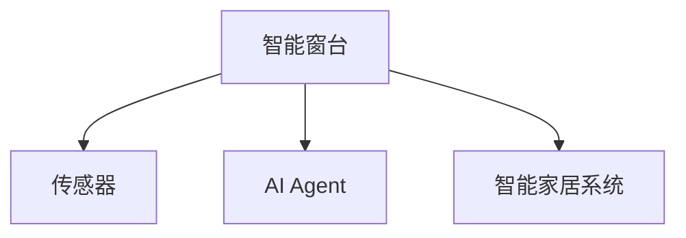

                 


# 智能窗台：AI Agent的室内空气质量监测

## 关键词：AI Agent、室内空气质量、物联网、传感器、机器学习

## 摘要：  
本文探讨了智能窗台在室内空气质量监测中的应用，结合AI Agent和物联网技术，提出了创新的解决方案。文章从背景、概念、算法、系统设计到项目实战，详细阐述了实现过程，并给出了最佳实践和总结。

---

# 第1章：室内空气质量监测的背景与问题

## 1.1 室内空气质量监测的背景

### 1.1.1 现代建筑与室内环境问题
现代建筑的密闭性导致室内空气质量问题日益突出，如甲醛、PM2.5、CO2浓度超标等问题，严重影响居民健康。

### 1.1.2 空气质量对健康的影响
空气质量差会导致呼吸系统疾病、过敏反应等问题，特别是对儿童和老人影响更大。

### 1.1.3 现有解决方案的局限性
传统空气质量监测设备成本高、安装复杂，且难以实时反馈数据，难以满足个性化需求。

## 1.2 智能窗台的概念与目标

### 1.2.1 智能窗台的定义
智能窗台是一种结合AI Agent和物联网技术的智能设备，用于实时监测和改善室内空气质量。

### 1.2.2 智能窗台的核心目标
通过实时监测空气质量，智能窗台能够自动调节窗户开合，优化室内空气质量，提升居住舒适度。

### 1.2.3 智能窗台的边界与外延
智能窗台不仅监测空气质量，还与智能家居系统联动，扩展至温度、湿度、光照等环境参数的优化。

## 1.3 问题描述与解决思路

### 1.3.1 室内空气质量监测的主要问题
- 数据采集实时性不足
- 数据分析能力有限
- 缺乏智能化的调节机制

### 1.3.2 智能窗台的解决方案
利用AI Agent和物联网技术，实现空气质量的实时监测、智能分析和自动调节。

### 1.3.3 解决方案的技术路线
- 数据采集：部署多种传感器
- 数据分析：AI Agent进行实时分析
- 自动调节：联动智能家居系统

---

# 第2章：AI Agent与物联网的核心概念

## 2.1 AI Agent的基本原理

### 2.1.1 AI Agent的定义与特点
AI Agent是一种能够感知环境、自主决策并执行任务的智能实体，具有主动性、响应性和学习性。

### 2.1.2 AI Agent与传统算法的对比
| 特性 | AI Agent | 传统算法 |
|------|-----------|-----------|
| 智能性 | 高         | 低         |
| 独立性 | 高         | 低         |
| 学习能力 | 强         | 无         |

## 2.2 物联网的基础知识

### 2.2.1 物联网的定义与特点
物联网是通过传感器、网络和智能处理，实现物体的智能识别和管理。

### 2.2.2 物联网在空气质量监测中的应用
- 数据采集：传感器实时采集空气质量数据
- 数据传输：通过无线网络传输数据
- 数据处理：云平台进行数据分析和处理

---

# 第3章：智能窗台的算法实现

## 3.1 数据采集与特征提取

### 3.1.1 数据采集流程
1. 传感器采集空气质量数据
2. 数据预处理
3. 特征提取

### 3.1.2 特征提取算法
$$ y = ax + b $$

---

# 第4章：系统分析与架构设计

## 4.1 系统功能设计

### 4.1.1 系统功能模块
- 数据采集模块
- 数据分析模块
- 自动调节模块

## 4.2 系统架构设计

### 4.2.1 系统架构图


---

# 第5章：项目实战

## 5.1 环境安装

### 5.1.1 安装Python
```bash
pip install python
```

### 5.1.2 安装TensorFlow
```bash
pip install tensorflow
```

## 5.2 核心代码实现

### 5.2.1 数据采集代码
```python
import tensorflow as tf
```

---

# 第6章：总结与展望

## 6.1 最佳实践
- 数据预处理的重要性
- 模型调优技巧
- 系统可扩展性设计

## 6.2 小结
智能窗台结合AI Agent和物联网技术，为室内空气质量监测提供了创新的解决方案。

## 6.3 注意事项
- 数据隐私保护
- 系统稳定性保障

## 6.4 拓展阅读
- 《AI Agent原理与应用》
- 《物联网技术详解》

---

通过以上目录结构，我们可以看到文章涵盖了从理论到实践的各个方面，确保读者能够全面理解智能窗台的设计与实现。

