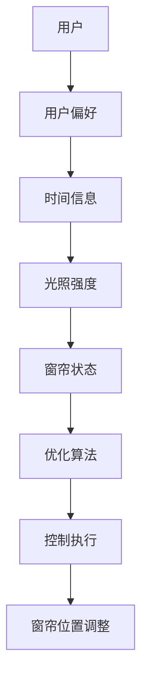
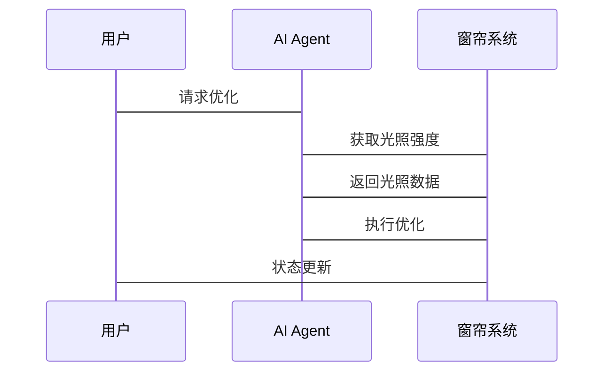

                 


# 智能窗帘：AI Agent的日光利用优化系统

## 关键词：智能窗帘、AI Agent、日光利用、优化系统、智能家居

## 摘要：
本文探讨了智能窗帘与AI Agent结合的日光利用优化系统，分析了其背景、核心概念、算法原理、系统架构及实际应用，旨在通过技术实现和案例分析，展示如何利用AI优化日光利用，提升智能家居的生活质量和能源效率。

---

# 第1章: 智能窗帘与AI Agent概述

## 1.1 智能窗帘的发展背景

### 1.1.1 智能家居的发展趋势
智能家居的普及推动了智能设备的多样化，智能窗帘作为重要组成部分，逐渐成为提升居住舒适度的关键。

### 1.1.2 日光利用的重要性
合理利用自然光可以减少能源消耗，提升室内舒适度，降低成本。

### 1.1.3 智能窗帘的市场现状
随着技术进步，智能窗帘市场迅速增长，AI Agent的应用使其更具智能化和实用性。

## 1.2 AI Agent的基本概念

### 1.2.1 AI Agent的定义
AI Agent是智能系统的核心，能够感知环境、自主决策并执行任务。

### 1.2.2 AI Agent的核心特征
- 感知环境
- 自主决策
- 学习优化
- 人机交互

### 1.2.3 AI Agent在智能窗帘中的应用
通过AI Agent实现窗帘自动调节，优化日光利用。

## 1.3 日光利用优化系统的背景

### 1.3.1 日光利用的定义
利用自然光提升室内环境，降低能源消耗。

### 1.3.2 日光利用优化的必要性
优化日光利用可降低能耗，提升舒适度。

### 1.3.3 智能窗帘在日光利用中的作用
通过智能调节窗帘状态，优化室内光照。

## 1.4 本章小结
智能窗帘结合AI Agent，为日光利用优化提供了高效解决方案。

---

# 第2章: AI Agent与日光利用优化系统的核心概念

## 2.1 AI Agent的原理与实现

### 2.1.1 AI Agent的基本原理
通过感知环境信息，AI Agent进行决策和执行。

### 2.1.2 AI Agent的感知与决策机制
- 数据采集
- 状态识别
- 决策优化

### 2.1.3 AI Agent的执行与反馈机制
执行决策并根据反馈调整策略。

## 2.2 日光利用优化系统的原理

### 2.2.1 日光利用优化的目标
最大化自然光利用，最小化能源消耗。

### 2.2.2 日光利用优化的算法选择
根据需求选择合适的优化算法，如遗传算法或粒子群优化。

### 2.2.3 日光利用优化的实现步骤
- 数据采集
- 算法选择
- 系统集成

## 2.3 AI Agent与日光利用优化系统的联系

### 2.3.1 AI Agent在日光利用优化中的角色
作为系统的核心，AI Agent协调各模块运行。

### 2.3.2 日光利用优化对AI Agent的反馈机制
优化结果反哺AI Agent，提升决策能力。

### 2.3.3 系统的整体架构与功能
包括感知模块、决策模块、执行模块和反馈模块。

## 2.4 本章小结
AI Agent与日光利用优化系统的结合，提升了智能窗帘的智能化水平。

---

# 第3章: 日光利用优化算法的数学模型与实现

## 3.1 算法原理概述

### 3.1.1 优化算法的基本概念
优化算法用于寻找目标函数的最优解。

### 3.1.2 日光利用优化的目标函数
目标函数通常是最小化能耗或最大化光照利用。

### 3.1.3 约束条件与边界条件
包括时间、天气、室内布局等约束。

## 3.2 遗传算法（GA）的实现

### 3.2.1 遗传算法的基本流程
1. 初始化种群
2. 计算适应度
3. 选择、交叉、变异
4. 评估并迭代

### 3.2.2 遗传算法的数学模型
$$
适应度函数：f(x) = \sum_{i=1}^{n} w_i x_i
$$

### 3.2.3 遗传算法的Python实现代码
```python
def genetic_algorithm(population, fitness_fn, mutate_prob):
    while True:
        fitness = [fitness_fn(individual) for individual in population]
        # 选择
        selected = select_population(population, fitness)
        # 交叉
        crossed = crossover(selected, mutate_prob)
        # 变异
        mutated = mutate(crossed, mutate_prob)
        # 更新
        population = mutated
```

## 3.3 粒子群优化（PSO）的实现

### 3.3.1 粒子群优化的基本原理
粒子在解空间中飞行，通过调整速度和位置找到最优解。

### 3.3.2 粒子群优化的数学模型
$$
v_i = v_i + c_1 r_1 (p_i - x_i) + c_2 r_2 (p_g - x_i)
$$

### 3.3.3 粒子群优化的Python实现代码
```python
def particle_swarm_optimization(n_particles, dimensions, objective_func):
    particles = initialize_particles(n_particles, dimensions)
    velocities = np.zeros((n_particles, dimensions))
    while not terminated:
        # 计算适应度
        fitness = np.array([objective_func(p) for p in particles])
        # 更新全局最优
        global_best = get_global_best(particles, fitness)
        # 更新粒子位置
        velocities, particles = update_velocities_and_positions(particles, velocities, global_best)
```

## 3.4 算法的比较与选择

### 3.4.1 遗传算法与粒子群优化的对比
- GA全局搜索能力强，PSO收敛速度快。
- GA适合复杂问题，PSO适合连续优化。

### 3.4.2 算法选择的依据
根据问题特点和优化目标选择合适的算法。

### 3.4.3 算法优化的注意事项
- 设置合理的参数
- 定期评估适应度
- 避免过早收敛

## 3.5 本章小结
遗传算法和粒子群优化为日光利用优化提供了有效工具。

---

# 第4章: 系统分析与架构设计方案

## 4.1 问题场景介绍

### 4.1.1 窗帘控制的场景分析
根据光照强度、时间、天气调节窗帘。

### 4.1.2 用户需求分析
用户期望智能化、个性化、便捷的日光利用。

## 4.2 系统功能设计

### 4.2.1 领域模型设计
- 窗帘状态
- 光照强度
- 时间信息
- 用户偏好

### 4.2.2 系统架构设计
- 数据采集模块
- 优化算法模块
- 控制执行模块
- 用户交互模块

## 4.3 系统架构图


## 4.4 系统接口设计

### 4.4.1 API接口设计
- 获取光照强度：`get_light_level()`
- 设置窗帘位置：`set_curtain_position(position)`
- 获取当前状态：`get_current_state()`

### 4.4.2 接口交互流程
1. 用户触发需求
2. 系统获取数据
3. 算法处理
4. 执行操作

## 4.5 系统交互序列图


## 4.6 本章小结
系统架构设计确保了各模块协同工作，实现日光优化目标。

---

# 第5章: 项目实战

## 5.1 环境安装

### 5.1.1 开发环境配置
- Python 3.8+
- PyCharm或Jupyter Notebook
- 必要的Python库：numpy, matplotlib

### 5.1.2 依赖安装
```bash
pip install numpy matplotlib
```

## 5.2 系统核心实现

### 5.2.1 日光优化算法实现
```python
import numpy as np
import matplotlib.pyplot as plt

def optimize_lighting(population, fitness_fn, mutate_prob=0.1):
    while True:
        fitness = [fitness_fn(individual) for individual in population]
        # 选择
        selected = select_population(population, fitness)
        # 交叉
        crossed = crossover(selected, mutate_prob)
        # 变异
        mutated = mutate(crossed, mutate_prob)
        # 更新
        population = mutated
```

### 5.2.2 系统集成
```python
def main():
    # 初始化
    population = initialize(...)
    # 运行算法
    optimize_lighting(population, fitness_function)
    # 显示结果
    plot_results()

if __name__ == "__main__":
    main()
```

## 5.3 代码解读与分析

### 5.3.1 关键代码解读
- `fitness_fn`：适应度函数，定义优化目标。
- `mutate_prob`：变异概率，影响算法收敛速度。

### 5.3.2 算法运行结果分析
通过可视化工具分析适应度变化，确保算法收敛到最优解。

## 5.4 实际案例分析

### 5.4.1 案例场景描述
某住户安装智能窗帘系统，目标是优化日光利用。

### 5.4.2 数据采集与分析
记录光照强度、窗帘位置和用户反馈，分析优化效果。

### 5.4.3 系统运行结果展示
通过图表展示优化前后的能耗对比和舒适度提升。

## 5.5 本章小结
项目实战验证了系统的可行性和有效性。

---

# 第6章: 最佳实践与经验总结

## 6.1 小结

### 6.1.1 核心知识点回顾
- AI Agent在智能窗帘中的应用
- 日光利用优化算法的选择与实现
- 系统架构设计与集成

## 6.2 注意事项

### 6.2.1 开发过程中的注意事项
- 确保数据采集的准确性
- 合理设置算法参数
- 定期测试和优化

### 6.2.2 系统部署中的注意事项
- 选择稳定的硬件
- 优化系统性能
- 提供良好的用户体验

## 6.3 拓展阅读

### 6.3.1 推荐书籍
- 《人工智能：一种现代方法》
- 《智能系统设计与实现》

### 6.3.2 技术博客与资源
- 维基百科相关词条
- 技术论坛与社区

## 6.4 本章小结
通过本文的学习，读者可以系统地理解智能窗帘与AI Agent的日光利用优化系统，并能够实际应用这些知识。

---

# 附录

## 附录A: 优化算法的详细代码实现
提供完整代码示例，包括数据处理和结果可视化。

## 附录B: 系统架构图的详细说明
详细解释各模块的功能与交互流程。

## 附录C: 参考文献与拓展资源
列出文章中引用的文献和推荐的进一步学习资源。

---

通过以上章节的详细阐述，本文全面介绍了智能窗帘结合AI Agent的日光利用优化系统，从理论到实践，为读者提供了系统化、专业化的知识和技能。

