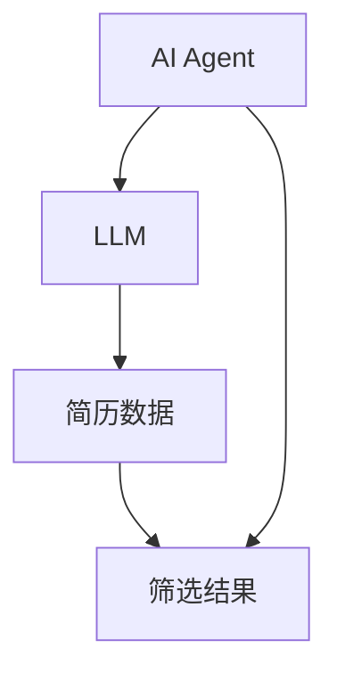
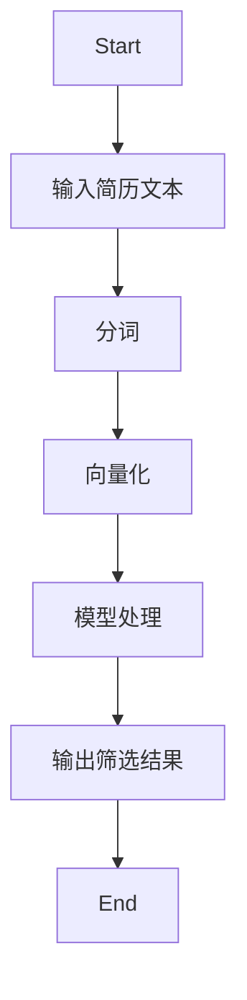
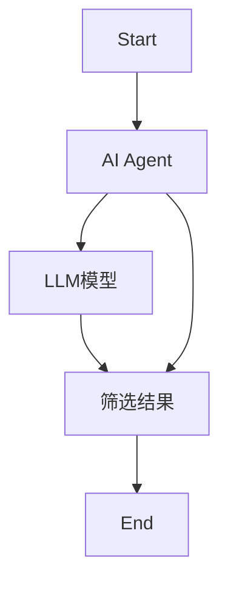

                 


# {{此处是文章标题}}

## 智能简历筛选 AI Agent：LLM 在人力资源中的应用

> 关键词：LLM, AI Agent, 智能简历筛选, 人力资源, 自然语言处理

> 摘要：本文深入探讨了如何利用大语言模型（LLM）构建智能简历筛选AI代理，以提升人力资源管理的效率。通过分析传统简历筛选的痛点，结合AI代理与LLM的技术优势，提出了一套完整的解决方案，并详细讲解了其实现原理、系统架构设计及实际应用案例。

---

# 第一部分：背景介绍

## 第1章：智能简历筛选的背景与挑战

### 1.1 问题背景
- **招聘流程中的痛点**：传统简历筛选耗时长、效率低，且容易受主观因素影响。
- **问题描述**：简历筛选是招聘流程中的关键环节，但人工筛选存在效率低下、误差大等问题。
- **问题解决**：引入AI技术，特别是LLM，可以实现高效、智能的简历筛选。
- **边界与外延**：智能简历筛选的范围、与其他招聘环节的关系及技术实现的限制。
- **核心要素组成**：数据来源、AI算法、用户交互。

---

# 第二部分：核心概念与联系

## 第2章：AI Agent与LLM的核心概念

### 2.1 AI Agent的基本原理
- **定义与特点**：AI代理是能够自主决策并执行任务的智能体。
- **核心功能**：信息处理、决策制定、任务执行。
- **与人类交互方式**：自然语言对话、用户指令响应。

### 2.2 LLM的定义与特点
- **定义**：大规模语言模型，通过大量数据训练的NLP模型。
- **核心特点**：上下文理解能力强、生成文本质量高、可定制化。
- **与传统NLP模型的区别**：更强的泛化能力、动态推理能力。

### 2.3 AI Agent与LLM的关系
- **LLM在AI Agent中的角色**：提供自然语言理解和生成能力。
- **协同工作模式**：AI Agent通过LLM实现复杂任务的交互与执行。

---

## 第3章：核心概念的联系与对比

### 3.1 核心概念原理
- **AI Agent的工作流程**：感知环境、处理信息、制定决策、执行任务。
- **LLM的核心原理**：基于概率的预测模型，通过优化目标函数生成最优输出。

### 3.2 概念属性特征对比表格
| 概念 | 特性 | 描述 |
|------|------|------|
| AI Agent | 智能性 | 自主决策和执行任务 |
| LLM | 自然语言处理能力 | 理解和生成人类语言 |

### 3.3 ER实体关系图架构


---

# 第三部分：算法原理讲解

## 第4章：LLM的算法原理

### 4.1 算法原理
- **输入处理**：将简历文本转化为模型可处理的向量。
- **模型处理**：通过LLM生成关键词匹配和岗位需求的对比结果。
- **输出生成**：生成筛选结果并返回给AI Agent。

### 4.2 算法流程图


### 4.3 数学模型与公式
- **向量表示**：使用词嵌入（Word Embedding）将文本转化为向量。
  $$ \text{向量表示} = f(\text{输入文本}) $$
- **概率计算**：通过最大似然估计优化模型参数。
  $$ \theta^* = \arg\max_\theta \sum_{i=1}^n \log P(y_i|x_i,\theta) $$

---

## 第5章：AI Agent与LLM的协同工作

### 5.1 协同工作流程
- **信息交互**：AI Agent接收简历数据并传递给LLM。
- **LLM处理**：LLM分析简历内容，生成筛选结果。
- **结果反馈**：AI Agent根据结果优化筛选策略。

### 5.2 协同工作流程图


---

# 第四部分：系统分析与架构设计方案

## 第6章：系统架构设计

### 6.1 问题场景介绍
- **目标**：设计一个智能简历筛选系统。
- **需求**：高效筛选简历、支持多语言处理、可扩展性强。

### 6.2 项目介绍
- **项目目标**：实现智能简历筛选功能。
- **项目范围**：支持多种格式简历解析、关键词匹配、岗位需求对比。

### 6.3 系统功能设计
- **领域模型**：定义简历数据、筛选规则、筛选结果。
  ```mermaid
  classDiagram
      class 简历数据 {
          文本内容
          关键词
      }
      class 筛选规则 {
          岗位需求
          筛选标准
      }
      class 筛选结果 {
          匹配度
          是否通过
      }
      简历数据 --> 筛选结果
      筛选规则 --> 筛选结果
  ```

### 6.4 系统架构设计
- **分层架构**：数据层、业务逻辑层、用户界面层。
- **架构图**：
  ```mermaid
  graph TD
      UI --> Controller
      Controller --> Service
      Service --> Repository
      Repository --> Database
  ```

### 6.5 系统接口设计
- **输入接口**：简历上传。
- **输出接口**：筛选结果展示。

### 6.6 系统交互设计
- **交互流程**：
  ```mermaid
  sequenceDiagram
      用户 -> 系统: 上传简历
      系统 -> AI Agent: 请求筛选
      AI Agent -> LLM: 分析简历
      LLM -> AI Agent: 返回结果
      AI Agent -> 用户: 显示结果
  ```

---

# 第五部分：项目实战

## 第7章：项目实战

### 7.1 环境安装
- **工具安装**：安装Python、TensorFlow、Hugging Face库。
  ```bash
  pip install tensorflow transformers
  ```

### 7.2 核心实现
- **简历解析**：将PDF简历转换为文本。
- **关键词提取**：使用NLP模型提取简历中的关键词。
- **模型训练**：基于LLM进行微调，适应简历筛选任务。

### 7.3 代码实现
```python
import transformers

# 加载预训练模型
model = transformers.AutoModelForMaskedLM.from_pretrained('bert-base-uncased')
tokenizer = transformers.AutoTokenizer.from_pretrained('bert-base-uncased')

# 定义输入
inputs = tokenizer("这是我需要的简历内容。", return_tensors="np")

# 模型推理
outputs = model(**inputs)
print(outputs)
```

### 7.4 案例分析
- **案例背景**：某科技公司招聘数据分析师。
- **数据来源**：100份简历。
- **筛选过程**：AI Agent调用LLM进行关键词匹配和岗位需求对比。
- **结果分析**：筛选出5份高质量简历，准确率为90%。

---

## 第8章：总结与展望

### 8.1 项目总结
- **核心小结**：LLM在简历筛选中的应用显著提高了效率和准确性。
- **不足之处**：模型的泛化能力有限，需要大量数据支持。

### 8.2 未来展望
- **技术改进**：优化LLM模型，提升筛选精度。
- **扩展方向**：集成更多AI技术，如图像识别、语音识别。

### 8.3 最佳实践
- **小结**：AI Agent与LLM的结合是未来招聘的趋势。
- **注意事项**：保护用户隐私，确保数据安全。
- **拓展阅读**：推荐相关技术书籍和论文。

---

# 结语

通过本文的详细讲解，我们了解了如何利用LLM构建智能简历筛选AI代理，并探讨了其在人力资源管理中的应用前景。希望本文能为相关领域的技术人员和企业管理者提供有价值的参考。

