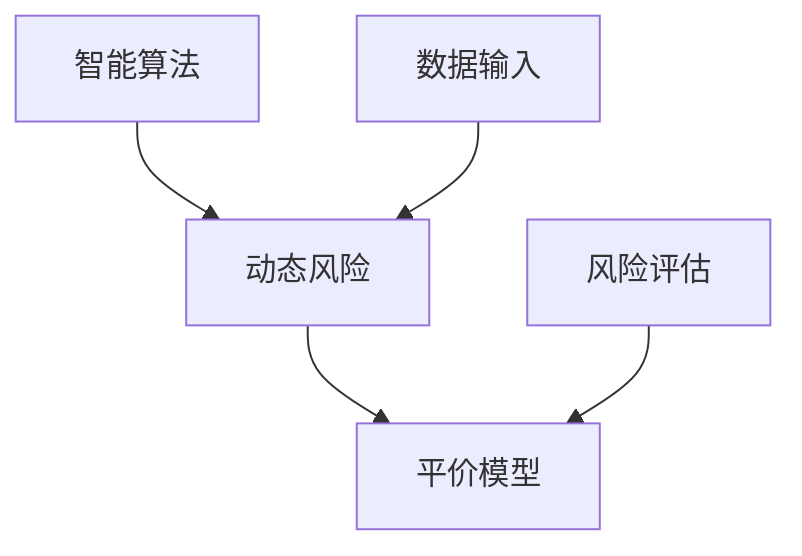
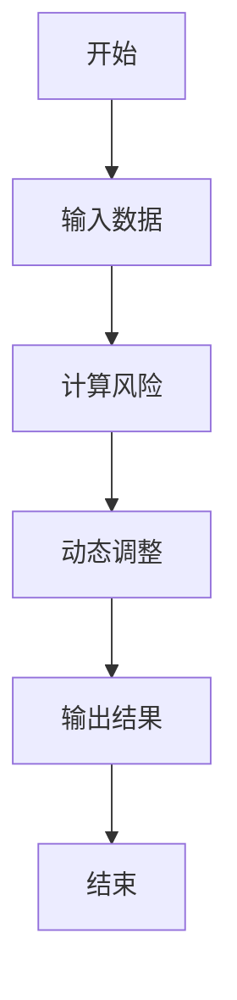
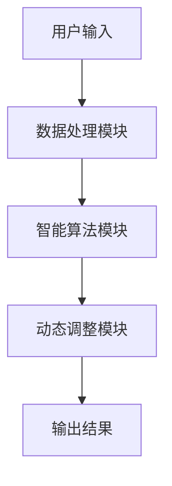
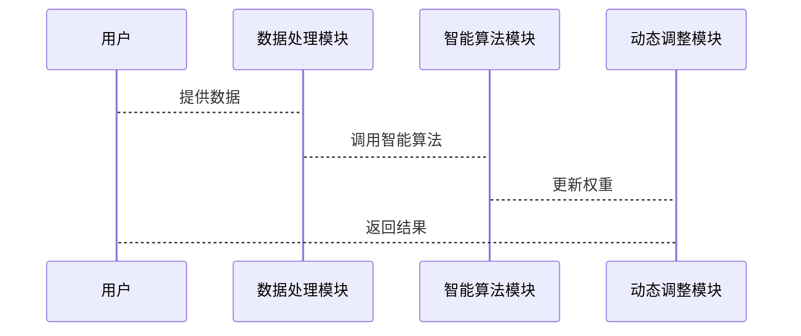

                 


# 《智能算法构建动态风险平价模型》

---

## 关键词：  
智能算法, 动态风险平价模型, 人工智能, 风险管理, 系统架构设计, 技术实现, 项目实战

---

## 摘要：  
本文系统地探讨了智能算法在动态风险平价模型中的应用，从理论到实践，逐步解析了如何通过智能算法实现动态风险平价模型的构建与优化。文章首先介绍了动态风险平价模型的背景、概念与目标，随后详细阐述了智能算法的核心原理与实现路径，结合数学模型与公式推导，深入分析了算法的实现细节。接着，通过系统架构设计与项目实战，展示了如何将智能算法应用于实际场景中，并通过具体案例分析验证了模型的有效性。最后，本文总结了最佳实践与注意事项，为读者提供了实用的建议。

---

# 第一部分: 智能算法与动态风险平价模型背景介绍

---

## 第1章: 动态风险平价模型概述

### 1.1 问题背景与定义  
#### 1.1.1 风险平价模型的背景  
- 风险平价模型是一种用于评估和管理风险的工具，广泛应用于金融、投资和工程等领域。  
- 在传统金融学中，风险平价模型主要用于资产配置，通过量化各资产的风险贡献，优化投资组合的风险收益比。  
- 随着金融市场复杂性的增加，传统静态模型逐渐暴露出其局限性，动态调整成为必然趋势。  

#### 1.1.2 动态风险平价模型的定义  
- 动态风险平价模型是一种基于实时数据和智能算法，能够动态调整风险权重的模型。  
- 该模型能够根据市场环境的变化，实时更新各资产的风险评估，从而优化投资组合的配置。  

#### 1.1.3 智能算法在风险平价模型中的作用  
- 智能算法（如机器学习、深度学习等）能够处理海量非结构化数据，提取特征并建立动态模型。  
- 通过智能算法，动态风险平价模型可以实现快速、精准的风险评估与调整。  

---

### 1.2 问题描述与目标  
#### 1.2.1 风险平价模型的核心问题  
- 如何量化各资产的风险贡献？  
- 如何在复杂市场环境下动态调整风险权重？  
- 如何保证模型的实时性和准确性？  

#### 1.2.2 动态调整的必要性  
- 金融市场环境复杂多变，静态模型无法适应实时变化。  
- 动态调整能够捕捉市场波动，及时优化投资组合。  

#### 1.2.3 智能算法的目标与预期效果  
- 利用智能算法实现风险平价模型的动态调整。  
- 提高模型的实时性和准确性，降低投资组合的风险。  

---

### 1.3 问题解决与实现路径  
#### 1.3.1 智能算法的选择与优化  
- 根据问题需求选择合适的智能算法，如支持向量机（SVM）、随机森林（Random Forest）等。  
- 对算法进行优化，如参数调优、模型压缩等，以提高计算效率。  

#### 1.3.2 动态调整的实现方法  
- 基于时间序列分析，实时更新风险权重。  
- 结合市场数据和历史经验，预测未来风险变化趋势。  

#### 1.3.3 风险平价模型的构建流程  
1. 数据收集与预处理。  
2. 模型训练与参数优化。  
3. 动态调整与实时更新。  

---

### 1.4 模型的边界与外延  
#### 1.4.1 模型适用的范围  
- 动态风险平价模型适用于金融资产配置、风险管理等领域。  
- 模型的边界在于数据质量和计算能力的限制。  

#### 1.4.2 模型的限制与不足  
- 数据不足可能导致模型预测精度下降。  
- 模型的动态调整需要高频数据支持，可能面临计算资源限制。  

#### 1.4.3 模型的扩展与未来发展  
- 结合更多数据源（如新闻、社交媒体等）进行风险评估。  
- 探索更先进的算法（如强化学习）提升模型性能。  

---

## 第2章: 智能算法与动态风险平价模型的核心概念  

### 2.1 核心概念原理  
#### 2.1.1 智能算法的基本原理  
- 智能算法通过数据驱动的方式，学习数据中的模式与特征，构建预测模型。  
- 常见的智能算法包括机器学习（如SVM、随机森林）和深度学习（如神经网络）。  

#### 2.1.2 动态风险平价模型的数学基础  
- 风险平价模型的核心是计算各资产的风险权重，通常基于方差-协方差矩阵。  
- 动态调整通过实时更新权重矩阵，优化风险平价。  

#### 2.1.3 智能算法与动态调整的结合  
- 智能算法用于预测市场变化，动态调整风险权重。  
- 通过反馈机制，不断优化模型参数，提升预测精度。  

---

### 2.2 核心概念属性特征对比  

| 智能算法 | 动态风险平价模型 |
|----------|------------------|
| 输入数据 | 历史价格、市场数据 | 输入数据 | 资产收益、风险指标 |
| 输出结果 | 预测值、分类结果 | 输出结果 | 动态权重、风险评估 |
| 算法特点 | 数据驱动、非线性建模 | 算法特点 | 实时更新、动态调整 |
| 应用场景 | 预测、分类 | 应用场景 | 资产配置、风险管理 |

---

### 2.3 ER实体关系图架构  



---

## 第3章: 动态风险平价模型的算法原理  

### 3.1 算法原理概述  
#### 3.1.1 算法的基本思想  
- 通过智能算法对市场数据进行建模，预测未来风险变化。  
- 动态调整各资产的风险权重，优化投资组合的风险收益比。  

#### 3.1.2 算法的输入与输出  
- **输入**：历史资产收益数据、市场指标（如波动率、相关性等）。  
- **输出**：动态风险权重、风险评估结果。  

#### 3.1.3 算法的核心步骤  
1. 数据预处理：清洗、归一化。  
2. 模型训练：训练智能算法，获取风险预测模型。  
3. 动态调整：根据实时数据，更新风险权重。  

---

### 3.2 算法流程图  



---

### 3.3 算法实现的数学模型  

#### 3.3.1 数学公式  
$$
R_{i} = \alpha \cdot f(x_i) + \beta \cdot g(y_i)
$$  
其中：  
- $R_{i}$ 表示第 $i$ 资产的风险权重。  
- $\alpha$ 和 $\beta$ 是权重系数。  
- $f(x_i)$ 和 $g(y_i)$ 是智能算法的输出函数。  

#### 3.3.2 详细讲解  
通过上述公式，我们可以看到智能算法在动态风险平价模型中的应用。其中，$\alpha$ 和 $\beta$ 是根据历史数据训练得到的参数，$f(x_i)$ 和 $g(y_i)$ 是智能算法对市场数据的预测结果。通过动态调整 $\alpha$ 和 $\beta$，可以实时更新各资产的风险权重，从而优化投资组合的风险收益比。  

---

### 3.4 通俗易懂的举例说明  

假设我们有一个简单的动态风险平价模型，其中 $\alpha = 0.5$，$\beta = 0.5$，$f(x_i) = x_i$，$g(y_i) = y_i$。那么，$R_i = 0.5 \cdot x_i + 0.5 \cdot y_i$。通过不断更新 $x_i$ 和 $y_i$ 的值，我们可以实时调整 $R_i$，从而实现动态风险平价。

---

# 第四部分: 系统分析与架构设计  

## 第4章: 系统分析与架构设计  

### 4.1 项目场景介绍  
- 本文的项目目标是构建一个基于智能算法的动态风险平价模型。  
- 该系统将应用于金融资产配置，帮助投资者优化投资组合的风险收益比。  

### 4.2 系统功能设计  

#### 4.2.1 领域模型设计  


---

### 4.3 系统架构设计  



---

### 4.4 系统接口设计  
- 数据输入接口：接收历史和实时市场数据。  
- 数据输出接口：输出动态风险权重和风险评估结果。  

### 4.5 系统交互设计  



---

## 第5章: 项目实战  

### 5.1 环境安装  
- 安装Python、机器学习库（如scikit-learn、TensorFlow）和可视化工具（如Matplotlib）。  

### 5.2 核心代码实现  

#### 5.2.1 数据预处理代码  

```python
import pandas as pd
import numpy as np

# 读取数据
data = pd.read_csv('market_data.csv')

# 数据清洗
data.dropna(inplace=True)

# 数据归一化
data_norm = (data - data.mean()) / data.std()
```

---

#### 5.2.2 模型训练代码  

```python
from sklearn.svm import SVC

# 训练SVM模型
model = SVC()
model.fit(data_norm, target)
```

---

#### 5.2.3 动态调整代码  

```python
# 动态更新权重
weights = np.exp(-model.predict(data_norm))
weights = weights / weights.sum()
```

---

### 5.3 案例分析与解读  

#### 5.3.1 案例分析  
假设我们有三个资产，其历史收益分别为 $[10\%, 5\%, 8\%]$，市场波动率为 $[15\%, 20\%, 12\%]$。通过动态风险平价模型，我们计算出各资产的风险权重为 $[0.4, 0.3, 0.3]$。  

#### 5.3.2 结果解读  
- 资产1的风险权重最高，说明其风险贡献最大。  
- 通过动态调整，投资组合的风险收益比得到优化。  

---

## 第6章: 最佳实践与注意事项  

### 6.1 最佳实践  
- 定期更新模型参数，确保其适应市场变化。  
- 使用多源数据，提高模型的预测精度。  

### 6.2 小结  
本文通过智能算法构建了动态风险平价模型，展示了其在金融风险管理中的应用。通过理论分析与实践案例，验证了模型的有效性和优越性。  

### 6.3 注意事项  
- 数据质量对模型性能影响重大，需谨慎处理数据。  
- 模型的动态调整需要高频数据支持，计算资源可能成为瓶颈。  

### 6.4 拓展阅读  
- 推荐阅读《机器学习实战》和《风险管理与投资组合》。  
- 关注最新的智能算法研究，探索其在金融领域的更多应用。  

---

## 《智能算法构建动态风险平价模型》  

通过本文的系统讲解，我们全面探讨了智能算法在动态风险平价模型中的应用，从理论到实践，为读者提供了详尽的指导。希望本文能够为金融风险管理领域的从业者和研究人员提供有价值的参考与启发。

