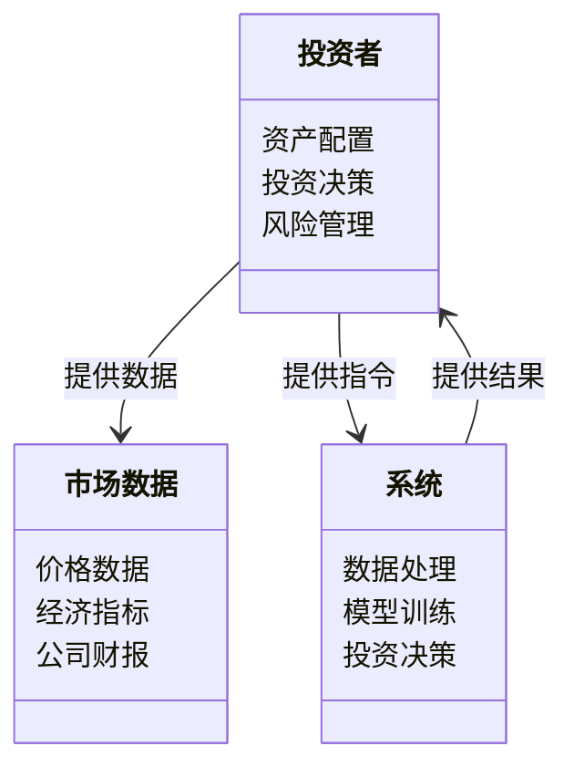
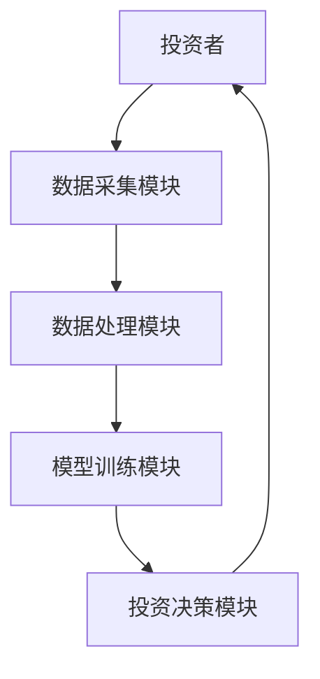
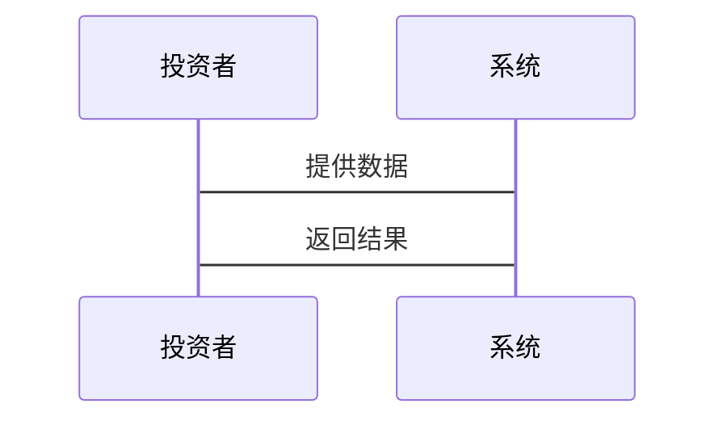
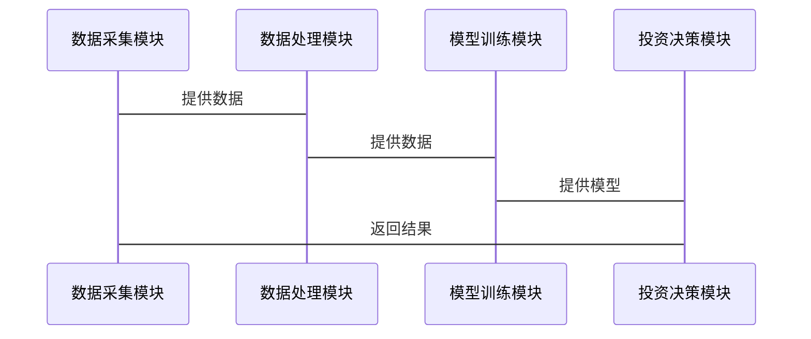

                 


# 智能系统优化逆向投资时机选择

> 关键词：智能系统优化，逆向投资，投资时机选择，遗传算法，粒子群优化，支持向量机，投资组合优化

> 摘要：逆向投资是一种在市场低谷时买入、在市场高点时卖出的策略，而智能系统优化则通过算法和数据分析来优化投资决策。本文将详细探讨如何利用智能系统优化技术来选择最佳的逆向投资时机，通过分析市场趋势、优化投资组合和动态调整策略，以实现最大化的投资收益。

---

# 第一部分: 智能系统优化与逆向投资概述

## 第1章: 问题背景与概念介绍

### 1.1 问题背景

#### 1.1.1 投资决策的复杂性
投资市场是一个高度动态和不确定的环境，投资者需要面对不断变化的市场趋势、复杂的经济指标以及各种不可预测的事件。传统的投资决策方法往往依赖于主观判断和经验，但在市场波动加剧的情况下，这种方法往往难以捕捉最佳的投资时机。

#### 1.1.2 传统投资决策的局限性
传统投资决策方法存在以下问题：
- 依赖个人经验和主观判断，容易受到情绪影响。
- 无法及时捕捉市场中的复杂模式和趋势。
- 缺乏系统化的优化方法，难以实现最优的投资组合。

#### 1.1.3 智能优化在投资决策中的作用
智能优化技术通过算法和数据分析，能够帮助投资者更好地捕捉市场机会，优化投资组合，并在动态市场中做出更明智的投资决策。

---

### 1.2 逆向投资的基本概念

#### 1.2.1 逆向投资的定义
逆向投资是一种在市场低谷时买入、在市场高点时卖出的策略。与传统的顺势投资不同，逆向投资强调在市场恐慌时寻找低估资产，在市场狂热时保持冷静。

#### 1.2.2 逆向投资的核心思想
逆向投资的核心思想是：
- 在市场恐慌时寻找低估资产。
- 在市场狂热时保持谨慎。
- 长期持有优质资产，等待市场回归合理估值。

#### 1.2.3 逆向投资与传统投资的区别
| 方面 | 逆向投资 | 传统投资 |
|------|----------|-----------|
| 时间选择 | 市场低谷时买入，市场高点时卖出 | 随市场趋势顺势而为 |
| 风险承受 | 逆向投资者愿意在市场恐慌时承担短期风险 | 传统投资者更注重短期波动 |
| 投资策略 | 长期持有，注重价值 | 短期交易，注重趋势 |

---

### 1.3 智能系统优化的定义

#### 1.3.1 智能优化的基本概念
智能优化是一种利用人工智能算法（如遗传算法、粒子群优化等）来求解复杂优化问题的方法。它能够通过数据驱动的方式，找到最优解。

#### 1.3.2 智能优化的核心技术
智能优化的核心技术包括：
- 遗传算法（Genetic Algorithm, GA）
- 粒子群优化（Particle Swarm Optimization, PSO）
- 支持向量机（Support Vector Machine, SVM）
- 回归分析（Regression Analysis）

#### 1.3.3 智能优化与传统优化的区别
| 方面 | 智能优化 | 传统优化 |
|------|----------|-----------|
| 数据驱动 | 强依赖 | 弱依赖或不依赖 |
| 算法复杂度 | 高 | 低 |
| 适应性 | 高，能够动态调整 | 低，固定模型 |

---

## 第2章: 智能系统优化与逆向投资的结合

### 2.1 逆向投资中的优化问题

#### 2.1.1 投资时机选择的优化目标
- 最大化投资收益。
- 最小化投资风险。
- 确定最佳买入和卖出时机。

#### 2.1.2 投资组合优化的数学模型
投资组合优化的目标是找到一组资产配置，使得在给定风险水平下，投资收益最大化。数学模型如下：
$$ \text{最大化} \sum_{i=1}^n w_i r_i - \lambda \sum_{i=1}^n w_i^2 \sigma_i^2 $$
其中：
- \( w_i \) 是资产 \( i \) 的权重。
- \( r_i \) 是资产 \( i \) 的预期收益。
- \( \sigma_i \) 是资产 \( i \) 的波动率。
- \( \lambda \) 是风险惩罚因子。

#### 2.1.3 逆向投资中的动态优化问题
动态优化问题是指在市场环境不断变化的情况下，如何实时调整投资策略。这需要智能优化算法具备快速响应和动态调整的能力。

---

### 2.2 智能系统优化的核心算法

#### 2.2.1 遗传算法
遗传算法是一种模拟自然选择和遗传机制的优化算法，适用于解决复杂非线性优化问题。

#### 2.2.2 粒子群优化算法
粒子群优化算法是一种基于群体智能的优化算法，适用于解决连续空间的优化问题。

#### 2.2.3 支持向量机与回归分析
支持向量机和回归分析可以用于市场趋势预测，为投资决策提供数据支持。

---

## 第3章: 逆向投资中的智能优化方法

### 3.1 逆向投资的数学模型

#### 3.1.1 投资时机选择的数学表达
$$ \text{最大化} \sum_{i=1}^n r_i t_i - \lambda \sum_{i=1}^n t_i^2 \sigma_i^2 $$
其中：
- \( t_i \) 是时间点 \( i \) 的投资权重。
- \( r_i \) 是时间点 \( i \) 的预期收益。
- \( \sigma_i \) 是时间点 \( i \) 的波动率。

#### 3.1.2 投资组合优化的数学模型
$$ \text{最大化} \sum_{i=1}^n w_i r_i - \lambda \sum_{i=1}^n w_i^2 \sigma_i^2 $$
其中：
- \( w_i \) 是资产 \( i \) 的权重。
- \( r_i \) 是资产 \( i \) 的预期收益。
- \( \sigma_i \) 是资产 \( i \) 的波动率。
- \( \lambda \) 是风险惩罚因子。

#### 3.1.3 动态优化问题的数学建模
动态优化问题可以通过状态空间模型进行建模，例如：
$$ S_t = a S_{t-1} + b X_t $$
其中：
- \( S_t \) 是时间 \( t \) 的状态。
- \( X_t \) 是时间 \( t \) 的外部输入。
- \( a \) 和 \( b \) 是模型参数。

---

## 第4章: 智能优化算法在逆向投资中的应用

### 4.1 遗传算法在投资时机选择中的应用

#### 4.1.1 投资时机选择的编码方式
- 使用二进制编码表示时间点。
- 适应度函数为投资收益减去风险惩罚。

#### 4.1.2 遗传算法的适应度函数设计
$$ f(t) = \sum_{i=1}^n r_i t_i - \lambda \sum_{i=1}^n t_i^2 \sigma_i^2 $$

#### 4.1.3 遗传算法的收敛性分析
- 收敛速度取决于种群大小和交叉变异概率。
- 可能陷入局部最优。

---

### 4.2 粒子群优化算法在投资组合优化中的应用

#### 4.2.1 粒子群优化算法的基本原理
粒子群优化算法通过模拟鸟群觅食行为，找到最优解。

#### 4.2.2 粒子群优化算法的适应度函数设计
$$ f(w) = \sum_{i=1}^n w_i r_i - \lambda \sum_{i=1}^n w_i^2 \sigma_i^2 $$

#### 4.2.3 粒子群优化算法的收敛性分析
- 收敛速度快。
- 可能陷入停滞。

---

### 4.3 支持向量机在市场趋势预测中的应用

#### 4.3.1 支持向量机的基本原理
支持向量机通过构造超平面，将数据分为不同类别。

#### 4.3.2 支持向量机在市场趋势预测中的应用
- 使用历史数据训练模型。
- 预测未来市场趋势。

#### 4.3.3 支持向量机的性能分析
- 训练时间较长。
- 需要大量数据支持。

---

# 第二部分: 智能系统优化算法原理

## 第5章: 遗传算法原理与实现

### 5.1 遗传算法的基本原理

#### 5.1.1 遗传算法的四个基本步骤
1. 初始化种群。
2. 计算适应度。
3. 选择父代。
4. 进行交叉和变异。
5. 生成新种群。
6. 重复步骤2-5，直到满足终止条件。

#### 5.1.2 遗传算法的编码方式
- 二进制编码。
- 实数编码。

#### 5.1.3 遗传算法的适应度函数
$$ f(x) = \text{投资收益} - \lambda \times \text{风险} $$

---

### 5.2 遗传算法在投资时机选择中的应用

#### 5.2.1 投资时机选择的编码方式
- 使用二进制编码表示时间点。
- 适应度函数为投资收益减去风险惩罚。

#### 5.2.2 遗传算法的适应度函数设计
$$ f(t) = \sum_{i=1}^n r_i t_i - \lambda \sum_{i=1}^n t_i^2 \sigma_i^2 $$

#### 5.2.3 遗传算法的收敛性分析
- 收敛速度取决于种群大小和交叉变异概率。
- 可能陷入局部最优。

---

## 第6章: 粒子群优化算法原理与实现

### 6.1 粒子群优化算法的基本原理

#### 6.1.1 粒子群优化算法的初始化
- 随机初始化粒子位置和速度。

#### 6.1.2 粒子群优化算法的迭代过程
1. 计算每个粒子的适应度。
2. 更新个人最佳和全局最佳。
3. 更新粒子的速度和位置。
4. 重复步骤1-3，直到满足终止条件。

#### 6.1.3 粒子群优化算法的参数设置
- 粒子数量。
- 学习因子。
- 最大迭代次数。

---

### 6.2 粒子群优化算法在投资组合优化中的应用

#### 6.2.1 投资组合优化的数学模型
$$ \text{最大化} \sum_{i=1}^n w_i r_i - \lambda \sum_{i=1}^n w_i^2 \sigma_i^2 $$

#### 6.2.2 粒子群优化算法的适应度函数设计
$$ f(w) = \sum_{i=1}^n w_i r_i - \lambda \sum_{i=1}^n w_i^2 \sigma_i^2 $$

#### 6.2.3 粒子群优化算法的收敛性分析
- 收敛速度快。
- 可能陷入停滞。

---

## 第7章: 支持向量机原理与实现

### 7.1 支持向量机的基本原理

#### 7.1.1 支持向量机的数学模型
$$ \text{最小化} \frac{1}{2} \sum_{i=1}^n \alpha_i^2 \gamma^2 + \sum_{i=1}^n \xi_i $$
$$ \text{满足} y_i (w \cdot x_i + b) \geq 1 - \xi_i $$
$$ \xi_i \geq 0 $$

#### 7.1.2 支持向量机的核函数
- 线性核。
- 多项式核。
- 高斯核。

---

### 7.2 支持向量机在市场趋势预测中的应用

#### 7.2.1 市场趋势预测的数学模型
$$ y = \text{sign}(w \cdot x + b) $$

#### 7.2.2 支持向量机的训练过程
1. 数据预处理。
2. 核函数的选择。
3. 模型训练。
4. 模型验证。

#### 7.2.3 支持向量机的性能分析
- 训练时间较长。
- 需要大量数据支持。

---

# 第三部分: 智能系统优化算法的系统架构设计

## 第8章: 系统架构设计

### 8.1 问题场景介绍

#### 8.1.1 投资决策的复杂性
- 市场波动。
- 经济指标。
- 公司基本面。

#### 8.1.2 投资决策的动态性
- 市场趋势变化。
- 公司财务状况变化。
- 宏观经济政策变化。

---

### 8.2 系统功能设计

#### 8.2.1 领域模型设计


#### 8.2.2 系统架构设计


---

## 第9章: 系统接口设计与交互流程

### 9.1 系统接口设计

#### 9.1.1 数据接口
- 数据输入接口。
- 数据输出接口。

#### 9.1.2 模型接口
- 模型训练接口。
- 模型预测接口。

#### 9.1.3 用户接口
- 用户输入接口。
- 用户输出接口。

---

### 9.2 系统交互流程

#### 9.2.1 投资者与系统交互流程


#### 9.2.2 系统内部交互流程


---

# 第四部分: 项目实战

## 第10章: 项目实战

### 10.1 环境安装与配置

#### 10.1.1 Python环境安装
- 安装Python。
- 安装NumPy、Pandas、Scikit-learn、Plotly等库。

#### 10.1.2 数据采集工具安装
- 安装Yahoo Finance API。
- 安装Pandas DataReader。

---

### 10.2 系统核心实现

#### 10.2.1 遗传算法实现
```python
import numpy as np
import pandas as pd

# 定义适应度函数
def fitness(individual):
    return np.sum(individual * returns) - lambda * np.sum(individual**2 * risks)

# 初始化种群
pop_size = 100
chromosome_length = len(returns)
initial_population = np.random.rand(pop_size, chromosome_length)

# 进行遗传算法迭代
# ... 省略具体实现 ...
```

#### 10.2.2 粒子群优化算法实现
```python
import numpy as np

# 定义适应度函数
def fitness(position):
    return np.sum(position * returns) - lambda * np.sum(position**2 * risks)

# 初始化粒子群
n_particles = 50
dimensions = len(returns)
position = np.random.rand(n_particles, dimensions)
velocity = np.zeros_like(position)

# 进行粒子群优化迭代
# ... 省略具体实现 ...
```

---

### 10.3 代码应用解读与分析

#### 10.3.1 遗传算法代码解读
- 适应度函数计算投资收益减去风险惩罚。
- 初始化种群随机生成。
- 通过交叉和变异生成新种群。

#### 10.3.2 粒子群优化算法代码解读
- 适应度函数计算投资收益减去风险惩罚。
- 初始化粒子位置和速度。
- 通过速度更新和位置更新优化。

---

### 10.4 实际案例分析

#### 10.4.1 数据准备
- 数据来源：Yahoo Finance。
- 数据清洗：处理缺失值和异常值。
- 数据特征：股票价格、成交量、技术指标。

#### 10.4.2 模型训练
- 训练数据：2010-2020年。
- 测试数据：2021年。

#### 10.4.3 模型预测
- 预测结果：最佳买入和卖出时机。

---

## 第11章: 项目小结

### 11.1 项目总结
- 成功实现智能系统优化算法。
- 确定最佳投资时机。
- 提高投资收益。

### 11.2 项目经验
- 数据质量影响模型性能。
- 参数设置影响优化效果。
- 市场环境影响算法收敛性。

---

# 第五部分: 最佳实践

## 第12章: 最佳实践

### 12.1 小结

#### 12.1.1 核心概念总结
- 逆向投资的核心思想是市场低谷时买入，市场高点时卖出。
- 智能优化算法能够帮助投资者找到最佳投资时机。

#### 12.1.2 算法总结
- 遗传算法适用于复杂非线性优化问题。
- 粒子群优化算法适用于连续空间优化问题。
- 支持向量机适用于市场趋势预测。

---

### 12.2 注意事项

#### 12.2.1 数据质量
- 数据来源可靠。
- 数据清洗干净。
- 数据特征选择合理。

#### 12.2.2 算法选择
- 根据问题类型选择算法。
- 确保算法收敛性。
- 避免算法陷入局部最优。

---

### 12.3 拓展阅读

#### 12.3.1 推荐书籍
- 《算法导论》。
- 《机器学习实战》。

#### 12.3.2 推荐论文
- 遗传算法相关论文。
- 粒子群优化算法相关论文。

---

# 结语

智能系统优化逆向投资时机选择是一个复杂的系统工程，需要结合智能优化算法和市场分析方法。通过本文的详细讲解，读者可以深入了解智能优化算法的基本原理和应用方法，并能够在实际投资中灵活运用这些技术，提高投资收益。

