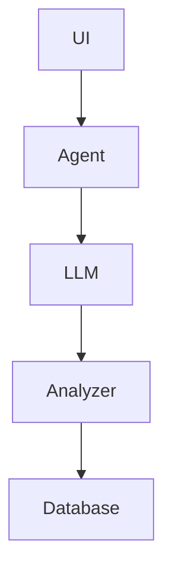
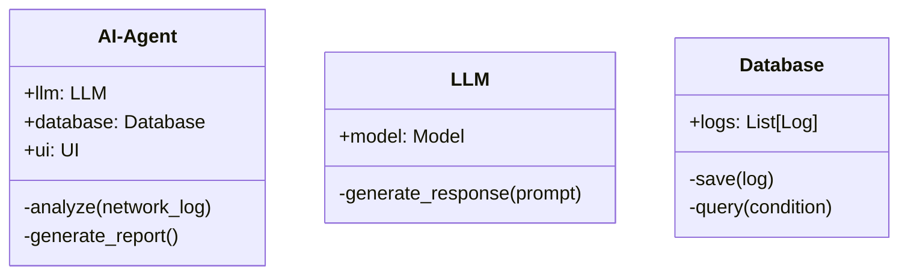

                 


# 智能网络安全分析 AI Agent：LLM 在网络防御中的应用

## 关键词：AI Agent，LLM，网络安全分析，网络防御，智能决策，大语言模型

## 摘要：  
随着网络安全威胁的日益复杂化和智能化，传统的网络安全分析方法已难以应对新型攻击手段。本文探讨了如何利用大语言模型（LLM）构建智能网络安全分析 AI Agent，通过自然语言处理和机器学习技术，提升网络防御的智能化水平。文章从背景、原理、系统设计到实战应用，详细分析了LLM在网络安全中的应用，为读者提供了全面的技术解读和实践指南。

---

## 第1章: 智能网络安全分析的背景与挑战

### 1.1 网络安全分析的现状与挑战  
网络安全分析是保障网络系统安全的核心环节，其主要任务包括威胁检测、漏洞发现、攻击溯源等。然而，随着网络攻击技术的不断升级，传统基于规则的网络安全分析方法逐渐暴露出以下问题：  
1. **规则依赖性强**：传统方法依赖于预定义的规则，难以应对未知的攻击手段。  
2. **数据量爆炸式增长**：现代网络系统产生的日志和流量数据量巨大，人工分析效率低下。  
3. **攻击智能化**：攻击者利用AI技术提升攻击能力，要求防御方也需要智能化的分析手段。  

### 1.2 AI Agent的基本概念与特点  
AI Agent（人工智能代理）是一种能够感知环境、执行任务并做出决策的智能实体。其核心特点包括：  
1. **自主性**：能够在无外部干预的情况下独立运行。  
2. **反应性**：能够实时感知环境变化并做出响应。  
3. **学习能力**：通过机器学习技术不断优化自身的分析能力。  

### 1.3 LLM在网络安全中的应用前景  
大语言模型（LLM）通过强大的自然语言处理能力，能够理解、生成和推理文本信息。其在网络安全中的应用前景包括：  
1. **威胁情报分析**：快速理解威胁情报报告，提取关键信息。  
2. **漏洞管理**：自动分析漏洞描述，评估其潜在风险。  
3. **攻击溯源**：通过日志分析和上下文推理，辅助攻击溯源。  

---

## 第2章: 智能网络安全分析的核心概念与联系

### 2.1 核心概念原理  
AI Agent的智能决策机制依赖于大语言模型的文本理解和生成能力。LLM通过处理网络日志、流量数据等文本信息，为AI Agent提供决策支持。  

### 2.2 核心概念属性特征对比表格  
以下是AI Agent、LLM和网络安全分析的核心属性对比：  

| 概念       | 智能性 | 实时性 | 准确性 |  
|------------|--------|--------|--------|  
| AI Agent   | 高     | 中     | 中     |  
| LLM        | 高     | 低     | 高     |  
| 网络安全分析 | 中     | 高     | 高     |  

### 2.3 ER实体关系图架构  
以下是网络安全分析AI Agent的实体关系图：  

```mermaid
er
actor: 用户
agent: AI Agent
llm: 大语言模型
network: 网络系统
event: 安全事件
rule: 安全规则
```

---

## 第3章: LLM在网络安全分析中的算法原理

### 3.1 算法原理概述  
LLM的基本工作流程包括：  
1. **输入处理**：将网络日志、流量数据等文本信息输入模型。  
2. **文本理解**：通过语言模型理解输入内容的语义。  
3. **决策生成**：基于理解结果生成安全分析结论。  

### 3.2 算法原理的数学模型  
以下是语言模型的数学基础：  
$$ P(\text{sequence}) = \prod_{i=1}^{n} P(w_i | w_{i-1}, ..., w_{i-k}) $$  

在网络安全分析中，基于条件概率的威胁检测模型可以表示为：  
$$ P(\text{威胁} | \text{日志}) = \frac{P(\text{日志} | \text{威胁}) \cdot P(\text{威胁})}{P(\text{日志})} $$  

### 3.3 代码实现示例  
以下是LLM生成安全分析报告的代码示例：  

```python
def generate_security_report(prompt):
    # 初始化LLM模型
    llm = LlamaCpp(
        temperature=0.7,
        max_tokens=1000,
        model_path="llama2",
    )
    
    # 生成报告
    response = llm.generate([f"Please analyze the following network log: {prompt}"])
    return response.choices[0].message.content
```

---

## 第4章: LLM在网络安全分析中的系统设计

### 4.1 系统架构与设计  
以下是网络安全分析AI Agent的系统架构图：  



### 4.2 系统功能设计与实现  
以下是系统功能模块的类图：  



---

## 第5章: 项目实战与案例分析

### 5.1 项目环境安装  
以下是项目所需的环境配置：  
1. Python 3.8+  
2. LLM框架（如Hugging Face Transformers）  
3. 网络日志数据集  

### 5.2 系统核心实现源代码  
以下是AI Agent的核心实现代码：  

```python
class AI-Agent:
    def __init__(self):
        self.llm = LLM()
        self.database = Database()
    
    def analyze(self, network_log):
        result = self.llm.generate_response(network_log)
        self.database.save(network_log)
        return result
```

### 5.3 实际案例分析  
通过一个实际案例，展示AI Agent如何利用LLM分析网络日志并生成安全报告。  

---

## 第6章: 系统优化与实际应用

### 6.1 系统优化方向  
1. **性能优化**：优化LLM的推理速度。  
2. **模型更新**：定期更新LLM以应对新威胁。  

### 6.2 实际应用与展望  
目前，LLM在网络安全分析中的应用已取得显著成效，未来将进一步结合实时监控和自动化响应，构建更智能的网络安全防护体系。  

---

## 小结  
通过本文的详细分析，我们可以看到，AI Agent结合LLM技术，为网络安全分析带来了新的可能性。然而，实际应用中仍需解决性能、模型更新等问题，以进一步提升网络防御能力。  

--- 

**注意事项**：本文内容基于技术原理编写，实际应用需结合具体场景和数据进行调整。  
**Tips**：建议读者结合代码示例和实际案例，深入理解LLM在网络安全分析中的具体应用。  
**拓展阅读**：推荐阅读相关技术书籍和论文，以深入掌握大语言模型与网络安全的结合应用。

