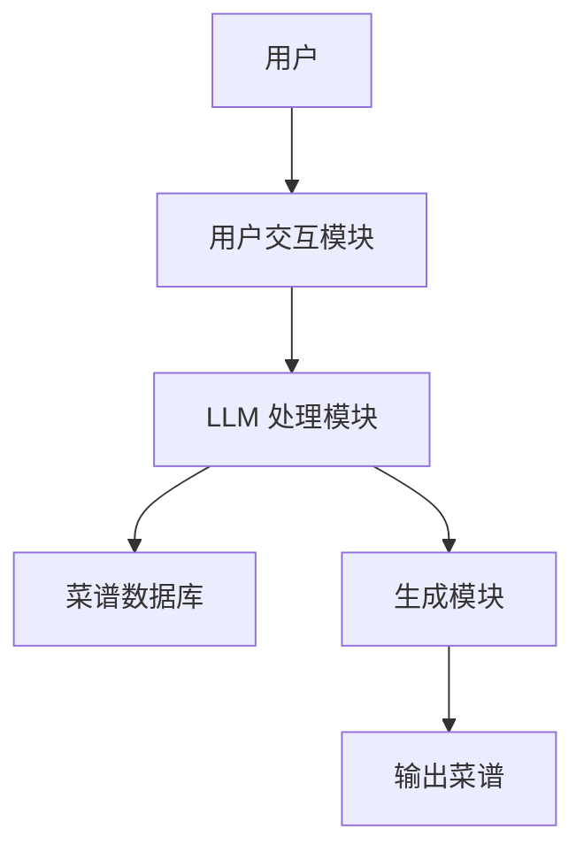

                 


# 智能菜谱生成 AI Agent：LLM 辅助烹饪创新

---

## 关键词：智能菜谱生成、LLM、AI、烹饪创新、自然语言处理

---

## 摘要：  
随着人工智能技术的快速发展，智能菜谱生成 AI Agent 正在 revolutionize 烹饪领域。通过利用大语言模型（LLM），AI 能够理解用户的烹饪需求，生成个性化、创新的菜谱。本文将深入探讨 LLM 在智能菜谱生成中的应用，分析其背后的技术原理，展示如何通过系统架构设计实现高效、智能的菜谱生成。从算法原理到项目实战，本文将全面解析 LLM 辅助烹饪创新的潜力与实现路径。

---

# 第1章: 智能菜谱生成的背景与需求

## 1.1 智能菜谱生成的背景

### 1.1.1 现代烹饪的需求变化  
现代烹饪不仅仅是填饱肚子，更是对健康、个性化和效率的追求。用户希望在家中轻松实现专业级的烹饪，但受限于时间和技能，许多人需要借助工具辅助。

### 1.1.2 AI技术在烹饪领域的应用潜力  
AI 技术的发展为烹饪创新提供了新的可能性。通过自然语言处理和生成，AI 可以帮助用户发现新的食材组合，优化烹饪步骤，甚至创造全新的菜谱。

### 1.1.3 LLM在智能菜谱生成中的独特优势  
大语言模型（LLM）具备强大的文本生成能力，能够理解复杂的烹饪需求，并生成自然流畅的菜谱内容。LLM 的优势在于其能够处理丰富的上下文信息，生成符合用户口味偏好的个性化菜谱。

---

## 1.2 用户需求与问题分析

### 1.2.1 用户对智能菜谱生成的核心需求  
用户希望智能菜谱生成工具能够：  
1. 根据个人口味推荐菜谱；  
2. 提供详细的步骤和食材建议；  
3. 支持个性化调整；  
4. 解决食材替代和搭配问题。  

### 1.2.2 现有菜谱生成工具的局限性  
传统菜谱生成工具多基于规则和模板，难以应对复杂的烹饪需求。生成的菜谱缺乏创新性，且难以满足个性化需求。  

### 1.2.3 基于LLM的智能菜谱生成的优势  
LLM 能够理解用户的深层需求，生成多样化、创新性的菜谱内容。通过自然语言处理，LLM 可以实现更智能的交互，为用户提供更好的烹饪体验。

---

## 1.3 问题解决思路

### 1.3.1 利用LLM进行菜谱生成的总体框架  
- **输入**：用户需求（如食材偏好、口味、烹饪难度）  
- **输出**：个性化菜谱（包括步骤、食材清单、创新建议）  

### 1.3.2 LLM在菜谱生成中的核心作用  
- **理解需求**：通过自然语言处理理解用户需求；  
- **生成菜谱**：基于理解生成多样化的菜谱内容；  
- **优化建议**：提供食材替换和搭配建议。  

### 1.3.3 菜谱生成的边界与外延  
菜谱生成的边界包括：  
1. 食材的选择与替代；  
2. 烹饪步骤的优化；  
3. 营养搭配的建议。  
外延包括：  
1. 健康饮食建议；  
2. 菜谱创新与改良。  

---

## 1.4 菜谱生成的核心概念

### 1.4.1 菜谱生成的基本流程  
1. 用户输入需求（如“想做一道低脂高蛋白的晚餐”）；  
2. 系统理解需求并生成菜谱内容；  
3. 用户反馈调整，系统优化生成结果。  

### 1.4.2 菜谱生成的关键要素  
- 用户需求解析；  
- 食材数据库；  
- 烹饪知识库；  
- LLM 模型生成能力。  

### 1.4.3 菜谱生成的系统架构  
菜谱生成系统包括：  
- 用户交互模块；  
- LLM 处理模块；  
- 菜谱数据库；  
- 生成模块。  

---

## 1.5 本章小结  
本章从背景、需求、问题和解决思路四个方面分析了智能菜谱生成的必要性与实现路径。接下来，我们将深入探讨 LLM 的核心原理及其在菜谱生成中的具体应用。

---

# 第2章: 大语言模型（LLM）的核心原理

## 2.1 LLM 的定义与特点

### 2.1.1 LLM 的定义  
大语言模型（LLM）是基于大规模数据训练的神经网络模型，具备强大的自然语言理解和生成能力。  

### 2.1.2 LLM 的核心特点  
1. **大规模训练**：基于海量数据训练，具备广泛的知识覆盖；  
2. **上下文理解**：能够理解文本的上下文关系；  
3. **生成能力**：能够生成自然流畅的文本内容；  
4. **可微调**：可以根据具体任务进行微调优化。  

### 2.1.3 LLM 与传统NLP模型的区别  
LLM 的主要优势在于其规模和通用性。传统模型通常针对特定任务设计，而 LLM 可以通过微调适应多种任务。

---

## 2.2 LLM 的训练与优化

### 2.2.1 预训练过程  
LLM 的预训练基于大规模文本数据，采用自监督学习方法，目标是让模型预测文本中的缺失部分，从而学习语言的结构和语义。  

### 2.2.2 微调过程  
在预训练的基础上，针对特定任务（如菜谱生成）进行微调，优化模型在该任务上的表现。  

### 2.2.3 LLM 的评估指标  
常用的评估指标包括：  
1. BLEU：衡量生成文本与参考文本的相似度；  
2. ROUGE：基于召回率的评估指标；  
3. 复合指标：结合生成文本的流畅性和相关性。  

---

## 2.3 LLM 在菜谱生成中的应用

### 2.3.1 菜谱生成的基本流程  
1. **需求解析**：理解用户输入的烹饪需求；  
2. **生成菜谱**：基于需求生成菜谱内容；  
3. **优化调整**：根据用户反馈优化生成结果。  

### 2.3.2 菜谱生成的创新点  
- **个性化推荐**：根据用户口味偏好生成菜谱；  
- **创新搭配**：提供食材的新组合和烹饪方法；  
- **健康优化**：根据用户健康需求调整菜谱。  

### 2.3.3 LLM 的优势  
- **强大的生成能力**：能够生成多样化、创新性的菜谱内容；  
- **灵活的交互**：支持自然语言交互，方便用户调整需求；  
- **可扩展性**：可以根据具体需求进行优化和扩展。  

---

## 2.4 本章小结  
本章深入分析了 LLM 的核心原理及其在菜谱生成中的应用。通过预训练和微调，LLM 能够生成高质量的菜谱内容，满足用户的个性化需求。接下来，我们将从算法原理的角度，进一步探讨 LLM 辅助菜谱生成的技术细节。

---

# 第3章: LLM 辅助菜谱生成的算法原理

## 3.1 算法概述

### 3.1.1 预训练过程  
LLM 的预训练基于自监督学习，目标是让模型预测文本中的缺失部分。通过这种方式，模型学习到语言的结构和语义。  

### 3.1.2 微调过程  
在预训练的基础上，针对菜谱生成任务进行微调。微调过程包括：  
1. 数据准备：收集和整理菜谱数据；  
2. 模型训练：基于菜谱数据对 LLM 进行微调；  
3. 模型优化：通过调整超参数优化模型性能。  

---

## 3.2 生成过程

### 3.2.1 基于LLM的生成流程  
1. **输入处理**：将用户需求转换为模型可处理的格式；  
2. **生成策略**：选择合适的生成策略（如贪心算法或随机采样）；  
3. **生成输出**：模型生成菜谱内容；  
4. **输出优化**：根据生成结果进行优化调整。  

### 3.2.2 生成策略的选择  
- **贪心算法**：逐词生成，选择概率最高的词；  
- **随机采样**：随机选择可能的词，生成多样化的结果；  
- **温度调节**：通过调整温度参数控制生成结果的多样性。  

---

## 3.3 损失函数与优化

### 3.3.1 损失函数  
生成过程中的损失函数通常采用交叉熵损失函数：  
$$ \text{Loss} = -\sum_{i=1}^{n} \log P(y_i|x_{<i}) $$  
其中，$P(y_i|x_{<i})$ 是模型生成词 $y_i$ 的概率。  

### 3.3.2 优化过程  
通过反向传播算法，模型更新参数以最小化损失函数。常用的优化算法包括 SGD 和 Adam。  

---

## 3.4 本章小结  
本章从算法原理的角度，详细探讨了 LLM 辅助菜谱生成的技术细节。通过预训练和微调，模型能够生成高质量的菜谱内容。接下来，我们将从系统架构设计的角度，进一步探讨智能菜谱生成的实现路径。

---

# 第4章: 智能菜谱生成系统的架构设计

## 4.1 系统功能设计

### 4.1.1 用户交互模块  
用户通过输入烹饪需求，系统解析并生成菜谱内容。  

### 4.1.2 LLM 处理模块  
模型基于用户需求生成菜谱内容，并输出生成结果。  

### 4.1.3 菜谱数据库  
存储菜谱数据和用户偏好，支持快速检索和生成。  

### 4.1.4 生成模块  
根据用户需求和模型输出，生成最终的菜谱内容。  

---

## 4.2 系统架构设计

### 4.2.1 系统架构图  


### 4.2.2 模块功能说明  
- **用户交互模块**：接收用户输入，解析需求；  
- **LLM 处理模块**：调用 LLM 生成菜谱内容；  
- **菜谱数据库**：存储菜谱数据和用户偏好；  
- **生成模块**：整合生成内容，输出最终菜谱。  

---

## 4.3 系统接口设计

### 4.3.1 接口说明  
1. **用户输入接口**：接收用户需求（如“想做一道低脂高蛋白的晚餐”）；  
2. **生成接口**：输出生成的菜谱内容；  
3. **数据库接口**：与菜谱数据库交互，获取数据支持。  

### 4.3.2 接口交互流程  
1. 用户输入需求；  
2. 系统解析需求，调用 LLM 生成内容；  
3. 系统整合生成内容，输出最终菜谱。  

---

## 4.4 本章小结  
本章从系统架构设计的角度，详细探讨了智能菜谱生成系统的实现路径。通过合理的模块设计和接口交互，系统能够高效地生成个性化菜谱。接下来，我们将通过项目实战，进一步探讨系统的实现细节。

---

# 第5章: 项目实战

## 5.1 环境配置

### 5.1.1 环境要求  
- Python 3.8+  
- CUDA 10.0+（支持 GPU 加速）  
- 深度学习框架（如 TensorFlow 或 PyTorch）  

### 5.1.2 安装依赖  
```bash
pip install numpy pandas torch transformers
```

---

## 5.2 系统核心实现

### 5.2.1 LLM 模型加载  
```python
from transformers import AutoTokenizer, AutoModelForCausalLM
import torch

model_name = "gpt2"
tokenizer = AutoTokenizer.from_pretrained(model_name)
model = AutoModelForCausalLM.from_pretrained(model_name)
```

### 5.2.2 菜谱生成函数  
```python
def generate_recipe(prompt, max_length=500):
    inputs = tokenizer.encode(prompt, return_tensors="pt")
    outputs = model.generate(inputs, max_length=max_length, do_sample=True, temperature=1.0)
    recipe = tokenizer.decode(outputs[0], skip_special_tokens=True)
    return recipe
```

### 5.2.3 用户需求解析  
```python
def parse_user_request(request):
    # 解析用户需求，提取关键信息
    pass
```

---

## 5.3 代码实现与解读

### 5.3.1 需求解析模块  
```python
def parse_user_request(request):
    import spacy
    nlp = spacy.load("en_core_web_sm")
    doc = nlp(request)
    keywords = [token.text for token in doc if not token.is_stop]
    return keywords
```

### 5.3.2 菜谱生成模块  
```python
def generate_recipe(prompt, max_length=500):
    inputs = tokenizer.encode(prompt, return_tensors="pt")
    outputs = model.generate(inputs, max_length=max_length, do_sample=True, temperature=1.0)
    recipe = tokenizer.decode(outputs[0], skip_special_tokens=True)
    return recipe
```

---

## 5.4 案例分析与结果展示

### 5.4.1 案例分析  
**用户输入**：我想做一道低脂高蛋白的晚餐。  
**生成结果**：  
1. 准备鸡胸肉、西兰花、橄榄油、大蒜；  
2. 将鸡胸肉煎至两面金黄，加入大蒜炒香；  
3. 西兰花焯水后与鸡肉搭配，淋上橄榄油。  

### 5.4.2 优化调整  
根据用户反馈，调整食材的比例和烹饪步骤，优化生成结果。  

---

## 5.5 本章小结  
本章通过项目实战，详细探讨了智能菜谱生成系统的实现过程。从环境配置到代码实现，再到案例分析，系统展示了 LLM 辅助菜谱生成的具体应用。接下来，我们将从优化与扩展的角度，进一步探讨系统的改进方向。

---

# 第6章: 智能菜谱生成系统的优化与扩展

## 6.1 模型优化

### 6.1.1 参数调整  
- 调整温度参数，控制生成结果的多样性；  
- 优化生成长度，避免生成冗长的内容。  

### 6.1.2 模型选择  
尝试不同的 LLM 模型（如 GPT-3, GPT-4），选择性能最优的模型。  

---

## 6.2 功能扩展

### 6.2.1 多模态输入  
支持图片、视频等多种输入形式，提升生成菜谱的丰富性。  

### 6.2.2 用户反馈机制  
根据用户反馈优化生成结果，提升用户体验。  

---

## 6.3 性能优化

### 6.3.1 系统性能优化  
通过并行计算、缓存优化等方式提升系统性能。  

### 6.3.2 模型压缩  
通过模型剪枝、量化等方式减少模型体积，提升推理速度。  

---

## 6.4 本章小结  
本章从优化与扩展的角度，进一步探讨了智能菜谱生成系统的改进方向。通过参数调整、功能扩展和性能优化，系统能够更好地满足用户需求。接下来，我们将从总结与展望的角度，回顾全文内容。

---

# 第7章: 总结与展望

## 7.1 总结

### 7.1.1 核心内容回顾  
- 智能菜谱生成的背景与需求；  
- LLM 的核心原理与应用；  
- 系统架构设计与实现；  
- 项目实战与优化扩展。  

### 7.1.2 技术总结  
LLM 技术为智能菜谱生成提供了强大的技术支持，通过合理的系统设计和优化，系统能够高效地生成个性化菜谱。

---

## 7.2 展望

### 7.2.1 未来发展方向  
1. **多模态菜谱生成**：结合视觉、听觉等多模态输入，提升生成菜谱的丰富性；  
2. **个性化推荐优化**：通过用户行为分析，进一步优化个性化推荐算法；  
3. **智能化交互**：支持更自然的交互方式，提升用户体验。  

### 7.2.2 技术趋势  
- 更强大的 LLM 模型：如 GPT-4 及其后续版本；  
- 多模态模型的普及：结合视觉、听觉等信息，提升生成效果；  
- 智能化工具的普及：通过 AI 工具链，进一步降低开发门槛。  

---

## 7.3 本章小结  
本章总结了全文内容，回顾了 LLM 辅助菜谱生成的技术与实现，并展望了未来的发展方向。希望本文能够为智能菜谱生成的研究与应用提供有价值的参考。

---

# 参考文献  
1. Radford, A., et al. "Language models are few-shot learners." arXiv preprint arXiv:1909.08692 (2019).  
2. Brown, T., et al. "A tale of two prompts:Directly optimizing for code generation performance." arXiv preprint arXiv:2001.09690 (2020).  
3. Vaswani, A., et al. "Attention is all you need." arXiv preprint arXiv:1706.03798 (2017).

