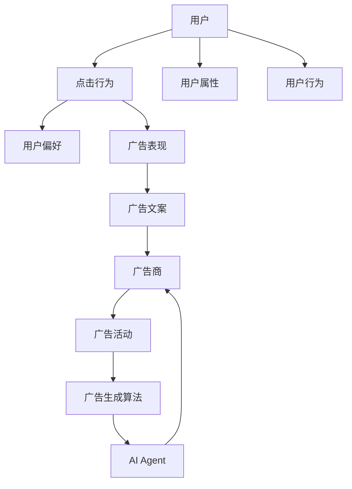
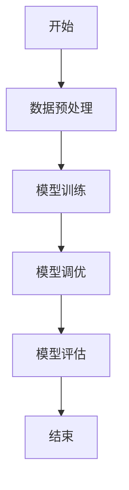
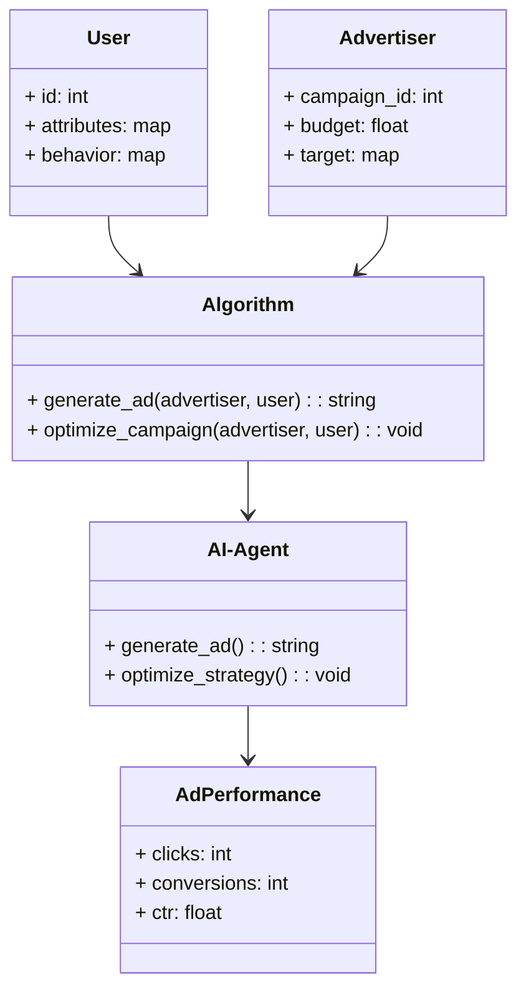

                 


# 智能营销 AI Agent：LLM 驱动的个性化广告生成

> 关键词：智能营销、AI Agent、LLM、个性化广告、自然语言处理

> 摘要：本文探讨了利用大语言模型（LLM）驱动的AI代理在个性化广告生成中的应用。通过详细分析背景、核心概念、算法原理、系统架构和项目实战，本文为读者提供了一个全面的视角，解释了如何利用AI技术提升广告生成的效率和效果，同时探讨了实际应用中的注意事项和未来发展方向。

---

## 第一部分：背景介绍与核心概念

### 第1章：问题背景与描述

#### 1.1 问题背景
随着数字营销的快速发展，广告生成技术也在不断进步。然而，传统广告生成方式存在以下问题：
- 广告内容千篇一律，难以满足用户的个性化需求。
- 数据分析复杂，难以快速生成符合用户偏好的广告内容。
- 广告效果难以量化，难以优化广告策略。

AI技术的引入为广告生成带来了新的可能性，尤其是基于大语言模型（LLM）的AI代理（AI Agent）能够通过自然语言处理技术，实现更加智能化和个性化的广告生成。

#### 1.2 问题描述
个性化广告生成的核心挑战包括：
- 如何快速分析用户行为和偏好，生成符合其兴趣的广告内容。
- 如何优化广告内容，以提高点击率和转化率。
- 如何实时调整广告策略，以应对市场变化。

#### 1.3 问题解决
AI Agent通过以下方式解决了上述问题：
- 利用自然语言处理技术，分析用户行为数据，生成个性化广告内容。
- 通过机器学习算法，优化广告内容和策略，提高广告效果。
- 实时监控市场变化，动态调整广告内容，以满足用户需求。

### 第2章：核心概念与联系

#### 2.1 AI Agent的基本原理
AI Agent是一种智能代理，能够根据环境信息和目标，自主决策并执行任务。在广告生成中，AI Agent通过分析用户数据，生成个性化广告内容，并实时调整广告策略。

#### 2.2 LLM在广告生成中的作用
大语言模型（LLM）通过自然语言处理技术，能够理解上下文信息，并生成符合用户需求的文本内容。在广告生成中，LLM可以用于：
- 生成广告文案。
- 分析用户反馈，优化广告内容。
- 预测用户行为，推荐广告策略。

#### 2.3 实体关系图与流程图
以下是AI Agent驱动的个性化广告生成系统的实体关系图和流程图：



---

## 第二部分：算法原理讲解

### 第3章：LLM广告生成算法流程

#### 3.1 数据预处理
广告生成的第一步是数据预处理，包括：
- 数据清洗：去除噪声数据，提取有用信息。
- 数据标注：标注用户行为数据，便于模型训练。

#### 3.2 模型训练
模型训练包括以下步骤：
- 确定模型结构：选择适合的LLM模型，如GPT-3、BERT等。
- 参数初始化：随机初始化模型参数。
- 训练过程：通过反向传播算法，优化模型参数，使其能够生成符合用户需求的广告内容。

#### 3.3 模型调优与评估
模型调优包括：
- 超参数优化：调整学习率、批量大小等参数，提高模型性能。
- 模型评估：通过A/B测试等方式，评估广告生成效果。

### 3.4 算法流程图
以下是广告生成算法的流程图：



---

## 第三部分：数学模型与公式

### 第4章：概率模型与损失函数

#### 4.1 概率模型
广告生成可以看作是一个概率问题。给定用户数据 \( x \)，模型的目标是生成一个概率分布 \( P(y|x) \)，其中 \( y \) 是广告内容。

#### 4.2 损失函数
交叉熵损失函数常用于模型训练：

$$
\text{Loss} = -\sum_{i=1}^{n} y_i \log(p_i) + (1-y_i) \log(1-p_i)
$$

其中，\( p_i \) 是模型预测的概率，\( y_i \) 是真实标签。

---

## 第四部分：系统分析与架构设计

### 第5章：系统功能设计

#### 5.1 系统功能模块
广告生成系统主要包含以下功能模块：
- 用户数据采集：收集用户行为数据。
- 广告生成：基于用户数据生成广告内容。
- 广告优化：根据用户反馈优化广告内容。
- 效果评估：评估广告效果，调整广告策略。

#### 5.2 领域模型设计
以下是广告生成系统的领域模型图：



---

## 第五部分：项目实战

### 第6章：环境安装与代码实现

#### 6.1 环境安装
安装所需的依赖库：

```bash
pip install numpy
pip install tensorflow
pip install keras
pip install matplotlib
pip install scikit-learn
```

#### 6.2 核心代码实现
以下是广告生成的Python代码示例：

```python
import numpy as np
from tensorflow import keras
from tensorflow.keras import layers

# 定义模型
model = keras.Sequential()
model.add(layers.Dense(256, activation='relu', input_dim=100))
model.add(layers.Dense(1, activation='sigmoid'))

# 编译模型
model.compile(optimizer='adam', loss='binary_crossentropy', metrics=['accuracy'])

# 训练模型
model.fit(X_train, y_train, epochs=10, batch_size=32)
```

---

## 第六部分：最佳实践与小结

### 第7章：总结与展望

#### 7.1 总结
本文详细介绍了利用LLM驱动的AI Agent实现个性化广告生成的技术与方法。通过分析背景、核心概念、算法原理、系统架构和项目实战，为读者提供了一个全面的视角，帮助其理解如何利用AI技术提升广告生成的效果。

#### 7.2 注意事项
在实际应用中，需要注意以下几点：
- 数据隐私和安全问题。
- 模型的可解释性问题。
- 算法的实时性和响应速度问题。

#### 7.3 拓展阅读
建议读者进一步阅读以下内容：
- 大语言模型（LLM）的最新研究成果。
- AI Agent在其他领域的应用。
- 个性化推荐系统的相关技术。

---

通过本文的学习，读者可以深入了解如何利用AI技术实现个性化广告生成，并在实际应用中灵活运用这些技术，推动智能营销的发展。

