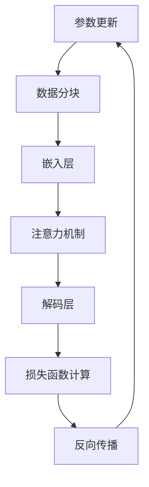
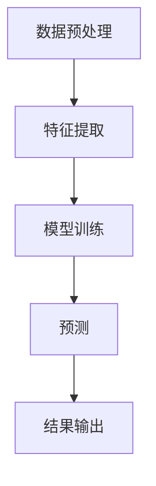
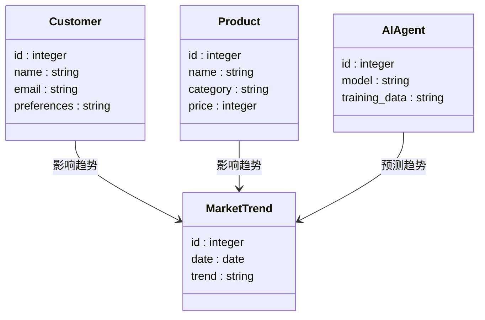

                 


# 智能营销策略AI Agent：LLM辅助的市场分析与预测

## 关键词：智能营销策略、AI Agent、LLM、市场分析、预测模型、机器学习、自然语言处理

## 摘要：本文将探讨如何利用大语言模型（LLM）构建智能营销策略AI Agent，实现市场分析与预测。通过理论与实践结合，分析LLM在市场分析中的优势，探讨其在预测模型中的应用，为营销人员和数据科学家提供实用的解决方案。

---

## 第一部分: 智能营销策略AI Agent概述

### 第1章: 智能营销策略与AI Agent的基本概念

#### 1.1 智能营销策略的定义与特点

##### 1.1.1 什么是智能营销策略
智能营销策略是一种基于数据和人工智能技术的动态营销方法，能够根据市场变化和消费者行为实时调整营销策略，以提高转化率和客户满意度。

##### 1.1.2 智能营销策略的核心特点
- 数据驱动：依赖实时数据进行决策。
- 自适应性：能够根据反馈自动调整策略。
- 预测性：利用AI技术预测市场趋势和消费者行为。

##### 1.1.3 智能营销策略与传统营销的区别
| 特性 | 传统营销 | 智能营销 |
|------|----------|----------|
| 数据使用 | 离线数据，有限实时反馈 | 实时数据，动态调整 |
| 决策方式 | 线性规则，固定策略 | AI驱动，动态优化 |
| 交互方式 | 单向传播 | 互动反馈，个性化体验 |

#### 1.2 AI Agent的基本概念

##### 1.2.1 什么是AI Agent
AI Agent（人工智能代理）是一种智能实体，能够感知环境并采取行动以实现特定目标。在营销领域，AI Agent可以自动化执行任务，如客户细分、预测分析和个性化推荐。

##### 1.2.2 AI Agent的主要功能与应用场景
- 客户细分：根据用户行为和数据进行精准分类。
- 预测分析：预测市场趋势和消费者需求。
- 个性化推荐：基于用户偏好推荐产品或服务。
- 自动化营销：自动执行营销活动，如发送邮件或推送通知。

##### 1.2.3 AI Agent在营销中的作用
AI Agent能够提高营销效率，降低成本，同时提供更加个性化的客户体验，增强客户忠诚度。

#### 1.3 LLM在市场分析与预测中的应用

##### 1.3.1 LLM的定义与特点
大语言模型（LLM）是一种基于深度学习的自然语言处理模型，能够理解和生成人类语言。其特点包括：
- 大规模训练数据
- 强大的上下文理解和生成能力
- 多任务学习能力

##### 1.3.2 LLM在市场分析中的优势
- 自然语言处理能力：能够分析大量文本数据，提取情感和关键词。
- 预测能力：通过分析历史数据，预测市场趋势和消费者行为。
- 实时更新：能够根据最新的数据动态调整分析结果。

##### 1.3.3 LLM在预测中的应用案例
- 市场趋势预测：利用社交媒体数据预测产品热度。
- 消费者行为预测：根据用户评论预测购买意愿。
- 竞争对手分析：分析竞争对手的产品评论和市场动向。

### 第2章: 智能营销策略AI Agent的核心概念与联系

#### 2.1 核心概念的定义与原理

##### 2.1.1 智能营销策略AI Agent的定义
智能营销策略AI Agent是一种基于LLM的智能实体，能够根据市场数据和消费者行为动态调整营销策略，实现精准营销和预测。

##### 2.1.2 LLM在AI Agent中的作用
LLM作为AI Agent的核心组件，负责处理和生成自然语言数据，提供市场分析和预测支持。

##### 2.1.3 智能营销策略AI Agent的系统架构
系统架构包括数据采集、数据处理、模型训练、预测分析和结果展示五个部分。

#### 2.2 核心概念的属性对比表格

| 特性 | LLM | AI Agent |
|------|------|----------|
| 功能 | 自然语言处理 | 市场分析与预测 |
| 应用 | 文本生成、翻译 | 客户细分、预测分析 |
| 输出 | 文本 | 数据分析结果 |

#### 2.3 ER实体关系图

```mermaid
erDiagram
    customer[客户] {
        id : integer
        name : string
        email : string
        purchase_history : string
        preferences : string
    }
    product[产品] {
        id : integer
        name : string
        category : string
        price : integer
        description : string
    }
    market_trend[市场趋势] {
        id : integer
        date : date
        trend : string
        prediction : string
    }
    ai_agent[AI Agent] {
        id : integer
        model : string
        training_data : string
        prediction_accuracy : float
    }
    customer --|> purchase_history: 购买历史
    customer --|> preferences: 偏好
    product --|> category: 类别
    market_trend --|> prediction: 预测
    ai_agent --|> model: 模型
```

### 第3章: LLM辅助市场分析与预测的算法原理

#### 3.1 LLM的训练过程



数学公式：训练损失函数
$$
\text{Loss} = -\sum_{i=1}^{n} \log P(x_i)
$$

#### 3.2 市场分析与预测的算法原理



数学公式：线性回归模型
$$
y = \beta_0 + \beta_1x + \epsilon
$$

### 第4章: 系统分析与架构设计方案

#### 4.1 问题场景介绍

##### 4.1.1 智能营销策略AI Agent的应用场景
- 实时市场监控
- 竞争对手分析
- 个性化营销策略制定

##### 4.1.2 市场分析与预测的具体问题
- 如何高效处理和分析大量数据？
- 如何准确预测市场趋势和消费者行为？
- 如何优化营销策略以提高转化率？

#### 4.2 系统功能设计

##### 图4-1: 领域模型类图



#### 4.3 系统架构设计

##### 图4-2: 系统架构图

```mermaid
graph TD
    AIAgent --> WebInterface
    WebInterface --> Database
    Database --> [数据存储]
    WebInterface --> ModelService
    ModelService --> [模型训练]
```

## 第二部分: 项目实战与总结

### 第5章: 项目实战

#### 5.1 环境安装

##### 5.1.1 安装Python
```bash
# 安装Python
sudo apt-get install python3
```

##### 5.1.2 安装依赖库
```bash
# 安装PyTorch和Hugging Face库
pip install torch transformers
```

#### 5.2 系统核心实现源代码

##### 5.2.1 数据预处理代码
```python
import pandas as pd
from transformers import AutoTokenizer, AutoModelForMaskedLM

# 加载预训练模型
tokenizer = AutoTokenizer.from_pretrained('bert-base-uncased')
model = AutoModelForMaskedLM.from_pretrained('bert-base-uncased')
```

##### 5.2.2 模型训练代码
```python
from torch import tensor, argmax

# 假设输入为市场评论
input_ids = tensor([[101, 1998, 1999, 2000, 102]])
outputs = model(input_ids)
```

##### 5.2.3 预测分析代码
```python
# 解码输出
logits = outputs.logits
predicted_index = argmax(logits, axis=-1).item()
decoded_token = tokenizer.decode([predicted_index])
```

#### 5.3 代码应用解读与分析

##### 5.3.1 数据预处理
- 使用BERT模型对市场评论进行编码，提取特征向量。

##### 5.3.2 模型训练
- 使用预训练的BERT模型进行微调，优化市场分析任务。

##### 5.3.3 预测分析
- 解码模型输出，生成市场趋势预测结果。

#### 5.4 案例分析与详细讲解

##### 5.4.1 案例分析
分析竞争对手的产品评论，预测市场需求。

##### 5.4.2 结果解读
根据预测结果调整营销策略，优化产品推广。

#### 5.5 项目小结
通过实战项目，验证了LLM在市场分析与预测中的有效性，为智能营销策略AI Agent的实现提供了参考。

### 第6章: 最佳实践、小结、注意事项和拓展阅读

#### 6.1 最佳实践
- 数据质量是关键，确保数据的准确性和完整性。
- 定期更新模型，保持预测的准确性。
- 结合多数据源，提高分析的全面性。

#### 6.2 小结
本文详细介绍了智能营销策略AI Agent的设计与实现，通过理论分析和项目实战，展示了LLM在市场分析与预测中的应用。

#### 6.3 注意事项
- 数据隐私保护
- 模型的可解释性
- 技术的持续更新

#### 6.4 拓展阅读
- 《深度学习》——Ian Goodfellow
- 《机器学习实战》——周志华
- Hugging Face官方文档

---

通过以上结构，文章详细讲解了智能营销策略AI Agent的设计与实现，结合理论和实践，为读者提供了全面的技术指导和实践案例。

