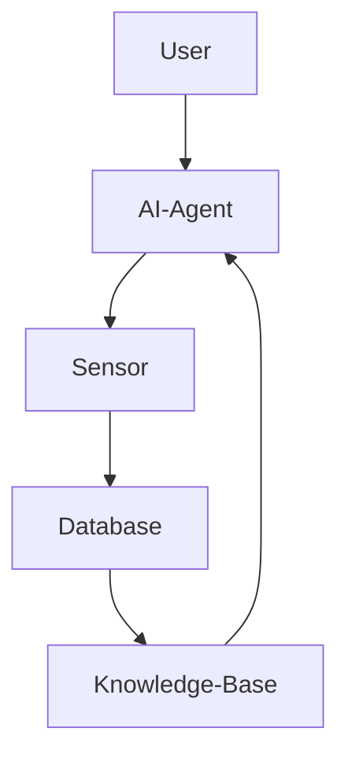

                 


# 智能衣架：AI Agent的衣物保养专家系统

## 关键词：智能衣架，AI Agent，衣物保养，智能助手，算法原理，系统架构，项目实战

## 摘要

本文系统阐述智能衣架AI Agent在衣物保养中的应用，从背景、原理到系统架构，再到项目实现和优化，全面分析其技术实现和实际应用价值。通过详细的技术分析和实例演示，本文旨在为技术爱好者和相关从业者提供深入的技术洞见和实践指导。

---

## 第1章：智能衣架的背景与问题背景

### 1.1 智能衣架的背景

#### 1.1.1 衣物保养的传统问题与挑战

传统衣物保养面临诸多问题，包括衣物材质复杂、保养方法多样、用户知识不足等。用户常因错误的保养方法导致衣物损坏，而专业的保养知识难以快速获取。

#### 1.1.2 AI技术在衣物保养中的应用潜力

AI技术，特别是自然语言处理和机器学习，能够帮助用户快速获取保养信息，提供个性化的保养建议。智能衣架通过集成AI Agent，可以实时分析衣物状态，推荐最优保养方案。

#### 1.1.3 智能衣架的定义与目标

智能衣架是一种结合物联网和AI技术的智能设备，通过传感器和AI算法，实时监测衣物状态，提供智能化的保养建议和提醒服务，目标是延长衣物使用寿命，提升用户生活质量。

---

## 第2章：AI Agent的基本原理与核心概念

### 2.1 AI Agent的定义与分类

#### 2.1.1 AI Agent的定义

AI Agent是具有感知环境、理解用户需求并执行任务的智能实体，能够通过交互提供个性化服务。

#### 2.1.2 AI Agent的分类

AI Agent主要分为两类：基于规则的简单Agent和基于机器学习的智能Agent。智能衣架中的AI Agent属于后者，能够通过学习优化建议。

#### 2.1.3 AI Agent与传统软件的区别

AI Agent具有主动性、学习能力和自适应性，能够根据反馈优化服务，而传统软件依赖预设规则。

---

## 第3章：智能衣架中的AI Agent架构

### 3.1 分层架构：感知层、决策层、执行层

#### 3.1.1 感知层

感知层负责数据采集，包括衣物材质、颜色、品牌识别等。使用图像识别技术，通过摄像头捕捉衣物信息。

#### 3.1.2 决策层

决策层基于感知数据，结合知识图谱，生成保养建议。使用自然语言处理技术，提供个性化的对话交互。

#### 3.1.3 执行层

执行层通过物联网设备（如智能衣架）执行任务，例如调整衣物存放位置或触发清洗提醒。

---

## 第4章：算法原理与数学模型

### 4.1 对话生成模型

#### 4.1.1 Transformer模型

对话生成基于Transformer模型，通过自注意力机制捕捉上下文信息，生成自然流畅的回复。

#### 4.1.2 损失函数

交叉熵损失函数用于模型训练：

$$ \text{损失函数} = -\sum_{i=1}^{n} \text{log} p(y_i|x_i) $$

### 4.2 意图识别算法

#### 4.2.1 关键词匹配

通过关键词提取用户意图，如“清洗”、“干燥”等。

#### 4.2.2 机器学习分类

使用支持向量机或随机森林分类器对意图进行分类。

---

## 第5章：系统架构设计

### 5.1 系统模块划分

- 数据采集模块：负责衣物信息采集。
- AI处理模块：负责数据处理和建议生成。
- 用户交互模块：负责与用户的对话交互。

### 5.2 系统架构图



---

## 第6章：项目实战

### 6.1 环境搭建

- 使用Python 3.8及以上版本，安装TensorFlow、Keras等库。

### 6.2 核心代码实现

```python
def generate_response(user_input):
    # 模型加载
    model = load_model('conversation_model.h5')
    # 预处理
    input_seq = preprocess(user_input)
    # 预测
    prediction = model.predict(input_seq)
    # 生成回复
    response = decode(prediction)
    return response
```

### 6.3 实际案例分析

案例：用户询问如何清洗羊毛衣物。系统识别材质，结合知识库，建议使用温水和中性洗涤剂，避免过度揉搓。

---

## 第7章：优化与维护

### 7.1 性能优化

- 使用缓存机制减少重复计算。
- 优化模型结构，降低计算复杂度。

### 7.2 数据安全

- 数据加密存储，确保用户隐私。
- 定期备份数据，防止数据丢失。

### 7.3 用户反馈

- 收集用户反馈，持续优化模型。
- 定期更新知识库，提升建议准确性。

---

## 附录：工具与资源

- Python安装指南
- TensorFlow安装与使用
- 项目源代码下载链接

---

## 参考文献

1. Vaswani et al. "Attention Is All You Need." 2017.
2. LeCun et al. "Deep Learning." 2015.
3. IBM Watson Documentation.

---

通过以上内容，您可以系统地了解智能衣架AI Agent的技术实现和应用场景。从背景到实现，从理论到实践，本文为您提供全面的技术解析和实践指导。

