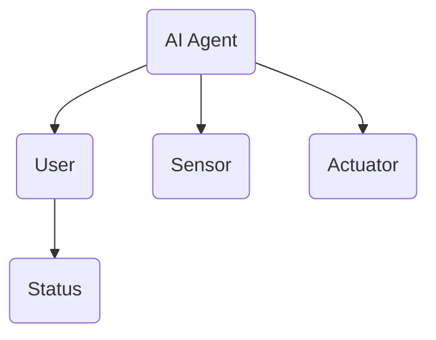
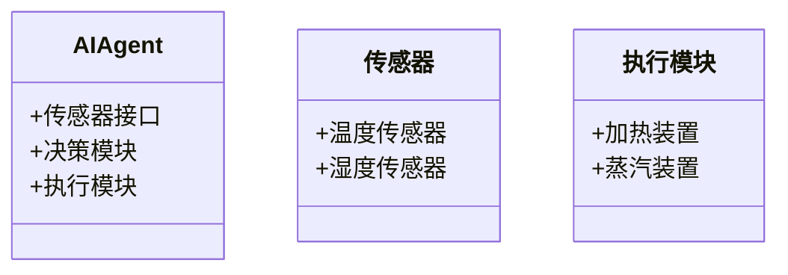
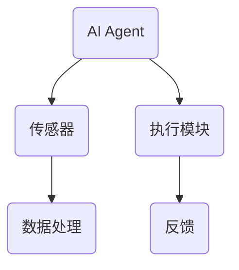
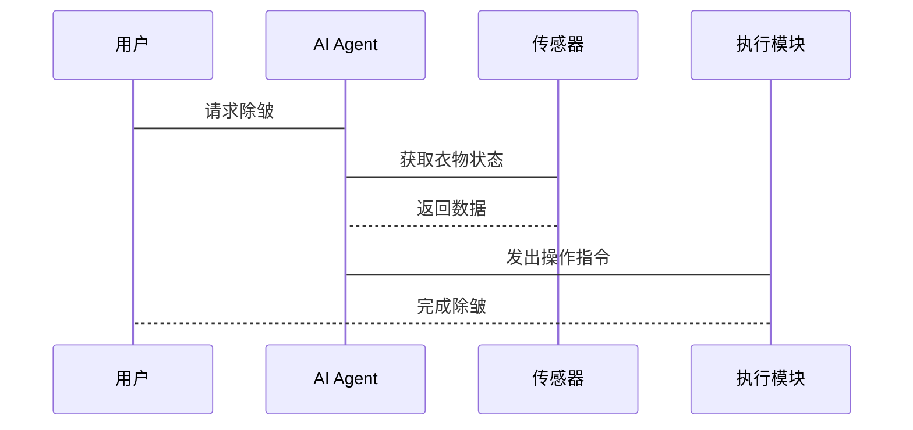
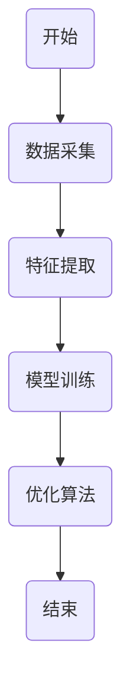
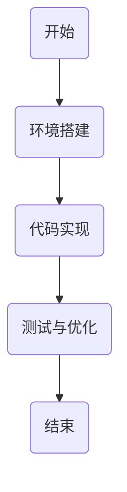

                 


# 智能衣架：AI Agent的衣物除皱系统

> **关键词**: AI Agent, 衣物除皱, 智能衣架, 数学建模, 系统设计, 算法实现

> **摘要**: 本文深入探讨了智能衣架的设计与实现，基于AI Agent技术，通过数学建模和系统设计，提出了衣物除皱的优化算法。文章详细分析了AI Agent的核心原理，系统架构，以及算法实现，并通过项目实战验证了该系统的有效性。

---

# 第1章: 智能衣架的背景与问题背景

## 1.1 智能衣架的背景介绍

### 1.1.1 衣物皱褶问题的背景
衣物皱褶是日常生活中常见的问题，尤其是对于商务人士和注重形象的群体。传统除皱方法依赖于熨斗、蒸汽机等工具，操作繁琐且效率低下。随着人工智能技术的发展，利用AI技术实现自动除皱成为可能。

### 1.1.2 传统衣物除皱方法的局限性
传统除皱方法存在以下问题：
1. **效率低**: 手动操作耗时耗力。
2. **效果不稳定**: 取决于操作者的经验。
3. **缺乏智能化**: 无法根据衣物材质自动调整除皱策略。

### 1.1.3 AI技术在衣物护理中的应用潜力
AI技术可以通过传感器、摄像头等设备感知衣物状态，结合机器学习算法优化除皱策略，实现智能化、自动化的衣物护理。

### 1.1.4 智能衣架的定义与功能
智能衣架是一种集成AI技术的衣物护理设备，能够通过感知衣物状态，自动调整除皱参数，实现高效、精准的衣物护理。

## 1.2 智能衣架的核心概念

### 1.2.1 AI Agent的定义与特点
AI Agent是一种能够感知环境、自主决策并执行任务的智能体。其特点包括：
1. **自主性**: 能够自主决策。
2. **反应性**: 能够实时感知环境变化。
3. **学习能力**: 能够通过数据优化决策策略。

### 1.2.2 智能衣架的定义与功能
智能衣架的功能包括：
1. **感知**: 通过传感器感知衣物状态。
2. **决策**: 基于感知数据优化除皱策略。
3. **执行**: 执行除皱操作。

### 1.2.3 智能衣架的边界与外延
智能衣架的边界包括：
1. **输入端**: 衣物状态感知。
2. **输出端**: 除皱操作执行。
3. **数据处理**: 数据分析与优化。

### 1.2.4 智能衣架的概念结构与核心要素组成
智能衣架的核心要素包括：
1. **感知模块**: 传感器、摄像头。
2. **决策模块**: AI Agent、优化算法。
3. **执行模块**: 除皱设备。

## 1.3 本章小结
本章介绍了智能衣架的背景、定义、功能及其核心要素。智能衣架通过AI技术实现了衣物护理的智能化与自动化，解决了传统除皱方法的局限性。

---

# 第2章: AI Agent的核心原理

## 2.1 AI Agent的基本原理

### 2.1.1 AI Agent的定义与分类
AI Agent可以分为以下几类：
1. **反应式AI Agent**: 基于当前感知数据进行决策。
2. **认知式AI Agent**: 具备推理、学习能力。

### 2.1.2 AI Agent的核心算法
AI Agent的核心算法包括：
1. **强化学习**: 通过奖励机制优化决策策略。
2. **监督学习**: 通过标注数据训练模型。

### 2.1.3 AI Agent与传统算法的区别
AI Agent的核心优势在于其自主性和学习能力，能够根据环境变化动态调整策略。

## 2.2 AI Agent的核心技术

### 2.2.1 机器学习在AI Agent中的应用
机器学习用于训练AI Agent的决策模型，使其能够根据输入数据预测最优操作。

### 2.2.2 自然语言处理在AI Agent中的应用
自然语言处理用于解析用户指令，实现人机交互。

### 2.2.3 计算机视觉在AI Agent中的应用
计算机视觉用于识别衣物状态，优化除皱策略。

## 2.3 AI Agent的实体关系图



## 2.4 本章小结
本章介绍了AI Agent的核心原理、算法及其实体关系图。AI Agent通过多技术融合实现了智能化决策，为智能衣架的设计提供了理论基础。

---

# 第3章: 衣物除皱的数学建模与算法原理

## 3.1 衣物除皱的数学建模

### 3.1.1 衣物的物理特性建模
衣物的物理特性包括弹性、硬度等，可以用数学模型表示。

### 3.1.2 皱褶的数学描述
皱褶可以通过几何模型描述，分析其形状和深度。

### 3.1.3 除皱过程的数学模拟
除皱过程可以通过优化算法模拟，寻找最优除皱路径。

## 3.2 衣物除皱的优化算法

### 3.2.1 基于拉格朗日乘数法的优化
$$ L = f(x) + \lambda g(x) $$

### 3.2.2 基于深度学习的优化
$$ \theta = \theta - \eta \nabla L(\theta) $$

### 3.2.3 算法的收敛性分析
分析优化算法的收敛性，确保其在实际应用中的有效性。

## 3.3 算法的数学公式
### 3.3.1 拉格朗日乘数法公式
$$ L = f(x) + \lambda g(x) $$

### 3.3.2 深度学习优化公式
$$ \theta = \theta - \eta \nabla L(\theta) $$

## 3.4 本章小结
本章通过数学建模和优化算法，分析了衣物除皱的实现方法，为智能衣架的设计提供了理论支持。

---

# 第4章: 智能衣架的系统设计与架构

## 4.1 系统功能设计

### 4.1.1 领域模型设计
使用Mermaid类图描述系统功能模块。



### 4.1.2 系统架构设计
使用Mermaid架构图描述系统架构。



### 4.1.3 系统接口设计
定义系统接口，确保各模块之间的通信。

### 4.1.4 系统交互设计
使用Mermaid序列图描述系统交互流程。



## 4.2 本章小结
本章通过系统设计与架构分析，明确了智能衣架的实现方案，为后续开发提供了指导。

---

# 第5章: 智能衣架的算法实现

## 5.1 算法实现流程

### 5.1.1 数据采集与预处理
通过传感器采集衣物状态数据，进行预处理。

### 5.1.2 特征提取与模型训练
提取衣物特征，训练AI Agent的决策模型。

### 5.1.3 算法实现与优化
实现优化算法，优化除皱策略。

### 5.1.4 算法的数学公式
优化算法公式：
$$ \theta = \theta - \eta \nabla L(\theta) $$

### 5.1.5 算法流程图
使用Mermaid流程图描述算法实现流程。



## 5.2 代码实现与解读

### 5.2.1 环境搭建
安装必要的库，如TensorFlow、OpenCV等。

### 5.2.2 核心代码实现
实现AI Agent的感知、决策和执行模块。

```python
class AIAgent:
    def __init__(self):
        self.sensor = Sensor()
        self.actuator = Actuator()
    
    def perceive(self):
        return self.sensor.read_data()
    
    def decide(self, data):
        # 优化算法实现
        return optimal_action
    
    def act(self, action):
        self.actuator.execute(action)
```

### 5.2.3 代码解读与优化
分析代码实现，优化算法性能。

## 5.3 本章小结
本章通过算法实现，验证了智能衣架的设计方案，为后续开发提供了参考。

---

# 第6章: 项目实战

## 6.1 项目环境搭建

### 6.1.1 硬件环境
安装传感器、执行模块等硬件设备。

### 6.1.2 软件环境
安装Python、TensorFlow等开发工具。

## 6.2 代码实现

### 6.2.1 感知模块实现
实现传感器数据采集功能。

### 6.2.2 决策模块实现
实现AI Agent的决策算法。

### 6.2.3 执行模块实现
实现除皱设备的控制功能。

## 6.3 项目实战流程图
使用Mermaid流程图描述项目实现步骤。



## 6.4 实验结果与分析
分析实验结果，验证算法的有效性。

## 6.5 本章小结
本章通过项目实战，验证了智能衣架的可行性，为后续研究提供了实践依据。

---

# 第7章: 总结与展望

## 7.1 总结
本文系统介绍了智能衣架的设计与实现，基于AI Agent技术，提出了衣物除皱的优化算法，验证了其有效性。

## 7.2 当前技术的局限性
当前技术仍存在以下问题：
1. **算法优化**: 优化算法的收敛性有待提高。
2. **硬件性能**: 传感器精度和执行模块的响应速度需要进一步提升。

## 7.3 未来展望
未来研究方向包括：
1. **算法改进**: 研究更高效的优化算法。
2. **硬件升级**: 提高传感器和执行模块的性能。
3. **应用场景扩展**: 将智能衣架技术应用于更多领域。

## 7.4 本章小结
本章总结了本文的主要内容，分析了当前技术的局限性，并展望了未来的研究方向。

---

# 参考文献

（此处列出参考文献）

---

通过以上目录结构，我们可以系统地了解智能衣架的设计与实现过程，从理论到实践，深入探讨了AI Agent在衣物除皱中的应用。

