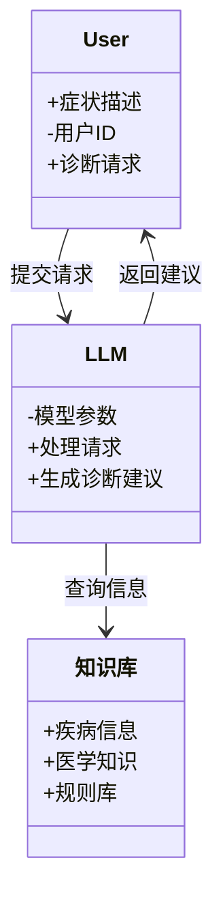
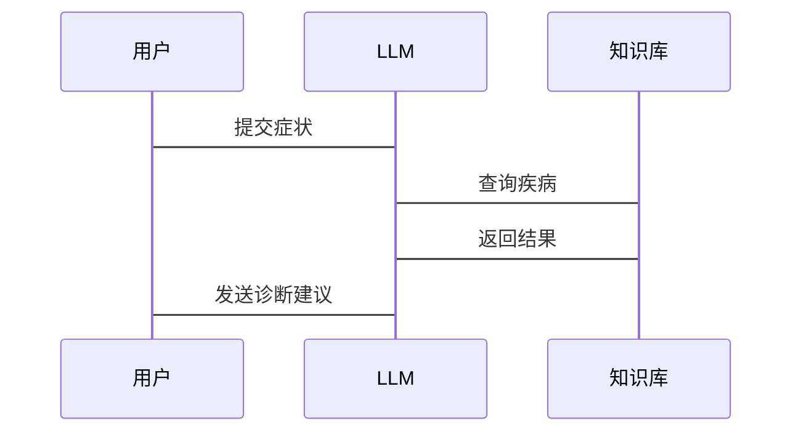

                 


# 智能诊断AI Agent：LLM在医疗健康领域的应用

## 关键词
智能诊断、AI Agent、LLM、医疗健康、人工智能、大语言模型

## 摘要
智能诊断AI Agent利用大语言模型（LLM）技术，在医疗健康领域实现了高效、精准的诊断辅助。本文从背景、核心概念、算法原理、系统架构、项目实战到最佳实践，全面解析LLM在医疗诊断中的应用，探讨其在医疗行业中的潜力和挑战。

---

# 第一部分: 背景与概念

## 第1章: 医疗健康领域的智能诊断需求

### 1.1 医疗行业的发展与挑战
#### 1.1.1 医疗行业的现状与发展趋势
医疗行业正经历数字化转型，数据量激增，但医生资源有限，诊断效率亟待提高。传统诊断依赖经验，存在主观性和效率瓶颈。

#### 1.1.2 传统医疗诊断的局限性
- 诊断耗时长，资源分配不均。
- 医生经验不足可能导致误诊或漏诊。
- 医疗数据分散，难以高效整合。

#### 1.1.3 AI技术在医疗诊断中的潜力
- AI技术可快速处理海量数据，提高诊断效率。
- 基于LLM的AI Agent能提供个性化诊断建议，辅助医生决策。

### 1.2 智能诊断的背景与问题描述
#### 1.2.1 医疗诊断中的问题与挑战
- 医疗数据复杂，结构化与非结构化并存。
- 病症多样，诊断逻辑复杂。
- 数据隐私保护要求高。

#### 1.2.2 AI在医疗诊断中的应用场景
- 病症初步筛查。
- 辅助诊断建议。
- 治疗方案推荐。

#### 1.2.3 LLM在智能诊断中的独特优势
- 强大的自然语言处理能力，理解非结构化数据。
- 能够生成人类可读的诊断报告。
- 支持多轮对话，提供个性化服务。

### 1.3 智能诊断AI Agent的边界和外延
- 边界：专注于辅助诊断，不替代医生最终决策。
- 外延：可扩展至健康咨询、疾病预防等领域。

## 第2章: 智能诊断AI Agent的核心概念

### 2.1 AI Agent的基本定义与特点
- **定义**：AI Agent是一种智能体，能感知环境并采取行动以实现目标。
- **特点**：自主性、反应性、主动性、社会性。

### 2.2 LLM在智能诊断中的应用
- **LLM基本原理**：基于Transformer架构，通过大量数据预训练，理解上下文。
- **LLM在诊断中的优势**：处理非结构化数据，生成自然语言文本。

### 2.3 智能诊断AI Agent的系统架构
- **系统整体架构**：数据输入、模型处理、结果输出。
- **模块交互**：用户输入→LLM处理→知识库调用→结果生成。

## 第3章: 智能诊断AI Agent的核心要素

### 3.1 数据来源与处理
- **数据多样性**：文本、图像、结构化数据。
- **数据预处理**：清洗、标注、格式统一。

### 3.2 知识库构建与管理
- **知识库构建**：医学术语、疾病知识图谱。
- **知识库管理**：动态更新、高效检索。

### 3.3 模型训练与优化
- **模型选择**：选择适合医疗场景的LLM。
- **模型调优**：微调任务，优化诊断准确率。

---

# 第二部分: 核心概念与联系

## 第4章: 智能诊断AI Agent的核心原理

### 4.1 LLM的工作原理
#### 4.1.1 大语言模型的基本原理
- 基于Transformer的编码器和解码器结构。
- 注意力机制捕捉上下文关系。

#### 4.1.2 模型的训练过程
- 预训练：无监督学习，理解语言结构。
- 微调：有监督学习，适应特定任务。

#### 4.1.3 模型的推理机制
- 解码器生成输出，基于概率预测。

### 4.2 AI Agent的决策过程
#### 4.2.1 信息输入与解析
- 用户输入病历，解析关键信息。
- 使用自然语言处理提取症状。

#### 4.2.2 决策生成与验证
- 基于知识库生成诊断建议。
- 多轮对话验证准确性。

#### 4.2.3 决策反馈与优化
- 用户反馈优化模型。
- 持续学习提升性能。

### 4.3 系统的协同工作
- 数据流：用户输入→LLM处理→知识库→输出结果。
- 模块协同：各组件分工明确，高效协作。

---

## 第5章: 系统分析与架构设计

### 5.1 问题场景介绍
- 用户输入症状，系统生成诊断建议。
- 系统需调用知识库，提供准确信息。

### 5.2 项目介绍
- 开发一个基于LLM的智能诊断AI Agent。
- 功能包括症状分析、诊断建议、健康咨询。

### 5.3 系统功能设计
#### 5.3.1 领域模型设计
- 使用Mermaid画出类图，展示各组件关系。



### 5.4 系统架构设计
#### 5.4.1 系统架构图
- 展示各模块的交互关系。


### 5.5 系统接口设计
- 接口定义：RESTful API，处理请求和返回结果。

### 5.6 系统交互流程
- 使用Mermaid序列图展示交互流程。



---

## 第6章: 项目实战

### 6.1 环境配置
- 安装Python和相关库（如transformers、flask）。

### 6.2 核心代码实现
#### 6.2.1 模型加载与调用
```python
from transformers import AutoTokenizer, AutoModelForCausalLM
model_name = "gpt2"
tokenizer = AutoTokenizer.from_pretrained(model_name)
model = AutoModelForCausalLM.from_pretrained(model_name)
```

#### 6.2.2 知识库查询
```python
def query_knowledge_base(question):
    # 简单实现，实际应调用知识库API
    return "根据知识库，您的症状可能与感冒有关。"
```

#### 6.2.3 诊断建议生成
```python
def generate_diagnosis(input_text):
    inputs = tokenizer(input_text, return_tensors="np")
    outputs = model.generate(inputs.input_ids, max_length=100)
    return tokenizer.decode(outputs[0], skip_special_tokens=True)
```

### 6.3 代码解读与分析
- 模型加载：使用预训练好的GPT-2模型。
- 知识库查询：简单实现，实际应集成专业医疗知识库。
- 诊断生成：基于输入生成诊断建议。

### 6.4 实际案例分析
- 用户输入：咳嗽、发热。
- 系统诊断：可能为感冒，建议进一步检查。

### 6.5 项目小结
- 成功实现了一个简单的智能诊断系统。
- 未来可优化知识库和模型性能。

---

## 第7章: 最佳实践与总结

### 7.1 小结
- 本文详细介绍了智能诊断AI Agent的背景、核心概念、算法原理、系统架构和项目实战。
- LLM在医疗诊断中的应用潜力巨大。

### 7.2 注意事项
- 数据隐私保护至关重要。
- 模型需持续优化，提升诊断准确率。

### 7.3 拓展阅读
- 推荐阅读《Large Language Models in Medical Diagnostics》。

---

# 结语
智能诊断AI Agent借助LLM技术，正在改变医疗行业的诊断方式。未来，随着技术进步，AI将更好地辅助医生，提升诊断效率和准确性，为患者带来更好的医疗体验。

--- 

希望这篇技术博客能满足您的需求！

