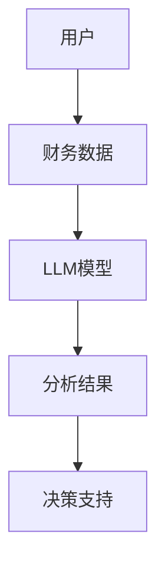
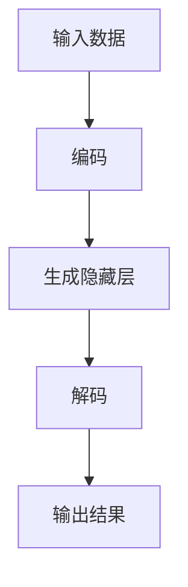
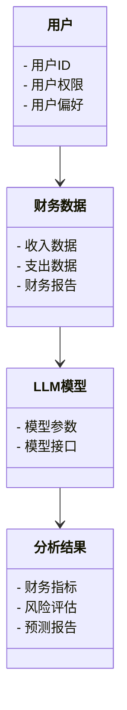
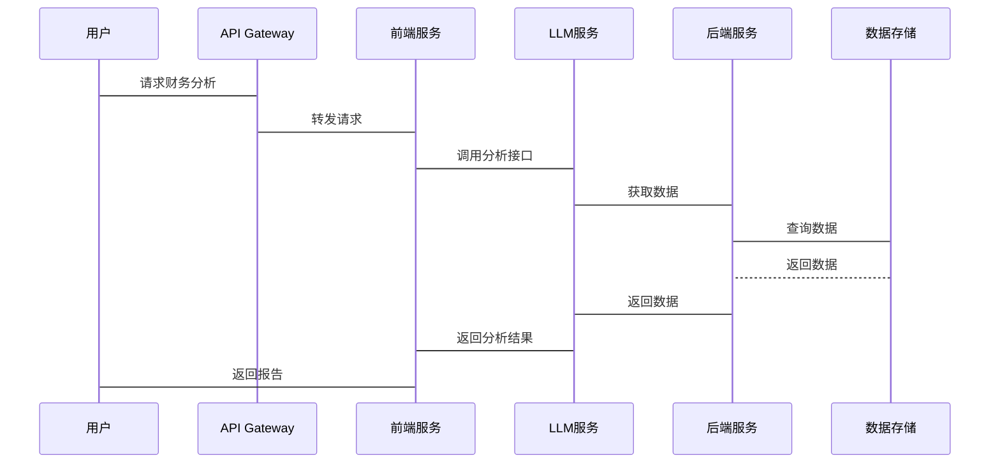

                 


# 智能财务分析 AI Agent：LLM 在企业财务管理中的应用

> 关键词：智能财务分析，LLM，AI Agent，企业财务管理，深度学习，自然语言处理

> 摘要：随着人工智能技术的飞速发展，自然语言处理（NLP）技术在企业财务管理中的应用日益广泛。本文将重点探讨大语言模型（LLM）在智能财务分析 AI Agent 中的应用，分析其在企业财务管理中的实际场景、技术实现和应用价值。文章内容包括背景介绍、核心概念、算法原理、系统架构设计、项目实战及总结等部分，旨在为企业财务管理的智能化转型提供理论支持和实践指导。

---

# 第一部分: 背景介绍与核心概念

## 第1章: 智能财务分析与LLM的背景介绍

### 1.1 问题背景与描述

#### 1.1.1 传统财务分析的局限性
传统财务分析主要依赖人工操作，包括数据收集、整理、分析和报告撰写等环节。这种方式效率低下，容易出错，且难以应对复杂多变的财务问题。此外，传统方法通常只能处理结构化数据，对非结构化数据（如财务报告中的文本信息）处理能力有限。

#### 1.1.2 LLM在财务分析中的潜力
大语言模型（LLM）凭借其强大的自然语言处理能力和通用性，能够对财务文本进行深度理解、推理和生成。LLM能够处理大量非结构化数据，提供更精准的财务分析结果，并生成符合业务需求的报告。

#### 1.1.3 智能财务分析AI Agent的定义与目标
智能财务分析AI Agent是一种基于LLM的智能系统，能够自动完成财务数据的采集、分析、报告生成和决策支持等任务。其目标是通过智能化手段提升财务管理效率，降低人工成本，提高分析结果的准确性和及时性。

---

### 1.2 问题解决与边界

#### 1.2.1 LLM如何解决财务分析问题
LLM可以通过以下方式解决财务分析问题：
1. **数据处理**：自动提取和整理结构化与非结构化数据。
2. **模式识别**：识别财务数据中的模式和趋势。
3. **预测分析**：基于历史数据进行财务预测。
4. **文本生成**：自动生成财务报告和建议。

#### 1.2.2 智能财务分析的边界与外延
智能财务分析的边界包括：
- 仅处理财务相关数据和任务。
- 依赖高质量的训练数据和模型。
- 无法完全替代人类的财务决策，仅作为辅助工具。

其外延包括：
- 与其他企业系统的集成（如ERP、CRM等）。
- 支持多语言、多文化的财务分析需求。

#### 1.2.3 核心要素与概念结构
智能财务分析AI Agent的核心要素包括：
1. **LLM模型**：提供自然语言理解和生成能力。
2. **财务知识库**：包含行业知识和财务规则。
3. **数据源**：结构化和非结构化财务数据。
4. **用户交互界面**：方便用户与AI Agent交互。

---

## 第2章: 核心概念与联系

### 2.1 核心概念原理

#### 2.1.1 LLM的基本原理
大语言模型通过以下步骤实现自然语言处理：
1. **输入处理**：将输入文本转换为数字表示。
2. **模型训练**：使用大量数据训练模型参数。
3. **生成推理**：根据输入生成输出文本。

#### 2.1.2 智能财务分析的实现机制
智能财务分析AI Agent的实现机制包括：
1. **数据预处理**：清洗和整合财务数据。
2. **模型调用**：通过API调用LLM进行分析。
3. **结果解释**：将模型输出转换为可理解的财务信息。

#### 2.1.3 AI Agent的工作流程
AI Agent的工作流程如下：
1. 接收用户请求。
2. 解析请求并调用LLM进行分析。
3. 处理分析结果并生成响应。
4. 返回结果给用户。

---

### 2.2 概念属性特征对比表

#### 表2.1: LLM与传统NLP模型的对比

| 特性       | LLM                          | 传统NLP模型                  |
|------------|------------------------------|-----------------------------|
| 模型复杂度 | 高                           | 较低                        |
| 处理能力   | 支持多种任务（分类、生成等） | 通常针对单一任务             |
| 训练数据   | 需要大量数据                 | 数据需求量较低               |

#### 表2.2: 智能财务分析与传统财务分析的对比

| 特性       | 智能财务分析                | 传统财务分析                |
|------------|-----------------------------|-----------------------------|
| 数据处理   | 支持结构化与非结构化数据     | 主要处理结构化数据           |
| 分析效率   | 高                           | 较低                        |
| 可扩展性   | 强                           | 较弱                        |

---

### 2.3 ER实体关系图



---

## 第3章: 算法原理讲解

### 3.1 LLM算法流程图



### 3.2 Python核心代码实现

```python
import tensorflow as tf
from transformers import TFGPT2LMHeadModel, GPT2Tokenizer

tokenizer = GPT2Tokenizer.from_pretrained('gpt2')
model = TFGPT2LMHeadModel.from_pretrained('gpt2')

def generate_text(prompt):
    inputs = tokenizer.encode(prompt, return_tensors='tf')
    outputs = model.generate(inputs, max_length=50, do_sample=True)
    return tokenizer.decode(outputs[0].numpy())

print(generate_text("财务分析："))
```

---

### 3.3 数学模型与公式

#### 3.3.1 概率论基础
条件概率公式：
$$P(A|B) = \frac{P(A \cap B)}{P(B)}$$

#### 3.3.2 神经网络模型
深层神经网络结构：
$$y = f(Wx + b)$$
其中，$f$ 是激活函数，$W$ 是权重矩阵，$x$ 是输入，$b$ 是偏置。

---

# 第二部分: 系统分析与架构设计

## 第4章: 问题场景介绍

### 4.1 企业财务管理场景
企业财务管理场景包括：
1. **财务报表分析**：分析利润表、资产负债表等。
2. **预算管理**：预测和监控预算执行情况。
3. **风险评估**：识别财务风险并提供应对策略。

---

## 第5章: 项目介绍

### 5.1 项目目标
开发一个基于LLM的智能财务分析AI Agent，实现财务数据的自动分析和报告生成。

---

## 第6章: 系统功能设计

### 6.1 功能模块
1. **数据采集模块**：从多种数据源采集财务数据。
2. **数据处理模块**：清洗和整合数据。
3. **分析模块**：调用LLM进行财务分析。
4. **报告生成模块**：自动生成财务报告。

---

### 6.2 领域模型设计



---

## 第7章: 系统架构设计

### 7.1 系统架构图


---

## 第8章: 系统接口设计

### 8.1 接口描述
1. **数据接口**：提供数据采集和存储的API。
2. **分析接口**：提供财务分析的API。
3. **报告接口**：提供报告生成和下载的API。

---

## 第9章: 系统交互设计

### 9.1 交互流程



---

# 第三部分: 项目实战

## 第10章: 项目环境安装

### 10.1 安装依赖
```bash
pip install tensorflow transformers
```

---

## 第11章: 核心代码实现

### 11.1 模型训练代码

```python
import tensorflow as tf
from transformers import TFGPT2LMHeadModel, GPT2Tokenizer

tokenizer = GPT2Tokenizer.from_pretrained('gpt2')
model = TFGPT2LMHeadModel.from_pretrained('gpt2')

def generate_financial_report(prompt):
    inputs = tokenizer.encode(prompt, return_tensors='tf')
    outputs = model.generate(inputs, max_length=100, do_sample=True)
    return tokenizer.decode(outputs[0].numpy())

print(generate_financial_report("分析公司季度财务报告："))
```

---

## 第12章: 案例分析与解读

### 12.1 案例分析
假设我们有一个季度的财务数据，需要生成财务分析报告。AI Agent可以自动提取数据、分析趋势并生成报告。

---

## 第13章: 项目小结

### 13.1 成果总结
通过本项目，我们实现了基于LLM的智能财务分析AI Agent，能够自动完成财务数据的分析和报告生成。

---

# 第四部分: 总结与展望

## 第14章: 总结

### 14.1 核心观点回顾
1. LLM在智能财务分析中的应用具有巨大潜力。
2. AI Agent能够显著提升财务管理效率。
3. 通过技术创新，企业可以实现财务管理的智能化转型。

---

## 第15章: 未来展望

### 15.1 拓展方向
1. **多模态模型**：结合图像、语音等多种数据源。
2. **强化学习**：提升模型的决策能力。
3. **实时分析**：实现财务数据的实时处理。

---

## 第16章: 注意事项与最佳实践

### 16.1 注意事项
1. 确保数据隐私和安全。
2. 定期更新模型和知识库。
3. 提供用户友好的交互界面。

---

## 第17章: 最佳实践 tips

### 17.1 知识库优化
定期更新知识库，确保模型能够理解最新的财务规则和行业动态。

---

## 第18章: 拓展阅读

### 18.1 推荐资源
1.《大语言模型与企业应用》
2.《自然语言处理在金融领域的应用》

---

# 结语

通过本文的详细讲解，我们深入探讨了LLM在智能财务分析AI Agent中的应用，从理论到实践，为企业财务管理的智能化转型提供了有力支持。未来，随着技术的不断发展，LLM在财务管理中的应用将更加广泛和深入。

--- 

* 本文作者声明：文章内容基于现有的公开知识和最佳实践编写，不构成具体的技术方案或产品推荐。如需进一步探讨或合作，请联系作者。

