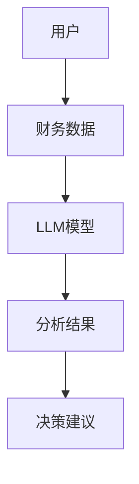
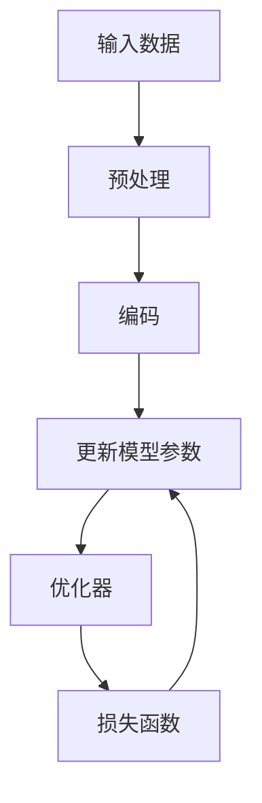
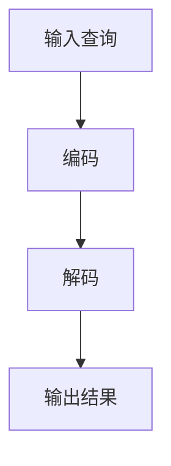
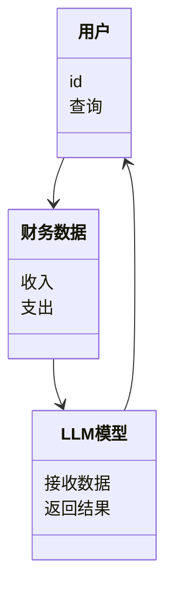
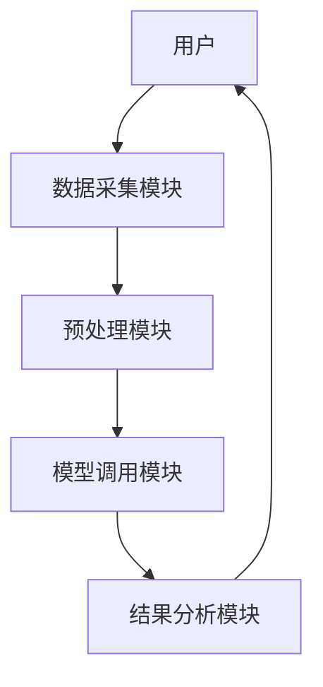
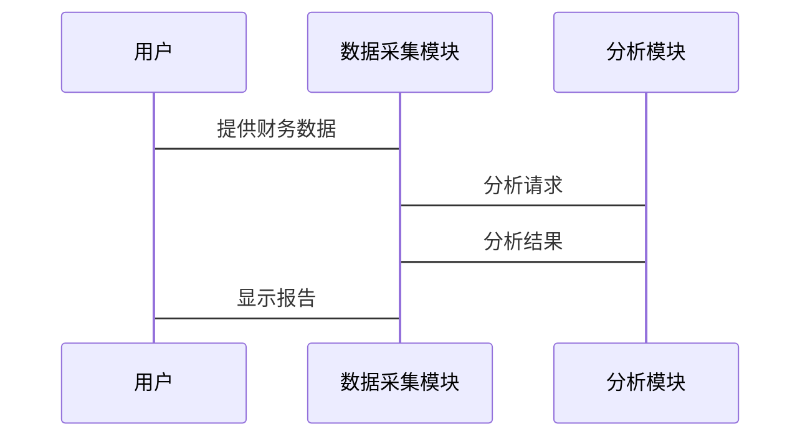

                 


# 智能财务分析AI Agent：LLM在企业决策中的应用

## 关键词：智能财务分析，LLM，AI Agent，企业决策，大语言模型

## 摘要

随着人工智能技术的飞速发展，大语言模型（LLM）在企业财务分析中的应用逐渐成为热点。本文深入探讨了如何利用LLM构建智能财务分析AI Agent，以提升企业决策的效率和准确性。文章从背景介绍、核心概念、算法原理、系统架构设计、项目实战到最佳实践，全面解析了LLM在财务分析中的应用，为企业决策者和技术开发者提供了理论和实践的双重指导。

---

## 第1章：智能财务分析AI Agent的背景与概念

### 1.1 问题背景

传统财务分析依赖人工操作，存在效率低、误差高、实时性差等问题。随着企业数据量的爆炸式增长，对实时、精准的财务分析需求日益迫切。AI技术的引入为企业提供了新的解决方案，特别是大语言模型（LLM）的出现，进一步提升了分析能力。

### 1.2 问题描述

企业在财务分析中面临的主要问题包括：

1. **数据量大**：企业每天产生的财务数据庞大，人工分析耗时且容易出错。
2. **实时性要求高**：企业需要快速响应市场变化，实时的财务分析至关重要。
3. **复杂性高**：财务数据涉及多个部门和业务流程，分析复杂。

### 1.3 问题解决

引入智能财务分析AI Agent，利用LLM的强大能力，实现对企业财务数据的实时分析、预测和决策支持。AI Agent能够自动处理数据，生成分析报告，并提供建议，显著提升效率和准确性。

### 1.4 边界与外延

智能财务分析AI Agent的应用范围主要集中在财务数据处理、预测分析和决策支持。其局限性在于对模型训练数据的依赖性和对新兴业务场景的适应能力。此外，AI Agent还可以与其他技术如区块链、物联网等结合，进一步拓展应用场景。

### 1.5 核心概念组成

智能财务分析AI Agent的核心组成包括：

- **LLM模型**：负责理解和生成文本，处理复杂的数据关系。
- **AI Agent**：负责执行任务，如数据采集、分析和决策。
- **财务分析指标**：如净利润率、毛利率等，用于评估企业财务状况。

---

## 第2章：LLM与智能财务分析AI Agent的核心原理

### 2.1 LLM的核心原理

LLM通过深度学习技术，利用大量的数据进行训练，形成强大的语言理解和生成能力。其关键组成部分包括：

1. **编码器**：将输入数据转化为向量表示。
2. **注意力机制**：聚焦于重要的信息，提升模型的理解能力。
3. **解码器**：根据编码结果生成输出。

### 2.2 AI Agent的构成与功能

AI Agent由感知层、决策层和执行层构成：

- **感知层**：负责数据的采集和预处理。
- **决策层**：利用LLM进行分析和预测，生成决策建议。
- **执行层**：根据决策结果执行操作，如生成报告。

### 2.3 核心概念对比分析

| 比较维度       | LLM                          | AI Agent                        |
|----------------|------------------------------|----------------------------------|
| 核心功能       | 语言理解和生成                | 执行任务和提供决策支持          |
| 输入输出       | 文本形式                     | 多种数据类型，包括文本、数字等   |
| 应用场景       | 自然语言处理                 | 跨领域应用，如财务分析、医疗等    |

### 2.4 ER实体关系图



---

## 第3章：LLM的算法原理

### 3.1 模型训练流程



### 3.2 模型推理过程



### 3.3 Python代码实现

```python
import tensorflow as tf
from tensorflow.keras import layers

def build_model(vocab_size, embedding_dim, lstm_dim):
    inputs = layers.Input(shape=(None,))  # 输入
    embed = layers.Embedding(vocab_size, embedding_dim)(inputs)
    lstm_layer = layers.LSTM(lstm_dim)(embed)
    outputs = layers.Dense(vocab_size, activation='softmax')(lstm_layer)
    return tf.keras.Model(inputs=inputs, outputs=outputs)

model = build_model(vocab_size=10000, embedding_dim=256, lstm_dim=512)
model.compile(optimizer='adam', loss='sparse_categorical_crossentropy', metrics=['accuracy'])
```

### 3.4 数学公式

LLM的损失函数通常使用交叉熵损失：

$$ L = -\sum_{i=1}^{n} \log(p(y_i|x_i)) $$

其中，$p(y_i|x_i)$ 是模型预测的概率。

---

## 第4章：系统分析与架构设计

### 4.1 问题场景介绍

企业需要实时分析财务数据，生成报告和决策建议。传统方法效率低下，引入AI Agent可以显著提升效率。

### 4.2 领域模型类图



### 4.3 系统架构设计



### 4.4 接口设计与交互流程



---

## 第5章：项目实战

### 5.1 环境安装

安装必要的库：

```bash
pip install tensorflow==2.5.0
pip install mermaid
pip install matplotlib
```

### 5.2 核心代码实现

```python
import numpy as np
import tensorflow as tf
from tensorflow.keras import layers

# 数据预处理
def preprocess_data(data):
    # 数据清洗和标准化
    return processed_data

# 模型训练
def train_model(train_data, val_data):
    model = build_model(...)
    model.fit(train_data, val_data, epochs=10, batch_size=32)
    return model

# 模型推理
def analyze_financial(data, model):
    processed_data = preprocess_data(data)
    result = model.predict(processed_data)
    return result

# 应用示例
data = ...  # 示例数据
model = train_model(...)
result = analyze_financial(data, model)
print(result)
```

### 5.3 代码解读与案例分析

通过实际案例，展示如何使用上述代码进行财务分析。例如，分析公司的季度收入趋势，生成预测报告。

### 5.4 项目总结

总结项目实现的关键点，讨论可能的优化方向，如模型调优、数据隐私保护等。

---

## 第6章：最佳实践与总结

### 6.1 小结

本文详细探讨了LLM在智能财务分析中的应用，从理论到实践，为企业决策提供了有力支持。

### 6.2 注意事项

- 数据隐私和安全需严格保护。
- 模型需定期更新以适应业务变化。
- 结合其他技术（如区块链）提升系统的安全性。

### 6.3 拓展阅读

推荐相关书籍和论文，如《Deep Learning》、《自然语言处理实战》等，进一步深入学习。

---

## 结语

智能财务分析AI Agent的应用为企业带来了革命性的变化，通过LLM的强大能力，企业能够更高效、精准地进行财务分析和决策。随着技术的不断进步，未来将有更多创新应用出现，推动企业数字化转型的深入发展。

---

以上为《智能财务分析AI Agent：LLM在企业决策中的应用》的详细目录大纲，涵盖从背景介绍到项目实战的各个关键部分，确保读者能够系统地理解和应用这些知识。

