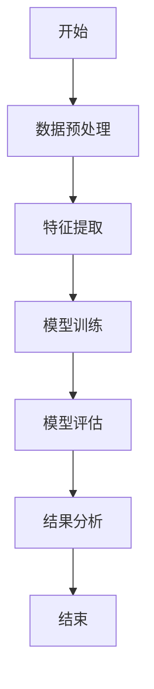
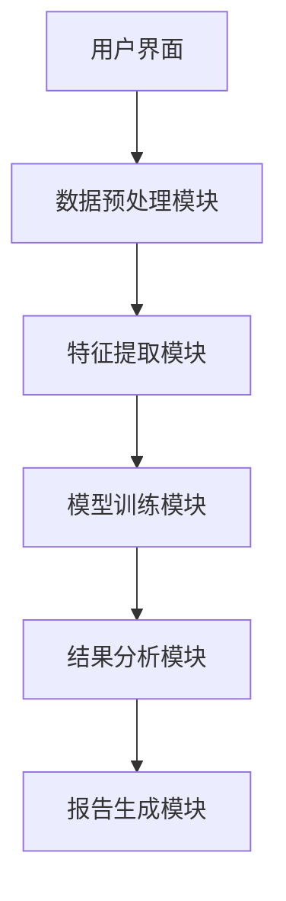

                 


# 智能财务报表舞弊检测系统

> 关键词：智能财务报表，舞弊检测，人工智能，机器学习，自然语言处理

> 摘要：本文探讨了智能财务报表舞弊检测系统的设计与实现，结合人工智能和大数据分析技术，提出了基于机器学习和自然语言处理的财务舞弊检测方法。文章详细分析了财务报表舞弊的现状与挑战，阐述了系统的核心概念与原理，设计了系统的架构与功能模块，并通过实际案例展示了系统的实现过程与效果。

---

## 第一部分: 智能财务报表舞弊检测系统背景与意义

### 第1章: 财务报表舞弊的现状与挑战

#### 1.1 财务报表舞弊的现状

财务报表舞弊是指企业在财务报表中故意提供虚假信息，以掩盖真实财务状况的行为。这种行为不仅损害了投资者和债权人的利益，还破坏了资本市场的公平性。当前，财务报表舞弊的主要手段包括虚增收入、虚减支出、隐瞒债务、虚假关联交易等。这些舞弊行为往往具有隐蔽性，传统的财务审核方法难以及时发现。

#### 1.2 智能化检测的必要性

传统财务报表审核主要依赖人工检查，存在效率低、覆盖面窄、主观性强等问题。随着企业规模的扩大和数据量的增加，人工审核的效率和准确性已无法满足需求。人工智能技术的发展为财务舞弊检测提供了新的解决方案。通过机器学习和深度学习算法，系统能够自动分析财务数据，识别异常模式，提高检测的准确性和效率。

#### 1.3 系统的重要性

智能财务报表舞弊检测系统能够帮助审计机构和监管部门快速识别财务舞弊行为，降低企业财务造假的风险。此外，该系统还可以为企业提供实时监控服务，帮助企业及时发现和纠正财务问题，提升企业治理能力。

---

### 第2章: 智能财务报表舞弊检测的技术背景

#### 2.1 人工智能技术的发展

人工智能（AI）技术的快速发展为财务舞弊检测提供了强大的工具。机器学习算法能够从大量数据中提取特征，识别模式，而深度学习技术则能够处理非结构化数据，如财务报表中的文本信息。

#### 2.2 自然语言处理与财务报表分析

自然语言处理（NLP）技术在财务报表分析中具有重要作用。财务报表中的文本信息（如注释、关联交易说明）可以通过NLP技术进行结构化处理，提取有用的信息用于舞弊检测。

#### 2.3 深度学习技术的优势

深度学习模型，如卷积神经网络（CNN）和长短期记忆网络（LSTM），在处理复杂数据模式方面具有优势。这些模型能够从财务数据中提取深层次特征，提高舞弊检测的准确率。

---

## 第二部分: 智能财务报表舞弊检测系统的核心概念与原理

### 第4章: 智能财务报表舞弊检测的核心概念

#### 4.1 数据特征提取

数据特征提取是舞弊检测的关键步骤。财务数据特征包括财务比率、交易频率、金额分布等。通过分析这些特征，可以识别异常交易模式。

#### 4.2 模型选择与训练

选择合适的模型是舞弊检测系统成功的关键。常见的模型包括随机森林、支持向量机（SVM）、逻辑回归和神经网络等。模型训练过程中需要进行特征工程和参数调优。

#### 4.3 算法流程

以下是算法的流程图：



---

## 第三部分: 智能财务报表舞弊检测系统的实现与应用

### 第5章: 系统分析与架构设计

#### 5.1 问题场景介绍

系统需要处理海量财务数据，识别潜在的舞弊行为。常见的问题包括数据清洗、特征提取、模型选择和结果解释等。

#### 5.2 系统架构设计

以下是系统架构图：



---

### 第6章: 项目实战

#### 6.1 环境安装

需要安装的工具包括Python、Jupyter Notebook、机器学习库（如Scikit-learn、XGBoost）和NLP库（如spaCy、NLTK）。

#### 6.2 系统核心实现源代码

以下是实现代码示例：

```python
import pandas as pd
from sklearn.ensemble import RandomForestClassifier
from sklearn.metrics import accuracy_score

# 数据加载
data = pd.read_csv('financial_data.csv')

# 数据预处理
data = data.dropna()
data = pd.get_dummies(data)

# 特征选择
features = data.drop('label', axis=1)
labels = data['label']

# 模型训练
model = RandomForestClassifier()
model.fit(features, labels)

# 模型预测
predictions = model.predict(features)
print("准确率:", accuracy_score(labels, predictions))
```

#### 6.3 实际案例分析

通过分析某企业的财务数据，系统能够识别出虚增收入的行为。例如，发现某企业在收入确认方面存在异常，可能通过虚假交易虚增收入。

---

## 第四部分: 优化与扩展

### 第7章: 系统优化与扩展

#### 7.1 模型优化

可以通过超参数调优、集成学习等方法提高模型的准确率和稳定性。

#### 7.2 系统扩展

可以将系统与其他财务管理系统集成，实现实时监控和预警功能。

#### 7.3 未来趋势

随着技术的发展，未来的舞弊检测系统将更加智能化和自动化，可能引入更多的NLP技术和实时数据处理能力。

---

### 第8章: 总结与展望

智能财务报表舞弊检测系统通过人工智能技术，显著提高了舞弊检测的效率和准确性。随着技术的不断发展，系统将更加智能化和多样化，为企业和监管部门提供更有力的支持。

---

以上是《智能财务报表舞弊检测系统》的技术博客文章大纲和部分内容。希望对您有所帮助！

