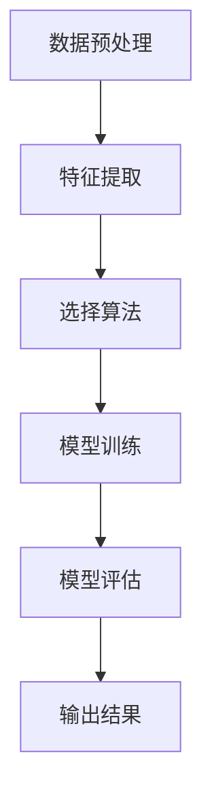

                 


# 智能财务报表舞弊风险评估系统

## 关键词：智能财务，舞弊风险，人工智能，财务审计，风险管理

## 摘要：  
随着企业规模的不断扩大和财务数据的复杂化，传统的财务报表审计方法已难以满足高效、准确的需求。本文介绍了一种基于人工智能技术的智能财务报表舞弊风险评估系统，通过分析财务数据中的异常模式，利用机器学习算法和数据挖掘技术，实现对财务报表舞弊风险的智能化识别和评估。本文从系统背景、核心概念、算法原理、系统架构、项目实战等方面进行详细阐述，旨在为财务审计领域提供一种创新的解决方案。

---

# 第一部分: 问题背景与目标

## 第1章: 财务报表舞弊的背景与现状

### 1.1 财务报表舞弊的定义与特征
财务报表舞弊是指企业在编制财务报表时，通过虚构、隐瞒、篡改等手段，故意提供虚假或误导性信息，以达到误导投资者、债权人或其他利益相关者的目的。其主要特征包括：

1. **目的性**：舞弊行为通常是为了掩盖财务困境或夸大经营成果。
2. **隐蔽性**：舞弊者会采取复杂的手法掩盖异常，如虚构收入、虚增资产等。
3. **复杂性**：随着企业规模扩大，舞弊手段日益复杂，涉及多个会计科目和业务环节。

### 1.2 舞弊行为对企业与社会的危害
1. **对企业的影响**：舞弊会导致企业财务数据失真，影响决策制定和经营稳定性。
2. **对社会的影响**：舞弊行为会损害投资者和债权人的利益，破坏市场信任，甚至引发系统性金融风险。

### 1.3 传统财务报表审计的局限性
1. **人工审计效率低**：传统审计依赖人工检查，效率低下且容易遗漏。
2. **主观性较强**：审计结果受审计人员经验与判断的影响，存在人为误差。
3. **难以应对复杂舞弊手段**：传统方法难以发现隐蔽性较高的舞弊行为。

## 第2章: 智能化舞弊风险评估的需求

### 2.1 人工智能在财务领域的应用趋势
随着大数据和人工智能技术的快速发展，AI在财务领域的应用逐渐普及，尤其是在风险评估和异常检测方面。

### 2.2 智能财务报表舞弊风险评估的核心目标
1. **自动化数据处理**：通过AI技术实现财务数据的自动采集和预处理。
2. **异常模式识别**：利用机器学习算法发现数据中的异常模式。
3. **风险量化与预警**：根据异常程度生成风险评分，并提供预警信息。

### 2.3 系统建设的必要性与可行性分析
1. **必要性**：传统审计方法效率低、成本高，难以应对日益复杂的舞弊手段。
2. **可行性**：现代AI技术（如深度学习、自然语言处理）为舞弊风险评估提供了技术保障。

---

# 第二部分: 核心概念与理论基础

## 第3章: 财务报表舞弊风险评估的理论框架

### 3.1 舞弊风险的构成要素
舞弊风险由以下几个要素构成：
1. **动机**：企业为何要进行舞弊，例如掩盖亏损。
2. **机会**：企业是否有机会实施舞弊，例如复杂的业务流程。
3. **能力**：企业是否有能力实施舞弊，例如财务人员的专业水平。

### 3.2 舞弊风险评估的指标体系
常见的舞弊风险评估指标包括：
1. **财务指标**：如应收账款周转率、净利率等。
2. **行为指标**：如频繁的关联交易、异常的交易时间等。
3. **文本指标**：如财务报表中的异常表述。

### 3.3 舞弊风险的量化方法
1. **基于统计的方法**：如Z值模型、马柯维茨模型。
2. **基于机器学习的方法**：如随机森林、支持向量机（SVM）。

## 第4章: 智能化评估的核心技术

### 4.1 人工智能在舞弊检测中的应用
1. **监督学习**：用于分类问题，如判断财务报表是否异常。
2. **无监督学习**：用于聚类分析，发现数据中的异常模式。
3. **深度学习**：用于处理非结构化数据，如自然语言处理。

### 4.2 数据挖掘与特征提取
1. **数据预处理**：包括数据清洗、标准化等。
2. **特征选择**：提取与舞弊相关的特征，如收入增长率、应收账款比例等。

### 4.3 机器学习算法在风险评估中的作用
常用的算法包括：
1. **决策树**：用于分类问题，如随机森林、XGBoost。
2. **支持向量机（SVM）**：用于高维数据的分类。
3. **神经网络**：用于复杂模式的识别。

---

# 第三部分: 算法原理与实现

## 第5章: 算法原理

### 5.1 机器学习算法的选择与优化
1. **算法选择**：根据数据特点选择合适的算法，如随机森林适合分类问题。
2. **超参数调优**：通过网格搜索或随机搜索优化模型性能。

### 5.2 算法流程图


### 5.3 数学模型与公式
随机森林的数学模型如下：
$$
\text{预测概率} = \frac{1}{N} \sum_{i=1}^{N} \text{基模型预测值}
$$
其中，\(N\) 是基模型的数量。

---

# 第四部分: 系统分析与架构设计

## 第6章: 系统架构设计

### 6.1 系统功能设计
1. **数据采集模块**：从财务系统中获取数据。
2. **数据处理模块**：清洗和标准化数据。
3. **模型训练模块**：训练机器学习模型。
4. **风险评估模块**：生成风险评分并预警。

### 6.2 系统架构图


### 6.3 接口设计与交互
1. **API接口**：提供RESTful API，供其他系统调用。
2. **用户界面**：直观展示风险评分和预警信息。

---

# 第五部分: 项目实战

## 第7章: 环境安装与代码实现

### 7.1 环境安装
安装所需的Python库：
```bash
pip install pandas numpy scikit-learn matplotlib
```

### 7.2 核心代码实现
```python
import pandas as pd
from sklearn.ensemble import RandomForestClassifier
from sklearn.model_selection import train_test_split
from sklearn.metrics import accuracy_score

# 数据加载
df = pd.read_csv('financial_data.csv')

# 特征与标签分离
X = df.drop('is_fraud', axis=1)
y = df['is_fraud']

# 数据分割
X_train, X_test, y_train, y_test = train_test_split(X, y, test_size=0.2, random_state=42)

# 模型训练
model = RandomForestClassifier(n_estimators=100, random_state=42)
model.fit(X_train, y_train)

# 模型评估
y_pred = model.predict(X_test)
print("Accuracy:", accuracy_score(y_test, y_pred))
```

---

# 第六部分: 总结与展望

## 第8章: 总结

### 8.1 系统优点
1. **高效性**：自动化处理数据，节省时间。
2. **准确性**：基于机器学习算法，提高检测精度。
3. **可扩展性**：支持大规模数据处理。

### 8.2 系统局限性
1. **依赖数据质量**：模型性能依赖于数据的完整性和准确性。
2. **需要人工干预**：异常情况仍需人工审核。

## 第9章: 未来展望

### 9.1 系统优化方向
1. **模型优化**：引入更先进的深度学习模型。
2. **多模态数据处理**：结合文本、图像等多模态数据。

### 9.2 技术发展趋势
1. **实时监控**：实现对财务数据的实时监控和预警。
2. **区块链技术**：结合区块链技术，确保数据不可篡改。

---

通过以上步骤，我们可以构建一个高效、准确的智能财务报表舞弊风险评估系统，为企业和审计机构提供强有力的技术支持。

