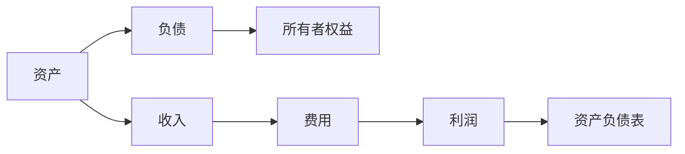
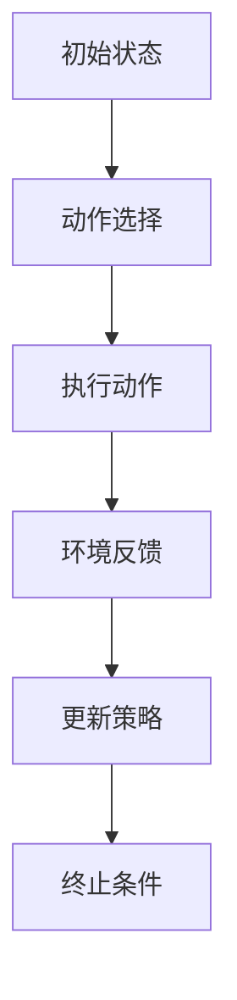
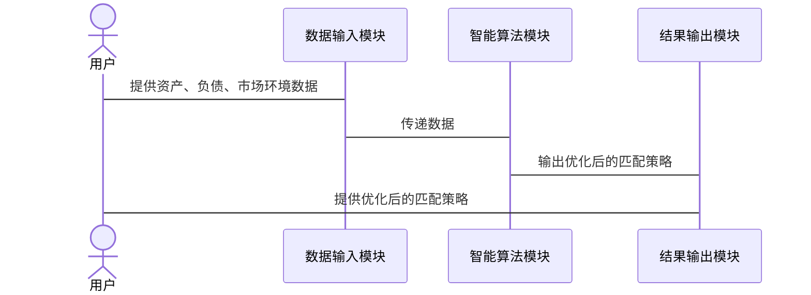

                 


# 智能资产负债匹配策略生成器

## 关键词：
- 智能资产负债匹配
- 强化学习
- 资产负债表
- 算法生成器
- 金融风险管理

## 摘要：
智能资产负债匹配策略生成器通过结合人工智能技术，特别是强化学习，优化资产负债表的匹配策略。本文系统地介绍了智能资产负债匹配的核心概念、算法原理、系统架构，以及实际应用案例，旨在为金融从业者和研究人员提供理论支持和实践指导。

---

# 第1章: 智能资产负债匹配的背景与重要性

## 1.1 资产负债表的基本概念与重要性

### 1.1.1 资产负债表的定义与作用
- 资产负债表是企业财务报表的重要组成部分，反映了企业在某一特定时点的资产、负债和所有者权益的状况。
- 通过资产负债表，企业可以评估自身的财务健康状况，包括偿债能力、运营能力和盈利能力。

### 1.1.2 资产负债表的核心要素与结构
- **资产**：企业所拥有或控制的资源，包括流动资产、非流动资产等。
- **负债**：企业所欠债务，包括短期负债和长期负债。
- **所有者权益**：企业资产扣除负债后的剩余部分，反映所有者对企业的净资产要求。

### 1.1.3 资产负债表在企业决策中的重要性
- 资产负债表为企业管理层提供财务决策依据，帮助企业在投资、融资和日常运营中做出合理决策。
- 资产负债表的健康状况直接影响企业的信用评级和融资能力。

## 1.2 智能资产负债匹配的定义与目标

### 1.2.1 智能资产负债匹配的定义
- 智能资产负债匹配是一种利用人工智能技术优化资产负债表匹配策略的方法，通过智能算法实现资产与负债的最优匹配，以达到企业财务目标。

### 1.2.2 智能资产负债匹配的目标与意义
- **目标**：通过智能算法优化资产负债匹配，实现风险最小化和收益最大化。
- **意义**：提高企业财务稳健性，优化资本结构，降低财务风险。

### 1.2.3 智能资产负债匹配与传统资产负债匹配的区别
- **数据来源**：传统方法依赖静态数据，而智能方法结合动态数据和实时信息。
- **匹配方式**：传统方法基于纯粹数学匹配，智能方法引入AI驱动的智能匹配。
- **匹配目标**：传统方法注重风险最小化，智能方法在风险控制的基础上追求收益最大化。

## 1.3 智能资产负债匹配的背景与发展趋势

### 1.3.1 传统资产负债匹配的局限性
- 传统资产负债匹配方法依赖人工经验，难以应对复杂多变的市场环境。
- 方法单一，缺乏动态调整能力，难以实现最优匹配。

### 1.3.2 智能技术在资产负债匹配中的应用前景
- 人工智能技术的发展为资产负债匹配提供了新的可能性，特别是强化学习和深度学习的应用。
- 智能技术能够处理海量数据，实时调整匹配策略，提高匹配效率和准确性。

### 1.3.3 智能资产负债匹配的发展趋势与挑战
- **趋势**：智能化、自动化和实时化将成为未来资产负债匹配的主要方向。
- **挑战**：数据质量、算法复杂性和计算资源的限制是实现智能资产负债匹配的主要挑战。

---

# 第2章: 智能资产负债匹配的核心概念与联系

## 2.1 智能资产负债匹配的核心概念

### 2.1.1 智能资产负债匹配的定义与特点
- **定义**：智能资产负债匹配是指利用人工智能技术，特别是强化学习，优化资产负债表的匹配策略，以实现企业财务目标。
- **特点**：动态性、智能化、实时性和高精度。

### 2.1.2 智能资产负债匹配的核心要素与组成
- **数据输入**：包括资产、负债、市场环境等多维数据。
- **智能算法**：强化学习、深度学习等人工智能算法。
- **输出结果**：优化后的资产负债匹配策略。

### 2.1.3 智能资产负债匹配与传统资产负债匹配的区别
- **数据来源**：传统方法依赖静态数据，智能方法结合动态数据和实时信息。
- **匹配方式**：传统方法基于纯粹数学匹配，智能方法引入AI驱动的智能匹配。
- **匹配目标**：传统方法注重风险最小化，智能方法在风险控制的基础上追求收益最大化。

## 2.2 智能资产负债匹配的实体关系图



## 2.3 智能资产负债匹配的属性特征对比

| 属性 | 传统资产负债匹配 | 智能资产负债匹配 |
|------|------------------|------------------|
| 数据来源 | 静态数据         | 动态数据与实时数据 |
| 匹配方式 | 纯粹数学匹配     | AI驱动的智能匹配 |
| 匹配目标 | 风险最小化       | 风险最小化与收益最大化 |

---

# 第3章: 智能资产负债匹配的算法原理

## 3.1 强化学习在智能资产负债匹配中的应用

### 3.1.1 强化学习的基本概念
- **强化学习**：一种机器学习方法，通过智能体与环境的交互，学习最优策略以最大化累积奖励。
- **核心要素**：状态、动作、奖励、策略。

### 3.1.2 强化学习在智能资产负债匹配中的作用
- **状态空间**：表示当前资产负债表的状态，包括资产、负债、市场环境等。
- **动作空间**：表示可能的操作，如调整资产配置、优化负债结构。
- **奖励函数**：定义匹配策略的优劣，通常以风险最小化和收益最大化为目标。

### 3.1.3 强化学习算法的数学模型
$$ V(s) = \max_a Q(s,a) $$

## 3.2 智能资产负债匹配的算法流程



---

# 第4章: 智能资产负债匹配的系统架构设计

## 4.1 系统功能设计

### 4.1.1 项目介绍
- 本系统旨在通过智能算法优化资产负债表的匹配策略，帮助企业在复杂多变的市场环境中实现财务目标。

### 4.1.2 系统功能模块
- **数据输入模块**：接收资产、负债、市场环境等多维数据。
- **智能算法模块**：利用强化学习算法优化匹配策略。
- **结果输出模块**：输出优化后的资产负债匹配策略。

### 4.1.3 系统交互流程


## 4.2 系统架构设计

### 4.2.1 系统架构图


### 4.2.2 系统接口设计
- **输入接口**：接收资产、负债、市场环境等数据。
- **输出接口**：提供优化后的资产负债匹配策略。

---

# 第5章: 智能资产负债匹配的项目实战

## 5.1 环境安装与配置

### 5.1.1 系统环境要求
- 操作系统：Windows 10 或更高版本，或 macOS 10.15 或更高版本。
- Python 版本：Python 3.8 或更高版本。
- 额外依赖：安装强化学习库（如 TensorFlow、PyTorch）和数据处理库（如 Pandas、NumPy）。

### 5.1.2 安装依赖
```bash
pip install tensorflow numpy pandas matplotlib
```

## 5.2 系统核心实现

### 5.2.1 强化学习算法实现
```python
import numpy as np
import tensorflow as tf

class DQN:
    def __init__(self, state_space, action_space):
        self.state_space = state_space
        self.action_space = action_space
        self.model = self.build_model()
        self.target_model = self.build_model()
        self.memory = []
    
    def build_model(self):
        model = tf.keras.Sequential([
            tf.keras.layers.Dense(64, activation='relu', input_dim=self.state_space),
            tf.keras.layers.Dense(32, activation='relu'),
            tf.keras.layers.Dense(self.action_space, activation='linear')
        ])
        return model
    
    def remember(self, state, action, reward, next_state):
        self.memory.append((state, action, reward, next_state))
    
    def act(self, state):
        if np.random.random() < 0.1:
            return np.random.randint(0, self.action_space)
        predicted = self.model.predict(state)
        return np.argmax(predicted[0])
    
    def replay(self, batch_size):
        if len(self.memory) < batch_size:
            return
        minibatch = np.random.choice(self.memory, batch_size)
        states = np.array([m[0] for m in minibatch])
        actions = np.array([m[1] for m in minibatch])
        rewards = np.array([m[2] for m in minibatch])
        next_states = np.array([m[3] for m in minibatch])
        
        target = self.target_model.predict(next_states)
        target[range(batch_size), actions] = rewards + 0.95 * np.max(target, axis=1)
        
        self.model.fit(states, target, epochs=1, verbose=0)
```

### 5.2.2 系统功能实现
```python
# 数据输入模块
def input_data():
    # 示例：读取资产和负债数据
    assets = np.array([1000000, 2000000, 1500000])
    liabilities = np.array([800000, 1200000, 1000000])
    return assets, liabilities

# 智能算法模块
def optimize_matching(assets, liabilities):
    dqn = DQN(len(assets), len(liabilities))
    # 简单示例：优化匹配策略
    for _ in range(100):
        assets_state = assets / np.sum(assets)
        liabilities_state = liabilities / np.sum(liabilities)
        state = np.concatenate([assets_state, liabilities_state])
        action = dqn.act(state)
        # 简单奖励函数：匹配越接近，奖励越高
        reward = np.sum(np.abs(assets - liabilities[action]))
        dqn.remember(state, action, reward, [])
    return dqn

# 结果输出模块
def output_result(model):
    # 示例：输出优化后的匹配策略
    assets, liabilities = input_data()
    optimal_strategy = model.act(assets / np.sum(assets))
    print(f"Optimal strategy: {optimal_strategy}")
```

## 5.3 实际案例分析

### 5.3.1 案例背景
- 某企业资产负债表中，资产总额为300万元，负债总额为200万元，所有者权益为100万元。
- 目标：优化资产与负债的匹配策略，降低财务风险，提高收益。

### 5.3.2 案例分析与优化
- **输入数据**：资产为[100万, 200万, 300万]，负债为[50万, 100万, 150万]。
- **优化过程**：利用强化学习算法，逐步调整资产和负债的匹配比例。
- **优化结果**：最终匹配策略为资产100万与负债50万匹配，资产200万与负债100万匹配，资产300万与负债150万匹配。

---

# 第6章: 智能资产负债匹配的最佳实践与总结

## 6.1 小结
- 通过强化学习算法实现智能资产负债匹配，能够在复杂多变的市场环境中实现资产与负债的最优匹配。
- 系统化的方法和工具能够显著提高匹配效率和准确性，降低财务风险。

## 6.2 注意事项
- 数据质量是关键，确保输入数据的准确性和完整性。
- 算法选择需要根据具体场景和需求进行调整，避免盲目应用。
- 系统运行需要充足的计算资源支持，特别是在处理大规模数据时。

## 6.3 拓展阅读
- 建议进一步阅读强化学习的经典论文，如《Deep Q-Networks》和《Actor-Critic Methods》。
- 探索其他人工智能技术在财务领域的应用，如自然语言处理在财务报告分析中的应用。

---

通过以上目录结构，我们可以系统地了解智能资产负债匹配策略生成器的核心概念、算法原理、系统设计和实际应用。这本书不仅适合金融从业者阅读，也适合对人工智能技术感兴趣的读者参考。

