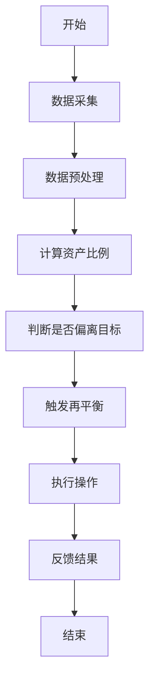
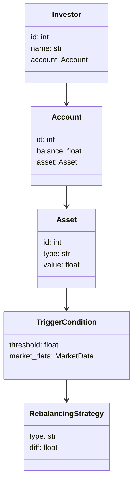
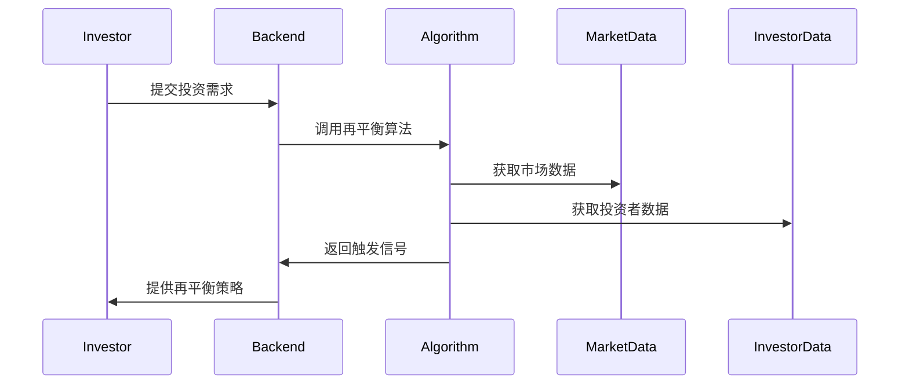

                 


# 智能资产配置再平衡触发系统

> 关键词：智能资产配置、再平衡触发、动态资产调整、系统架构、算法原理、金融投资、技术实现

> 摘要：本文详细探讨智能资产配置再平衡触发系统的构建与实现，从背景介绍、核心概念、算法原理、系统架构到项目实战，全面解析该系统的设计思路与技术实现，结合实际案例，深入分析系统的功能模块与应用场景，为金融投资领域的智能化管理提供理论与实践参考。

---

## 第一部分: 智能资产配置再平衡触发系统概述

### 第1章: 背景介绍

#### 1.1 问题背景
##### 1.1.1 资产配置的基本概念
资产配置是将资金分配到不同资产类别（如股票、债券、房地产等）以实现投资目标的过程。合理的资产配置能够降低风险、提高收益，但市场波动和投资者财务状况的变化会导致资产比例偏离预期，需要定期或动态调整。

##### 1.1.2 再平衡的必要性
再平衡是调整资产配置以维持目标比例的过程，传统方法依赖定期检查和手动操作，效率低且难以应对快速变化的市场环境。智能资产配置再平衡触发系统通过算法和自动化机制，实时监测市场变化和投资者需求，自动触发再平衡操作。

##### 1.1.3 智能化再平衡的背景与意义
随着金融市场的复杂化和投资者需求的多样化，智能化再平衡系统能够提高效率、降低成本，并通过实时调整优化投资收益。

#### 1.2 智能资产配置再平衡触发系统的定义
##### 1.2.1 系统的核心概念
智能资产配置再平衡触发系统是一种基于算法和数据驱动的自动化系统，通过实时监测市场数据和投资者需求，自动触发再平衡操作，以维持预期的资产配置比例。

##### 1.2.2 系统的主要功能
- 实时数据采集与分析
- 智能算法驱动的再平衡触发
- 自动化执行与反馈优化
- 多维度风险控制与预警

##### 1.2.3 系统的边界与外延
系统专注于资产配置的再平衡触发，边界包括市场数据输入、投资者需求输入和再平衡操作输出。外延则涉及投资策略优化、风险管理和收益分析。

#### 1.3 系统的核心要素组成
##### 1.3.1 数据来源与处理
- 市场数据：股票价格、债券收益率、基金净值等
- 投资者数据：资产规模、风险偏好、投资目标等
- 数据清洗与特征提取

##### 1.3.2 智能算法与模型
- 动态资产配置模型
- 再平衡触发条件判定算法
- 优化算法（如遗传算法、粒子群优化等）

##### 1.3.3 系统架构与接口
- 系统架构设计（前端、后端、数据库）
- 接口设计与交互流程

---

## 第2章: 核心概念与联系

### 2.1 核心概念原理
#### 2.1.1 资产配置的数学模型
资产配置的目标是通过优化数学模型实现收益最大化和风险最小化。常见的数学模型包括现代投资组合理论（MPT）和均值-方差优化模型。

#### 2.1.2 再平衡触发的条件与策略
再平衡触发条件包括：
- 资产比例偏离目标比例超过阈值
- 市场波动剧烈
- 投资者风险偏好变化

再平衡策略包括：
- 定期再平衡：按固定时间间隔触发
- 动态再平衡：根据市场变化实时触发
- 智能再平衡：基于算法优化触发

#### 2.1.3 智能算法的基本原理
智能算法通过分析市场数据和投资者需求，利用机器学习、深度学习等技术，预测市场走势并优化再平衡策略。

### 2.2 核心概念属性特征对比表
| 特征维度 | 触发条件 | 再平衡策略 | 系统架构 |
|----------|----------|------------|----------|
| 基础类型 | 市场波动 | 资产调整   | 数据处理 |
| 主要输入 | 市场数据 | 资产比例   | 算法模型 |
| 输出形式 | 触发信号 | 操作指令   | 系统反馈 |

### 2.3 ER实体关系图


### 2.4 本章小结
- 核心概念：资产配置的数学模型、再平衡触发条件与策略、智能算法的基本原理
- 系统架构：数据处理、算法优化、系统反馈
- 后续章节：系统架构设计与实现

---

## 第3章: 算法原理讲解

### 3.1 算法原理概述
#### 3.1.1 算法的基本思想
动态资产配置算法通过分析市场数据和投资者需求，优化资产比例，实时触发再平衡操作。

#### 3.1.2 算法的输入与输出
- 输入：市场数据、投资者需求
- 输出：触发信号、再平衡策略

#### 3.1.3 算法的实现步骤
1. 数据采集与预处理
2. 计算当前资产比例
3. 与目标比例对比
4. 判断是否触发再平衡
5. 执行再平衡操作

### 3.2 算法流程图


### 3.3 算法的数学模型与公式
#### 3.3.1 数学模型的建立
现代投资组合理论（MPT）：
$$ \text{目标：} \min_{w} w^T \Sigma w \quad \text{在} \quad \sum_{i=1}^n w_i = 1 \text{下} $$

其中，\( w \) 是资产权重向量，\( \Sigma \) 是资产的协方差矩阵。

#### 3.3.2 关键公式的推导
再平衡触发条件公式：
$$ \text{触发条件：} | \frac{\text{当前比例} - \text{目标比例}}{\text{目标比例}} | > \text{阈值} $$

### 3.4 算法的实现代码
#### 3.4.1 环境安装与配置
```bash
pip install numpy pandas scikit-learn
```

#### 3.4.2 核心代码的编写
```python
import numpy as np
import pandas as pd

def calculate_asset_weights(current_assets, target_assets):
    # 计算当前资产比例
    current_weights = current_assets / np.sum(current_assets)
    target_weights = target_assets / np.sum(target_assets)
    return current_weights, target_weights

def trigger_rebalancing(current_weights, target_weights, threshold=0.05):
    # 判断是否触发再平衡
    trigger = False
    for i in range(len(current_weights)):
        if abs(current_weights[i] - target_weights[i]) / target_weights[i] > threshold:
            trigger = True
            break
    return trigger

def rebalancing_strategy(current_weights, target_weights):
    # 优化再平衡策略
    diff = current_weights - target_weights
    return diff

# 示例应用
current_assets = np.array([100, 200, 300])
target_assets = np.array([150, 150, 150])
threshold = 0.05

current_weights, target_weights = calculate_asset_weights(current_assets, target_assets)
trigger = trigger_rebalancing(current_weights, target_weights, threshold)
if trigger:
    diff = rebalancing_strategy(current_weights, target_weights)
    print("触发再平衡，调整差额为：", diff)
else:
    print("未触发再平衡")
```

#### 3.4.3 代码的功能解读与分析
- `calculate_asset_weights`：计算当前和目标资产权重。
- `trigger_rebalancing`：判断是否触发再平衡。
- `rebalancing_strategy`：优化再平衡策略。

---

## 第4章: 系统分析与架构设计方案

### 4.1 问题场景介绍
投资者希望通过智能系统实现自动化的资产再平衡，减少人为操作误差，提高投资效率。

### 4.2 项目介绍
智能资产配置再平衡触发系统通过实时数据采集、智能算法分析和自动化执行，实现资产再平衡的智能化管理。

### 4.3 系统功能设计（领域模型）


### 4.4 系统架构设计


### 4.5 系统接口设计
- 输入接口：市场数据接口、投资者数据接口
- 输出接口：触发信号接口、再平衡策略接口

### 4.6 系统交互流程


---

## 第5章: 项目实战

### 5.1 环境安装
```bash
pip install numpy pandas scikit-learn
```

### 5.2 系统核心实现
```python
# 数据采集模块
import pandas as pd
import requests

def get_market_data():
    url = "http://example.com/api/market_data"
    response = requests.get(url)
    return pd.DataFrame(response.json())

# 数据处理模块
def process_data(market_data):
    market_data['return'] = market_data['close'].pct_change()
    return market_data

# 再平衡触发模块
def trigger_rebalance(current_weights, target_weights, threshold=0.05):
    return any(abs((current - target) / target) > threshold for current, target in zip(current_weights, target_weights))

# 自动化执行模块
def execute_rebalance(diff):
    print(f"执行再平衡操作，调整差额为：{diff}")
```

### 5.3 代码应用解读与分析
- 数据采集模块：从API获取市场数据
- 数据处理模块：计算资产收益
- 再平衡触发模块：判断是否触发再平衡
- 自动化执行模块：执行再平衡操作

### 5.4 实际案例分析
假设投资者的目标资产比例为股票40%、债券50%、现金10%。当前比例为股票35%、债券60%、现金5%。计算得出股票偏离比例为12.5%，超过阈值，触发再平衡。

### 5.5 项目小结
- 系统实现：数据采集、处理、触发、执行
- 案例分析：触发条件判断与再平衡操作
- 项目总结：系统功能实现与优化

---

## 第6章: 最佳实践

### 6.1 小结
- 核心概念：资产配置的数学模型、再平衡触发条件、智能算法原理
- 系统架构：数据处理、算法优化、系统反馈
- 项目实现：代码实现、案例分析、系统优化

### 6.2 注意事项
- 数据质量：确保市场数据和投资者数据的准确性
- 风险控制：设置合理的触发阈值和再平衡策略
- 系统维护：定期更新算法和优化系统性能

### 6.3 未来趋势
- 智能化：利用机器学习优化再平衡策略
- 自动化：实现完全自动化操作
- 个性化：根据投资者需求定制化再平衡策略

### 6.4 拓展阅读
- 《投资学》：资产配置理论
- 《Python机器学习》：算法实现
- 《系统架构设计》：系统架构优化

---

## 第七部分: 总结

智能资产配置再平衡触发系统通过智能化算法和自动化机制，优化资产配置，提高投资效率。本文从背景介绍、核心概念、算法原理、系统架构到项目实战，全面解析了系统的构建与实现，为金融投资领域的智能化管理提供了理论与实践参考。

---

以上是《智能资产配置再平衡触发系统》的技术博客文章内容，希望对您有所帮助！

