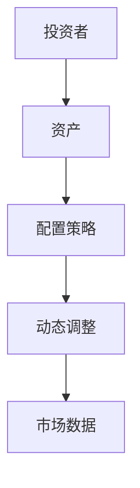
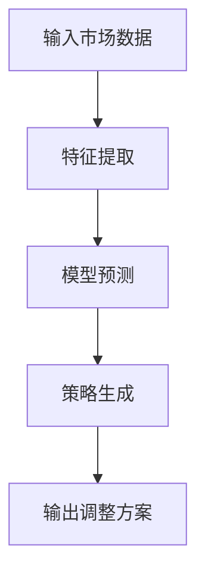
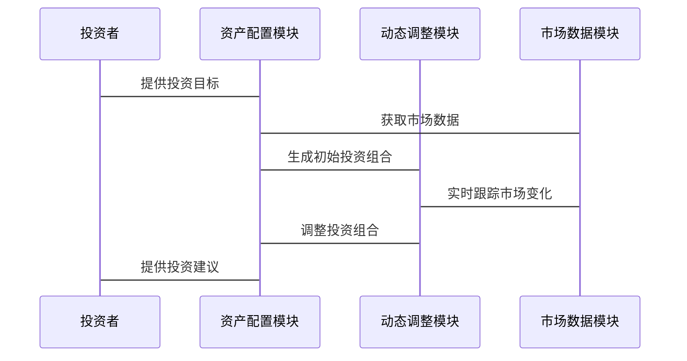

                 


# 智能资产配置策略动态调整系统

> 关键词：智能资产配置，动态调整系统，机器学习，算法优化，金融投资

> 摘要：智能资产配置策略动态调整系统是一种结合人工智能和金融投资的系统，用于根据市场变化自动调整投资策略。本文将详细分析该系统的背景、核心概念、算法原理、系统架构、项目实现和最佳实践，帮助读者全面理解其工作原理和应用价值。

---

# 第一部分: 智能资产配置策略动态调整系统概述

## 第1章: 智能资产配置策略动态调整系统背景介绍

### 1.1 问题背景

#### 1.1.1 资产配置的传统方法与局限性
传统的资产配置方法依赖于固定的投资组合和定期调整，这种方法在市场环境稳定时表现良好，但在市场波动加剧的情况下往往难以适应变化，导致投资收益下降甚至亏损。

#### 1.1.2 动态调整的必要性与挑战
随着金融市场环境的快速变化，投资者需要一种能够实时跟踪市场动态并快速调整投资组合的方法。动态调整的必要性在于应对市场的不确定性，但实现这一目标的挑战在于如何在短时间内进行高效的计算和决策。

#### 1.1.3 智能化资产配置的机遇与趋势
人工智能技术的发展为资产配置提供了新的可能性。通过机器学习算法，系统可以实时分析市场数据，识别潜在的投资机会，并动态调整投资组合，从而提高投资收益和风险管理能力。

### 1.2 问题描述

#### 1.2.1 资产配置的核心问题
资产配置的核心问题是如何在不同资产类别之间分配资金，以实现最大化收益和最小化风险的目标。

#### 1.2.2 动态调整的定义与目标
动态调整是指根据市场变化和投资者目标的变化，实时调整投资组合的过程。其目标是在不同市场条件下优化资产配置，以实现最佳的投资收益。

#### 1.2.3 智能化资产配置的实现路径
智能化资产配置的实现路径包括数据采集、模型构建、实时监控和动态调整四个步骤。通过机器学习算法，系统可以自动分析市场数据并生成最优投资策略。

### 1.3 问题解决

#### 1.3.1 智能化资产配置的解决方案
智能化资产配置的解决方案包括使用机器学习算法对市场数据进行分析，预测市场走势，并根据预测结果动态调整投资组合。

#### 1.3.2 动态调整的具体实现方法
动态调整的具体实现方法包括实时数据采集、模型预测和策略生成。通过这些步骤，系统可以快速响应市场变化并调整投资组合。

#### 1.3.3 系统设计的基本思路
系统设计的基本思路是构建一个能够实时处理市场数据、分析投资机会并生成最优投资策略的智能化系统。

### 1.4 系统的边界与外延

#### 1.4.1 系统的功能边界
系统的功能边界包括数据采集、模型构建、实时监控和动态调整。系统只关注与资产配置相关的功能，不涉及其他业务领域。

#### 1.4.2 系统的外部接口与交互
系统的外部接口包括数据源接口、用户接口和外部系统接口。数据源接口用于获取市场数据，用户接口用于与投资者交互，外部系统接口用于与其他金融系统集成。

#### 1.4.3 系统的扩展性与可维护性
系统的扩展性体现在支持多种资产类别和投资策略上。系统的可维护性通过模块化设计和标准化接口实现。

### 1.5 核心概念与组成

#### 1.5.1 资产配置的核心要素
资产配置的核心要素包括投资目标、风险承受能力和市场环境。这些要素决定了投资组合的构成和调整策略。

#### 1.5.2 动态调整的关键因素
动态调整的关键因素包括市场波动、投资者风险偏好变化和经济指标变化。系统需要实时跟踪这些因素并进行调整。

#### 1.5.3 系统的架构组成
系统的架构组成包括数据采集模块、模型构建模块、实时监控模块和动态调整模块。这些模块协同工作，实现智能化资产配置。

---

## 第2章: 核心概念与系统架构

### 2.1 核心概念原理

#### 2.1.1 智能化资产配置的原理
智能化资产配置的原理是通过机器学习算法对市场数据进行分析，预测市场走势，并根据预测结果动态调整投资组合。

#### 2.1.2 动态调整的实现机制
动态调整的实现机制包括实时数据采集、模型预测和策略生成。通过这些步骤，系统可以快速响应市场变化并调整投资组合。

#### 2.1.3 系统的核心算法与模型
系统的核心算法包括机器学习算法和优化算法。这些算法用于分析市场数据并生成最优投资策略。

### 2.2 核心概念对比分析

#### 2.2.1 不同资产配置策略的对比
不同的资产配置策略包括被动配置、主动配置和智能化配置。被动配置是固定的投资组合，主动配置是定期调整，智能化配置是实时动态调整。

#### 2.2.2 动态调整与静态配置的差异
动态调整与静态配置的差异在于调整的频率和响应速度。动态调整可以实时响应市场变化，而静态配置则固定不变。

#### 2.2.3 智能化与传统方法的优劣势
智能化方法的优势在于能够实时响应市场变化，提高投资收益。其劣势在于需要大量的计算资源和数据支持。传统方法的优势在于简单易行，劣势在于适应性差。

### 2.3 ER实体关系图



---

## 第3章: 算法原理与实现

### 3.1 算法原理

#### 3.1.1 动态调整的核心算法
动态调整的核心算法包括机器学习算法和优化算法。这些算法用于分析市场数据并生成最优投资策略。

#### 3.1.2 智能化资产配置的数学模型
智能化资产配置的数学模型包括目标函数和约束条件。目标函数是最大化投资收益，约束条件是投资组合的权重和风险限制。

#### 3.1.3 算法的优化与改进
算法的优化与改进包括参数调整、模型优化和计算效率提升。这些改进可以提高系统的性能和准确性。

### 3.2 算法实现流程



### 3.3 数学模型与公式

#### 3.3.1 资产配置的优化目标函数
$$ \text{maximize } \sum_{i=1}^{n} w_i r_i $$

#### 3.3.2 动态调整的约束条件
$$ \sum_{i=1}^{n} w_i = 1 $$
$$ w_i \geq 0 \quad \forall i $$

---

## 第4章: 系统分析与架构设计

### 4.1 系统功能设计

#### 4.1.1 资产配置模块
资产配置模块负责根据市场数据和投资者目标生成初始投资组合。

#### 4.1.2 动态调整模块
动态调整模块负责实时跟踪市场变化并根据预测结果调整投资组合。

#### 4.1.3 数据采集模块
数据采集模块负责从多个数据源获取市场数据，包括股票价格、经济指标等。

### 4.2 系统架构设计

#### 4.2.1 领域模型类图


#### 4.2.2 系统架构图


#### 4.2.3 系统接口设计
系统的接口设计包括数据接口、用户接口和系统接口。数据接口用于获取市场数据，用户接口用于与投资者交互，系统接口用于与其他金融系统集成。

#### 4.2.4 系统交互流程图


---

## 第5章: 项目实战

### 5.1 环境安装

#### 5.1.1 系统环境
系统环境包括操作系统、编程语言和相关库的安装。推荐使用Python 3.8及以上版本，安装numpy、pandas、scikit-learn等库。

#### 5.1.2 开发工具
开发工具包括Jupyter Notebook、PyCharm和Git。这些工具可以帮助开发者进行代码编写、调试和版本控制。

### 5.2 系统核心实现源代码

#### 5.2.1 数据采集模块
```python
import pandas as pd
import requests

def get_market_data(ticker):
    url = f"https://api.example.com/{ticker}"
    response = requests.get(url)
    data = response.json()
    return pd.DataFrame(data)
```

#### 5.2.2 模型构建模块
```python
from sklearn.linear_model import LinearRegression

def build_model(X, y):
    model = LinearRegression()
    model.fit(X, y)
    return model
```

#### 5.2.3 动态调整模块
```python
def dynamic_adjustment(model, current_weights, market_data):
    predicted_returns = model.predict(market_data)
    adjusted_weights = optimize_weights(predicted_returns)
    return adjusted_weights
```

### 5.3 案例分析与详细解读

#### 5.3.1 案例分析
假设市场数据包括股票价格和经济指标，系统会根据这些数据预测市场走势并生成投资策略。例如，当预测股票价格上涨时，系统会增加股票的权重，减少债券的权重。

#### 5.3.2 详细解读
动态调整模块通过实时跟踪市场数据，预测市场走势，并根据预测结果调整投资组合。这种动态调整可以最大化投资收益并降低风险。

---

## 第6章: 最佳实践与小结

### 6.1 最佳实践

#### 6.1.1 系统优化技巧
系统优化技巧包括算法优化、数据预处理和模型调参。这些技巧可以提高系统的性能和准确性。

#### 6.1.2 风险管理策略
风险管理策略包括风险分散、止损设置和定期评估。这些策略可以降低投资风险并保护投资者的资产。

#### 6.1.3 系统维护与更新
系统维护与更新包括数据更新、模型重新训练和系统升级。这些措施可以确保系统的稳定性和先进性。

### 6.2 小结

### 6.3 注意事项

### 6.4 拓展阅读

---

通过以上结构，您可以逐步展开每部分内容，撰写一篇完整的技术博客文章。

