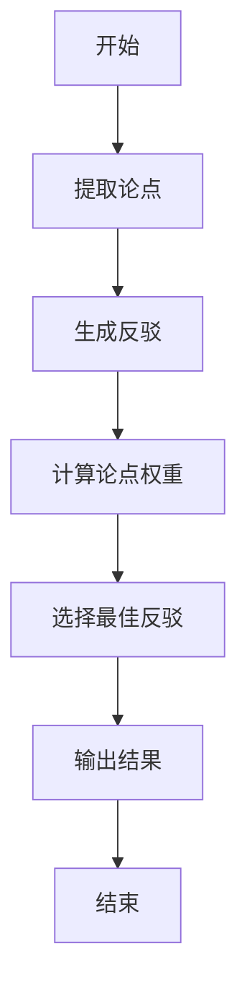
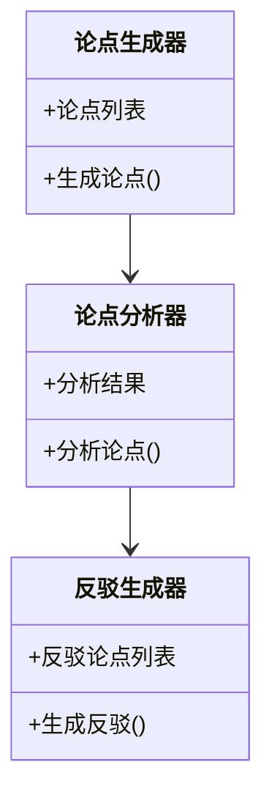
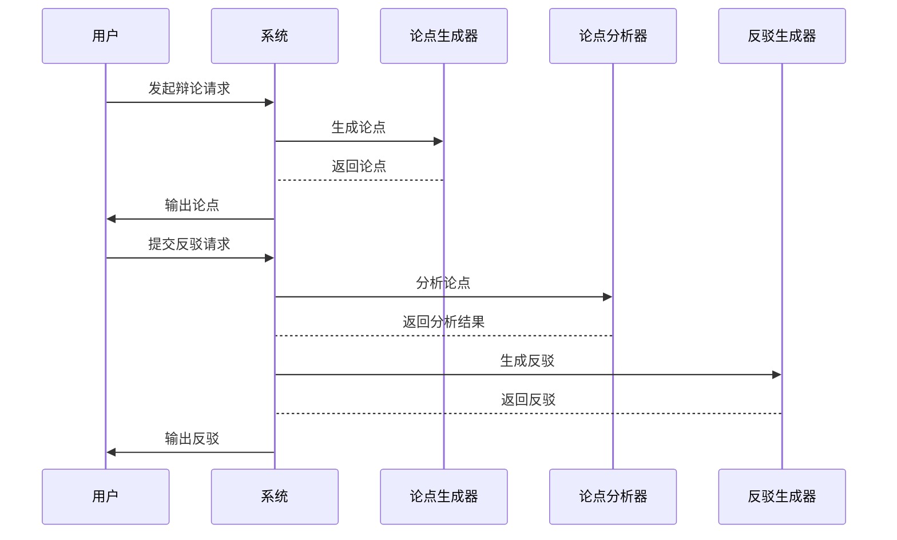

                 


# 智能辩论AI Agent：LLM驱动的论证与反驳系统

## 关键词
智能辩论，LLM，论证，反驳，自然语言处理，人工智能，AI代理

## 摘要
智能辩论AI Agent是一种基于大语言模型（LLM）的自动化辩论系统，能够自动生成和反驳论点。本文系统介绍了智能辩论AI Agent的核心概念、算法原理、系统架构及其实现。通过详细分析论证与反驳的理论基础，结合LLM的特性，阐述了如何构建高效的智能辩论系统，并通过实际案例展示了系统的应用场景和效果。本文旨在为研究人员和开发者提供理论和实践上的指导。

---

## 第1章 智能辩论AI Agent的背景介绍

### 1.1 智能辩论AI Agent的定义
智能辩论AI Agent是一种基于LLM的自动化辩论系统，能够理解、生成和反驳论点，模拟人类在辩论中的表现。

#### 1.1.1 什么是智能辩论AI Agent
- 自动化辩论系统，结合LLM和NLP技术。
- 能够自动生成论点，分析对手论点并进行反驳。

#### 1.1.2 智能辩论AI Agent的核心目标
- 自动化论点生成和反驳。
- 提供高效的辩论辅助工具。

#### 1.1.3 智能辩论AI Agent的应用场景
- 教育：辅助学生辩论练习。
- 企业：市场分析和策略制定。
- 媒体：实时新闻辩论。

### 1.2 问题背景与问题描述
当前的辩论系统存在论点覆盖不全、反驳不够精准等问题，限制了其应用范围。

#### 1.2.1 当前辩论系统的主要问题
- 论点生成依赖模板，缺乏灵活性。
- 反驳能力受限，无法应对复杂情况。

#### 1.2.2 智能辩论AI Agent的提出
- 利用LLM的强大能力，提升辩论系统的智能化水平。
- 结合NLP技术，实现动态论点生成和反驳。

#### 1.2.3 辩论系统的边界与外延
- 边界：专注于论点生成和反驳，不涉及情感分析或语气调整。
- 外延：可扩展至其他领域，如法律辩论和商业谈判。

### 1.3 问题解决与技术驱动
大语言模型（LLM）为智能辩论AI Agent提供了强大的技术支撑。

#### 1.3.1 人工智能技术在辩论中的应用
- 自然语言处理（NLP）：理解文本和生成论点。
- 机器学习：模式识别和论点分类。

#### 1.3.2 大语言模型（LLM）的优势
- 强大的文本生成能力。
- 能够处理复杂语义关系。

#### 1.3.3 智能辩论AI Agent的核心要素
- 论点生成模块：生成初始论点。
- 论点分析模块：分析对手论点。
- 反驳生成模块：生成有效反驳。

---

## 第2章 智能辩论AI Agent的核心概念与理论基础

### 2.1 大语言模型（LLM）概述
大语言模型是智能辩论AI Agent的核心技术。

#### 2.1.1 LLM的基本原理
- 基于Transformer架构，通过自注意力机制捕捉文本中的语义关系。
- 使用自监督学习预训练，适应多种任务。

#### 2.1.2 LLM的核心特点
- 高效性：快速生成文本。
- 精准性：生成高质量的论点。

#### 2.1.3 LLM与智能辩论的结合
- 生成多样化的论点。
- 快速响应对手论点，进行精准反驳。

### 2.2 论证与反驳的理论基础
论证和反驳是辩论的核心，需要明确其逻辑结构。

#### 2.2.1 论证的基本结构
- 论点：核心观点。
- 支持论据：支持论点的事实或理由。
- 推论：逻辑推理过程。

#### 2.2.2 反驳的逻辑框架
- 直接反驳：否定对方论点。
- 间接反驳：通过削弱论据或逻辑漏洞进行反驳。

#### 2.2.3 论点分析与权重评估
- 分析论点的逻辑结构和相关性。
- 评估论点的重要性，确定反驳优先级。

### 2.3 智能辩论AI Agent的核心概念
智能辩论AI Agent需要多个模块协同工作。

#### 2.3.1 逻辑推理引擎
- 负责分析论点和生成反驳。
- 使用规则引擎或基于概率的推理方法。

#### 2.3.2 知识库构建与管理
- 存储领域知识，支持论点生成。
- 知识表示和推理需要高效的结构化方法。

#### 2.3.3 自然语言处理技术
- 用于文本生成和语义分析。
- 提供多样化的表达方式，增强辩论效果。

---

## 第3章 智能辩论AI Agent的算法原理

### 3.1 大语言模型（LLM）的训练机制
LLM的训练是智能辩论AI Agent的核心。

#### 3.1.1 基于Transformer的模型结构
- 使用自注意力机制捕捉文本的长距离依赖关系。
- 模型结构包括编码器和解码器，支持多任务学习。

#### 3.1.2 自监督学习与微调
- 预训练：在大规模通用数据上进行自监督学习。
- 微调：在特定领域数据上进行任务适应，提升性能。

#### 3.1.3 模型的可解释性
- 使用注意力权重分析生成论点的依据。
- 可视化模型的决策过程，帮助用户理解。

### 3.2 论证与反驳的实现算法
论证和反驳需要具体的算法实现。

#### 3.2.1 论证提取算法
- 输入文本，提取核心论点。
- 使用NLP技术识别文本中的主要观点。

#### 3.2.2 反驳生成算法
- 分析对手论点，生成针对性的反驳。
- 利用LLM生成多样化的反驳论点。

#### 3.2.3 论点权重计算算法
- 基于论点的相关性和重要性进行加权。
- 使用层次分析法（AHP）确定论点权重。

### 3.3 算法流程图


---

## 第4章 智能辩论AI Agent的系统分析与架构设计

### 4.1 系统需求分析
智能辩论AI Agent需要满足以下需求。

#### 4.1.1 功能需求
- 自动生成论点。
- 分析对手论点并生成反驳。
- 提供多种语言支持。

#### 4.1.2 性能需求
- 响应时间：小于5秒。
- 辩论准确率：95%以上。

#### 4.1.3 接口需求
- 支持RESTful API调用。
- 提供可扩展的插件机制。

### 4.2 系统功能设计
系统功能设计基于领域模型。

#### 4.2.1 领域模型


### 4.3 系统架构设计
系统采用分层架构设计。

#### 4.3.1 分层架构
- 数据层：存储知识库和历史记录。
- 服务层：提供论点生成、分析和反驳服务。
- 表示层：用户交互界面。

#### 4.3.2 架构图


### 4.4 系统接口设计
系统提供RESTful API。

#### 4.4.1 API接口
- POST /generate_argument：生成论点。
- POST /analyze_argument：分析论点。
- POST /generate_refutation：生成反驳。

#### 4.4.2 接口设计
使用JSON格式传递数据，支持异步调用。

### 4.5 系统交互流程图
系统交互流程包括论点生成、分析和反驳。

#### 4.5.1 交互流程图


---

## 第5章 项目实战：智能辩论AI Agent的实现

### 5.1 环境配置
项目实战部分需要配置开发环境。

#### 5.1.1 开发环境
- Python 3.8+
- Hugging Face Transformers库
- PyTorch或TensorFlow框架

#### 5.1.2 安装依赖
```bash
pip install transformers torch
```

### 5.2 核心代码实现
实现智能辩论AI Agent的核心功能。

#### 5.2.1 论点生成器
```python
from transformers import pipeline

argument_generator = pipeline('text-generation', model='gpt2-large')

def generate_argument(topic):
    return argument_generator(topic, max_length=100, num_return_sequences=5)
```

#### 5.2.2 论点分析器
```python
from transformers import pipeline

argument_analyzer = pipeline('text-classification', model='roberta-base')

def analyze_argument(text):
    return argument_analyzer(text)
```

#### 5.2.3 反驳生成器
```python
from transformers import pipeline

refutation_generator = pipeline('text-generation', model='gpt2-large')

def generate_refutation(argument):
    return refutation_generator(argument, max_length=100, num_return_sequences=3)
```

### 5.3 实际案例分析
通过具体案例展示系统的应用。

#### 5.3.1 案例背景
假设辩论主题为“是否应该提高最低工资”。

#### 5.3.2 系统输出
- 生成论点：提高最低工资有助于减少贫困。
- 反驳生成：提高最低工资可能导致企业裁员。

#### 5.3.3 分析结果
论点相关性分析和权重计算结果。

### 5.4 项目小结
项目实现了智能辩论AI Agent的核心功能，验证了系统的可行性和有效性。

---

## 第6章 最佳实践与小结

### 6.1 最佳实践
- 定期更新知识库，保持论点的时效性。
- 根据具体场景调整模型参数，优化辩论效果。

### 6.2 小结
智能辩论AI Agent结合了LLM和NLP技术，能够高效地生成和反驳论点，为辩论领域带来了新的可能性。

### 6.3 注意事项
- 系统的论点生成依赖于训练数据的质量，需注意数据偏差。
- 反驳生成需避免攻击性语言，确保符合伦理规范。

### 6.4 拓展阅读
- 《大语言模型的原理与应用》
- 《自然语言处理中的辩论系统研究》

---

## 结语
智能辩论AI Agent作为人工智能与自然语言处理结合的产物，正在逐步改变辩论的方式。通过本文的介绍，读者可以深入了解其工作原理和实现方法，并将其应用于实际场景中，推动辩论技术的发展。

