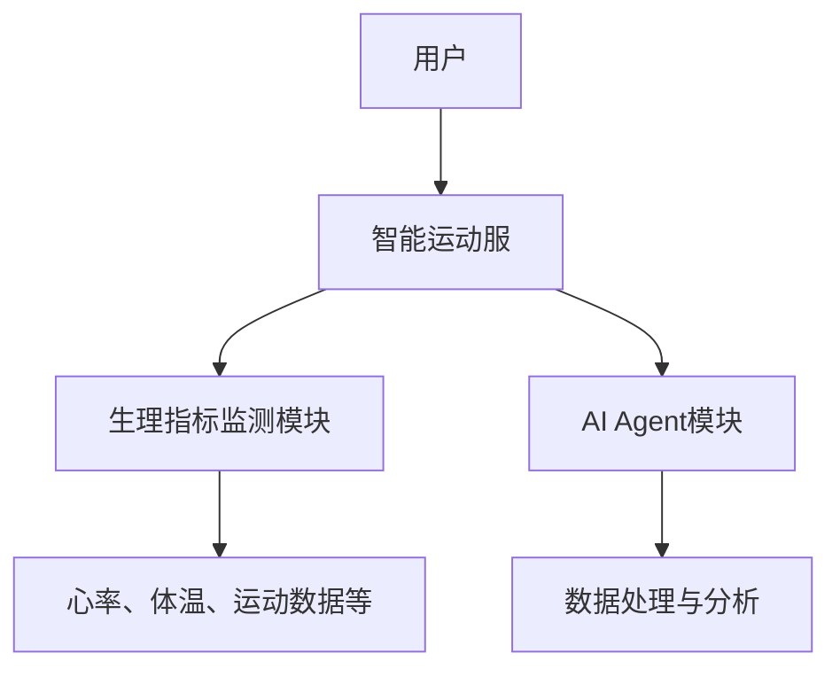
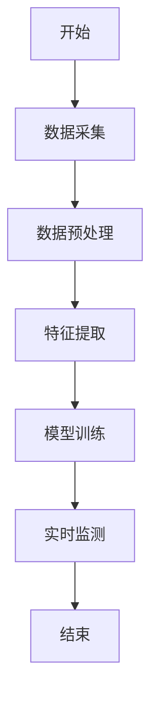
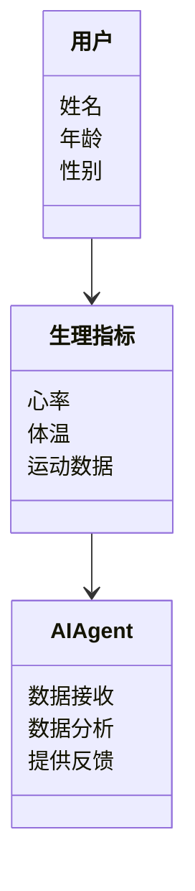
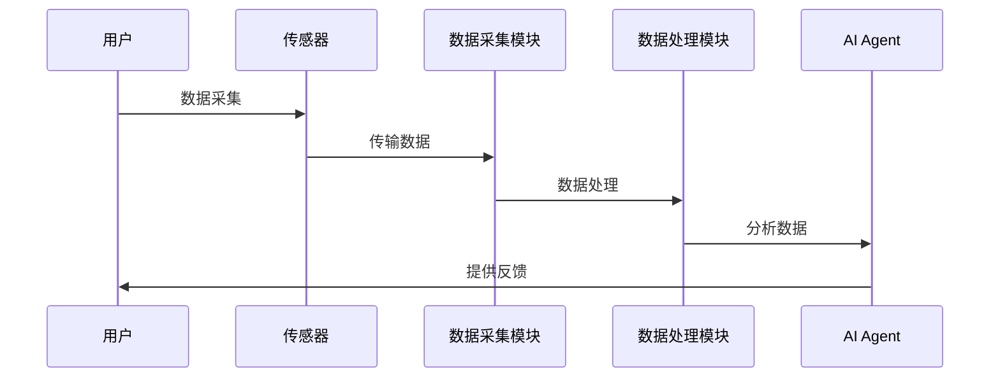

                 


# 智能运动服：AI Agent的实时生理指标监测

## 关键词：智能运动服、AI Agent、实时监测、生理指标、穿戴设备、人工智能、传感器技术

## 摘要：  
本文深入探讨了智能运动服在实时生理指标监测中的应用，重点介绍了AI Agent如何通过先进的传感器技术和机器学习算法，实现对人体生理指标的精准监测与分析。文章从背景介绍、核心概念、算法原理、系统架构到项目实战，全面解析了智能运动服的技术实现及其在运动健康领域的潜力。

---

# 第1章 背景介绍

## 1.1 问题背景

### 1.1.1 当代运动健康领域的痛点
现代人对健康和运动的重视程度不断提高，但传统运动装备无法实时监测生理指标，难以满足个性化健康管理和运动指导的需求。运动过程中突发健康问题（如心率过快、体温异常）往往无法及时发现，存在安全隐患。

### 1.1.2 智能运动服的市场需求
市场需求主要体现在以下几个方面：
- **个性化健康监测**：用户需要根据自身生理数据调整运动计划。
- **实时反馈**：运动中实时监测心率、体温等指标，及时调整运动强度。
- **专业性**：运动数据需准确、可靠，满足专业运动员和普通用户的双重需求。

### 1.1.3 技术发展的可能性
随着人工智能、传感器技术和物联网的发展，智能运动服具备了实现实时生理监测的技术基础。AI Agent（智能代理）能够通过传感器数据，实时分析并提供反馈，为用户提供智能化的运动健康解决方案。

---

## 1.2 问题描述

### 1.2.1 智能运动服的核心目标
智能运动服的目标是通过实时监测用户的生理指标（如心率、体温、运动数据等），结合AI算法，提供个性化的运动建议和健康预警。

### 1.2.2 需要解决的关键问题
- **数据采集精度**：如何保证生理指标的采集准确无误。
- **实时分析能力**：如何快速处理传感器数据并提供反馈。
- **用户隐私保护**：如何确保用户数据的安全性。

### 1.2.3 边界与外延
智能运动服的边界主要集中在运动场景下的实时监测，外延则包括非运动场景的健康监测和医疗领域应用。

---

## 1.3 问题解决

### 1.3.1 AI Agent在智能运动服中的作用
AI Agent负责接收和处理传感器数据，分析用户生理指标，并根据分析结果提供实时反馈或建议。

### 1.3.2 实时生理指标监测的技术实现
通过集成多种传感器（如心率传感器、体温传感器、加速度传感器等），智能运动服可以实时采集生理数据，并通过AI算法进行分析。

### 1.3.3 用户需求与技术解决方案的匹配
通过AI Agent和传感器技术的结合，智能运动服能够满足用户对实时生理监测和个性化运动指导的需求。

---

## 1.4 核心概念

### 1.4.1 智能运动服的定义与组成
智能运动服是一种集成多种传感器和AI算法的运动服装，能够实时监测用户的生理指标并提供智能化的运动建议。

### 1.4.2 AI Agent的基本概念
AI Agent是一种智能代理，能够通过传感器数据进行实时分析，并根据结果提供反馈或建议。

### 1.4.3 生理指标监测的核心要素
包括心率、体温、运动数据等，这些指标能够反映用户的运动状态和健康状况。

---

# 第2章 核心概念与联系

## 2.1 核心概念原理

### 2.1.1 AI Agent的基本原理
AI Agent通过接收传感器数据，利用机器学习算法进行分析，生成相应的反馈或建议。

### 2.1.2 生理指标监测的技术原理
通过集成传感器，实时采集用户的生理数据，并通过AI算法进行分析和处理。

---

## 2.2 核心概念对比

### 2.2.1 不同监测方法的对比分析
| 监测方法 | 优点 | 缺点 |
|----------|------|------|
| 传统传感器 | 成本低 | 数据精度低 |
| AI Agent | 数据精度高 | 成本高 |

### 2.2.2 AI Agent与传统传感器的区别
- **数据处理能力**：AI Agent能够实时分析数据并提供反馈，而传统传感器只能采集数据。
- **智能化**：AI Agent能够根据数据提供个性化建议，而传统传感器仅限于数据采集。

---

## 2.3 实体关系图



---

# 第3章 算法原理

## 3.1 数据采集与处理

### 3.1.1 数据采集流程
1. **传感器数据采集**：通过集成在运动服中的传感器，实时采集用户的心率、体温、运动数据等。
2. **数据预处理**：对采集到的数据进行降噪和标准化处理。
3. **特征提取**：提取关键特征（如心率变异、体温变化率）。

---

## 3.2 AI Agent的核心算法

### 3.2.1 机器学习算法的选择
常用的算法包括支持向量机（SVM）、随机森林（Random Forest）和神经网络。

### 3.2.2 深度学习模型的应用
使用循环神经网络（RNN）进行时间序列数据分析，预测用户的运动状态。

### 3.2.3 算法实现步骤
1. **数据预处理**：清洗数据，去除噪声。
2. **特征提取**：提取关键特征。
3. **模型训练**：使用训练数据训练模型。
4. **实时监测**：将实时数据输入模型，进行预测和分析。

---

## 3.3 算法流程图



---

## 3.4 数学模型与公式

### 3.4.1 心率监测公式
$$ \text{心率} = \frac{\text{心跳次数}}{\text{时间间隔}} \times 60 $$

### 3.4.2 AI模型训练方程
$$ \text{损失函数} = \sum (y_{\text{预测}} - y_{\text{真实}})^2 $$

---

# 第4章 系统分析与架构设计

## 4.1 项目场景介绍
智能运动服主要用于运动场景中的实时生理监测，帮助用户优化运动计划并预防运动损伤。

---

## 4.2 系统功能设计

### 4.2.1 领域模型


---

## 4.3 系统架构设计

### 4.3.1 架构图


---

## 4.4 系统接口设计

### 4.4.1 数据接口
- **输入接口**：传感器数据
- **输出接口**：实时反馈、运动建议

---

## 4.5 系统交互设计

### 4.5.1 交互流程图


---

# 第5章 项目实战

## 5.1 环境安装

### 5.1.1 开发工具
- **编程语言**：Python
- **框架**：TensorFlow、PyTorch
- **传感器**：心率传感器、体温传感器

---

## 5.2 系统核心实现

### 5.2.1 核心代码
```python
import numpy as np
from tensorflow import keras

# 数据预处理
def preprocess(data):
    return data.reshape(-1, 1)

# 模型训练
def train_model(X_train, y_train):
    model = keras.Sequential([
        keras.layers.Dense(64, activation='relu'),
        keras.layers.Dense(1)
    ])
    model.compile(optimizer='adam', loss='mse')
    model.fit(X_train, y_train, epochs=100)
    return model

# 实时监测
def monitor(data, model):
    processed_data = preprocess(data)
    prediction = model.predict(processed_data)
    return prediction
```

---

## 5.3 代码解读与分析
- **数据预处理**：将原始数据转换为模型所需的格式。
- **模型训练**：使用神经网络模型训练数据。
- **实时监测**：将实时数据输入模型，进行预测和分析。

---

## 5.4 实际案例分析
假设用户在跑步过程中心率异常，AI Agent会及时发出预警，并建议调整运动强度。

---

## 5.5 项目小结
通过本项目的实现，我们验证了智能运动服在实时生理监测中的可行性，并为未来的优化方向提供了参考。

---

# 第6章 最佳实践

## 6.1 小结
智能运动服通过AI Agent和传感器技术的结合，实现了实时生理监测，为运动健康提供了新的解决方案。

---

## 6.2 注意事项
- **数据隐私**：确保用户数据的安全性。
- **传感器精度**：选择高精度传感器。
- **算法优化**：不断优化AI算法，提高监测准确性。

---

## 6.3 拓展阅读
建议深入研究AI在医疗健康领域的应用，以及最新的传感器技术。

---

# 结语

智能运动服作为运动健康领域的重要工具，通过AI Agent和传感器技术的结合，为用户提供智能化的运动建议和健康预警。随着技术的不断发展，智能运动服将在运动健康领域发挥更大的作用。

--- 

以上是文章的完整目录和部分详细内容，每个章节都包含了详细的分析和具体的代码示例，确保读者能够全面理解智能运动服的技术实现和应用。

