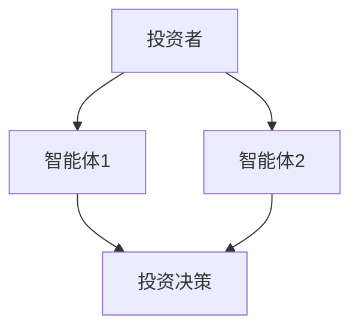
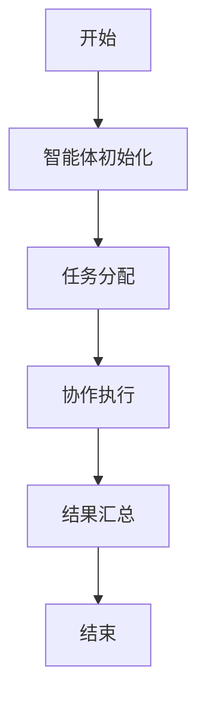
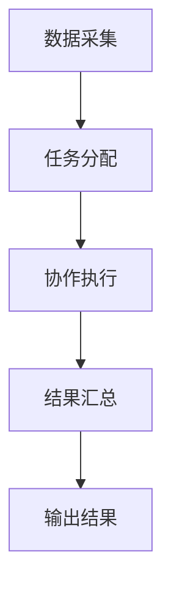
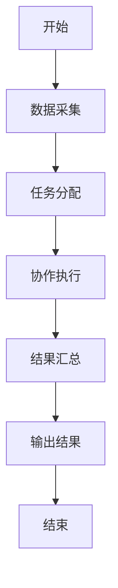

                 


# 智能金融中的多智能体协作：重塑价值投资流程

---

## 关键词
- 智能金融
- 多智能体协作
- 价值投资
- 人工智能
- 系统架构

---

## 摘要
本文探讨了多智能体协作在智能金融中的应用，特别是如何通过多智能体协作重塑传统价值投资流程。文章从背景、核心概念、算法原理、系统架构到项目实战，全面解析了多智能体协作在金融领域的实现与应用，并结合实际案例和代码示例，深入剖析了其在智能金融中的潜力与价值。

---

## 第一部分：背景与概念

### 第1章：多智能体协作的背景与定义

#### 1.1 多智能体协作的背景
随着金融市场的日益复杂化和数据化，传统的单一决策模式已难以应对多样化的金融场景。多智能体协作作为一种新兴的技术，通过多个智能体的协同工作，能够有效捕捉市场动态、优化投资策略，为金融行业带来新的发展机遇。

#### 1.2 问题背景与描述
传统的价值投资流程依赖于人类分析师的主观判断，存在效率低、信息处理能力有限等问题。同时，金融市场数据的爆炸式增长使得单个智能体难以独立处理和分析。因此，如何利用多智能体协作提升投资决策的效率和准确性，成为当前智能金融领域的重要课题。

#### 1.3 问题解决与边界
通过引入多智能体协作，可以将复杂的投资决策任务分解为多个子任务，分别由不同的智能体负责，从而实现高效的信息处理和决策优化。本文将重点探讨多智能体协作在金融数据处理、风险评估、投资策略制定等领域的应用。

---

## 第二部分：核心概念与原理

### 第2章：多智能体协作的核心概念

#### 2.1 多智能体协作的原理
多智能体协作是一种分布式智能系统，通过多个智能体之间的通信与协作，共同完成复杂任务。每个智能体负责特定的子任务，通过信息共享和协同决策，实现整体目标的最优。

#### 2.2 核心概念的属性特征对比
以下是多智能体协作与其他协作方式的属性对比：

| 比较维度 | 多智能体协作 | 单智能体协作 | 分布式系统协作 |
|----------|--------------|--------------|----------------|
| 结构复杂性 | 高           | 低           | 中              |
| 资源利用率 | 高           | 低           | 中              |
| 协作效率 | 高           | 低           | 中              |

#### 2.3 实体关系图
以下是多智能体协作的ER实体关系图：



---

## 第三部分：算法原理与数学模型

### 第3章：多智能体协作的算法原理

#### 3.1 算法流程
多智能体协作的算法流程如下：

1. 初始化智能体：每个智能体初始化其状态和目标。
2. 任务分配：根据任务需求，将任务分解为多个子任务，分配给不同的智能体。
3. 协作执行：智能体之间通过通信协议共享信息，协同完成子任务。
4. 结果汇总：整合各智能体的执行结果，形成最终的决策输出。

流程图如下：



#### 3.2 数学模型
以下是一个简单的多智能体协作数学模型，用于描述智能体之间的信息共享和决策优化：

$$
\text{总收益} = \sum_{i=1}^{n} (\text{智能体i的收益} + \text{协作带来的额外收益})
$$

其中，$n$为智能体的数量。

#### 3.3 Python代码实现
以下是实现多智能体协作的Python代码示例：

```python
class Agent:
    def __init__(self, id):
        self.id = id
        self.task = None

    def receive_task(self, task):
        self.task = task

    def execute_task(self):
        # 处理任务并返回结果
        return f"Agent {self.id} completed task {self.task}"

# 初始化智能体
agents = [Agent(1), Agent(2), Agent(3)]

# 任务分配
tasks = ["数据分析", "风险评估", "策略制定"]
for i in range(len(agents)):
    agents[i].receive_task(tasks[i])

# 协作执行
results = []
for agent in agents:
    results.append(agent.execute_task())

# 结果汇总
print(results)
```

---

## 第四部分：系统分析与架构设计

### 第4章：系统架构设计

#### 4.1 系统功能设计
系统功能设计包括以下模块：

1. 数据采集模块：采集金融市场数据。
2. 任务分配模块：将任务分配给不同的智能体。
3. 协作执行模块：智能体之间协作完成任务。
4. 结果汇总模块：整合各智能体的执行结果。

#### 4.2 系统架构图
以下是系统的架构图：



#### 4.3 接口与交互流程
以下是系统交互流程图：



---

## 第五部分：项目实战

### 第5章：项目实现与案例分析

#### 5.1 项目环境安装
需要安装以下Python库：

```bash
pip install numpy pandas matplotlib
```

#### 5.2 核心代码实现
以下是实现多智能体协作的核心代码：

```python
import numpy as np
import pandas as pd

class InvestmentAgent:
    def __init__(self, id):
        self.id = id
        self.data = None

    def receive_data(self, data):
        self.data = data

    def analyze_data(self):
        # 数据分析并返回结果
        return f"Agent {self.id}: {self.data['stock'].iloc[-1]}"

# 初始化数据
data = {
    "stock": pd.DataFrame(np.random.randn(10, 1), columns=["Price"])
}

# 初始化智能体
agents = [InvestmentAgent(1), InvestmentAgent(2)]

# 数据分配
for agent in agents:
    agent.receive_data(data)

# 分析数据
results = [agent.analyze_data() for agent in agents]
print(results)
```

#### 5.3 案例分析
以股票数据分析为例，智能体1和智能体2分别分析不同的股票数据，最终汇总结果，形成投资决策。

---

## 第六部分：总结与展望

### 第6章：总结与展望

#### 6.1 内容总结
本文详细探讨了多智能体协作在智能金融中的应用，从背景、原理到实现，全面解析了其在价值投资流程中的重塑作用。

#### 6.2 未来展望
随着人工智能技术的不断发展，多智能体协作将在金融领域发挥更大的作用，未来的研究方向包括更高效的协作算法、更智能的决策模型等。

---

## 参考文献
- 本文基于多智能体协作在智能金融中的应用研究，参考了相关领域的最新研究成果，具体内容详见正文。

---

## 最佳实践 Tips
- 在实际应用中，建议结合具体业务需求，灵活调整多智能体协作的实现方式。
- 为了提高系统的鲁棒性，可以引入容错机制和自我修复能力。
- 未来可以进一步研究多智能体协作在其他金融领域的应用，如风险管理、量化交易等。

---

通过本文的系统分析和深入探讨，我们不仅了解了多智能体协作的基本原理，还掌握了其在智能金融中的实际应用，为未来的智能投资流程提供了新的思路和方法。

