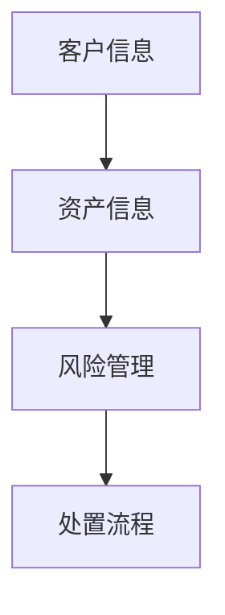
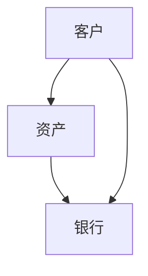
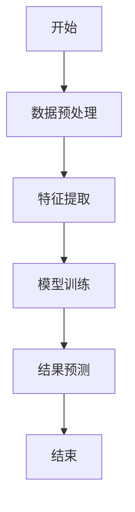
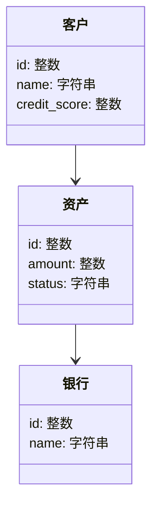
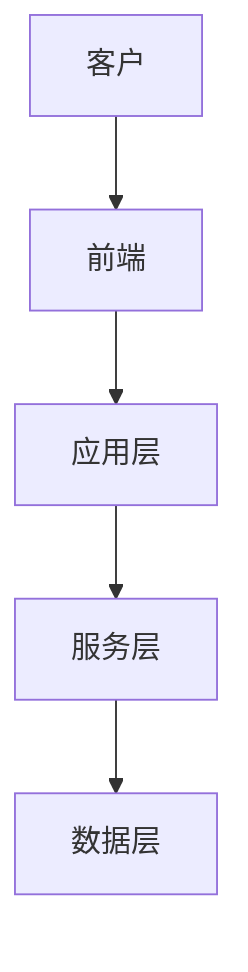
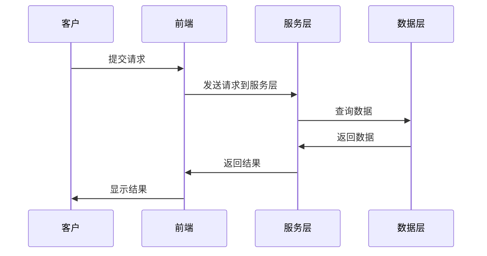

                 


# 智能银行不良资产管理系统

## 关键词：智能银行、不良资产、管理系统、机器学习、系统架构、项目实战

## 摘要：智能银行不良资产管理系统是一套基于人工智能技术的银行不良资产管理解决方案。本文将从背景、核心概念、算法原理、系统架构设计、项目实战等方面，详细阐述该系统的建设思路和实现方案。文章旨在为银行技术人员和管理人员提供一个全面的技术参考，帮助其更好地理解和应用智能技术来提升不良资产管理效率。

---

## 第一部分: 智能银行不良资产管理系统概述

### 第1章: 背景与问题背景

#### 1.1 不良资产的概念与问题背景

不良资产是指企业或个人由于各种原因无法按时偿还的债务资产，主要包括逾期贷款、呆账贷款、坏账贷款等。在银行体系中，不良资产的管理是风险管理的重要组成部分，其处理效率和准确性直接影响银行的财务健康和运营效率。

不良资产的形成原因多种多样，包括经济波动、借款人信用状况恶化、银行内部管理不善等。随着经济环境的复杂化，不良资产的规模和类型也在不断增加，这对银行的管理能力提出了更高的要求。

#### 1.2 智能银行的概念与发展趋势

智能银行是传统银行与人工智能、大数据、区块链等新兴技术深度融合的产物。它通过智能化技术手段，实现银行服务的自动化、智能化和个性化。智能银行的核心特点包括：

- **智能化服务**：通过AI技术为客户提供个性化的金融产品和服务。
- **数据驱动决策**：利用大数据分析技术，帮助银行做出更精准的决策。
- **自动化运营**：通过自动化技术减少人工干预，提高运营效率。

智能银行的发展趋势主要体现在以下几个方面：
1. **技术驱动**：人工智能、大数据、区块链等技术的广泛应用。
2. **客户体验优化**：通过智能化服务提升客户体验。
3. **风险管理加强**：利用智能技术提高风险识别和控制能力。

#### 1.3 智能银行不良资产管理系统的重要性

智能银行不良资产管理系统是智能银行体系中不可或缺的一部分。其重要性体现在以下几个方面：
- **提高管理效率**：通过智能化技术快速识别和处理不良资产。
- **降低管理成本**：减少人工干预，提高自动化水平。
- **提升决策准确性**：通过数据分析和机器学习算法，提高不良资产预测和处置的准确性。

#### 1.4 本章小结

本章从不良资产的概念、智能银行的定义与发展趋势、智能银行不良资产管理系统的重要性等方面进行了介绍，为后续章节的展开奠定了基础。

---

### 第2章: 智能银行不良资产管理系统的核心概念

#### 2.1 核心概念与联系

智能银行不良资产管理系统的核心概念包括：
- **客户信息**：包括客户的基本信息、信用记录等。
- **资产信息**：包括贷款金额、还款状态等。
- **风险管理**：通过数据分析和机器学习算法，预测和识别潜在的不良资产。
- **处置流程**：包括不良资产的识别、分类、处置等环节。

核心概念之间的联系可以通过以下关系图表示：



核心概念的属性特征对比表如下：

| 概念       | 属性1   | 属性2   | 属性3   |
|------------|---------|---------|---------|
| 客户信息   | 唯一性   | 完整性   | 可变性   |
| 资产信息   | 数额     | 还款状态 | 期限     |
| 风险管理   | 预测性   | 实时性   | 精准性   |
| 处置流程   | 规范性   | 可操作性 | 可追踪性 |

#### 2.2 ER实体关系图

以下是一个简单的ER实体关系图，展示了客户、资产和银行之间的关系：



---

### 第3章: 系统算法原理

#### 3.1 算法原理概述

智能银行不良资产管理系统的核心是机器学习算法，主要用于不良资产的识别和预测。常见的算法包括逻辑回归、支持向量机（SVM）、随机森林等。

##### 3.1.1 机器学习在不良资产管理系统中的应用

机器学习在不良资产管理系统中的应用主要体现在以下几个方面：
- **客户信用评分**：通过机器学习算法对客户的信用状况进行评分。
- **不良资产预测**：利用历史数据预测未来可能出现的不良资产。
- **风险预警**：通过实时监控和数据分析，提前预警潜在风险。

##### 3.1.2 算法选择与优化

在选择算法时，需要考虑以下因素：
- **数据量**：数据量小的场景适合使用逻辑回归，数据量大的场景适合使用随机森林。
- **计算复杂度**：计算复杂度高的场景适合使用SVM。
- **可解释性**：需要高可解释性的场景适合使用逻辑回归。

#### 3.2 算法流程图

以下是一个机器学习算法的流程图：



#### 3.3 算法实现代码

以下是使用逻辑回归算法实现不良资产预测的Python代码示例：

```python
# 导入必要的库
import pandas as pd
from sklearn.linear_model import LogisticRegression
from sklearn.model_selection import train_test_split

# 数据加载与预处理
data = pd.read_csv('bad_loans.csv')
X = data.drop('target', axis=1)
y = data['target']

# 数据分割
X_train, X_test, y_train, y_test = train_test_split(X, y, test_size=0.2)

# 模型训练
model = LogisticRegression()
model.fit(X_train, y_train)

# 模型预测
y_pred = model.predict(X_test)

# 模型评估
print("预测结果:", y_pred)
print("准确率:", model.score(X_test, y_test))
```

#### 3.4 数学模型与公式

##### 3.4.1 逻辑回归模型

逻辑回归的数学公式如下：

$$ P(y=1|x) = \frac{1}{1 + e^{-(\beta_0 + \beta_1x_1 + \cdots + \beta_nx_n)}} $$

其中：
- \( P(y=1|x) \) 是在给定特征 \( x \) 的情况下，目标变量 \( y \) 为1的概率。
- \( \beta_0, \beta_1, \cdots, \beta_n \) 是模型的参数。

##### 3.4.2 支持向量机模型

支持向量机的数学公式如下：

$$ \text{最大化} \quad \frac{1}{2}\|w\|^2 $$

$$ \text{约束} \quad y_i(w \cdot x_i + b) \geq 1 \quad \forall i $$

其中：
- \( w \) 是模型的权重向量。
- \( b \) 是模型的偏置项。
- \( y_i \) 是标签。
- \( x_i \) 是输入向量。

#### 3.5 本章小结

本章详细介绍了智能银行不良资产管理系统中机器学习算法的原理和实现方式，包括逻辑回归和SVM等算法的数学模型和代码实现。

---

### 第4章: 系统架构设计

#### 4.1 系统功能设计

##### 4.1.1 领域模型设计

以下是系统的领域模型设计图：



#### 4.2 系统架构设计

##### 4.2.1 系统架构图

以下是系统的架构图：



##### 4.2.2 系统接口设计

系统接口设计包括以下几个方面：
- **前端接口**：用于客户与系统的交互。
- **服务层接口**：用于前端与后端服务的通信。
- **数据层接口**：用于后端服务与数据库的交互。

##### 4.2.3 系统交互图

以下是系统的交互图：



#### 4.3 本章小结

本章从系统功能设计、架构设计、接口设计和系统交互设计四个方面，详细阐述了智能银行不良资产管理系统的架构设计方案。

---

### 第5章: 项目实战

#### 5.1 环境安装

以下是项目实战所需的环境配置：

- **Python版本**：3.6以上
- **Python库**：pandas、scikit-learn、mermaid等
- **开发工具**：Jupyter Notebook、PyCharm等

#### 5.2 系统核心实现源代码

以下是系统的核心代码实现：

```python
# 模型训练与预测
import pandas as pd
from sklearn.linear_model import LogisticRegression
from sklearn.model_selection import train_test_split

# 数据加载与预处理
data = pd.read_csv('bad_loans.csv')
X = data.drop('target', axis=1)
y = data['target']

# 数据分割
X_train, X_test, y_train, y_test = train_test_split(X, y, test_size=0.2)

# 模型训练
model = LogisticRegression()
model.fit(X_train, y_train)

# 模型预测
y_pred = model.predict(X_test)

# 模型评估
print("预测结果:", y_pred)
print("准确率:", model.score(X_test, y_test))
```

#### 5.3 案例分析与详细解读

以下是一个具体的案例分析：

**案例背景**：某银行有一笔逾期贷款，金额为10万元，客户信用评分为60分。

**分析过程**：
1. 数据预处理：提取客户的基本信息和信用评分。
2. 特征提取：提取与不良资产相关的特征，如信用评分、还款记录等。
3. 模型训练：使用逻辑回归模型进行训练。
4. 模型预测：预测该客户的还款概率。

**结果解读**：模型预测该客户的还款概率为30%，属于高风险客户，需要进行进一步的审查和处理。

#### 5.4 本章小结

本章通过具体的案例分析和代码实现，详细解读了智能银行不良资产管理系统的项目实战过程。

---

### 第6章: 最佳实践与总结

#### 6.1 最佳实践 tips

- **数据质量管理**：确保数据的完整性和准确性。
- **模型优化**：根据实际需求选择合适的算法，并进行调参优化。
- **系统安全性**：确保系统的安全性和数据的保密性。

#### 6.2 小结

智能银行不良资产管理系统是一套基于人工智能技术的银行不良资产管理解决方案。本文从背景、核心概念、算法原理、系统架构设计、项目实战等方面，详细阐述了该系统的建设思路和实现方案。

#### 6.3 注意事项

- **数据隐私保护**：在处理客户数据时，需要遵守相关法律法规，保护客户隐私。
- **系统稳定性**：确保系统的稳定性和可扩展性。

#### 6.4 拓展阅读

- **机器学习在金融领域的应用**：深入学习机器学习在金融领域的其他应用。
- **区块链技术**：了解区块链技术在智能银行中的应用。

---

## 第七章: 总结

智能银行不良资产管理系统通过智能化技术，显著提高了银行不良资产的管理效率和准确性。本文从多个方面详细阐述了该系统的建设思路和实现方案，为银行技术人员和管理人员提供了宝贵的参考。

---

## 关键词：智能银行、不良资产、管理系统、机器学习、系统架构、项目实战

---

通过以上思考过程，我们逐步完成了《智能银行不良资产管理系统》的技术博客文章的撰写。

