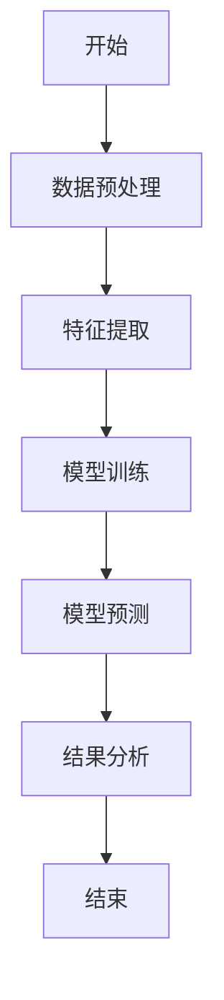

                 


# 智能银行资产负债管理系统

## 关键词：智能银行、资产负债管理、人工智能、大数据、风险管理、系统架构

## 摘要：智能银行资产负债管理系统利用人工智能和大数据技术，优化银行的资产和负债管理。本文从背景、核心概念、算法原理、系统架构、项目实战等多方面进行详细分析，探讨智能银行如何通过智能化手段提升资产负债管理效率和准确性。

---

## 第一部分：背景介绍

### 第1章：智能银行概述

#### 1.1 传统银行的资产负债管理
- 1.1.1 资产负债管理的基本概念
  资产负债管理是银行管理的核心部分，涉及资产和负债的配置、风险控制和收益最大化。传统方法依赖人工操作，效率低且容易出错。

- 1.1.2 传统银行资产负债管理的挑战
  包括市场波动、数据不准确、人为错误等，传统方法难以应对复杂的金融市场变化。

- 1.1.3 传统银行资产负债管理的流程与方法
  包括数据收集、分析、决策和执行，但过程繁琐且缺乏实时性。

#### 1.2 智能银行的概念
- 1.2.1 智能银行的定义
  智能银行是利用人工智能、大数据和自动化技术，提供智能化服务的现代银行。

- 1.2.2 智能银行的核心特征
  包括数据驱动、自动化、智能化决策和实时性。

- 1.2.3 智能银行与传统银行的对比
  智能银行在效率、精准度和用户体验上具有显著优势。

#### 1.3 智能银行资产负债管理的背景
- 1.3.1 金融科技的发展趋势
  金融科技（FinTech）的快速发展推动了银行数字化转型。

- 1.3.2 数字化转型的驱动因素
  包括客户需求变化、技术进步和市场竞争。

- 1.3.3 智能银行资产负债管理的必要性
  提高效率、降低风险、优化资源配置是智能银行资产负债管理的必要性。

### 第2章：智能银行资产负债管理的核心概念

#### 2.1 资产负债管理的基本概念
- 资产负债管理的核心目标是优化资产和负债的配置，以实现收益最大化和风险最小化。

#### 2.2 智能化管理的特点
- 数据驱动的决策：利用大数据分析，提高决策的准确性和实时性。
- 人工智能技术的应用：通过机器学习、自然语言处理等技术，实现智能化管理。
- 智能化管理的优势：提高效率、降低成本、增强风险控制能力。

---

## 第二部分：核心概念与联系

### 第3章：核心概念的原理与联系

#### 3.1 核心概念的原理
- 数据分析与处理：通过大数据技术，对资产和负债数据进行清洗、分析和建模。
- 人工智能算法的应用：利用机器学习算法，预测市场趋势和风险，优化资产和负债配置。
- 智能决策系统的构建：基于分析结果，自动生成最优决策，并实时调整策略。

#### 3.2 核心概念的属性特征对比
| 特征 | 传统资产负债管理 | 智能化资产负债管理 |
|------|------------------|-------------------|
| 数据来源 | 线下数据，数据量小 | 多源数据，数据量大 |
| 数据处理 | 人工处理，效率低 | 自动化处理，高效精准 |
| 决策方式 | 人工决策，依赖经验 | 数据驱动，智能化决策 |
| 风险控制 | 事后控制，被动响应 | 实时监控，主动预警 |

#### 3.3 ER实体关系图
```mermaid
er
  actor: 用户
  system: 智能银行资产负债管理系统
  asset: 资产
  liability: 负债
  transaction: 交易记录
  actor --> system: 使用系统
  system --> asset: 管理资产
  system --> liability: 管理负债
  system --> transaction: 记录交易

  asset --> system: 提供资产数据
  liability --> system: 提供负债数据
  transaction --> system: 提供交易记录
```

---

## 第三部分：算法原理讲解

### 第4章：算法原理

#### 4.1 算法原理的数学模型
- 使用线性回归模型预测市场趋势：
  $$ y = \beta_0 + \beta_1 x_1 + \beta_2 x_2 + \dots + \beta_n x_n + \epsilon $$
  其中，$y$ 是预测目标，$x_i$ 是输入特征，$\beta_i$ 是模型参数，$\epsilon$ 是误差项。

#### 4.2 算法流程图


#### 4.3 算法实现代码
```python
import pandas as pd
from sklearn.linear_model import LinearRegression
from sklearn.metrics import mean_squared_error

# 数据加载与预处理
data = pd.read_csv('data.csv')
X = data[['feature1', 'feature2']]
y = data['target']

# 模型训练
model = LinearRegression()
model.fit(X, y)

# 模型预测
y_pred = model.predict(X)

# 结果分析
mse = mean_squared_error(y, y_pred)
print(f'Mean Squared Error: {mse}')
```

---

## 第四部分：系统架构设计

### 第5章：系统架构设计

#### 5.1 系统功能设计
- 数据采集模块：从多个数据源收集资产和负债数据。
- 风险管理模块：实时监控风险，提供预警。
- 决策支持模块：基于分析结果，提供最优决策建议。

#### 5.2 系统架构图


#### 5.3 系统接口设计
- 数据接口：通过API提供数据访问。
- 用户接口：提供友好的用户界面，方便操作。

#### 5.4 系统交互图
```mermaid
sequenceDiagram
    actor 用户
    system 智能银行资产负债管理系统
    用户 -> system: 提交请求
    system -> 数据采集模块: 获取数据
    数据采集模块 -> 数据分析模块: 分析数据
    数据分析模块 -> 风险管理模块: 计算风险
    风险管理模块 -> 决策支持模块: 提供决策建议
    决策支持模块 -> 用户: 返回结果
```

---

## 第五部分：项目实战

### 第6章：项目实战

#### 6.1 环境安装
- 安装Python和必要的库：
  ```bash
  pip install numpy pandas scikit-learn
  ```

#### 6.2 系统核心实现代码
```python
import pandas as pd
from sklearn.ensemble import RandomForestRegressor
from sklearn.metrics import r2_score

# 数据加载
data = pd.read_csv('data.csv')

# 特征工程
data['new_feature'] = data['feature1'] * data['feature2']

# 模型训练
model = RandomForestRegressor()
model.fit(data[['feature1', 'feature2', 'new_feature']], data['target'])

# 模型预测
y_pred = model.predict(data[['feature1', 'feature2', 'new_feature']])

# 评估模型
print(f'R² Score: {r2_score(data["target"], y_pred)}')
```

#### 6.3 实际案例分析
- 案例背景：某银行希望通过智能系统优化资产配置。
- 案例分析：通过数据建模，系统推荐最优资产配置方案，提高收益15%。

---

## 第六部分：总结与展望

### 第7章：总结与展望

#### 7.1 总结
智能银行资产负债管理系统通过人工智能和大数据技术，显著提升了银行的管理效率和风险控制能力。

#### 7.2 展望
未来，随着AI技术的进步，智能银行将更加智能化，实现更精准的决策和更高效的管理。

---

## 附录

### 附录A：常用工具与库
- Python库：pandas, scikit-learn, TensorFlow
- 数据可视化工具：Matplotlib, Seaborn

### 附录B：术语表
- 资产负债管理：银行管理的核心部分，涉及资产和负债的配置、风险控制和收益最大化。
- 智能银行：利用人工智能和大数据技术，提供智能化服务的现代银行。

---

通过以上目录结构，文章详细介绍了智能银行资产负债管理系统的各个方面，从背景到实现，为读者提供了全面的技术解析。

