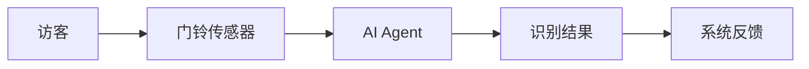
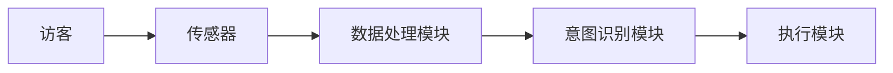

                 


# 智能门铃：AI Agent的访客意图识别系统

## 关键词：智能门铃、AI Agent、访客意图识别、自然语言处理、计算机视觉

## 摘要：本文深入探讨了智能门铃结合AI Agent的访客意图识别系统，分析了其技术原理、系统架构、算法实现及实际应用。文章从背景介绍入手，逐步解析了系统的核心概念、技术实现和项目实战，最后总结了最佳实践和未来发展。

---

## 第一部分: 背景与概念

### 第1章: 智能门铃与AI Agent概述

#### 1.1 智能门铃的发展历程
智能门铃最初的功能仅限于通知用户有访客到来。随着技术的进步，智能门铃逐渐集成摄像头、麦克风和显示屏，能够与手机APP联动，实现远程查看和开门功能。AI Agent的引入，使智能门铃能够通过分析访客的语音和图像，自动判断访客意图，进一步提升了智能化水平。

#### 1.2 AI Agent的基本概念
AI Agent（人工智能代理）是一种能够感知环境并采取行动以实现目标的智能实体。AI Agent在智能门铃中的应用主要体现在语音识别、图像识别和意图判断上，能够帮助用户更高效地管理访客。

#### 1.3 访客意图识别的必要性
访客意图识别是指通过分析访客的行为、语言和图像，判断其是否为已知访客或需要开门的陌生人。这一功能不仅提升了门铃的智能化水平，还增强了安全性，减少了误操作的可能性。

---

## 第二部分: 核心概念与联系

### 第2章: AI Agent的原理与实现

#### 2.1 AI Agent的核心原理
AI Agent在智能门铃中的实现主要依赖于自然语言处理（NLP）和计算机视觉（CV）技术。NLP用于分析访客的语音，CV用于识别访客的面部特征和行为动作。

#### 2.2 访客意图识别的数学模型
访客意图识别的数学模型可以基于概率模型和深度学习模型。概率模型如Naive Bayes用于分类，深度学习模型如LSTM用于序列分析。

#### 2.3 实体关系图
以下是一个简单的实体关系图，展示了智能门铃系统的主要组件及其关系：


---

## 第三部分: 算法原理讲解

### 第3章: 访客意图识别的算法实现

#### 3.1 自然语言处理（NLP）算法
NLP用于分析访客的语音指令。常用算法包括：
- 词袋模型（Bag of Words）：将文本表示为单词的集合。
- TF-IDF算法：计算单词的重要性。
- LSTM网络：用于处理序列数据，识别语音中的关键词。

#### 3.2 计算机视觉（CV）算法
CV用于识别人脸和行为。常用算法包括：
- Haar特征检测：用于面部检测。
- Faster R-CNN：用于目标检测。
- 人脸识别：基于深度学习的模型。

#### 3.3 综合算法流程
综合NLP和CV的流程如下：
1. 收集访客的语音和图像数据。
2. 使用NLP分析语音，提取关键词。
3. 使用CV识别访客的面部特征。
4. 结合关键词和面部特征，判断访客意图。

---

## 第四部分: 系统分析与架构设计

### 第4章: 系统架构设计

#### 4.1 系统功能设计
系统主要功能包括：
- 访客识别：通过语音和图像识别访客身份。
- 意图判断：根据识别结果判断访客意图。
- 系统反馈：根据意图执行相应操作。

#### 4.2 系统架构图
以下是一个简单的系统架构图：


#### 4.3 接口设计
系统接口包括：
- 传感器接口：连接摄像头和麦克风。
- 数据接口：与数据库交互，存储访客信息。
- 用户接口：与手机APP或智能家居系统联动。

#### 4.4 交互流程
交互流程如下：
1. 传感器检测到访客触发信号。
2. 数据处理模块收集语音和图像数据。
3. 意图识别模块分析数据，判断访客意图。
4. 执行模块根据判断结果执行开门或拒绝操作。

---

## 第五部分: 项目实战

### 第5章: 项目实战

#### 5.1 环境搭建
需要的工具和库：
- Python 3.8+
- TensorFlow 2.0+
- OpenCV 4.0+
- Keras

#### 5.2 核心实现代码
以下是访客意图识别的核心代码示例：
```python
import numpy as np
import tensorflow as tf
from tensorflow.keras import layers

# 数据预处理
def preprocess_data(data):
    # 数据归一化
    data_normalized = (data - np.mean(data)) / np.std(data)
    return data_normalized

# 模型定义
def build_model(input_shape):
    model = tf.keras.Sequential()
    model.add(layers.InputLayer(input_shape))
    model.add(layers.Dense(128, activation='relu'))
    model.add(layers.Dense(64, activation='relu'))
    model.add(layers.Dense(1, activation='sigmoid'))
    model.compile(optimizer='adam', loss='binary_crossentropy', metrics=['accuracy'])
    return model

# 训练模型
def train_model(model, X_train, y_train):
    model.fit(X_train, y_train, epochs=10, batch_size=32, validation_split=0.2)

# 使用模型进行预测
def predict(model, X_test):
    y_pred = model.predict(X_test)
    return y_pred.round()
```

#### 5.3 实际案例分析
假设有一个访客说：“我是快递员，请开门。” AI Agent会通过NLP分析出关键词“快递员”，并通过CV识别出快递员的面部特征，判断其为已知访客，执行开门操作。

#### 5.4 项目小结
通过项目实战，可以验证系统的可行性，并发现实际应用中的问题，进一步优化系统性能。

---

## 第六部分: 最佳实践与总结

### 第6章: 最佳实践

#### 6.1 项目经验总结
- 数据质量对模型性能影响巨大，需确保数据的多样性和代表性。
- 系统的安全性需重点关注，防止数据泄露和恶意攻击。

#### 6.2 小结
智能门铃结合AI Agent的访客意图识别系统，通过先进的NLP和CV技术，显著提升了门铃的智能化水平，为用户提供了更安全、便捷的使用体验。

---

## 结语
智能门铃的访客意图识别系统展示了AI技术在智能家居中的巨大潜力。未来，随着技术的进步，系统将更加智能化，为用户带来更优质的生活体验。

