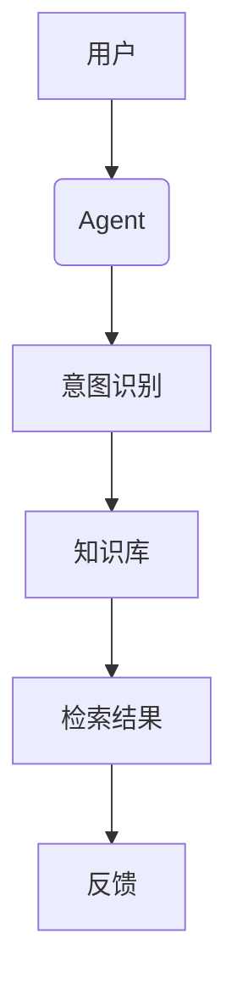
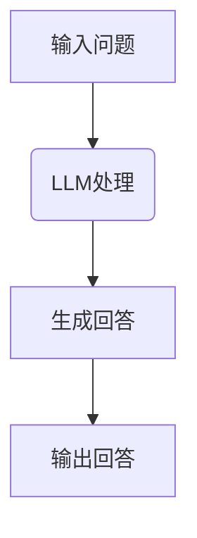
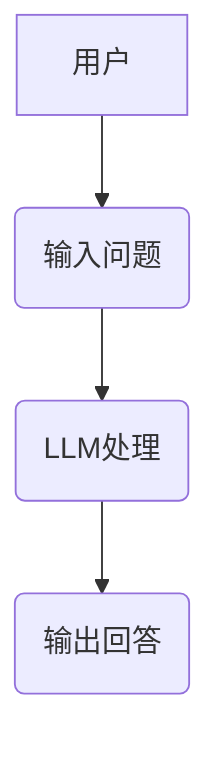
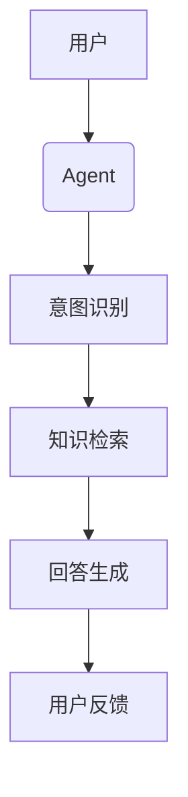

                 


# 智能问答系统AI Agent：基于LLM的精确信息检索

## 关键词：智能问答系统、AI Agent、大语言模型、信息检索、LLM、自然语言处理、对话系统

## 摘要：  
智能问答系统AI Agent是基于大语言模型（LLM）的精确信息检索技术，旨在通过自然语言处理和深度学习算法实现智能化的问答交互。本文从AI Agent的背景、核心概念、算法原理、系统架构设计、项目实战等方面展开详细分析，探讨如何构建高效、准确的智能问答系统，并通过具体案例展示其实现过程和应用价值。

---

# 第一部分: 背景与概述

## 第1章: 智能问答系统AI Agent的背景与概述

### 1.1 智能问答系统的发展背景
#### 1.1.1 从传统问答系统到智能问答系统的演进
传统问答系统基于关键词匹配和规则库，存在检索精度低、难以应对复杂语义的问题。随着大语言模型（LLM）的崛起，智能问答系统通过自然语言处理技术实现了更精准的意图识别和信息检索。

#### 1.1.2 大语言模型在智能问答系统中的应用
大语言模型（如GPT、BERT）具有强大的语义理解能力，能够通过上下文推理生成自然流畅的回答，成为智能问答系统的核心驱动力。

#### 1.1.3 智能问答系统的定义与特点
智能问答系统是一种基于自然语言处理技术的交互系统，能够理解用户的意图并提供精准的答案或解决方案。其特点包括：
- **智能化**：基于LLM实现语义理解与生成。
- **精准性**：通过上下文和意图分析提高检索精度。
- **交互性**：支持多轮对话，提供更自然的用户体验。

### 1.2 智能问答系统的核心问题
#### 1.2.1 信息检索的精确性问题
如何在大规模知识库中快速定位最相关的答案是智能问答系统的核心挑战。

#### 1.2.2 用户意图的理解与匹配
准确理解用户的深层需求是实现精准回答的关键。

#### 1.2.3 多轮对话中的上下文处理
在多轮对话中，系统需要保持上下文一致性，确保回答的连贯性和准确性。

### 1.3 AI Agent的定义与功能
#### 1.3.1 AI Agent的基本概念
AI Agent是一种智能代理系统，能够通过自然语言理解、推理和执行任务，为用户提供个性化的服务。

#### 1.3.2 AI Agent的核心功能
- **意图识别**：分析用户需求，提取关键信息。
- **知识检索**：基于LLM进行语义检索，获取相关信息。
- **对话管理**：维护上下文，实现流畅的多轮对话。
- **反馈机制**：根据用户反馈优化回答质量。

#### 1.3.3 AI Agent与传统问答系统的区别
AI Agent不仅能够回答问题，还能根据用户需求执行任务、提供个性化服务，具备更强的主动性和智能化。

### 1.4 本章小结
本章介绍了智能问答系统AI Agent的背景、核心问题和功能特点，为后续章节的深入分析奠定了基础。

---

# 第二部分: 核心概念与联系

## 第2章: 智能问答系统AI Agent的核心概念与联系

### 2.1 大语言模型的原理
#### 2.1.1 LLM的基本原理
大语言模型通过监督学习和强化学习训练，具备理解上下文、生成文本的能力。

#### 2.1.2 LLM的训练过程
1. 预处理：对大规模数据进行清洗和标注。
2. 模型训练：使用Transformer架构进行参数优化。
3. 微调：针对特定任务进行模型调整。

#### 2.1.3 LLM的应用场景
- 语义理解
- 文本生成
- 信息检索
- 对话系统

### 2.2 智能问答系统的核心要素
#### 2.2.1 用户意图识别
通过分词、实体识别和情感分析等技术，准确理解用户需求。

#### 2.2.2 上下文理解
基于历史对话记录，维护上下文信息，确保回答的连贯性。

#### 2.2.3 知识库的构建与检索
知识库是智能问答系统的核心资源，需要具备高效检索能力。

### 2.3 AI Agent的实体关系图


### 2.4 核心概念对比表
| 核心概念 | 特征描述 |
|----------|----------|
| 意图识别 | 基于自然语言理解技术，提取用户需求 |
| 上下文理解 | 维护对话历史，确保回答的连贯性 |
| 知识库 | 高效检索结构化或非结构化数据 |

### 2.5 本章小结
本章通过分析智能问答系统的核心概念，构建了实体关系图，并总结了各核心要素之间的联系。

---

# 第三部分: 算法原理

## 第3章: 基于LLM的智能问答系统算法原理

### 3.1 基础算法
#### 3.1.1 基于LLM的文本生成算法
- **输入**：用户问题
- **输出**：生成回答
- **流程**：
  1. 对问题进行分词和编码。
  2. 通过LLM生成候选答案。
  3. 根据置信度排序，选择最优回答。

#### 3.1.2 基于LLM的信息检索算法
- **输入**：用户问题
- **输出**：相关知识库结果
- **流程**：
  1. 对问题进行语义分析。
  2. 在知识库中进行相似性匹配。
  3. 返回最相关的答案。

#### 3.1.3 基于LLM的对话管理算法
- **输入**：用户问题、历史对话记录
- **输出**：生成回答
- **流程**：
  1. 维护对话上下文。
  2. 分析用户意图。
  3. 生成符合上下文的回答。

### 3.2 算法流程图


### 3.3 算法实现代码
```python
def llm_process(question, context):
    # 输入问题和上下文
    # 返回生成的回答
    pass
```

### 3.4 算法优化与调优
#### 3.4.1 知识库优化
- 使用向量索引（如FAISS）提高检索效率。
- 对知识库进行分块和压缩，减少检索时间。

#### 3.4.2 模型优化
- 对LLM进行微调，提升领域适应性。
- 使用概率模型优化回答生成过程。

### 3.5 本章小结
本章详细介绍了智能问答系统的核心算法原理，并通过流程图和代码示例展示了其实现过程。

---

## 第4章: 算法优化与调优

### 4.1 算法优化策略
#### 4.1.1 知识库优化
- 使用向量索引（如FAISS）提高检索效率。
- 对知识库进行分块和压缩，减少检索时间。

#### 4.1.2 模型优化
- 对LLM进行微调，提升领域适应性。
- 使用概率模型优化回答生成过程。

### 4.2 算法调优方法
#### 4.2.1 超参数调优
- 调整学习率、批次大小等参数，优化模型性能。

#### 4.2.2 增量学习
- 在新数据上进行增量训练，提升模型的适应性。

### 4.3 实验与结果分析
#### 4.3.1 实验设计
- 对比不同算法的性能指标（如准确率、响应时间）。

#### 4.3.2 结果分析
- 总结优化策略对系统性能的提升效果。

### 4.4 本章小结
本章通过实验分析，验证了优化策略的有效性，并总结了算法调优的关键点。

---

# 第四部分: 系统分析与架构设计

## 第5章: 智能问答系统AI Agent的系统分析与架构设计

### 5.1 系统分析
#### 5.1.1 问题场景介绍
- 用户通过自然语言提问，系统需要快速理解和回答。

#### 5.1.2 系统功能设计
- 用户输入问题。
- 系统解析问题，生成回答。
- 提供反馈机制，优化回答质量。

### 5.2 系统架构设计


### 5.3 系统接口设计
#### 5.3.1 输入接口
- 文本输入接口：接收用户问题。

#### 5.3.2 输出接口
- 文本输出接口：返回系统回答。

### 5.4 系统交互设计


### 5.5 本章小结
本章通过系统分析和架构设计，明确了智能问答系统的实现路径。

---

# 第五部分: 项目实战

## 第6章: 智能问答系统AI Agent的项目实战

### 6.1 环境安装
```bash
pip install transformers faiss-cpu
```

### 6.2 核心代码实现
```python
import transformers
import faiss

class LLMProcessor:
    def __init__(self):
        self.model = transformers.AutoModelForSeq2Seq.from_pretrained('model_name')
    
    def process(self, question, context):
        # 处理逻辑
        return answer
```

### 6.3 代码解读与分析
- **LLMProcessor类**：负责模型加载和处理。
- **process方法**：实现问题处理和回答生成。

### 6.4 实际案例分析
#### 6.4.1 案例背景
- 用户提问：“如何提高代码质量？”

#### 6.4.2 系统处理
1. **意图识别**：识别用户需求为“代码优化”。
2. **知识检索**：在知识库中匹配相关答案。
3. **回答生成**：生成详细回答并返回。

### 6.5 项目小结
本章通过实际案例展示了智能问答系统的实现过程，并总结了项目中的关键点。

---

# 第六部分: 最佳实践与总结

## 第7章: 最佳实践与总结

### 7.1 最佳实践
#### 7.1.1 知识库优化
- 定期更新知识库内容。
- 使用向量索引提升检索效率。

#### 7.1.2 模型优化
- 定期微调模型，保持领域适应性。
- 使用多模态数据丰富模型输入。

### 7.2 小结
智能问答系统AI Agent是基于大语言模型的精确信息检索技术，通过不断优化算法和系统架构，能够实现更高效、更准确的问答交互。

### 7.3 注意事项
- 确保数据安全，避免隐私泄露。
- 定期维护知识库，保持内容准确性。

### 7.4 拓展阅读
- 《Large Language Models in NLP》
- 《对话系统的设计与实现》

---

# 结语

智能问答系统AI Agent作为自然语言处理领域的前沿技术，正在深刻改变人机交互的方式。通过本文的详细分析，我们不仅了解了其核心原理和实现方法，还通过实际案例展示了其应用价值。未来，随着大语言模型的不断进步，智能问答系统将具备更强的智能性和实用性，为人类社会带来更多可能性。

