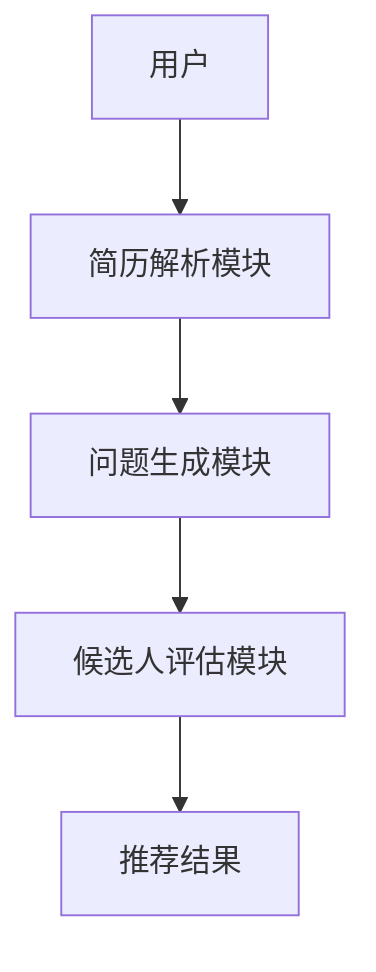

                 


# 智能面试官 AI Agent：LLM 辅助招聘流程

> **关键词**：智能面试官、LLM、人工智能、招聘流程、自然语言处理、AI辅助工具

> **摘要**：  
> 随着人工智能技术的迅速发展，大语言模型（LLM）在招聘流程中的应用日益广泛。本文探讨了如何利用LLM构建智能面试官AI Agent，以优化招聘效率、提升候选人体验，并降低企业招聘成本。通过分析LLM的工作原理、系统架构和实际应用案例，本文为读者提供了从理论到实践的全面指导。

---

## 第一部分：背景与概述

### 第1章：智能面试官与LLM的背景介绍

#### 1.1 智能面试官的定义与背景

随着企业对高效招聘的需求不断增长，传统的人工招聘方式逐渐暴露出效率低下、成本高昂等问题。招聘流程中的简历筛选、面试安排和候选人评估环节往往耗时耗力，且难以保证准确性。为了应对这一挑战，智能面试官的概念应运而生。智能面试官是一种基于人工智能技术的辅助工具，能够通过自然语言处理（NLP）技术，自动化地完成面试安排、问题生成和候选人评估等任务。

#### 1.2 LLM在招聘中的应用潜力

大语言模型（LLM）作为一种强大的自然语言处理工具，能够理解、生成和分析人类语言。在招聘流程中，LLM可以用于以下场景：

1. **简历解析**：通过自然语言处理技术，自动提取简历中的关键信息，如教育背景、工作经验和技能描述。
2. **面试问题生成**：根据岗位需求生成相关问题，帮助面试官更好地评估候选人的能力和匹配度。
3. **候选人评估**：通过分析候选人的回答，评估其语言表达能力、逻辑思维能力和岗位匹配度。

#### 1.3 本书的核心目标与结构

本书的核心目标是探讨如何利用LLM构建智能面试官AI Agent，并将其应用于招聘流程中。通过理论分析与实践案例相结合的方式，本书旨在为读者提供从技术原理到实际应用的全面指导。本书的结构安排如下：

1. 第一部分：背景与概述  
   - 介绍智能面试官和LLM的基本概念、背景和应用潜力。
2. 第二部分：核心概念与原理  
   - 深入分析智能面试官的核心功能模块和LLM的技术原理。
3. 第三部分：算法原理与技术实现  
   - 解释LLM的工作原理，并通过代码示例展示其在招聘流程中的应用。
4. 第四部分：系统架构与设计  
   - 绘制系统架构图和交互流程图，展示智能面试官的系统设计。
5. 第五部分：项目实战与案例分析  
   - 通过实际案例分析，展示如何利用LLM构建智能面试官。
6. 第六部分：最佳实践与小结  
   - 总结经验，提供小结、注意事项和拓展阅读建议。

---

## 第二部分：核心概念与原理

### 第2章：智能面试官的核心概念

#### 2.1 智能面试官的功能模块

智能面试官的功能模块主要包括以下三个部分：

1. **简历解析与分析**  
   - 通过自然语言处理技术，提取简历中的关键信息，如教育背景、工作经验和技能描述。
2. **面试问题生成与优化**  
   - 根据岗位需求生成相关问题，并优化问题的表达方式，确保问题的准确性和有效性。
3. **候选人评分与推荐**  
   - 通过分析候选人的回答，评估其语言表达能力、逻辑思维能力和岗位匹配度，并根据评分结果推荐合适的人选。

#### 2.2 LLM在智能面试官中的角色

大语言模型在智能面试官中的角色主要体现在以下几个方面：

1. **自然语言理解**  
   - LLM能够理解简历中的文本内容，并提取关键信息。
2. **文本生成**  
   - LLM可以根据岗位需求生成相关问题，并优化问题的表达方式。
3. **对话交互**  
   - LLM可以模拟面试官与候选人进行对话，评估候选人的语言表达能力和逻辑思维能力。

#### 2.3 智能面试官与传统招聘流程的对比

以下是智能面试官与传统招聘流程的对比：

| **对比维度**       | **传统招聘流程**                   | **智能面试官**                     |
|--------------------|------------------------------------|------------------------------------|
| **效率**           | 低效，人工筛选简历耗时较长          | 高效，自动筛选简历，节省时间       |
| **准确性**         | 可能存在主观偏差                   | 更客观，基于模型算法进行评估       |
| **成本**           | 成本高昂，需要大量人力资源         | 成本较低，自动化流程减少人力投入   |
| **体验**           | 候选人体验较差，等待时间较长        | 提供更好的候选人体验，减少等待时间 |

---

### 第3章：LLM的原理与技术基础

#### 3.1 大语言模型的基本原理

大语言模型的基本原理包括以下几个步骤：

1. **模型结构**  
   - LLM通常基于Transformer架构，包含编码器和解码器两部分。
2. **训练过程**  
   - 模型通过大量的语料库进行预训练，学习语言的规律和模式。
3. **推理机制**  
   - 在给定输入的情况下，模型生成输出文本。

#### 3.2 LLM在文本生成中的应用

LLM在文本生成中的应用包括以下几种：

1. **条件生成**  
   - 根据给定的条件生成文本，例如根据岗位需求生成面试问题。
2. **对话生成**  
   - 模拟对话，生成自然的对话内容，例如模拟面试官与候选人之间的对话。
3. **文本补全**  
   - 根据输入的前半部分，生成后半部分，例如自动补全候选人回答的后半部分。

#### 3.3 LLM在

---

## 第三部分：算法原理与技术实现

### 第4章：LLM的算法原理

#### 4.1 LLM的数学模型

大语言模型的核心是基于Transformer架构，其数学模型如下：

1. **编码器部分**  
   - 输入序列经过多层编码器处理，生成上下文表示。
2. **解码器部分**  
   - 解码器根据编码器生成的上下文表示，生成输出序列。

#### 4.2 LLM的训练过程

1. **预训练**  
   - 使用大规模语料库进行无监督预训练，目标是最小化预测词的概率。
2. **微调**  
   - 根据具体任务进行有监督微调，例如针对招聘任务进行微调。

#### 4.3 LLM的推理机制

1. **贪心搜索**  
   - 选择概率最高的词逐步生成输出。
2. **采样搜索**  
   - 使用蒙特卡洛采样生成多样化的输出。

---

### 第5章：LLM在招聘流程中的应用

#### 5.1 简历解析与分析

1. **简历解析**  
   - 使用自然语言处理技术，提取简历中的关键信息。
2. **简历评分**  
   - 根据岗位需求对简历进行评分，筛选出合适的候选人。

#### 5.2 面试问题生成与优化

1. **问题生成**  
   - 根据岗位需求生成相关问题。
2. **问题优化**  
   - 调整问题的表达方式，使其更符合面试场景。

#### 5.3 候选人评估与推荐

1. **候选人评估**  
   - 通过分析候选人的回答，评估其语言表达能力和逻辑思维能力。
2. **候选人推荐**  
   - 根据评估结果推荐合适的候选人。

---

## 第四部分：系统架构与设计

### 第6章：智能面试官的系统架构

#### 6.1 系统功能设计

1. **简历解析模块**  
   - 提供简历上传功能，并自动解析简历内容。
2. **问题生成模块**  
   - 根据岗位需求生成面试问题。
3. **候选人评估模块**  
   - 通过分析候选人回答，评估其能力和匹配度。

#### 6.2 系统架构图



#### 6.3 接口设计

1. **简历上传接口**  
   - 支持多种格式的简历上传。
2. **问题生成接口**  
   - 根据岗位需求生成面试问题。
3. **候选人评估接口**  
   - 通过API接收候选人回答，并返回评估结果。

---

## 第五部分：项目实战与案例分析

### 第7章：智能面试官的项目实战

#### 7.1 环境安装

1. **安装Python**  
   - 安装最新版本的Python，例如Python 3.9或更高版本。
2. **安装依赖库**  
   - 使用pip安装必要的依赖库，例如`transformers`和`torch`。

#### 7.2 核心代码实现

```python
from transformers import AutoTokenizer, AutoModelForCausalLM

model_name = "facebook/marian-large"
tokenizer = AutoTokenizer.from_pretrained(model_name)
model = AutoModelForCausalLM.from_pretrained(model_name)

def generate_question(job_description):
    inputs = tokenizer(job_description, return_tensors="np")
    outputs = model.generate(inputs.input_ids, max_length=100)
    return tokenizer.decode(outputs[0].tolist()[0])
```

#### 7.3 案例分析

1. **案例背景**  
   - 某公司招聘软件工程师，岗位需求包括编程能力和团队合作能力。
2. **问题生成**  
   - 根据岗位需求生成相关问题，例如“请描述一次你在团队中解决复杂问题的经历。”
3. **候选人评估**  
   - 分析候选人的回答，评估其语言表达能力和逻辑思维能力。

---

## 第六部分：最佳实践与小结

### 第8章：总结与展望

#### 8.1 最佳实践

1. **模型选择**  
   - 根据具体任务选择合适的模型，例如使用更大的模型提高生成效果。
2. **数据管理**  
   - 确保数据质量和多样性，避免模型偏见。
3. **用户体验优化**  
   - 提供友好的用户界面，提升用户体验。

#### 8.2 小结

通过本文的介绍，读者可以全面了解如何利用LLM构建智能面试官AI Agent，并将其应用于招聘流程中。从理论到实践，我们详细探讨了智能面试官的核心概念、算法原理、系统架构和实际应用案例。

#### 8.3 注意事项

1. **数据隐私**  
   - 确保数据的安全性和隐私性，遵守相关法律法规。
2. **模型优化**  
   - 持续优化模型性能，提升生成效果和评估准确性。
3. **技术支持**  
   - 提供技术支持，及时解决用户在使用过程中遇到的问题。

#### 8.4 拓展阅读

1. **推荐书籍**  
   - 《Deep Learning》
   - 《自然语言处理入门》
2. **推荐论文**  
   - "Attention Is All You Need"
   - "BERT: Pre-training of Deep Bidirectional Transformers for NLP"

---

以上是《智能面试官 AI Agent：LLM 辅助招聘流程》的详细目录大纲和文章内容。

