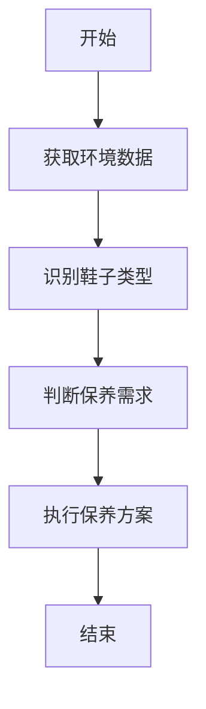
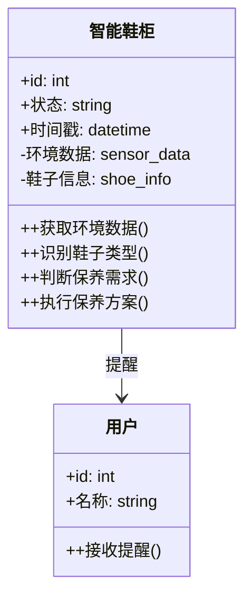
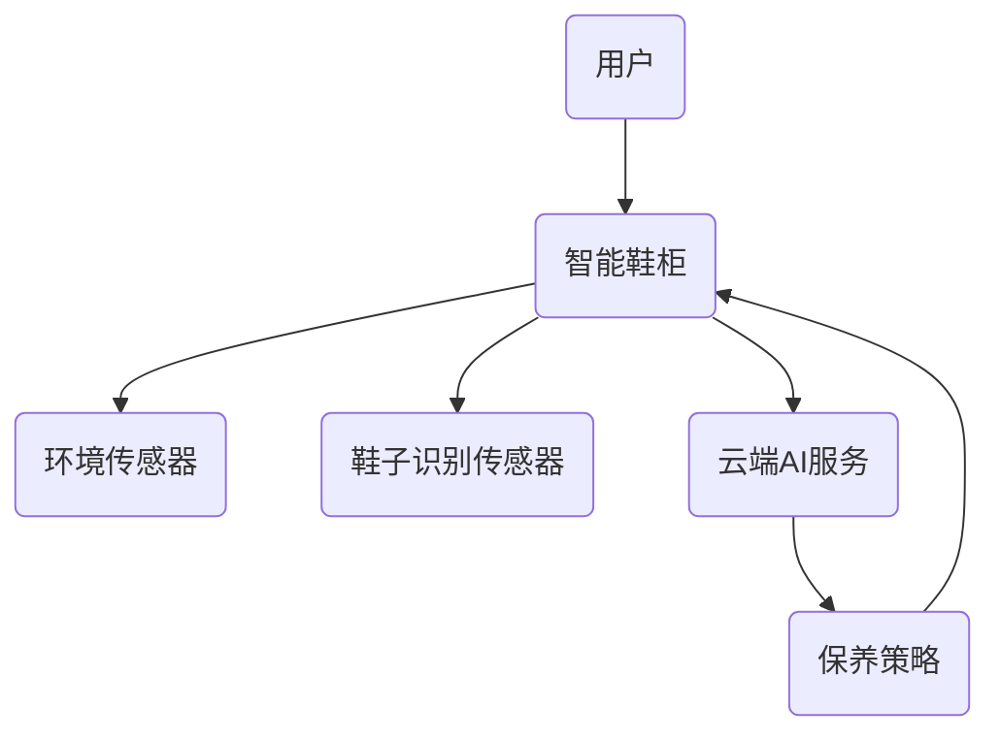
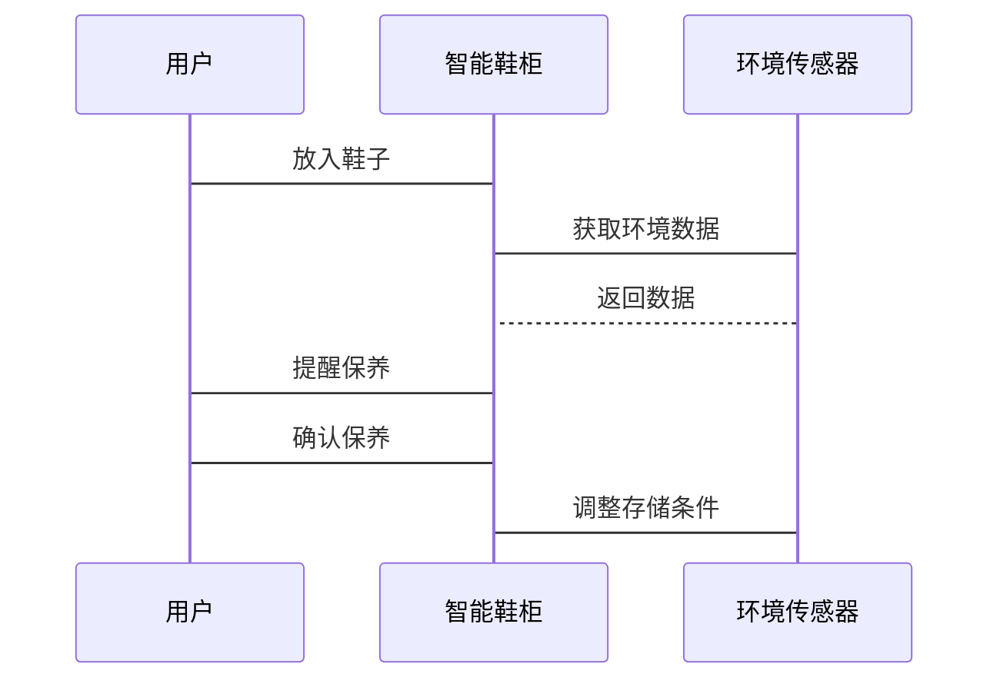

                 


# 智能鞋柜：AI Agent的鞋履保养专家

> 关键词：智能鞋柜，AI Agent，鞋履保养，物联网，智能家居，智能管理

> 摘要：本文深入探讨智能鞋柜在鞋履保养领域的应用，结合AI Agent技术，分析其工作原理、系统架构及实际案例，展示智能化管理的优势。

---

## 第一章：智能鞋柜的背景与问题背景

### 1.1 问题背景

#### 1.1.1 鞋履保养的痛点
- 鞋子种类繁多，保养方式多样，传统管理方式效率低下。
- 用户对鞋子保养需求多样化，缺乏智能化解决方案。

#### 1.1.2 智能化管理的需求
- 随着智能家居的发展，用户期望鞋柜具备智能化管理功能。
- 提高生活品质，节省时间，降低保养成本。

#### 1.1.3 AI Agent在鞋履保养中的应用潜力
- AI Agent能根据用户习惯推荐保养方案，提升用户体验。
- 实现鞋柜与智能家居的联动，推动智能化家居发展。

### 1.2 问题描述

#### 1.2.1 鞋履保养的复杂性
- 不同材质、品牌和类型的鞋子保养方法各异。
- 传统方法依赖人工经验，效率低且易出错。

#### 1.2.2 用户需求的多样性
- 用户对保养频率、方法和提醒的需求差异大。
- 需要个性化解决方案，满足不同用户需求。

#### 1.2.3 现有解决方案的局限性
- 传统鞋柜功能单一，无法智能化管理。
- 手动记录和提醒方式效率低，用户体验差。

### 1.3 问题解决

#### 1.3.1 AI Agent的核心作用
- 自动识别鞋子类型，推荐保养方案。
- 监测环境数据，自动调整存储条件。

#### 1.3.2 智能鞋柜的功能定位
- 自动识别鞋子信息，分类存储。
- 智能提醒保养时间，远程控制保养模式。

#### 1.3.3 技术实现的可行性分析
- 结合AI图像识别和传感器技术，实现智能化管理。
- 通过物联网技术，与智能家居系统联动。

### 1.4 边界与外延

#### 1.4.1 智能鞋柜的功能边界
- 仅限于鞋子的存储和保养管理，不涉及衣物或其他物品。
- 支持鞋子类型识别和保养提醒，不扩展至其他功能。

#### 1.4.2 与相关系统（如智能家居）的交互边界
- 通过物联网协议与智能家居联动，如环境监测和灯光控制。
- 数据传输和交互遵循API规范，确保数据安全。

#### 1.4.3 服务的扩展可能性
- 扩展至更多家居设备，如空调和加湿器，实现更智能的环境控制。
- 引入更多AI功能，如自动购买保养产品和健康监测。

### 1.5 核心要素组成

#### 1.5.1 AI Agent的构成要素
- 感知模块：图像识别和环境传感器。
- 决策模块：基于数据的保养策略。
- 执行模块：自动控制存储条件。

#### 1.5.2 智能鞋柜的硬件组成
- 鞋子识别传感器：RFID和图像传感器。
- 环境传感器：温湿度和空气质量传感器。
- 存储模块：智能分类存储系统。

#### 1.5.3 系统的交互流程
1. 用户放入鞋子，系统自动识别类型。
2. 根据鞋子信息和环境数据，AI Agent制定保养方案。
3. 用户通过手机APP接收提醒，手动或自动执行保养。

---

## 第二章：AI Agent与智能鞋柜的核心概念

### 2.1 核心概念原理

#### 2.1.1 AI Agent的基本原理
- AI Agent通过感知环境数据，执行任务。
- 包括感知、决策和执行三个阶段。

#### 2.1.2 智能鞋柜的系统架构
- 由硬件设备和AI算法组成，实现智能化管理。

#### 2.1.3 AI Agent在鞋履保养中的具体应用
- 自动识别鞋子类型，推荐保养方案。
- 监测存储环境，自动调整条件。

### 2.2 核心概念属性对比

| 属性 | AI Agent | 智能鞋柜 |
|------|----------|----------|
| 功能 | 执行任务 | 存储与保养 |
| 输入 | 环境数据 | 鞋子信息 |
| 输出 | 保养策略 | 存储指令 |

### 2.3 ER实体关系图

```mermaid
er
    entity 智能鞋柜 {
        id
        状态
        时间戳
    }
    entity 鞋履 {
        id
        类型
        品牌
    }
    entity 用户 {
        id
        名称
    }
    智能鞋柜 --> 鞋履: 存储
    智能鞋柜 --> 用户: 提醒
```

---

## 第三章：算法原理讲解

### 3.1 算法流程



### 3.2 数学模型

#### 3.2.1 概率模型
- 使用朴素贝叶斯算法识别鞋子类型，概率公式：
  $$ P(\text{类型}|特征) = \frac{P(\text{特征}|\text{类型}) \cdot P(\text{类型})}{P(\text{特征})} $$

#### 3.2.2 推荐算法
- 使用协同过滤算法推荐保养方案，公式：
  $$ \hat{r}_{u,i} = \bar{r} + r_u + r_i + \sum_{j \in N(u)} w_{u,j} (r_j,i - \bar{r}_j) $$

---

## 第四章：系统分析与架构设计方案

### 4.1 系统功能设计

#### 4.1.1 领域模型



### 4.2 系统架构设计



### 4.3 系统接口设计

#### 4.3.1 接口定义
- 用户通过APP发送指令到智能鞋柜。
- 鞋柜与传感器通过蓝牙/WiFi通信。
- 云端AI服务通过API返回保养策略。

#### 4.3.2 交互流程



---

## 第五章：项目实战

### 5.1 环境安装

#### 5.1.1 硬件安装
- 安装智能鞋柜和传感器。
- 配置物联网设备连接。

#### 5.1.2 软件安装
- 安装Python环境和相关库。
- 配置云端AI服务接口。

### 5.2 核心代码实现

#### 5.2.1 鞋子识别模块

```python
import cv2

def recognize_shoe(image):
    # 使用OpenCV进行图像处理
    gray = cv2.cvtColor(image, cv2.COLOR_BGR2GRAY)
    # 使用预训练模型进行识别
    result = model.predict(gray)
    return result
```

#### 5.2.2 保养策略生成模块

```python
from sklearn.naive_bayes import GaussianNB

def generate_plan(shoe_type, environment):
    # 使用机器学习模型生成保养策略
    model = GaussianNB()
    model.fit(X_train, y_train)
    prediction = model.predict([[shoe_type, environment]])
    return prediction
```

### 5.3 功能解读与案例分析

#### 5.3.1 功能解读
- 鞋子识别：通过图像识别确定鞋子类型。
- 环境监测：实时监测存储环境数据。
- 保养提醒：根据数据生成提醒和方案。

#### 5.3.2 实际案例分析
- 用户A的运动鞋因环境潮湿，系统自动启动除湿功能。
- 用户B的皮鞋需要定期上油，系统自动提醒。

---

## 第六章：总结与展望

### 6.1 最佳实践 tips
- 定期校准传感器，确保数据准确性。
- 及时更新AI模型，提升识别准确率。
- 定期检查系统，确保硬件正常运行。

### 6.2 小结
智能鞋柜结合AI Agent，实现了鞋履保养的智能化管理，提升了用户体验。

### 6.3 注意事项
- 避免高温和潮湿环境，防止硬件损坏。
- 定期清理传感器，确保数据采集准确。

### 6.4 拓展阅读
- 探讨AI在智能家居中的更多应用。
- 研究更先进的鞋履保养技术。

---

以上是《智能鞋柜：AI Agent的鞋履保养专家》的完整目录和内容框架，涵盖了从背景到技术实现，再到项目实战的各个方面，确保读者能够全面理解智能鞋柜的工作原理和实际应用。

