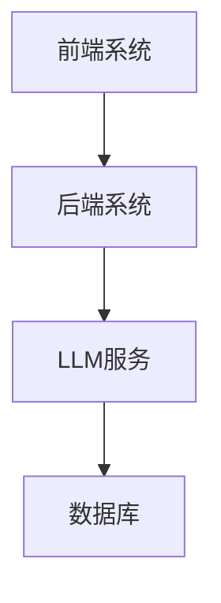
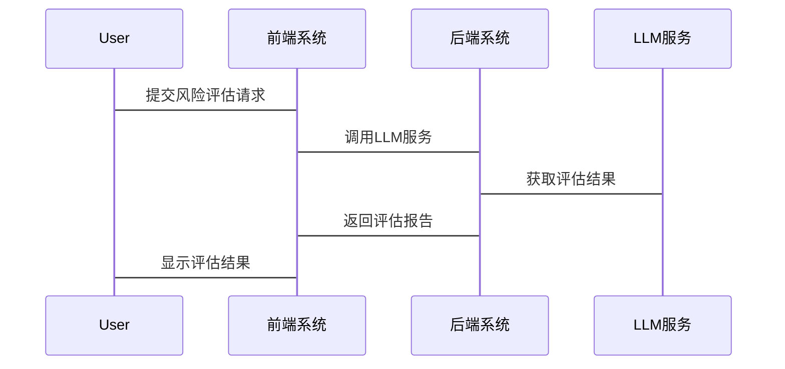

                 


# 智能风险评估 AI Agent：LLM 在保险行业中的应用

**关键词**：智能风险评估、AI Agent、LLM、保险行业、大数据分析、人工智能

**摘要**：本文探讨了智能风险评估AI Agent在保险行业中的应用，重点分析了大语言模型（LLM）如何通过自然语言处理和机器学习技术提升风险评估的效率和准确性。文章从背景介绍、核心概念、算法原理、系统设计、项目实战到总结与展望，详细阐述了LLM在保险行业中的应用场景、技术实现和未来发展方向，为保险行业的智能化转型提供了理论支持和实践指导。

---

# 第一部分：智能风险评估与AI Agent的背景介绍

## 第1章：问题背景与核心概念

### 1.1 智能风险评估的定义与问题背景

#### 1.1.1 风险评估的传统方法与局限性
传统风险评估主要依赖于人工分析和统计模型，存在以下局限性：
- 数据量有限，难以覆盖复杂场景。
- 人工分析耗时且易出错。
- 统计模型对非结构化数据处理能力较弱。

#### 1.1.2 智能化风险评估的需求与优势
随着保险行业的数字化转型，智能化风险评估的需求日益增长：
- 提高评估效率和准确性。
- 实现全自动化流程，降低人工成本。
- 能够处理非结构化数据，发现潜在风险。

#### 1.1.3 保险行业中的风险评估挑战
保险行业的风险评估面临以下挑战：
- 数据多样性与复杂性。
- 风险因素的动态变化。
- 如何高效整合多源数据。

### 1.2 AI Agent与LLM的核心概念

#### 1.2.1 AI Agent的基本定义与功能
AI Agent是一种智能体，能够在特定环境中感知、决策和执行任务。其核心功能包括：
- 数据采集与处理。
- 信息分析与推理。
- 决策与反馈。

#### 1.2.2 大语言模型（LLM）的基本原理
大语言模型通过大规模数据训练，能够理解上下文并生成自然语言文本。其特点包括：
- 基于深度学习的模型结构。
- 强大的上下文理解和生成能力。
- 可应用于多种NLP任务，如分类、摘要、问答等。

#### 1.2.3 LLM在保险行业的应用潜力
LLM在保险行业中的潜在应用包括：
- 自动生成风险评估报告。
- 智能客服与咨询。
- 保险条款解析与合规性检查。

### 1.3 保险行业的智能化转型

#### 1.3.1 保险行业的数字化趋势
保险行业正逐步从传统模式向数字化、智能化转型，主要体现在：
- 在线投保与理赔流程的自动化。
- 数据驱动的业务决策。
- 智能化客户服务。

#### 1.3.2 AI技术在保险业务中的应用场景
AI技术在保险行业中的应用场景包括：
- 风险评估与定价。
- 保险欺诈检测。
- 客户行为预测。

#### 1.3.3 智能风险评估的行业价值
智能风险评估能够显著提升保险行业的核心竞争力，具体体现在：
- 提高风险评估的准确性。
- 降低运营成本。
- 提升客户体验。

### 1.4 本章小结
本章介绍了智能风险评估的背景、AI Agent和LLM的核心概念，以及保险行业智能化转型的趋势和价值。

---

## 第2章：智能风险评估的核心要素

### 2.1 风险评估的流程与关键环节

#### 2.1.1 风险识别与数据采集
风险识别是风险评估的第一步，主要通过以下方式完成：
- 数据采集：包括结构化数据（如历史索赔数据）和非结构化数据（如文本描述）。
- 数据清洗：对采集的数据进行去噪和标准化处理。

#### 2.1.2 风险分析与模型构建
风险分析是基于采集的数据，构建风险评估模型。常用的模型包括：
- 统计模型：如逻辑回归、决策树。
- 机器学习模型：如支持向量机、随机森林。
- 深度学习模型：如神经网络。

#### 2.1.3 风险评估结果的输出与应用
风险评估结果的应用包括：
- 保险定价：根据风险等级调整保费。
- 风险管理：识别高风险客户并制定风险 mitigation策略。

### 2.2 AI Agent在风险评估中的角色

#### 2.2.1 AI Agent作为风险评估工具的定位
AI Agent在风险评估中主要作为辅助工具，帮助保险从业者快速分析数据、生成报告。

#### 2.2.2 LLM在风险评估中的具体应用
LLM在风险评估中的具体应用包括：
- 自动分析客户提供的文本信息，提取关键风险因素。
- 生成风险评估报告。
- 提供风险缓解建议。

#### 2.2.3 AI Agent与传统风险评估方法的对比
AI Agent与传统风险评估方法的对比如下：

| 对比维度         | AI Agent（LLM驱动）       | 传统方法                 |
|------------------|--------------------------|--------------------------|
| 数据处理能力     | 强大的非结构化数据处理能力 | 依赖结构化数据           |
| 处理效率         | 高效，自动化完成         | 低效，依赖人工分析         |
| 准确性           | 高，基于大数据训练       | 中等，受模型假设限制       |
| 适用场景         | 复杂、多样化的场景       | 简单、标准化的场景         |

### 2.3 智能风险评估的核心算法与模型

#### 2.3.1 传统风险评估算法简介
传统的风险评估算法包括：
- 逻辑回归：用于分类问题。
- 决策树：用于分类和回归问题。
- 支持向量机：适用于高维数据分类。

#### 2.3.2 基于LLM的风险评估模型
基于LLM的风险评估模型通过自然语言处理技术，将文本数据转化为可分析的特征，并结合传统机器学习模型进行评估。

#### 2.3.3 混合模型的优势与挑战
混合模型的优势在于结合了LLM的文本处理能力和传统模型的稳定性，但同时也面临模型复杂性和计算成本的挑战。

### 2.4 本章小结
本章详细阐述了风险评估的核心要素，对比了AI Agent与传统方法的应用，分析了基于LLM的风险评估模型的优势与挑战。

---

## 第3章：LLM的基本原理与训练过程

### 3.1 大语言模型的基本原理

#### 3.1.1 LLM的模型结构与训练方法
大语言模型通常基于Transformer架构，通过自注意力机制和前馈网络进行训练。

#### 3.1.2 模型的输入与输出机制
LLM的输入是文本序列，输出是概率分布的词序列。

#### 3.1.3 模型的可解释性与局限性
尽管LLM在生成文本方面表现出色，但其可解释性较差，且在特定领域的小样本数据上表现不稳定。

### 3.2 LLM在保险行业的训练与优化

#### 3.2.1 保险领域数据的预处理与标注
保险数据的预处理包括清洗、去重和标注，标注数据用于模型微调。

#### 3.2.2 领域特定模型的微调与优化
通过在保险领域数据上进行微调，可以提升模型在特定任务上的表现。

#### 3.2.3 模型性能的评估与改进
模型性能可以通过准确率、召回率和F1分数等指标进行评估，并通过参数调整和数据增强进行优化。

### 3.3 LLM在风险评估中的应用流程

#### 3.3.1 数据输入与特征提取
将客户提供的文本信息输入模型，提取关键特征。

#### 3.3.2 模型推理与结果生成
模型通过推理生成风险评估结果，并输出报告。

### 3.4 本章小结
本章介绍了LLM的基本原理和训练过程，并分析了其在保险行业中的应用流程。

---

## 第4章：系统分析与架构设计方案

### 4.1 问题场景介绍

#### 4.1.1 保险行业中的风险评估场景
以车险理赔为例，保险公司需要评估客户的理赔风险。

### 4.1.2 系统功能设计
系统功能包括数据采集、模型训练、风险评估和报告生成。

### 4.2 系统架构设计

#### 4.2.1 系统架构图


#### 4.2.2 系统接口设计
- 前端接口：接收用户输入，调用后端服务。
- 后端接口：与LLM服务交互，获取评估结果。

#### 4.2.3 系统交互图


### 4.3 本章小结
本章通过系统架构设计和交互图，展示了智能风险评估AI Agent的整体框架。

---

## 第5章：项目实战

### 5.1 环境安装

#### 5.1.1 安装Python环境
使用Anaconda安装Python 3.8及以上版本。

#### 5.1.2 安装LLM框架
安装Hugging Face的Transformers库：
```bash
pip install transformers
```

### 5.2 系统核心实现源代码

#### 5.2.1 数据预处理代码
```python
import pandas as pd

def preprocess_data(data_file):
    df = pd.read_csv(data_file)
    df.dropna(inplace=True)
    return df
```

#### 5.2.2 模型微调代码
```python
from transformers import AutoModelForMaskedLM, AutoTokenizer

model_name = "bert-base-uncased"
model = AutoModelForMaskedLM.from_pretrained(model_name)
tokenizer = AutoTokenizer.from_pretrained(model_name)
```

#### 5.2.3 风险评估代码
```python
def risk_assessment(text):
    inputs = tokenizer.encode_plus(text, max_length=512, truncation=True, return_tensors="pt")
    outputs = model(**inputs)
    # 处理输出结果并生成报告
    return report
```

### 5.3 实际案例分析与详细讲解

#### 5.3.1 案例分析
以车险理赔为例，分析客户提供的理赔记录和事故描述，生成风险评估报告。

#### 5.3.2 案例结果与讨论
通过LLM生成的报告，保险公司可以快速识别高风险客户并制定相应的风险管理策略。

### 5.4 本章小结
本章通过实际案例展示了智能风险评估AI Agent的实现过程和应用效果。

---

## 第6章：总结与展望

### 6.1 本章总结
本文详细介绍了智能风险评估AI Agent在保险行业中的应用，分析了LLM的核心原理和系统架构设计，并通过实际案例展示了其应用价值。

### 6.2 未来发展方向
未来，智能风险评估AI Agent的发展方向包括：
- 提升模型的实时性和可解释性。
- 拓展更多保险业务场景的应用。
- 结合边缘计算，实现本地化部署。

### 6.3 最佳实践 tips
- 在实际应用中，建议结合领域知识对模型进行微调。
- 注意数据隐私和模型安全问题。

### 6.4 本章小结
本文为保险行业的智能化转型提供了理论支持和实践指导，未来仍有很大的发展空间。

---

## 附录

### 附录A：相关术语解释
- 大语言模型（LLM）：基于Transformer架构的大规模预训练模型。
- AI Agent：智能体，能够在环境中感知、决策和执行任务。

### 附录B：代码库与工具
- Hugging Face Transformers：用于LLM的训练和推理。
- Mermaid：用于绘制图表的工具。

### 附录C：参考文献
- 提供相关文献和资料的引用。

---

通过以上结构和内容，本文系统地阐述了智能风险评估AI Agent在保险行业中的应用，为相关领域的研究和实践提供了参考。

