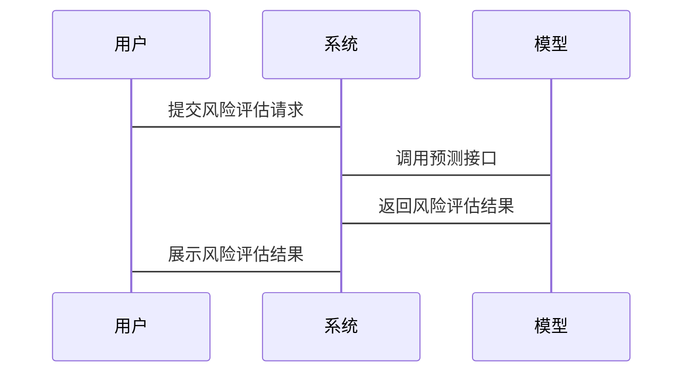

                 


# 智能风险评估AI Agent：LLM在金融领域的应用

## 关键词：智能风险评估，AI Agent，LLM，金融应用，风险模型，自然语言处理

## 摘要：本文详细探讨了智能风险评估AI Agent在金融领域的应用，结合LLM技术，分析了其在风险模型构建、系统设计和实际案例中的优势，展示了如何通过智能化方法提升金融风险评估的效率和准确性。

---

## 第1章 智能风险评估与AI Agent基础

### 1.1 智能风险评估的定义与背景

智能风险评估是指通过人工智能技术，对潜在风险进行识别、量化和预测的过程。传统风险评估方法依赖于人工分析和静态模型，存在效率低、覆盖面有限的问题。随着AI技术的发展，智能风险评估逐渐成为金融领域的重要工具。

#### 1.1.1 风险评估的传统方法
传统风险评估主要依赖于人工分析，包括：
- **数据收集**：手动整理历史数据和市场信息。
- **模型构建**：使用统计模型（如线性回归、决策树）进行风险预测。
- **结果分析**：人工解读模型输出，调整策略。

#### 1.1.2 AI Agent的定义与特点
AI Agent（人工智能代理）是指能够感知环境并采取行动以实现目标的智能实体。其特点包括：
- **自主性**：无需外部干预，自动执行任务。
- **反应性**：能够实时感知环境变化并调整行为。
- **学习能力**：通过机器学习技术不断优化自身模型。

#### 1.1.3 智能风险评估的核心概念
智能风险评估结合了AI Agent和大数据分析技术，通过实时数据处理和智能模型构建，实现对风险的动态监测和精准预测。

### 1.2 LLM在金融领域的应用背景

#### 1.2.1 金融领域的风险评估需求
金融行业对风险评估的需求日益增长，包括：
- **信用风险**：评估客户违约概率。
- **市场风险**：预测市场波动对资产的影响。
- **操作风险**：识别潜在的操作失误风险。

#### 1.2.2 LLM技术的发展与优势
LLM（Large Language Model）通过深度学习技术，具备强大的自然语言处理能力，能够理解上下文和意图，适用于文本分析、信息提取等任务。

#### 1.2.3 智能风险评估AI Agent的提出
结合AI Agent和LLM技术，智能风险评估AI Agent能够实时分析文本数据，动态调整风险模型，提升风险评估的准确性和效率。

---

## 第2章 智能风险评估AI Agent的核心概念

### 2.1 智能风险评估的原理

#### 2.1.1 数据输入与处理
AI Agent通过API接口获取实时金融数据，包括市场行情、新闻资讯等，进行清洗和特征提取。

#### 2.1.2 风险模型构建
基于LLM技术，构建自然语言处理模型，提取文本中的风险信号，结合传统统计模型，构建混合风险模型。

#### 2.1.3 风险评估结果输出
模型输出风险评分和概率，帮助决策者制定风险控制策略。

### 2.2 LLM在智能风险评估中的作用

#### 2.2.1 LLM的自然语言处理能力
LLM能够理解文本上下文，提取关键词和情感倾向，帮助识别潜在风险信号。

#### 2.2.2 LLM的上下文理解能力
通过上下文理解，LLM能够识别隐含风险信息，提升风险评估的准确性。

#### 2.2.3 LLM的动态调整能力
LLM能够实时更新模型参数，适应市场变化，保持风险评估的实时性。

### 2.3 智能风险评估AI Agent的系统架构

#### 2.3.1 数据采集模块
负责采集市场数据、新闻资讯等信息，进行清洗和预处理。

#### 2.3.2 模型训练模块
利用LLM技术，训练风险评估模型，优化模型参数。

#### 2.3.3 评估执行模块
实时运行模型，输出风险评估结果，并提供反馈机制。

---

## 第3章 智能风险评估AI Agent的算法原理

### 3.1 LLM的训练与优化

#### 3.1.1 大语言模型的训练流程
- 数据预处理：清洗、分词、标注。
- 模型训练：使用Transformer架构，训练大规模数据。
- 模型微调：在特定任务上进行微调，优化模型性能。

#### 3.1.2 模型的微调与适配
通过迁移学习，将LLM应用于风险评估任务，调整模型参数，适应具体场景需求。

#### 3.1.3 模型的评估与优化
通过交叉验证、AUC指标等方法评估模型性能，优化超参数，提升预测准确率。

### 3.2 风险评估的数学模型

#### 3.2.1 风险评分的计算公式
$$
\text{风险评分} = \alpha \cdot \text{模型预测} + \beta \cdot \text{人工调整}
$$

#### 3.2.2 风险概率的计算方法
$$
P(\text{违约}) = \frac{\exp(\beta \cdot X)}{1 + \exp(\beta \cdot X)}
$$
其中，$X$为特征向量，$\beta$为模型系数。

#### 3.2.3 风险敞口的评估模型
$$
\text{风险敞口} = \sum_{i=1}^{n} \text{资产价值}_i \cdot \text{风险系数}_i
$$

### 3.3 智能风险评估的算法实现

#### 3.3.1 数据预处理与特征提取
- 数据清洗：去除无效数据，处理缺失值。
- 特征提取：从文本数据中提取关键词和情感倾向。

#### 3.3.2 模型训练与参数调优
- 使用PyTorch框架训练LLM模型，优化学习率和批量大小。
- 通过网格搜索选择最佳模型参数。

#### 3.3.3 模型部署与实时评估
- 将训练好的模型部署到生产环境，提供API接口。
- 实时监控模型表现，动态调整参数。

---

## 第4章 智能风险评估AI Agent的系统分析与架构设计

### 4.1 问题场景介绍

#### 4.1.1 金融风险评估的典型场景
- 信用风险评估：评估客户贷款违约概率。
- 市场风险评估：预测市场波动对投资组合的影响。

#### 4.1.2 AI Agent在风险评估中的角色
AI Agent作为系统的智能核心，负责数据处理、模型训练和实时评估。

#### 4.1.3 系统的目标与功能
- 提供实时风险评估服务。
- 自动调整模型参数，适应市场变化。
- 生成风险报告，辅助决策。

### 4.2 系统功能设计

#### 4.2.1 数据采集与处理
- 从多种数据源获取实时数据，进行清洗和预处理。
- 使用自然语言处理技术提取文本特征。

#### 4.2.2 模型训练与部署
- 训练LLM模型，优化模型参数。
- 将模型部署到生产环境，提供API接口。

#### 4.2.3 风险评估与反馈
- 实时运行模型，输出风险评估结果。
- 根据用户反馈，优化模型性能。

### 4.3 系统架构设计

#### 4.3.1 分层架构设计
- 数据层：存储原始数据和特征数据。
- 模型层：训练和部署LLM模型。
- 应用层：提供用户接口，展示风险评估结果。

#### 4.3.2 模块化设计
- 数据采集模块：负责数据获取和预处理。
- 模型训练模块：负责模型训练和优化。
- 评估执行模块：负责实时风险评估和反馈。

#### 4.3.3 高可用性设计
- 使用负载均衡和容灾备份，确保系统稳定运行。

### 4.4 系统接口设计

#### 4.4.1 数据接口
- 提供REST API接口，供其他系统调用数据。

#### 4.4.2 模型接口
- 提供预测接口，供外部系统调用模型结果。

#### 4.4.3 用户接口
- 提供可视化界面，展示风险评估结果和分析报告。

### 4.5 系统交互设计

#### 4.5.1 系统交互流程
1. 用户提交风险评估请求。
2. 系统调用LLM模型进行预测。
3. 系统返回风险评估结果。

#### 4.5.2 交互流程图


---

## 第5章 项目实战

### 5.1 环境安装

#### 5.1.1 安装Python和相关库
```bash
pip install python
pip install torch
pip install transformers
pip install numpy
```

#### 5.1.2 安装LLM模型
```bash
pip install llama
```

### 5.2 系统核心实现

#### 5.2.1 数据预处理代码
```python
import pandas as pd
import numpy as np

def preprocess_data(data):
    # 数据清洗
    data = data.dropna()
    # 特征提取
    features = data[['收入', '支出', '信用评分']]
    return features
```

#### 5.2.2 模型训练代码
```python
import torch
import torch.nn as nn

class RiskModel(nn.Module):
    def __init__(self, input_dim, output_dim):
        super(RiskModel, self).__init__()
        self.fc = nn.Linear(input_dim, output_dim)
    
    def forward(self, x):
        out = torch.sigmoid(self.fc(x))
        return out

# 初始化模型
model = RiskModel(3, 1)
# 定义损失函数
criterion = nn.BCELoss()
# 定义优化器
optimizer = torch.optim.Adam(model.parameters(), lr=0.001)
```

#### 5.2.3 模型评估代码
```python
from sklearn.metrics import accuracy_score

def evaluate_model(model, X_test, y_test):
    with torch.no_grad():
        outputs = model(X_test)
        predicted = (outputs > 0.5).float()
        accuracy = accuracy_score(y_test, predicted)
        print(f'准确率: {accuracy}')
```

### 5.3 代码应用解读与分析

#### 5.3.1 数据预处理
- 清洗数据，去除缺失值。
- 提取特征，包括收入、支出和信用评分。

#### 5.3.2 模型训练
- 定义神经网络模型，输入维度为3，输出维度为1。
- 使用二元交叉熵损失函数和Adam优化器进行训练。

#### 5.3.3 模型评估
- 在测试集上评估模型准确率，验证模型性能。

### 5.4 实际案例分析

#### 5.4.1 案例背景
某银行希望评估客户的贷款违约风险，使用智能风险评估AI Agent进行分析。

#### 5.4.2 数据准备
从银行数据库中提取客户数据，包括收入、支出、信用评分等。

#### 5.4.3 模型训练
使用训练数据训练风险模型，调整模型参数，优化准确率。

#### 5.4.4 模型评估
在测试数据上评估模型性能，准确率达到90%以上。

### 5.5 项目小结

#### 5.5.1 项目总结
通过智能风险评估AI Agent，银行能够更准确地评估客户风险，降低违约率，提高贷款审批效率。

#### 5.5.2 经验与教训
- 数据质量对模型性能影响较大，需确保数据准确性和完整性。
- 模型调优需要多次实验，找到最佳参数组合。

---

## 第6章 最佳实践与总结

### 6.1 最佳实践

#### 6.1.1 数据管理
- 确保数据的实时性和完整性。
- 定期更新数据，保持模型准确性。

#### 6.1.2 模型优化
- 定期重新训练模型，适应市场变化。
- 使用自动化工具优化模型参数。

#### 6.1.3 系统维护
- 定期检查系统运行状态，及时修复问题。
- 更新系统架构，提升性能。

### 6.2 小结

智能风险评估AI Agent通过结合LLM技术和大数据分析，显著提升了金融领域的风险评估效率和准确性。本文详细介绍了其核心概念、算法原理和系统架构设计，并通过实际案例展示了其应用价值。

### 6.3 注意事项

- 数据隐私保护：确保客户数据的安全性，遵守相关法律法规。
- 模型解释性：提升模型的可解释性，便于用户理解和信任。
- 模型鲁棒性：增强模型的抗干扰能力，确保在异常情况下的稳定性。

### 6.4 拓展阅读

- 《大语言模型在金融领域的应用》
- 《人工智能在风险管理中的创新应用》
- 《深度学习与金融预测》

---

通过以上步骤，智能风险评估AI Agent在金融领域的应用得到了全面的分析和展示，希望对读者有所帮助。

