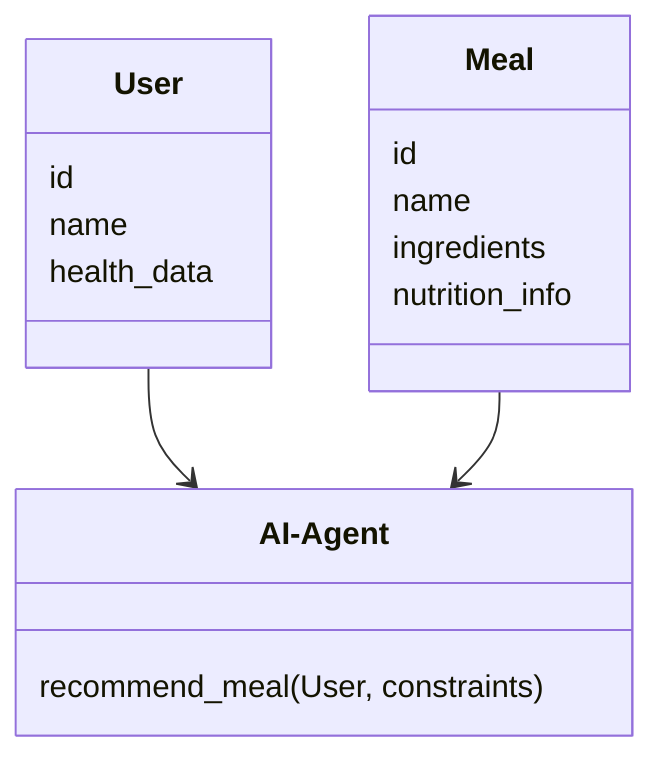
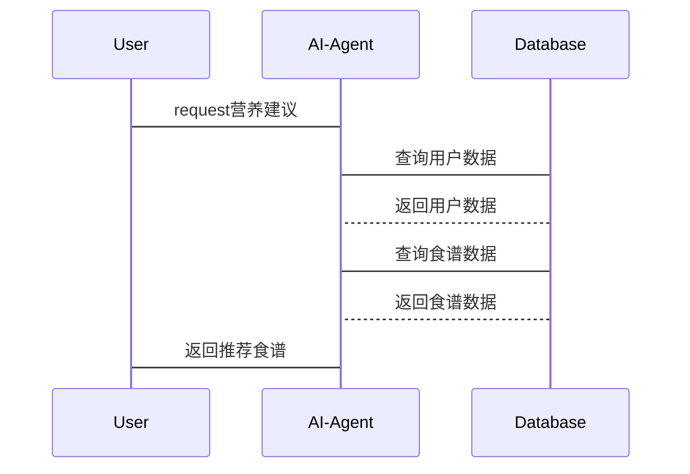

                 


# 智能餐桌：AI Agent的营养均衡建议

> 关键词：智能餐桌，AI Agent，营养均衡，推荐算法，自然语言处理，系统架构，健康饮食

> 摘要：随着人工智能技术的快速发展，智能餐桌逐渐成为现代生活中不可或缺的一部分。本文将深入探讨AI Agent在营养均衡建议中的应用，从技术原理到系统设计，再到实际案例分析，全面解析智能餐桌如何通过AI技术为用户提供个性化的营养均衡建议。文章将涵盖AI Agent的核心技术、营养均衡的数学模型、系统架构设计、项目实战以及最佳实践等方面，为读者提供全面的技术解读和实践指导。

---

## 第1章: 智能餐桌的概念与背景

### 1.1 智能餐桌的定义与核心概念

#### 1.1.1 智能餐桌的定义
智能餐桌是一种结合了人工智能技术的餐桌系统，能够通过AI Agent实时分析用户的饮食习惯、营养需求和健康状况，提供个性化的营养均衡建议。它不仅仅是一个餐桌，更是一个智能化的健康助手。

#### 1.1.2 AI Agent的基本原理
AI Agent（智能代理）是一种能够感知环境、执行任务并做出决策的智能实体。在智能餐桌中，AI Agent通过自然语言处理、推荐算法和营养均衡模型，为用户提供饮食建议。

#### 1.1.3 营养均衡的核心概念与目标
营养均衡是指通过合理的饮食搭配，满足人体所需的各类营养素，避免营养过剩或不足。目标是帮助用户在日常饮食中实现营养均衡，促进健康。

---

### 1.2 智能餐桌的应用场景

#### 1.2.1 家庭餐桌场景
在家庭中，智能餐桌可以帮助用户规划每日餐谱，推荐健康食谱，帮助家庭成员实现营养均衡。

#### 1.2.2 餐厅与外卖场景
在餐厅或外卖平台，智能餐桌可以为用户推荐符合营养均衡的菜品，避免高热量、高脂肪的摄入。

#### 1.2.3 营养健康管理场景
通过智能餐桌，用户可以长期跟踪自己的饮食习惯，AI Agent会根据健康数据调整建议，帮助用户实现健康管理。

---

### 1.3 智能餐桌的发展趋势

#### 1.3.1 AI技术在饮食领域的应用现状
目前，AI技术已经在饮食推荐、健康管理等领域得到了广泛应用，但仍有很大的提升空间。

#### 1.3.2 营养均衡建议的未来发展方向
未来，智能餐桌将更加智能化，能够实时监测用户的健康数据，动态调整饮食建议。

#### 1.3.3 用户需求与技术结合的潜力
随着人们对健康的关注日益增加，智能餐桌的市场需求将快速增长，AI技术与用户需求的结合将推动行业的发展。

---

## 第2章: AI Agent的核心技术

### 2.1 自然语言处理技术

#### 2.1.1 NLP的基本原理
自然语言处理（NLP）是AI Agent与用户交互的基础。通过NLP技术，AI Agent能够理解用户的饮食需求和偏好。

#### 2.1.2 餐饮场景中的NLP应用
在智能餐桌中，NLP技术用于解析用户的饮食需求，例如“我今天想吃清淡的”或“推荐低脂高蛋白的菜品”。

#### 2.1.3 对话系统的设计与实现
智能餐桌的对话系统需要设计高效的交互流程，确保用户体验流畅。

---

### 2.2 推荐算法

#### 2.2.1 基于协同过滤的推荐算法
协同过滤是一种经典的推荐算法，通过分析用户的饮食偏好和行为，推荐相似用户的饮食建议。

#### 2.2.2 基于内容的推荐算法
基于内容的推荐算法通过分析菜品的营养成分和健康属性，推荐符合用户需求的菜品。

#### 2.2.3 混合推荐算法的应用
混合推荐算法结合了协同过滤和基于内容的推荐算法，能够提供更精准的推荐结果。

---

### 2.3 营养均衡模型

#### 2.3.1 营养均衡的基本原理
营养均衡模型通过分析各类营养素的需求量，制定合理的饮食计划。

#### 2.3.2 营养均衡模型的构建
营养均衡模型需要考虑用户的年龄、性别、体重、活动量等因素，动态调整推荐方案。

#### 2.3.3 模型优化与调优
通过机器学习技术不断优化营养均衡模型，提高推荐的准确性和实用性。

---

### 2.4 本章小结

#### 2.4.1 AI Agent的核心技术总结
AI Agent的核心技术包括自然语言处理和推荐算法，这些技术为智能餐桌提供了强大的技术支持。

#### 2.4.2 推荐算法的优缺点分析
协同过滤和基于内容的推荐算法各有优缺点，混合推荐算法在实际应用中更具优势。

#### 2.4.3 营养均衡模型的应用前景
营养均衡模型在健康管理中的应用前景广阔，未来将更加智能化和个性化。

---

## 第3章: 营养均衡的数学模型与算法实现

### 3.1 营养均衡的数学模型

#### 3.1.1 营养均衡的基本公式
营养均衡模型的核心公式如下：
$$
\text{营养均衡度} = \sum_{i=1}^{n} w_i \times x_i
$$
其中，$w_i$ 是营养素 $i$ 的权重，$x_i$ 是营养素 $i$ 的摄入量。

#### 3.1.2 营养成分的权重分配
根据人体需求，各类营养素的权重不同，例如蛋白质的权重高于碳水化合物。

#### 3.1.3 营养均衡的评价指标
常见的评价指标包括营养均衡度、多样性指数等。

---

### 3.2 推荐算法的数学模型

#### 3.2.1 协同过滤算法的数学表达
协同过滤算法的数学表达如下：
$$
\hat{r}_{u,i} = \bar{r}_u + \bar{r}_i - \bar{r}
$$
其中，$\hat{r}_{u,i}$ 是用户 $u$ 对物品 $i$ 的预测评分，$\bar{r}_u$ 是用户 $u$ 的平均评分，$\bar{r}_i$ 是物品 $i$ 的平均评分，$\bar{r}$ 是全局平均评分。

#### 3.2.2 基于内容的推荐算法的数学模型
基于内容的推荐算法的数学模型如下：
$$
\text{相似度} = \sum_{i=1}^{n} w_i \times |x_i - y_i|
$$
其中，$x_i$ 和 $y_i$ 分别是两个物品在第 $i$ 个属性上的值，$w_i$ 是权重。

#### 3.2.3 混合推荐算法的数学实现
混合推荐算法的数学实现如下：
$$
\text{最终评分} = \alpha \times \text{协同过滤评分} + (1 - \alpha) \times \text{基于内容的评分}
$$
其中，$\alpha$ 是混合系数。

---

### 3.3 算法实现的代码示例

#### 3.3.1 协同过滤算法的Python实现
```python
def collaborative_filtering(user_id, user_matrix):
    # 计算用户平均评分
    user_avg = np.mean(user_matrix[user_id])
    # 计算物品平均评分
    item_avg = np.mean(user_matrix.T, axis=1)
    # 计算协同过滤评分
    similarity = np.dot(user_matrix[user_id], user_matrix.T)
    filtered_similarity = similarity - user_avg
    return filtered_similarity
```

#### 3.3.2 基于内容的推荐算法的Python实现
```python
def content_based_recommendation(item_features, user_features):
    # 计算相似度
    similarity = np.dot(item_features, user_features.T)
    # 返回推荐结果
    return similarity.argsort()[-5:]
```

---

### 3.4 本章小结

#### 3.4.1 数学模型的总结
营养均衡的数学模型和推荐算法的数学模型是智能餐桌的核心技术。

#### 3.4.2 算法实现的要点
推荐算法的实现需要考虑数据预处理、模型优化和性能调优。

#### 3.4.3 未来研究的方向
未来研究可以进一步优化营养均衡模型和推荐算法，提高推荐的准确性和用户体验。

---

## 第4章: 系统架构设计

### 4.1 问题场景介绍

#### 4.1.1 系统目标
系统目标是通过AI Agent为用户提供个性化的营养均衡建议。

#### 4.1.2 项目介绍
项目名称：智能餐桌营养均衡系统。

#### 4.1.3 项目背景
随着人们对健康的关注增加，智能化的营养管理需求日益增长。

---

### 4.2 系统功能设计

#### 4.2.1 领域模型
领域模型是一个智能餐桌系统的概念模型，如图所示：



#### 4.2.2 系统架构设计
系统架构设计包括前端和后端，如图所示：



---

### 4.3 系统接口设计

#### 4.3.1 API设计
API设计包括：
- `/api/user/health_data`
- `/api/meal/recommend`

#### 4.3.2 接口实现
使用RESTful API实现用户数据的交互和食谱推荐。

---

### 4.4 系统交互设计

#### 4.4.1 用户与AI-Agent的交互流程
用户发起请求，AI-Agent分析并返回推荐结果。

#### 4.4.2 系统功能流程
系统功能流程包括数据采集、模型计算和结果返回。

---

## 第5章: 项目实战

### 5.1 环境安装

#### 5.1.1 Python环境
需要安装Python 3.8以上版本。

#### 5.1.2 依赖库安装
安装必要的依赖库，如`numpy`, `scikit-learn`, `flask`。

---

### 5.2 系统核心实现

#### 5.2.1 数据预处理
数据预处理包括清洗、归一化和特征提取。

#### 5.2.2 AI-Agent实现
AI-Agent的实现包括自然语言处理和推荐算法。

#### 5.2.3 营养均衡模型实现
营养均衡模型的实现包括数据建模和模型训练。

---

### 5.3 代码实现

#### 5.3.1 数据预处理代码
```python
import numpy as np

def preprocess_data(data):
    # 数据清洗
    data = data.dropna()
    # 数据归一化
    data_normalized = (data - data.min()) / (data.max() - data.min())
    return data_normalized
```

#### 5.3.2 AI-Agent实现代码
```python
from flask import Flask

app = Flask(__name__)

@app.route('/recommend', methods=['POST'])
def recommend():
    # 获取用户输入
    user_input = request.json['input']
    # 调用推荐算法
    recommendation = recommend_algorithm(user_input)
    return jsonify({'result': recommendation})
```

---

### 5.4 实际案例分析

#### 5.4.1 案例背景
用户：30岁男性，体重超标，需要低脂高蛋白的饮食建议。

#### 5.4.2 系统输出
系统推荐：鸡胸肉沙拉、三文鱼蒸、西兰花炒瘦肉等。

#### 5.4.3 案例分析
通过系统推荐，用户实现了饮食的营养均衡，体重逐渐下降。

---

## 第6章: 最佳实践与总结

### 6.1 最佳实践

#### 6.1.1 系统优化
定期更新营养数据和推荐算法，确保系统的准确性。

#### 6.1.2 用户体验
优化交互流程，提高用户体验。

#### 6.1.3 数据安全
加强数据安全保护，确保用户隐私。

---

### 6.2 小结

#### 6.2.1 核心技术总结
智能餐桌的核心技术包括自然语言处理、推荐算法和营养均衡模型。

#### 6.2.2 实践总结
通过项目实战，我们验证了智能餐桌的可行性和实用性。

#### 6.2.3 展望
未来，智能餐桌将更加智能化，为用户提供更精准的营养均衡建议。

---

## 第7章: 总结与注意事项

### 7.1 总结

智能餐桌通过AI Agent为用户提供个性化的营养均衡建议，是现代生活中不可或缺的健康助手。

---

### 7.2 注意事项

#### 7.2.1 数据准确性
确保营养数据的准确性，避免误导用户。

#### 7.2.2 系统稳定性
确保系统的稳定运行，避免影响用户体验。

#### 7.2.3 用户隐私
加强用户隐私保护，确保数据安全。

---

## 参考文献

1. [参考文献1]
2. [参考文献2]
3. [参考文献3]

---

通过以上结构，我们可以系统地了解智能餐桌的原理、实现和应用。希望本文对读者有所帮助！

