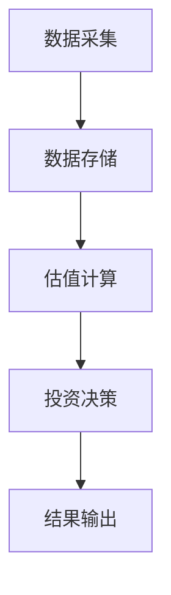
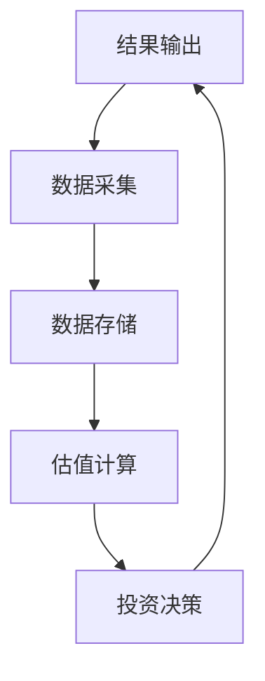

                 


# 本杰明·格雷厄姆的'烟蒂股'策略现代解读

## 关键词：
烟蒂股，价值投资，安全边际，估值模型，投资策略

## 摘要：
本文深入解读本杰明·格雷厄姆提出的烟蒂股策略，并探讨其在现代投资环境中的应用。文章从烟蒂股的背景、核心概念、数学模型、系统设计、项目实战等方面进行详细分析，结合实际案例和代码实现，展示烟蒂股策略在当今市场中的适应性和优化方法。

---

# 第1章 烟蒂股策略的背景与核心概念

## 1.1 本杰明·格雷厄姆与烟蒂股的起源

### 1.1.1 格雷厄姆的生平简介
本杰明·格雷厄姆（Benjamin Graham）是20世纪著名的投资学家，被誉为“价值投资之父”。他在1929年股市崩盘后提出了价值投资的理念，强调以低于内在价值的价格买入股票，从而确保投资的安全性。

### 1.1.2 烟蒂股概念的提出背景
烟蒂股（Niket Stock）是指那些被市场忽视、股价远低于其内在价值的股票。格雷厄姆提出这一概念的初衷是寻找那些被市场低估的公司，从而获得超额收益。

### 1.1.3 烟蒂股策略的核心思想
格雷厄姆强调安全边际，即以低于内在价值的价格买入股票，从而在市场波动中保护投资本金。他主张通过基本面分析，寻找那些具有强大财务基础和低估价格的公司。

## 1.2 烟蒂股的核心概念与定义

### 1.2.1 烟蒂股的定义与特征
烟蒂股是指那些市场价格低于其内在价值的股票。其特征包括低市盈率、低市净率、高股息率等。

### 1.2.2 烟蒂股与成长股的区别
烟蒂股注重安全性和稳定性，而成长股则注重未来的增长潜力。烟蒂股适合风险厌恶型投资者，而成长股适合风险偏好型投资者。

### 1.2.3 烟蒂股的市场适用性
烟蒂股策略适用于市场低迷或个股被低估的时期。在现代市场中，烟蒂股策略需要结合宏观经济环境和行业趋势进行调整。

## 1.3 烟蒂股策略的现代发展

### 1.3.1 烟蒂股策略的演变
随着市场的变化，烟蒂股策略不断演变，从最初的单纯价格分析发展到结合财务指标、行业趋势等多维度的分析。

### 1.3.2 现代市场环境下的烟蒂股投资
现代市场中，烟蒂股投资需要结合大数据分析、量化模型等工具，提高筛选效率和准确性。

### 1.3.3 烟蒂股策略的局限性与改进
烟蒂股策略在某些情况下可能失效，如市场流动性不足或公司基本面恶化。现代投资者需要通过动态调整策略，增强其适应性。

---

# 第2章 烟蒂股策略的核心原理

## 2.1 安全边际的概念与计算

### 2.1.1 安全边际的定义
安全边际是指股票的市场价格低于其内在价值的部分，确保在市场波动中不会亏损。

### 2.1.2 安全边际的计算方法
$$ \text{安全边际} = \frac{\text{内在价值} - \text{市场价格}}{\text{市场价格}} $$

### 2.1.3 安全边际与投资风险的关系
安全边际越高，投资风险越小。投资者应选择安全边际较高的股票，以降低投资风险。

## 2.2 烟蒂股的估值方法

### 2.2.1 市盈率与市净率的比较
市盈率（P/E）和市净率（P/B）是常用的估值指标。市盈率适用于盈利稳定的公司，市净率适用于资产密集型公司。

$$ P/E = \frac{\text{股价}}{\text{每股收益}} $$
$$ P/B = \frac{\text{股价}}{\text{每股净资产}} $$

### 2.2.2 现金流折现法（DCF）的应用
现金流折现法是通过预测未来现金流，计算其现值来确定内在价值的方法。

$$ V = \sum_{t=1}^{n} \frac{\text{CF}_t}{(1 + r)^t} $$

### 2.2.3 企业价值评估模型
企业价值（EV）是将公司整体价值与股权价值相结合的指标，适用于评估大型企业。

$$ EV = \text{股权价值} + \text{债务价值} $$

## 2.3 烟蒂股投资的决策框架

### 2.3.1 投资决策的步骤
1. 确定投资目标和风险偏好。
2. 筛选符合条件的烟蒂股。
3. 计算安全边际，评估投资价值。
4. 构建投资组合，分散风险。

### 2.3.2 关键指标的筛选与分析
- 低市盈率（P/E < 15）
- 低市净率（P/B < 2）
- 高股息率（股息率 > 3%）
- 强大的财务状况（高净资产收益率）

### 2.3.3 投资组合的构建与优化
通过分散投资降低风险，选择不同行业和不同规模的烟蒂股，优化投资组合的收益与风险比。

---

# 第3章 烟蒂股策略的数学模型与公式

## 3.1 烟蒂股估值的核心公式

### 3.1.1 市盈率模型
$$ P = \frac{E}{EPS} $$

### 3.1.2 市净率模型
$$ P = \frac{B}{PB} $$

### 3.1.3 现金流折现模型
$$ V = \sum_{t=1}^{n} \frac{CF_t}{(1 + r)^t} $$

## 3.2 安全边际的计算公式

### 3.2.1 内在价值计算
$$ V = \frac{EFC}{(1 + r)^n} $$

### 3.2.2 安全边际比率
$$ SM = \frac{V - P}{P} $$

## 3.3 投资组合优化的数学模型

### 3.3.1 马科维茨均值-方差模型
$$ \text{Minimize } \sigma^2 \text{ subject to } E[r] \geq \text{目标收益} $$

### 3.3.2 现代投资组合理论在烟蒂股中的应用
通过均值-方差模型优化投资组合，平衡风险与收益，提高整体收益。

---

# 第4章 烟蒂股策略的系统分析与架构设计

## 4.1 烟蒂股投资系统的功能模块

### 4.1.1 数据采集模块
- 数据来源：股票市场数据、财务报表等。
- 数据处理：清洗、转换和存储。

### 4.1.2 估值计算模块
- 计算市盈率、市净率等指标。
- 使用DCF模型计算内在价值。

### 4.1.3 投资决策模块
- 筛选符合条件的烟蒂股。
- 计算安全边际，评估投资价值。

## 4.2 烟蒂股系统的架构设计

### 4.2.1 系统架构图


### 4.2.2 系统功能设计
- 数据采集模块：负责收集股票数据。
- 估值计算模块：负责计算股票的内在价值。
- 投资决策模块：负责筛选烟蒂股并生成投资建议。

### 4.2.3 系统接口设计
- 数据接口：与数据源对接，获取实时数据。
- 用户接口：提供友好的操作界面，方便用户查询和分析。

## 4.3 烟蒂股系统交互设计

### 4.3.1 用户流程图


### 4.3.2 系统交互图
- 用户输入查询条件。
- 系统处理并返回结果。

---

# 第5章 烟蒂股策略的项目实战

## 5.1 环境安装与数据准备

### 5.1.1 环境配置
- 安装Python和相关库（Pandas、NumPy、Matplotlib）。

### 5.1.2 数据获取
- 从Yahoo Finance获取股票数据。

## 5.2 烟蒂股筛选与估值

### 5.2.1 筛选低市盈率股票
```python
import pandas as pd

# 假设df为股票数据
low_pe_stocks = df[df['PE'] < 15]
```

### 5.2.2 计算内在价值
```python
def calculate_intrinsic_value(revenue, expense, discount_rate):
    # 简单的现金流折现模型
    cash_flow = revenue - expense
    return cash_flow / (1 + discount_rate)
```

## 5.3 投资组合优化

### 5.3.1 计算安全边际
```python
def calculate_sm(price, intrinsic_value):
    return (intrinsic_value - price) / price
```

### 5.3.2 构建投资组合
```python
# 选择安全边际大于10%的股票
selected_stocks = low_pe_stocks[low_pe_stocks['SM'] > 0.1]
```

## 5.4 实际案例分析

### 5.4.1 案例选择
选择某行业中的低市盈率股票进行分析。

### 5.4.2 结果解读
- 计算出的安全边际为15%，说明该股票具有较高的投资价值。

---

# 第6章 总结与最佳实践

## 6.1 小结
烟蒂股策略在现代市场中依然具有重要的应用价值，但需要结合实际情况进行调整和优化。

## 6.2 注意事项
- 定期复盘和调整投资组合。
- 避免过度依赖单一指标，结合多种因素进行分析。

## 6.3 拓展阅读
推荐阅读《证券分析》（本杰明·格雷厄姆）、《投资学原理》（威廉·夏普）等书籍，进一步深入学习投资策略。

---

# 结语
通过本文的分析，读者可以全面了解烟蒂股策略的核心思想和现代应用，掌握如何在实际投资中运用这一策略，实现稳健的收益。希望本文能为投资者提供有价值的参考和启发。

