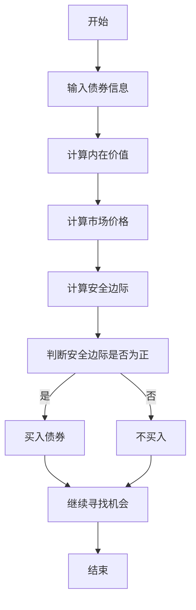

                 


# 本杰明·格雷厄姆的价值投资原则在债券市场的应用

## 关键词：价值投资，债券市场，本杰明·格雷厄姆，安全边际，内在价值

## 摘要：  
本文探讨了本杰明·格雷厄姆的价值投资原则在债券市场中的应用。通过分析债券市场的特点、价值投资的核心概念以及如何将这些原则应用于债券投资，本文为投资者提供了实用的策略和方法。结合实际案例和数学模型，本文深入解析了如何通过安全边际和内在价值的评估来选择优质债券，并构建稳健的投资组合。

---

## 第一部分：价值投资与债券市场概述

### 第1章：价值投资与债券市场的基本概念

#### 1.1 价值投资的定义与核心理念

- **1.1.1 价值投资的起源与发展**
  - 价值投资由本杰明·格雷厄姆提出，强调以低于内在价值的价格买入资产。
  - 格雷厄姆的学生大卫· Dodd 和彼得·林奇进一步发展了这一理论。
  - 价值投资的核心理念是寻找市场先生的错误定价，利用市场的非理性获利。

- **1.1.2 债券市场的基本概念与分类**
  - 债券是债务工具，发行人承诺在特定时间内支付利息和本金。
  - 主要类型包括政府债券、企业债券、可转换债券等。
  - 债券市场的规模庞大，是固定收益投资的重要领域。

- **1.1.3 价值投资与债券市场的契合点**
  - 债券市场的价格波动为价值投资者提供了发现低估机会的可能性。
  - 格雷厄姆的安全边际概念在债券投资中尤为重要，尤其是在评估信用风险时。

#### 1.2 价值投资在债券市场中的重要性

- **1.2.1 债券市场的特点与投资机会**
  - 债券市场具有较高的流动性，投资者可以灵活调整投资组合。
  - 债券的固定收益性质使其成为稳健投资者的首选。
  - 通过价值投资，投资者可以发现那些市场价格低于内在价值的债券，从而获得超额收益。

- **1.2.2 价值投资与债券市场的契合点**
  - 债券市场的波动性为价值投资者提供了低位买入的机会。
  - 格雷厄姆的安全边际概念可以帮助投资者在债券市场中规避风险，确保投资的稳健性。

---

## 第二部分：价值投资的核心原则

### 第2章：安全边际的概念与应用

#### 2.1 安全边际的定义与计算方法

- **2.1.1 安全边际的定义**
  - 安全边际是资产的市场价格与其内在价值之间的差距。
  - 格雷厄姆认为，安全边际的存在确保了投资的安全性，即使市场价格波动，内在价值的稳定性也能保证投资的回报。

- **2.1.2 安全边际的计算公式**
  - 安全边际 = 内在价值 - 市场价格
  - 内在价值的计算涉及债券的面值、票面利率、期限和当前市场利率。

- **2.1.3 安全边际在债券投资中的应用实例**
  - 例如，某债券的面值为 $1000，票面利率为5%，剩余期限为10年，当前市场利率为4%。计算其内在价值，假设市场价为 $950，安全边际为 $50，此时买入具有较高的安全边际。

#### 2.2 安全边际与债券信用评级的关系

- **2.2.1 信用评级的基本概念**
  - 信用评级是衡量债券发行人偿还能力的指标，由评级机构如穆迪、标准普尔等提供。
  - 评级从AAA到D不等，AAA为最高信用等级，D为违约。

- **2.2.2 不同信用评级下的安全边际分析**
  - 高信用评级债券的安全边际较低，风险小但收益有限。
  - 低信用评级债券的安全边际较高，但风险较大，需要仔细评估内在价值。

- **2.2.3 通过安全边际选择优质债券**
  - 投资者应关注具有较高安全边际的债券，尤其是在经济衰退期间，某些高收益债券可能被市场低估，提供较大的安全空间。

### 第3章：内在价值的评估与发现

#### 3.1 内在价值的定义与计算方法

- **3.1.1 内在价值的定义**
  - 内在价值是基于债券的未来现金流现值计算得出的理论价值。
  - 通过折现现金流模型计算，考虑债券的利息收入和本金偿还。

- **3.1.2 内在价值的计算公式**
  - 内在价值 = Σ(利息收入 / (1 + r)^t) + 本金偿还 / (1 + r)^n
  - 其中，r为当前市场利率，t为时间，n为债券期限。

- **3.1.3 内在价值在债券投资中的应用实例**
  - 例如，计算一只5年期、面值1000元、票面利率6%的债券的内在价值，假设市场利率为5%。计算其未来现金流的现值，得出内在价值约为 $1044.58。

#### 3.2 债券内在价值与市场价格的差异

- **3.2.1 市场价格波动的原因**
  - 市场价格受市场情绪、流动性、宏观经济因素等影响，可能偏离内在价值。
  - 市场波动为价值投资者提供了买入低估资产的机会。

- **3.2.2 内在价值与市场价格的对比分析**
  - 当市场价格低于内在价值时，债券被低估，适合买入。
  - 当市场价格高于内在价值时，债券被高估，应避免买入或考虑卖出。

- **3.2.3 抓住价格偏离内在价值的机会**
  - 通过持续监测债券价格与内在价值的差异，投资者可以在市场波动中获利。

---

## 第三部分：债券市场的特点与投资策略

### 第4章：债券市场的风险与收益分析

#### 4.1 债券市场的风险类型

- **4.1.1 利率风险**
  - 利率上升会导致债券价格下跌，反之亦然。
  - 长期债券的利率风险高于短期债券。

- **4.1.2 信用风险**
  - 发行人违约的风险，尤其是低信用评级的债券。
  - 通过分散投资和选择高信用评级债券可以降低信用风险。

- **4.1.3 流动性风险**
  - 债券市场的流动性可能不足，导致难以以合理价格买卖。
  - 选择流动性较高的债券或市场可以降低流动性风险。

#### 4.2 不同债券类型的风险与收益对比

- **4.2.1 政府债券**
  - 风险最低，收益稳定，适合保守投资者。
  - 例如，美国国债被视为无风险债券。

- **4.2.2 企业债券**
  - 风险较高，收益也较高，适合风险承受能力强的投资者。
  - 需要评估发行人的信用状况和财务稳定性。

- **4.2.3 其他类型债券**
  - 如可转换债券、垃圾债券等，风险和收益各不相同。
  - 投资者需根据自身风险偏好选择适合的债券类型。

### 第5章：价值投资策略在债券市场中的应用

#### 5.1 价值投资策略的基本框架

- **5.1.1 确定投资目标**
  - 明确投资目的，如追求稳定收益、资本增值等。
  - 设定风险承受能力和投资期限。

- **5.1.2 制定投资计划**
  - 制定债券投资组合的构成比例，如固定比例分配于不同信用评级的债券。
  - 定期评估投资组合的表现，调整以适应市场变化。

- **5.1.3 实施投资策略**
  - 通过分析债券的内在价值和市场价格，选择具有较大安全边际的债券买入。
  - 避免跟风，坚持价值投资的原则。

#### 5.2 债券投资组合的构建与管理

- **5.2.1 投资组合的构建原则**
  - 分散投资，降低风险。
  - 选择具有较高安全边际的债券，确保投资的稳健性。

- **5.2.2 投资组合的调整与优化**
  - 定期重新评估债券的内在价值和市场价格，调整投资组合。
  - 根据市场变化和自身目标，优化债券组合的结构。

- **5.2.3 风险管理与收益平衡**
  - 通过分散投资和严格的风险评估，平衡风险与收益。
  - 定期监控市场变化，及时调整投资策略。

---

## 第四部分：实际案例分析与经验总结

### 第6章：价值投资在债券市场中的成功案例

#### 6.1 格雷厄姆投资理念在债券市场的应用实例

- **6.1.1 典型案例分析**
  - 例如，在经济衰退期间，某些企业债券的市场价格大幅下降，但其内在价值并未显著减少。此时买入这些债券，可以获得较高的安全边际和未来的资本增值。

- **6.1.2 投资决策过程解析**
  - 确定目标债券，计算其内在价值，比较市场价格与内在价值的差异，评估安全边际。
  - 选择具有较大安全边际的债券，进行买入操作。

- **6.1.3 经验总结与启示**
  - 价值投资在债券市场中的成功关键在于准确评估内在价值和市场价格的差异。
  - 需要持续关注市场变化，及时调整投资组合。

#### 6.2 债券市场中的逆向投资策略

- **6.2.1 逆向投资的定义与特点**
  - 逆向投资是指在市场低迷时买入，在市场高亢时卖出。
  - 这种策略需要投资者具备独立思考和市场判断能力。

- **6.2.2 逆向投资在债券市场中的应用**
  - 在经济衰退期间，某些债券可能被市场低估，提供较高的安全边际。
  - 投资者可以通过逆向投资，抓住市场底部的机会，获得超额收益。

- **6.2.3 成功案例分析**
  - 例如，在2008年金融危机期间，某些优质企业债券的市场价格大幅下降，但其内在价值并未显著减少。买入这些债券的投资者在经济复苏后获得了丰厚的回报。

### 第7章：价值投资在债券市场中的未来展望

#### 7.1 债券市场的发展趋势

- **7.1.1 全球化背景下的债券市场**
  - 全球化促进了债券市场的国际化，投资者可以投资于全球范围内的债券。
  - 跨境债券投资的机会和风险并存，需要投资者具备全球视野。

- **7.1.2 技术进步对债券市场的影响**
  - 技术进步提高了债券市场的透明度和效率，投资者可以通过大数据和人工智能工具进行更精准的投资决策。
  - 技术的应用降低了交易成本，提高了投资效率。

#### 7.2 价值投资的未来应用

- **7.2.1 价值投资理念的持续重要性**
  - 尽管市场环境变化，价值投资的核心理念仍然适用。
  - 随着市场的发展，价值投资的方法和工具将不断创新。

- **7.2.2 未来投资策略建议**
  - 结合技术分析和基本面分析，制定更为科学的投资策略。
  - 进一步加强对债券内在价值的评估，利用技术工具提高投资效率。

---

## 第五部分：数学模型与系统分析

### 第8章：债券定价的数学模型

#### 8.1 债券定价公式

- **8.1.1 债券的现值公式**
  \[
  \text{内在价值} = \sum_{t=1}^{n} \frac{\text{利息收入}}{(1 + r)^t} + \frac{\text{本金偿还}}{(1 + r)^n}
  \]
  其中，\( r \) 为当前市场利率，\( n \) 为债券期限。

- **8.1.2 债券市场价格与内在价值的差异**
  \[
  \text{安全边际} = \text{内在价值} - \text{市场价格}
  \]
  投资者应选择具有正安全边际的债券进行投资。

#### 8.2 系统架构设计

- **8.2.1 系统功能设计**
  - 输入债券的基本信息，如面值、票面利率、期限等。
  - 计算债券的内在价值和市场价格。
  - 评估债券的安全边际，提供投资建议。

- **8.2.2 系统架构图**
  ```mermaid
  graph TD
      A[输入债券信息] --> B[计算内在价值]
      B --> C[计算市场价格]
      C --> D[计算安全边际]
      D --> E[输出投资建议]
  ```

- **8.2.3 系统实现代码**
  ```python
  def calculate_intrinsic_value(face_value, coupon_rate, years, market_rate):
      intrinsic_value = 0
      for t in range(1, years + 1):
          interest = face_value * coupon_rate
          intrinsic_value += interest / (1 + market_rate) ** t
      intrinsic_value += face_value / (1 + market_rate) ** years
      return intrinsic_value

  def main():
      face_value = 1000
      coupon_rate = 0.06
      years = 5
      market_rate = 0.05
      iv = calculate_intrinsic_value(face_value, coupon_rate, years, market_rate)
      print(f"债券的内在价值为：{iv:.2f} 美元")
      print(f"市场价格假设为：{iv * 0.9:.2f} 美元")
      print(f"安全边际为：{iv - iv * 0.9:.2f} 美元")

  if __name__ == "__main__":
      main()
  ```

#### 8.3 投资决策流程图



---

## 第六部分：项目实战与经验总结

### 第9章：项目实战分析

#### 9.1 项目背景与目标

- **项目背景**
  - 在2020年新冠疫情爆发期间，许多企业债券的市场价格大幅下跌。
  - 投资者有机会以较低的价格买入具有较高内在价值的债券。

- **项目目标**
  - 分析疫情期间某公司债券的内在价值和市场价格。
  - 判断其安全边际，制定投资策略。

#### 9.2 系统实现

- **9.2.1 数据收集**
  - 收集债券的基本信息，包括面值、票面利率、剩余期限等。
  - 收集市场利率数据，用于计算内在价值。

- **9.2.2 内在价值计算**
  - 使用数学模型计算债券的内在价值，比较其与市场价格的差异。
  - 评估安全边际，决定是否买入。

- **9.2.3 投资策略制定**
  - 根据计算结果，制定买入或卖出的决策。
  - 定期监控债券的价格变化，及时调整投资组合。

#### 9.3 实际案例分析

- **9.3.1 案例分析**
  - 某企业债券面值为1000美元，票面利率为8%，剩余期限为7年，当前市场利率为6%。
  - 计算其内在价值：
    \[
    \text{内在价值} = \sum_{t=1}^{7} \frac{80}{(1 + 0.06)^t} + \frac{1000}{(1 + 0.06)^7}
    \]
    计算得出内在价值约为 $1147.47 美元。
  - 假设市场价格为 $1050 美元，安全边际为 $97.47 美元，此时买入具有较高的安全空间。

- **9.3.2 投资决策**
  - 由于安全边际为正，投资者可以选择买入该债券，预期在未来市场利率下降或债券价格上涨时卖出获利。

---

## 第七部分：总结与展望

### 第10章：总结与未来趋势

#### 10.1 总结

- 本文详细探讨了本杰明·格雷厄姆的价值投资原则在债券市场中的应用。
- 通过分析债券市场的特点、价值投资的核心概念以及实际案例，本文为投资者提供了实用的策略和方法。

#### 10.2 未来趋势

- 随着市场的全球化和技术的进步，价值投资在债券市场中的应用将更加广泛和多样化。
- 投资者需要不断学习和适应市场变化，利用技术工具提高投资效率。

---

## 第八部分：最佳实践与注意事项

### 第11章：最佳实践 tips

- **11.1 投资者注意事项**
  - 保持独立思考，避免盲目跟风。
  - 定期评估投资组合，及时调整以适应市场变化。
  - 选择具有较高安全边际的债券，确保投资的稳健性。

- **11.2 风险管理策略**
  - 分散投资，降低风险。
  - 设定止损点，避免重大损失。
  - 关注宏观经济指标，预判市场变化。

- **11.3 持续学习与进步**
  - 关注市场动态，学习新的投资理念和工具。
  - 参与投资社群，分享经验和教训。

---

通过以上结构和内容，本文系统地探讨了价值投资原则在债券市场中的应用，为投资者提供了理论支持和实际操作指南。结合数学模型和实际案例，本文深入分析了如何通过安全边际和内在价值的评估，选择优质债券，构建稳健的投资组合。

