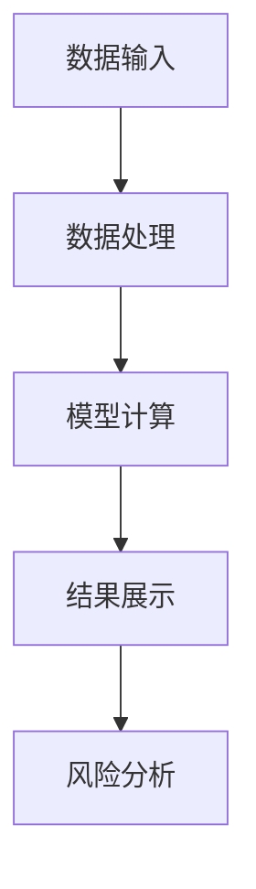

                 


# 本杰明·格雷厄姆的企业价值计算方法现代化

> 关键词：企业价值计算，本杰明·格雷厄姆，投资分析，现代方法，安全边际

> 摘要：本文探讨了本杰明·格雷厄姆的经典企业价值计算方法，并分析其在现代投资环境中的应用与改进。通过对比传统与现代方法，结合数学模型、系统架构和项目实战，展示了如何将格雷厄姆的理论与现代技术相结合，提升企业价值评估的准确性和效率。

---

## 第一部分: 本杰明·格雷厄姆的企业价值计算方法概述

### 第1章: 本杰明·格雷厄姆与企业价值计算方法

#### 1.1 本杰明·格雷厄姆的生平与投资理念

- **1.1.1 本杰明·格雷厄姆的生平简介**
  - 本杰明·格雷厄姆（Benjamin Graham）是20世纪著名的投资家和价值投资理论的创始人，被誉为“价值投资之父”。
  - 他于1929年经济大萧条期间开始投资生涯，经历了多次金融危机，积累了丰富的投资经验。
  - 格雷厄姆在《 Intelligent Investor》一书中提出了价值投资的理念，影响了后来的投资者如沃伦·巴菲特。

- **1.1.2 格雷厄姆的价值投资理论核心**
  - 格雷厄姆强调安全边际和内在价值的概念。
  - 他主张以低于内在价值的价格买入股票，以确保投资的安全性。
  - 格雷厄姆认为市场是不理性的，股票价格经常偏离其真实价值。

- **1.1.3 格雷厄姆对企业价值计算的贡献**
  - 提出了内在价值的计算方法，即基于企业未来现金流的折现值。
  - 强调了安全边际的重要性，即买入价格与内在价值的差距。

#### 1.2 企业价值计算方法的背景与意义

- **1.2.1 企业价值计算的基本概念**
  - 企业价值（Enterprise Value，EV）是企业整体价值的度量，包括股权和债权的价值。
  - 企业价值计算是投资决策的重要依据，帮助投资者评估企业的潜在价值。

- **1.2.2 企业价值计算的现实需求**
  - 在现代金融市场中，企业价值计算需要考虑更多的因素，如宏观经济环境、行业竞争状况、企业财务状况等。
  - 随着企业规模的扩大和复杂性增加，传统的计算方法已不足以应对现代挑战。

- **1.2.3 格雷厄姆方法在现代的应用价值**
  - 格雷厄姆的方法为现代企业价值计算提供了基础理论。
  - 将格雷厄姆的理论与现代技术结合，可以提升企业价值计算的准确性和效率。

#### 1.3 格雷厄姆投资理念的核心要素

- **1.3.1 安全边际的概念**
  - 安全边际是指买入价格与内在价值之间的差距，确保投资的安全性。
  - 格雷厄姆建议以低于内在价值的价格买入股票，以降低投资风险。

- **1.3.2 股票内在价值的定义**
  - 内在价值是基于企业未来现金流的折现值，反映了企业的实际价值。
  - 内在价值计算需要考虑企业的盈利能力、成长潜力和财务状况。

- **1.3.3 投资组合管理的原则**
  - 格雷厄姆主张分散投资，降低投资风险。
  - 他强调长期投资，避免短期市场的波动影响投资决策。

#### 1.4 本章小结

- 本章介绍了本杰明·格雷厄姆的生平和投资理念，重点阐述了他的企业价值计算方法的核心要素。
- 强调了安全边际和内在价值的重要性，并分析了格雷厄姆方法在现代的应用价值。

---

## 第二部分: 格雷厄姆企业价值计算方法的现代发展

### 第2章: 现代企业价值计算方法的演进

#### 2.1 格雷厄姆原始模型的局限性

- **2.1.1 原始模型的假设与简化**
  - 格雷厄姆的模型基于简单的现金流折现，假设企业未来现金流稳定增长。
  - 该模型忽略了市场波动、宏观经济因素等复杂因素。

- **2.1.2 现代企业复杂性对原始模型的挑战**
  - 现代企业面临更高的不确定性和复杂性，如全球化、技术创新等。
  - 企业的财务状况和市场环境更加多样化，需要更复杂的模型来计算。

- **2.1.3 经济环境变化对模型的影响**
  - 经济环境的变化，如利率波动、通货膨胀等，会影响企业价值计算。
  - 原始模型未能充分考虑这些因素的影响。

#### 2.2 现代企业价值计算的核心改进

- **2.2.1 现代企业价值计算的多维度考量**
  - 现代模型考虑了更多的因素，如企业的市场份额、竞争优势、管理团队等。
  - 还考虑了宏观经济环境、行业趋势等外部因素。

- **2.2.2 财务指标的扩展与优化**
  - 现代模型引入了更多的财务指标，如息税折旧及摊销前利润（EBITDA）、自由现金流等。
  - 这些指标能够更准确地反映企业的财务状况。

- **2.2.3 风险评估的现代化方法**
  - 现代方法引入了风险评估模型，如VaR（Value at Risk）和蒙特卡洛模拟。
  - 这些方法能够更好地量化投资风险。

#### 2.3 格雷厄姆方法与现代方法的对比分析

- **2.3.1 格雷厄姆方法的数学模型**
  - 格雷厄姆的内在价值公式：EV = 股东权益 + 长期债务
  - 该模型简单但缺乏对复杂因素的考虑。

- **2.3.2 现代方法的数学模型**
  - 贴现现金流模型（DCF）：EV = Σ (CF_t / (1 + r)^t)
  - 股权自由现金流模型：FCFE = 净利润 + 折旧和摊销 - 资本支出 - 偿还债务
  - 风险调整折现率模型：r = Rf + β*(Rm - Rf)

- **2.3.3 两种方法的优缺点对比**
  - 格雷厄姆方法简单易懂，适用于初步评估。
  - 现代方法更加复杂但更准确，适用于深入分析。

#### 2.4 本章小结

- 本章分析了格雷厄姆原始模型的局限性和现代方法的改进。
- 详细对比了两种方法的优缺点，突出现代方法在复杂环境下的优势。

---

## 第三部分: 现代企业价值计算的数学模型与算法

### 第3章: 企业价值计算的数学模型

#### 3.1 格雷厄姆原始模型的数学表达

- **3.1.1 内在价值公式**
  $$ EV = 股东权益 + 长期债务 $$
  其中，EV为企业价值，股东权益为企业账面价值，长期债务为企业债务。

- **3.1.2 安全边际的计算方法**
  $$ 安全边际 = 内在价值 - 市场价格 $$
  当市场价格低于内在价值时，存在安全边际。

- **3.1.3 案例分析**
  - 假设某公司股东权益为1000万元，长期债务为500万元，市场价为每股10元，总股本为100万股。
  - 内在价值为1500万元，市场价值为1000万元，存在500万元的安全边际。

#### 3.2 现代企业价值计算的改进模型

- **3.2.1 贴现现金流模型（DCF）**
  $$ EV = Σ (CF_t / (1 + r)^t) $$
  其中，CF_t为第t年的现金流，r为折现率。

- **3.2.2 股权自由现金流模型**
  $$ FCFE = 净利润 + 折旧和摊销 - 资本支出 - 偿还债务 $$
  用于计算股权部分的自由现金流。

- **3.2.3 风险调整折现率模型**
  $$ r = Rf + β*(Rm - Rf) $$
  其中，Rf为无风险利率，Rm为市场平均收益率，β为股票的贝塔系数。

#### 3.3 数学模型的对比与选择

- **3.3.1 不同模型的适用场景**
  - DCF模型适用于有稳定现金流的企业。
  - FCFE模型适用于股权投资者。
  - 风险调整折现率模型适用于高风险企业。

- **3.3.2 模型参数的敏感性分析**
  - 折现率对模型结果影响较大，需谨慎选择。
  - 现金流预测的准确性直接影响模型结果。

- **3.3.3 模型的优缺点权衡**
  - DCF模型较为复杂，但结果更准确。
  - FCFE模型更专注于股权价值，适用于特定场景。

#### 3.4 本章小结

- 本章详细介绍了格雷厄姆原始模型和现代改进模型的数学表达。
- 分析了不同模型的适用场景和优缺点，为实际应用提供了指导。

---

## 第四部分: 现代企业价值计算的系统架构与实现

### 第4章: 系统架构设计

#### 4.1 系统功能模块划分

- **4.1.1 数据输入与处理模块**
  - 输入企业财务数据、市场数据等。
  - 数据清洗和预处理。

- **4.1.2 模型计算模块**
  - 选择合适的数学模型进行计算。
  - 输出企业价值评估结果。

- **4.1.3 结果展示与分析模块**
  - 可视化展示评估结果。
  - 提供风险分析和投资建议。

#### 4.2 系统架构图



- 数据输入模块接收用户输入的企业数据。
- 数据处理模块清洗和预处理数据。
- 模型计算模块选择合适的模型进行计算。
- 结果展示模块将结果以图表形式展示。
- 风险分析模块提供风险评估和投资建议。

#### 4.3 系统接口设计

- **4.3.1 输入接口规范**
  - 接收JSON格式的企业数据，包括财务指标和市场指标。

- **4.3.2 输出接口规范**
  - 返回JSON格式的评估结果，包括企业价值、安全边际等。

- **4.3.3 接口的兼容性设计**
  - 支持多种数据格式，如CSV、Excel等。
  - 提供API接口，方便与其他系统集成。

#### 4.4 本章小结

- 本章设计了企业价值计算系统的架构，包括功能模块划分、系统架构图和接口设计。
- 系统架构清晰，功能模块分工明确，便于实际开发和应用。

---

## 第五部分: 项目实战与案例分析

### 第5章: 项目实战

#### 5.1 环境搭建与数据准备

- **5.1.1 开发环境的安装与配置**
  - 安装Python、Pandas、Matplotlib等工具。
  - 配置开发环境，如Jupyter Notebook。

- **5.1.2 数据来源与数据清洗**
  - 数据来源：企业财务报表、市场数据等。
  - 数据清洗：处理缺失值、异常值等。

#### 5.2 核心实现

- **5.2.1 选择合适的数学模型**
  - 根据企业特点选择DCF模型或FCFE模型。
  - 调整模型参数，如折现率、现金流预测等。

- **5.2.2 编写Python代码实现**
  ```python
  def calculate_ev(revenue, costs, wacc):
      ebit = revenue - costs
      fcf = ebit * (1 - tax_rate) + depreciation
      ev = sum(fcf / (1 + wacc)**t for t in range(5))
      return ev
  ```

- **5.2.3 可视化结果展示**
  - 使用Matplotlib绘制企业价值变化趋势图。

#### 5.3 案例分析

- **5.3.1 案例背景**
  - 某制造企业，财务数据已知，市场环境稳定。

- **5.3.2 数据分析与计算**
  - 计算企业的内在价值，比较市场价格，得出安全边际。

- **5.3.3 结果解读**
  - 企业价值为合理区间，存在一定的安全边际，建议买入。

#### 5.4 项目总结

- **5.4.1 项目成果**
  - 成功实现企业价值计算系统。
  - 提供了准确的评估结果和投资建议。

- **5.4.2 项目经验**
  - 数据质量对企业价值计算的影响重大。
  - 模型选择需要结合企业的具体情况。

#### 5.5 本章小结

- 本章通过项目实战展示了现代企业价值计算的方法。
- 详细讲解了环境搭建、数据准备、模型选择和结果分析的过程。

---

## 第六部分: 最佳实践与总结

### 第6章: 最佳实践与总结

#### 6.1 最佳实践 tips

- 数据的准确性和完整性是关键。
- 选择合适的模型和参数，避免过度简化或复杂化。
- 结合多方面的信息进行综合评估。

#### 6.2 小结

- 本篇文章系统地介绍了本杰明·格雷厄姆的企业价值计算方法的现代化。
- 从理论到实践，详细讲解了现代方法的优势和应用。
- 展示了如何将传统理论与现代技术结合，提升企业价值评估的效率和准确性。

#### 6.3 注意事项

- 投资者需根据实际情况调整模型。
- 数据收集和处理需谨慎，避免偏差。
- 结果分析需结合市场环境和企业特点。

#### 6.4 拓展阅读

- 建议阅读《 Intelligent Investor》深入理解格雷厄姆的理论。
- 学习现代投资分析方法，如蒙特卡洛模拟等。

---

# 附录

### 附录A: 格雷厄姆的内在价值公式

$$ EV = 股东权益 + 长期债务 $$

### 附录B: 贴现现金流模型代码示例

```python
import pandas as pd
import numpy as np

def discounted_cash_flow(cash_flows, discount_rate):
    return sum(cash_flow / (1 + discount_rate)**t for t, cash_flow in enumerate(cash_flows))

cash_flows = [100, 120, 150, 200, 250]
discount_rate = 0.1
ev = discounted_cash_flow(cash_flows, discount_rate)
print(ev)
```

---

通过以上步骤，我们系统地介绍了本杰明·格雷厄姆的企业价值计算方法的现代化过程。从理论到实践，从模型到系统，全面展示了如何将传统方法与现代技术结合，提升企业价值评估的效率和准确性。

