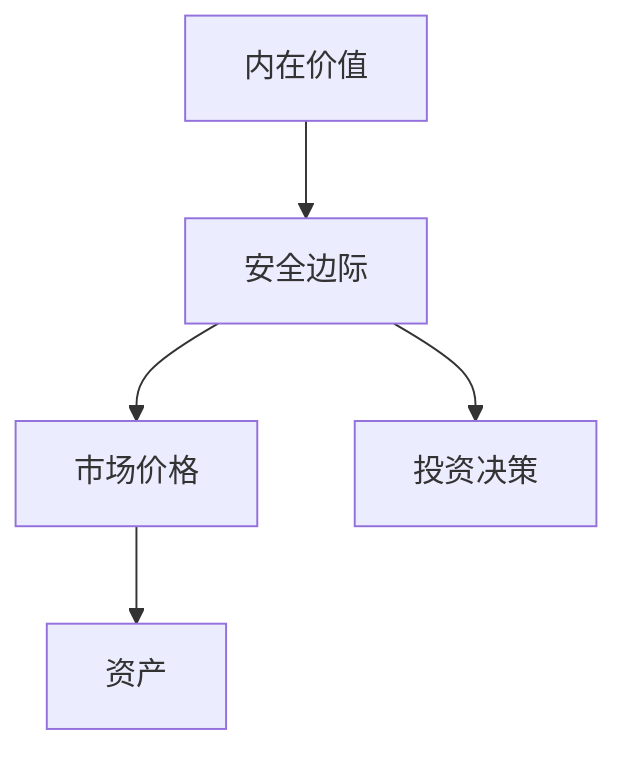
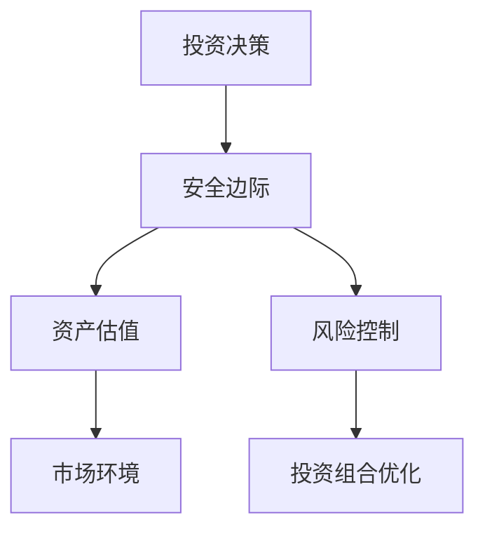
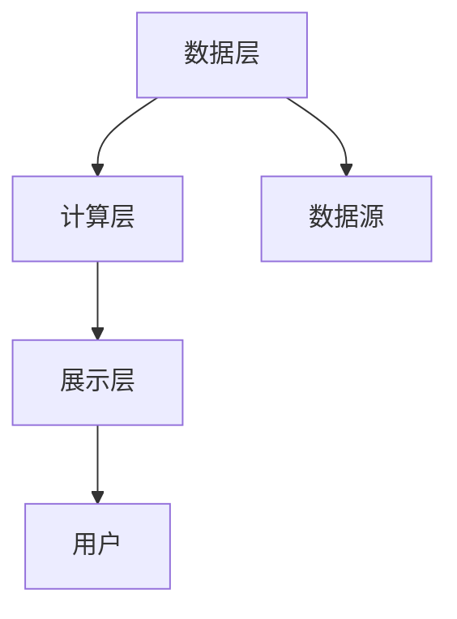

                 


# 本杰明·格雷厄姆的安全边际现代诠释

---

## 关键词：  
本杰明·格雷厄姆，安全边际，价值投资，风险管理，现代投资，量化分析

---

## 摘要：  
本杰明·格雷厄姆的安全边际理念是价值投资的核心思想之一，其在现代金融市场中的应用和发展值得深入探讨。本文通过结合现代技术手段，从安全边际的定义、计算方法、算法原理、系统架构设计、项目实战等多个维度，全面诠释安全边际的现代意义。我们不仅回顾了传统安全边际的概念，还结合量化分析和风险管理，提出了基于DCF模型的安全边际计算方法，并通过实际案例分析，展示了如何在现代投资环境中应用这一理念。

---

## 第1章: 安全边际的基本概念与背景介绍

### 1.1 安全边际的定义与背景  
安全边际是价值投资中的核心概念，由本杰明·格雷厄姆提出，旨在通过比较资产的内在价值与市场价格，评估投资的安全性。其核心思想是，当市场价格低于内在价值时，投资具有安全边际，能够为投资者提供保护，避免因市场波动带来的损失。  

#### 1.1.1 价值投资的基本原理  
价值投资的核心是寻找市场价格低于内在价值的资产，通过长期持有实现超额收益。格雷厄姆强调，内在价值是资产未来现金流的现值，而市场价格受市场情绪影响，可能偏离内在价值。  

#### 1.1.2 安全边际的核心概念  
安全边际 = 内在价值 - 市场价格  
当安全边际为正时，投资具有保护空间；为负时，投资风险较高。  

#### 1.1.3 现代环境下的安全边际  
在现代金融市场中，资产种类多样化、交易频率提高、信息获取便捷，安全边际的计算需要结合更多因素，如宏观经济指标、行业周期、企业财务状况等。  

### 1.2 安全边际的计算与应用  
安全边际的计算需要基于对资产内在价值的准确评估，而内在价值的计算通常采用现金流贴现模型（DCF）。  

#### 1.2.1 安全边际的计算方法  
1. **内在价值计算**：使用DCF模型计算资产的未来现金流现值。  
2. **市场价格比较**：比较市场价格与内在价值，得出安全边际。  

#### 1.2.2 安全边际在投资决策中的作用  
安全边际为投资者提供了风险管理的工具，帮助其在市场波动中规避风险，实现稳健投资。  

#### 1.2.3 安全边际与风险控制的关系  
安全边际越高，投资风险越低。通过设定安全边际，投资者可以在市场波动中保持信心，避免因短期市场波动导致的决策失误。  

### 1.3 现代市场环境下的安全边际  
现代市场环境复杂多变，安全边际的计算需要考虑更多因素，如宏观经济指标、行业周期、企业财务状况等。  

#### 1.3.1 现代金融市场的特点  
- 信息透明度提高：投资者可以更快速地获取信息，但信息过载也可能导致决策失误。  
- 交易频率提高：高频交易增加了市场的波动性。  
- 数字化工具的应用：大数据和人工智能技术为安全边际的计算提供了新方法。  

#### 1.3.2 安全边际在复杂市场中的应用  
在复杂市场中，安全边际的计算需要结合量化分析和基本面分析，帮助投资者在不确定性中找到相对安全的投资机会。  

#### 1.3.3 数字化工具对安全边际的影响  
数字化工具（如大数据、人工智能）可以提高安全边际计算的效率和准确性，但同时也需要考虑模型的局限性和数据的可靠性。  

---

## 第2章: 安全边际的核心概念与联系  

### 2.1 核心概念原理  
安全边际的核心概念包括内在价值、市场价格、现金流贴现模型等。  

#### 2.1.1 安全边际的数学模型  
$$ \text{安全边际} = \text{内在价值} - \text{市场价格} $$  
其中，内在价值的计算公式为：  
$$ V = \sum_{t=1}^{n} \frac{CF_t}{(1 + r)^t} $$  
其中，\( V \) 是内在价值，\( CF_t \) 是第 \( t \) 年的现金流，\( r \) 是折现率。  

#### 2.1.2 安全边际与资产估值的关系  
安全边际是资产估值的重要组成部分，反映了市场价格与内在价值的差异。  

#### 2.1.3 安全边际与投资组合优化的联系  
安全边际可以帮助投资者优化投资组合，降低整体风险，同时提高收益。  

### 2.2 核心概念对比分析  
通过对比分析，可以帮助我们更好地理解安全边际的特性和应用场景。  

#### 2.2.1 安全边际与风险调整收益的对比  
| 对比维度          | 安全边际              | 风险调整收益          |  
|-------------------|----------------------|-----------------------|  
| 定义              | 内在价值与市场价格的差值 | 考虑风险后的收益调整 |  
| 计算基础          | 现金流贴现模型        | 风险调整后的收益模型 |  
| 应用场景          | 投资决策              | 风险管理与收益优化    |  

#### 2.2.2 安全边际与现代投资组合理论的对比  
| 对比维度          | 安全边际              | 现代投资组合理论      |  
|-------------------|----------------------|-----------------------|  
| 核心思想          | 价格低于内在价值      | 最优化投资组合        |  
| 计算方法          | 现金流贴现模型        | 均值-方差优化          |  
| 应用场景          | 个股选择              | 投资组合优化          |  

#### 2.2.3 安全边际与行为金融学的结合  
行为金融学强调投资者心理因素对决策的影响，而安全边际则通过价格与价值的差异，为投资者提供了一种规避行为偏差的工具。  

### 2.3 实体关系图  
通过实体关系图，可以更直观地理解安全边际的概念及其与相关因素的关系。  

#### 2.3.1 安全边际的ER实体关系图  


#### 2.3.2 用 Mermaid 绘制的安全边际概念图  


---

## 第3章: 安全边际的算法原理与数学模型  

### 3.1 算法原理  
安全边际的计算基于现金流贴现模型（DCF），通过比较内在价值与市场价格，得出安全边际。  

#### 3.1.1 安全边际的计算流程  
1. **确定目标资产**：选择需要评估的资产。  
2. **预测未来现金流**：基于历史数据和行业分析，预测未来现金流。  
3. **计算内在价值**：使用DCF模型计算资产的内在价值。  
4. **比较市场价格与内在价值**：计算安全边际。  

#### 3.1.2 基于DCF模型的安全边际计算  
DCF模型通过预测未来现金流并贴现，计算资产的内在价值。公式如下：  
$$ V = \sum_{t=1}^{n} \frac{CF_t}{(1 + r)^t} $$  
其中，\( CF_t \) 是第 \( t \) 年的现金流，\( r \) 是折现率，\( n \) 是预测年数。  

#### 3.1.3 现代算法优化方法  
现代算法可以通过大数据和人工智能技术优化现金流预测和折现率估算，提高安全边际计算的准确性。  

### 3.2 数学模型与公式  
安全边际的计算涉及多个数学公式，以下是一些关键公式的详细解释。  

#### 3.2.1 安全边际的基本公式  
$$ \text{安全边际} = \text{内在价值} - \text{市场价格} $$  
其中，内在价值的计算公式为：  
$$ V = \sum_{t=1}^{n} \frac{CF_t}{(1 + r)^t} $$  

#### 3.2.2 现金流贴现模型  
现金流贴现模型是计算内在价值的核心工具，其公式如下：  
$$ V = \sum_{t=1}^{n} \frac{CF_t}{(1 + r)^t} $$  
其中，\( CF_t \) 是第 \( t \) 年的现金流，\( r \) 是折现率，\( n \) 是预测年数。  

#### 3.2.3 风险调整后的安全边际计算  
在考虑风险的情况下，可以对折现率进行调整，从而计算风险调整后的安全边际：  
$$ \text{调整后安全边际} = \text{内在价值（风险调整）} - \text{市场价格} $$  
其中，内在价值的计算公式为：  
$$ V_{\text{风险调整}} = \sum_{t=1}^{n} \frac{CF_t}{(1 + r_{\text{风险}})^t} $$  

---

## 第4章: 安全边际的系统分析与架构设计  

### 4.1 系统分析  
安全边际的计算需要结合多种因素，包括资产的现金流、市场环境、宏观经济指标等。  

#### 4.1.1 系统功能设计  
系统功能包括：  
1. 数据采集：获取资产的财务数据、市场数据等。  
2. 现金流预测：基于历史数据预测未来现金流。  
3. 内在价值计算：使用DCF模型计算内在价值。  
4. 安全边际计算：比较市场价格与内在价值，得出安全边际。  

#### 4.1.2 系统架构设计  
系统架构包括：  
1. 数据层：存储资产数据和市场数据。  
2. 计算层：执行现金流预测和内在价值计算。  
3. 展示层：显示计算结果和安全边际。  

#### 4.1.3 系统接口设计  
系统接口包括：  
1. 数据输入接口：接收资产数据和市场数据。  
2. 计算接口：执行现金流预测和内在价值计算。  
3. 输出接口：显示计算结果和安全边际。  

### 4.2 系统架构设计  
系统架构设计需要考虑系统的可扩展性和可维护性。  

#### 4.2.1 系统架构图  


#### 4.2.2 系统交互流程  
1. 用户输入资产数据和市场数据。  
2. 系统采集数据并存入数据层。  
3. 计算层基于数据层的数据进行现金流预测和内在价值计算。  
4. 计算结果传输至展示层，显示安全边际。  

---

## 第5章: 安全边际的项目实战  

### 5.1 环境安装  
项目实战需要以下环境：  
1. Python 3.8+  
2. NumPy 和 Pandas 库  
3. Matplotlib 或 Seaborn 绘图库  

#### 5.1.1 安装依赖  
```bash
pip install numpy pandas matplotlib
```

### 5.2 系统核心实现源代码  
以下是一个基于DCF模型的安全边际计算工具的代码示例。  

#### 5.2.1 数据加载与预处理  
```python
import numpy as np
import pandas as pd

# 加载财务数据
data = pd.read_csv('financial_data.csv')
data = data.set_index('date')
```

#### 5.2.2 现金流预测与内在价值计算  
```python
def calculate_intrinsic_value(cash_flows, discount_rate):
    return np.npv(discount_rate, cash_flows)
```

#### 5.2.3 安全边际计算  
```python
market_price = 100  # 市场价格
intrinsic_value = calculate_intrinsic_value(cash_flows, 0.1)
margin_of_safety = intrinsic_value - market_price
```

### 5.3 案例分析与解读  
以某公司为例，假设其未来现金流预测如下：  
| 年份 | 现金流（万元） |  
|------|----------------|  
| 2024 | 100            |  
| 2025 | 120            |  
| 2026 | 150            |  

折现率为10%，则内在价值为：  
$$ V = \frac{100}{1.1} + \frac{120}{1.1^2} + \frac{150}{1.1^3} \approx 312.97 \text{万元} $$  
市场价格为100万元，则安全边际为：  
$$ \text{安全边际} = 312.97 - 100 = 212.97 \text{万元} $$  

---

## 第6章: 最佳实践、小结与展望  

### 6.1 最佳实践  
1. **数据质量**：确保输入数据的准确性和完整性。  
2. **模型选择**：根据实际情况选择合适的现金流预测模型。  
3. **风险控制**：在计算中考虑宏观经济风险和行业周期性。  

### 6.2 小结  
本杰明·格雷厄姆的安全边际理念在现代投资中的应用具有重要意义。通过结合量化分析和风险管理，我们可以更准确地计算安全边际，为投资决策提供科学依据。  

### 6.3 注意事项  
1. 安全边际的计算依赖于对未来现金流的预测，存在一定的不确定性。  
2. 折现率的选择对内在价值的计算影响较大，需谨慎选择。  
3. 在实际应用中，需结合市场环境和行业特点进行调整。  

### 6.4 拓展阅读  
1. 《The Intelligent Investor》——本杰明·格雷厄姆的经典著作。  
2. 现代投资组合理论的相关文献。  
3. 关于现金流预测模型的最新研究。  

---

## 结语  
安全边际是价值投资的核心理念，其在现代投资中的应用需要结合量化分析和风险管理。通过本文的探讨，我们不仅回顾了传统安全边际的概念，还结合实际案例，展示了如何在现代投资环境中应用这一理念。希望本文能够为投资者和研究者提供有价值的参考。

