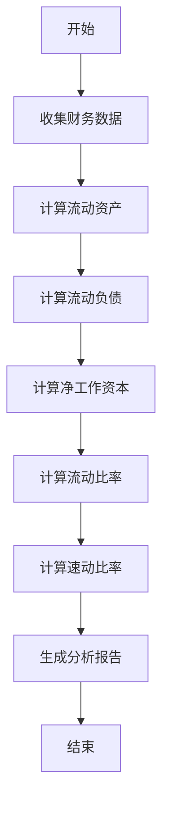
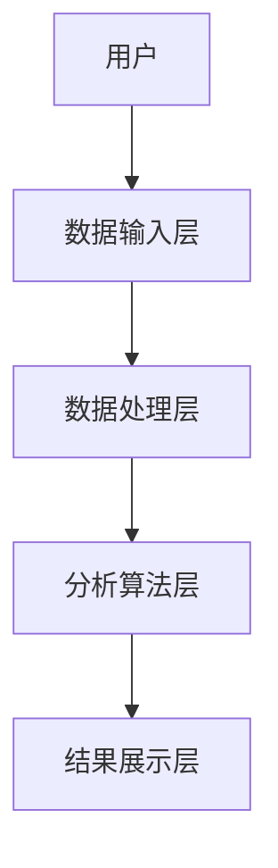

                 


# 本杰明·格雷厄姆的工作资本分析技巧

> 关键词：本杰明·格雷厄姆，工作资本分析，投资技巧，财务分析，价值投资

> 摘要：本杰明·格雷厄姆是价值投资的先驱，他的工作资本分析技巧为投资者提供了评估企业内在价值的方法。本文将详细探讨工作资本分析的核心概念、算法原理、系统架构，并通过实际案例分析，帮助读者掌握这一经典投资技巧。

---

## 第一章: 工作资本分析的背景与意义

### 1.1 工作资本分析的核心概念

#### 1.1.1 什么是工作资本
工作资本（Working Capital）是指企业在短期内可以转化为现金的资产，通常包括流动资产（如现金、应收账款、存货）减去流动负债（如应付账款、短期借款）。工作资本是衡量企业短期偿债能力和流动性的重要指标。

#### 1.1.2 工作资本的构成要素
工作资本的构成包括：
1. **流动资产**：现金、应收账款、存货等。
2. **流动负债**：应付账款、短期借款、预收款项等。
3. **净工作资本**：流动资产减去流动负债。

#### 1.1.3 工作资本分析的重要性
工作资本分析有助于评估企业的短期财务健康状况，帮助投资者判断企业是否有足够的流动资金来偿还短期债务，维持日常运营。

### 1.2 本杰明·格雷厄姆与工作资本分析

#### 1.2.1 本杰明·格雷厄姆的生平简介
本杰明·格雷厄姆（Benjamin Graham）是20世纪著名的投资大师，被誉为“价值投资之父”。他于1929年出版的《证券分析》奠定了现代证券分析的基础。

#### 1.2.2 格雷厄姆的投资理念
格雷厄姆主张以低于内在价值的价格买入优质股票，长期持有，注重安全边际。他认为，市场先生（Mr. Market）是投资的合作伙伴，但也是情绪化的敌人。

#### 1.2.3 格雷厄姆与工作资本分析的关联
格雷厄姆的工作资本分析是其价值投资体系的重要组成部分。他强调，投资者应关注企业的财务状况，尤其是工作资本，以评估企业的短期偿债能力和财务健康状况。

---

## 第二章: 工作资本分析的核心概念与原理

### 2.1 工作资本的构成与分类

#### 2.1.1 流动资产
流动资产是指可以在一年内变现的资产，包括：
- **现金及现金等价物**：企业持有的现金和活期存款。
- **应收账款**：企业因赊销而应收回的款项。
- **存货**：企业尚未售出的原材料、在制品和产成品。

#### 2.1.2 流动负债
流动负债是指企业在一年内需要偿还的债务，包括：
- **应付账款**：企业因采购原材料而欠供应商的款项。
- **短期借款**：企业从银行或其他金融机构获得的短期贷款。
- **预收款项**：企业收到的客户预付款。

#### 2.1.3 净流动资产
净流动资产 = 流动资产 - 流动负债。

### 2.2 工作资本分析的关键指标

#### 2.2.1 流动比率
流动比率（Current Ratio）是衡量企业短期偿债能力的重要指标，计算公式为：
$$\text{流动比率} = \frac{\text{流动资产}}{\text{流动负债}}$$
一般认为，流动比率应保持在2:1以上，以确保企业有足够的流动资产偿还短期债务。

#### 2.2.2 速动比率
速动比率（Quick Ratio）是流动比率的修正指标，剔除了存货的影响，计算公式为：
$$\text{速动比率} = \frac{\text{流动资产} - \text{存货}}{\text{流动负债}}$$
速动比率通常应保持在1:1以上，以确保企业在不依赖存货的情况下仍能偿还短期债务。

#### 2.2.3 现金比率
现金比率（Cash Ratio）是速动比率的进一步修正，仅考虑现金及现金等价物的变现能力，计算公式为：
$$\text{现金比率} = \frac{\text{现金及现金等价物}}{\text{流动负债}}$$
现金比率越高，企业的短期偿债能力越强。

### 2.3 工作资本分析的数学模型

#### 2.3.1 流动资产与流动负债的关系
工作资本的健康状况可以通过流动资产与流动负债的比值来衡量。如果流动资产远大于流动负债，说明企业有较强的短期偿债能力。

#### 2.3.2 净工作资本的计算
净工作资本（Net Working Capital）= 流动资产 - 流动负债。

---

## 第三章: 工作资本分析的算法与原理

### 3.1 工作资本分析的算法流程

#### 3.1.1 算法步骤
1. 收集企业的财务数据，包括流动资产和流动负债的详细构成。
2. 计算流动资产和流动负债的总和。
3. 计算净工作资本、流动比率、速动比率等关键指标。
4. 对比分析，判断企业的短期偿债能力。

#### 3.1.2 算法流程图


### 3.2 算法实现的Python代码

#### 3.2.1 数据输入
```python
# 输入流动资产和流动负债的构成
current_assets = {
    '现金及现金等价物': 100000,
    '应收账款': 200000,
    '存货': 150000
}
current_liabilities = {
    '应付账款': 120000,
    '短期借款': 80000,
    '预收款项': 50000
}
```

#### 3.2.2 计算净工作资本
```python
net_working_capital = sum(current_assets.values()) - sum(current_liabilities.values())
print(f"净工作资本为：${net_working_capital}")
```

#### 3.2.3 计算流动比率
```python
current_ratio = sum(current_assets.values()) / sum(current_liabilities.values())
print(f"流动比率为：{current_ratio}")
```

#### 3.2.4 计算速动比率
```python
quick_assets = sum(current_assets.values()) - current_assets['存货']
quick_ratio = quick_assets / sum(current_liabilities.values())
print(f"速动比率为：{quick_ratio}")
```

---

## 第四章: 工作资本分析的系统架构

### 4.1 系统功能设计

#### 4.1.1 领域模型


#### 4.1.2 系统架构


### 4.2 系统接口设计

#### 4.2.1 数据输入接口
用户可以通过Excel文件或数据库导入企业的财务数据。

#### 4.2.2 分析算法接口
系统根据输入的财务数据，调用工作资本分析算法，计算净工作资本、流动比率和速动比率。

---

## 第五章: 项目实战

### 5.1 环境安装

#### 5.1.1 Python环境
安装Python和必要的库（如pandas、numpy）。

#### 5.1.2 数据可视化工具
安装Matplotlib或Seaborn用于数据可视化。

### 5.2 核心实现源代码

#### 5.2.1 数据处理
```python
import pandas as pd

# 读取财务数据
df = pd.read_excel('financial_data.xlsx')
current_assets = df['流动资产'].sum()
current_liabilities = df['流动负债'].sum()
```

#### 5.2.2 计算比率
```python
net_working_capital = current_assets - current_liabilities
current_ratio = current_assets / current_liabilities
quick_ratio = (current_assets - df['存货'].sum()) / current_liabilities
```

#### 5.2.3 可视化
```python
import matplotlib.pyplot as plt

plt.figure(figsize=(10,6))
plt.bar(['净工作资本', '流动比率', '速动比率'], [net_working_capital, current_ratio, quick_ratio])
plt.ylabel('数值')
plt.title('工作资本分析')
plt.show()
```

### 5.3 案例分析

#### 5.3.1 案例背景
假设某企业2022年的财务数据如下：
- 流动资产：$500,000
- 流动负债：$300,000
- 存货：$150,000

#### 5.3.2 计算结果
- 净工作资本：$200,000
- 流动比率：1.666
- 速动比率：1.166

#### 5.3.3 分析结论
该企业的流动比率和速动比率均高于1，说明企业有较强的短期偿债能力，财务状况健康。

---

## 第六章: 总结与展望

### 6.1 最佳实践 tips

#### 6.1.1 关注行业特性
不同行业的企业，其工作资本需求和周转率差异较大，投资者应结合行业特点进行分析。

#### 6.1.2 定期更新数据
财务数据具有时效性，投资者应定期更新数据，及时调整分析结果。

### 6.2 项目小结
通过本项目的实践，我们掌握了工作资本分析的基本方法和实现步骤，能够利用Python工具进行自动化分析，提高投资决策的效率和准确性。

### 6.3 注意事项
- 数据来源应可靠，避免因数据错误导致分析结果偏差。
- 分析结果仅供参考，需结合其他因素进行综合判断。

### 6.4 拓展阅读
- 《证券分析》——本杰明·格雷厄姆
- 《价值投资实战指南》——张磊

---

## 第七章: 参考文献

1. 本杰明·格雷厄姆. 《证券分析》. 麦格劳-希尔出版公司, 1940.
2. 价值投资百科. 《工作资本分析》. 网页链接：https://www.valueinvesting.com/working-capital-analysis
3. Python官方文档. 《Pandas库使用指南》. 网页链接：https://pandas.pydata.org/pandas-docs/stable/user_guide.html

---

通过本文的详细讲解和实际案例分析，我们深入理解了本杰明·格雷厄姆的工作资本分析技巧，并掌握了如何利用Python工具进行自动化分析。希望读者能够将这些方法应用到实际投资中，提高决策的科学性和准确性。

