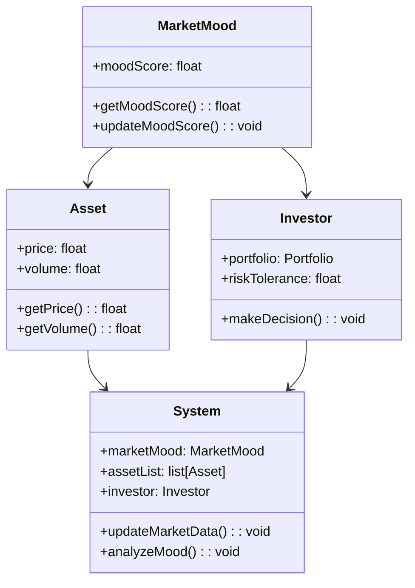
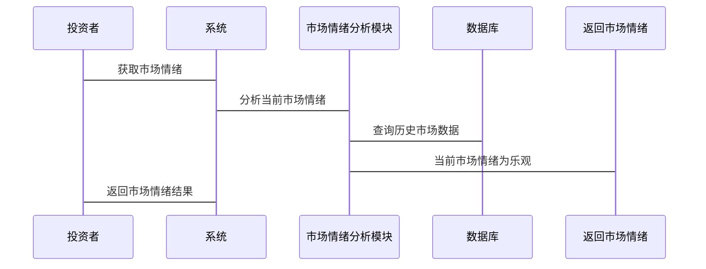

                 


# 本杰明·格雷厄姆的市场先生理论现代应用

## 关键词：市场先生理论、投资决策、市场情绪、行为金融学、风险管理、资产定价

## 摘要：本文将深入探讨本杰明·格雷厄姆提出的市场先生理论，并分析其在现代金融市场中的应用。通过结合行为金融学、技术分析和风险管理等方法，阐述市场先生理论的核心原理及其在实际投资中的应用价值。本文将从理论背景、核心概念、算法原理、系统架构、项目实战等多方面展开分析，为读者提供全面而深入的解读。

---

## 第1章：市场先生理论的背景与核心概念

### 1.1 市场先生理论的起源与发展
#### 1.1.1 本杰明·格雷厄姆的生平简介
- 本杰明·格雷厄姆：投资界的先驱，价值投资之父。
- 其他主要贡献：撰写《证券分析》和《聪明的投资者》，奠定价值投资理论基础。

#### 1.1.2 投资理论的演变历程
- 早期投资理论：基于基本面分析的价值投资。
- 现代投资组合理论的兴起：马科维茨的均值-方差优化。
- 行为金融学的崛起：心理因素对投资决策的影响。

#### 1.1.3 市场先生理论的提出背景
- 20世纪30年代经济大萧条的背景：市场恐慌与非理性行为的观察。
- 格雷厄姆对市场波动的深入研究：市场先生作为情绪化投资者的隐喻。

### 1.2 市场先生理论的核心概念
#### 1.2.1 市场先生的定义与特征
- 定义：市场先生是一个隐喻，代表市场的整体情绪和行为。
- 特征：情绪化、短期导向、非理性波动。

#### 1.2.2 市场情绪的波动性分析
- 市场情绪的周期性：牛市与熊市的交替。
- 市场先生的短期行为：过度反应与反应不足。

#### 1.2.3 投资者与市场先生的关系
- 投资者的理性与非理性：市场先生的影响与投资者的决策。
- 理性投资者的策略：利用市场先生的非理性波动获利。

### 1.3 现代市场环境下的应用背景
#### 1.3.1 当代金融市场的发展特点
- 信息爆炸：投资者获取信息的渠道多样化。
- 机构投资者的崛起：市场行为的复杂化。
- 全球化与金融创新：市场的波动性增加。

#### 1.3.2 技术进步对市场先生理论的影响
- 大数据与人工智能：市场情绪的量化分析。
- 高频交易：市场波动的加速与放大。

#### 1.3.3 全球化背景下的市场波动
- 全球市场的联动性：一个市场的波动可能影响全球。
- 地缘政治与经济政策：对市场情绪的重大影响。

### 1.4 与其他投资理论的对比
#### 1.4.1 市场先生理论与价值投资的异同
- 价值投资：注重基本面分析，寻找被低估的资产。
- 市场先生理论：关注市场情绪，寻找非理性波动带来的机会。

#### 1.4.2 行为金融学的视角分析
- 行为金融学：研究投资者心理与行为偏差。
- 市场先生理论：从市场整体情绪的角度解释波动。

#### 1.4.3 现代投资组合理论的借鉴意义
- 现代投资组合理论：通过分散投资降低风险。
- 市场先生理论：通过理解市场情绪优化投资策略。

### 1.5 本章小结
- 本章介绍了市场先生理论的背景、核心概念及其在现代市场中的应用背景，并将其与其他投资理论进行了对比分析。

---

## 第2章：市场先生理论的核心原理

### 2.1 市场情绪的量化分析
#### 2.1.1 市场情绪的衡量指标
- 市场情绪指数：通过股票市场数据计算得出。
- 市场恐慌指数：如VIX指数的计算与应用。

#### 2.1.2 市场波动的数学模型
- 市场情绪的周期性模型：正弦函数与余弦函数的应用。
- 市场波动的随机游走模型：布朗运动的数学描述。

#### 2.1.3 市场先生的理性与非理性
- 理性市场假设：市场价格反映所有信息。
- 非理性市场假设：市场先生的短期情绪波动。

### 2.2 市场先生的决策过程
#### 2.2.1 投资者心理分析
- 投资者心理的双重性：贪婪与恐惧。
- 投资者行为的偏差：过度自信、从众心理。

#### 2.2.2 市场情绪的周期性
- 市场情绪的波动周期：从乐观到恐慌再到乐观。
- 市场情绪的驱动因素：经济数据、政策变化、突发事件。

#### 2.2.3 市场先生的短期行为与长期趋势
- 短期行为：市场的过度反应与反应不足。
- 长期趋势：市场价值的回归。

### 2.3 市场先生理论的数学模型
#### 2.3.1 市场情绪的波动方程
- 情绪波动方程：$$E(t) = a \cdot E(t-1) + b \cdot \text{Market Data} + c$$
- 参数解释：$a$为情绪延续性系数，$b$为市场数据的影响权重，$c$为常数项。

#### 2.3.2 投资者决策的逻辑框架
- 投资者决策树：基于市场先生情绪的决策路径。
- 市场情绪对资产价格的影响模型：$$P(t) = V(t) + E(t)$$
  其中，$P(t)$为资产价格，$V(t)$为资产的内在价值，$E(t)$为情绪溢价。

#### 2.3.3 市场波动与资产定价的关系
- 资产定价模型：$$P = \frac{D}{k(1 + r)}$$
  其中，$D$为未来现金流，$k$为折现率，$r$为市场风险溢价。

### 2.4 本章小结
- 本章详细分析了市场情绪的量化方法、市场先生的决策过程以及市场波动的数学模型，为后续应用提供了理论基础。

---

## 第3章：市场先生理论的现代应用

### 3.1 行为金融学视角下的市场先生
#### 3.1.1 行为金融学的基本概念
- 行为金融学：研究投资者心理与行为对市场的影响。
- 主要理论：前景理论、有限理性理论。

#### 3.1.2 市场先生理论与行为金融学的结合
- 市场情绪的群体行为分析：从个体到整体的群体心理。
- 行为金融学对市场先生理论的补充：情绪传染与羊群效应。

#### 3.1.3 市场情绪对投资决策的影响
- 投资者情绪对资产配置的影响：$$A = \alpha \cdot M + \beta \cdot F$$
  其中，$A$为资产配置，$M$为市场情绪，$F$为基本面因素。

### 3.2 技术分析与市场先生理论的结合
#### 3.2.1 技术分析的基本原理
- 技术分析：通过历史价格和成交量预测未来走势。
- 主要工具：K线图、均线、成交量指标。

#### 3.2.2 市场先生理论对技术分析的启示
- 市场情绪与技术指标的关系：情绪波动对成交量和价格趋势的影响。
- 市场先生理论如何改进技术分析：结合情绪指标优化技术分析模型。

#### 3.2.3 市场情绪与技术指标的关系
- 技术指标的情绪化解释：如RSI（相对强弱指数）反映市场超买或超卖状态。

### 3.3 市场先生理论在风险管理中的应用
#### 3.3.1 风险管理的基本概念
- 风险管理：识别、评估和控制投资风险。
- 主要工具：VaR（在险值）、CVaR（条件在险值）。

#### 3.3.2 市场先生理论对风险管理的贡献
- 通过分析市场情绪优化风险敞口：$$R = \sum w_i \cdot r_i$$
  其中，$w_i$为权重，$r_i$为各资产的风险值。

#### 3.3.3 市场情绪与风险控制的结合
- 动态调整风险敞口：根据市场情绪变化调整资产配置。

### 3.4 本章小结
- 本章探讨了市场先生理论在行为金融学、技术分析和风险管理中的现代应用，展示了其在实际投资中的价值。

---

## 第4章：系统分析与架构设计方案

### 4.1 问题场景介绍
- 投资者如何利用市场先生理论优化投资策略。
- 系统设计的目标：构建一个基于市场情绪分析的投资决策支持系统。

### 4.2 项目介绍
- 项目名称：市场情绪驱动的智能投资系统。
- 项目目标：利用市场先生理论，结合大数据和人工智能技术，提供智能化的投资决策支持。

### 4.3 系统功能设计
#### 4.3.1 领域模型（Mermaid 类图）


### 4.4 系统架构设计
#### 4.4.1 系统架构（Mermaid 架构图）


### 4.5 系统接口设计
#### 4.5.1 API 接口
- 获取市场情绪：`/api/market/mood`
- 获取资产价格：`/api/asset/price`
- 风险评估：`/api/risk/assessment`

#### 4.5.2 接口交互流程
- 投资者发起请求：`/api/market/mood`
- 系统调用市场情绪分析模块：计算当前市场情绪并返回结果。

### 4.6 系统交互流程（Mermaid 序列图）


### 4.7 本章小结
- 本章通过系统分析与架构设计，展示了如何将市场先生理论应用于实际投资系统中。

---

## 第5章：项目实战——基于市场先生理论的量化交易系统

### 5.1 环境安装与配置
#### 5.1.1 环境要求
- 操作系统：Windows/Mac/Linux
- 开发工具：Python、Jupyter Notebook
- 依赖库：Pandas、NumPy、Matplotlib、Scikit-learn

#### 5.1.2 数据源配置
- 数据获取：使用Yahoo Finance API获取历史数据。
- 数据存储：使用本地数据库存储市场情绪指标。

### 5.2 系统核心实现
#### 5.2.1 市场情绪计算模块
```python
import pandas as pd
import numpy as np

def calculate_market_mood(prices, volumes):
    # 计算市场情绪指标（示例）
    mood = 0.5 * (prices.pct_change().mean() + volumes.pct_change().mean())
    return mood
```

#### 5.2.2 投资决策模块
```python
def investment_decision(mood, portfolio_value):
    if mood > 0.7:
        return "Buy"
    elif mood < 0.3:
        return "Sell"
    else:
        return "Hold"
```

#### 5.2.3 策略回测模块
```python
def backtest(mood_series, prices):
    # 简单的回测逻辑
    strategy = []
    for i in range(len(mood_series)):
        if mood_series[i] > 0.7:
            strategy.append("Buy")
        elif mood_series[i] < 0.3:
            strategy.append("Sell")
        else:
            strategy.append("Hold")
    # 计算收益
    returns = [prices[i+1]/prices[i] if strategy[i] == "Buy" else 1 if strategy[i] == "Hold" else 0.9 for i in range(len(prices)-1)]
    total_return = np.prod(returns)
    return total_return
```

### 5.3 代码解读与分析
#### 5.3.1 市场情绪计算模块
- 输入：资产价格和成交量数据。
- 输出：市场情绪指标（0到1之间）。
- 实现：基于价格和成交量的变化率计算市场情绪。

#### 5.3.2 投资决策模块
- 输入：市场情绪和投资组合价值。
- 输出：投资决策（买入、卖出或持有）。
- 实现：根据市场情绪阈值做出决策。

#### 5.3.3 策略回测模块
- 输入：市场情绪序列和资产价格数据。
- 输出：投资策略的总收益。
- 实现：根据投资决策计算资产收益。

### 5.4 案例分析与详细解读
#### 5.4.1 案例选择
- 选择一个具体的资产（如标普500指数）进行回测。
- 数据时间范围：2010年至今。

#### 5.4.2 实施步骤
1. 获取历史数据。
2. 计算市场情绪指标。
3. 制定投资策略。
4. 回测策略并计算收益。

#### 5.4.3 结果分析
- 策略收益：与市场基准收益对比。
- 策略的有效性：统计显著性检验。

### 5.5 本章小结
- 本章通过一个具体的量化交易系统案例，展示了如何将市场先生理论应用于实际投资中。

---

## 第6章：最佳实践与注意事项

### 6.1 投资策略的动态调整
- 定期评估市场情绪：根据市场变化调整投资策略。
- 动态优化模型参数：根据新数据更新市场情绪计算模型。

### 6.2 风险管理的重要性
- 设置止损点：避免重大损失。
- 分散投资：降低单一资产的风险。

### 6.3 系统实施的注意事项
- 数据质量：确保市场数据的准确性和完整性。
- 系统稳定性：保证系统在极端市场条件下的稳定运行。

### 6.4 持续学习与优化
- 关注市场环境变化：及时调整投资策略。
- 学习新技术：利用人工智能和大数据优化市场情绪分析。

### 6.5 本章小结
- 本章总结了实施市场先生理论的最佳实践和注意事项，为读者提供了实用的建议。

---

## 第7章：总结与展望

### 7.1 本章总结
- 本文系统地介绍了市场先生理论的核心概念、算法原理及其在现代金融中的应用。
- 通过系统设计和项目实战，展示了如何将市场先生理论应用于实际投资决策。

### 7.2 未来展望
- 市场先生理论与人工智能的结合：利用机器学习优化市场情绪分析。
- 多因子模型的应用：将市场情绪与其他因子结合，构建更有效的投资策略。

### 7.3 本章小结
- 本文为读者提供了全面而深入的市场先生理论现代应用分析，并展望了未来的发展方向。

---

## 附录

### 附录A：常用市场情绪指标

#### A.1 市场情绪指标列表
- VIX指数：波动率指数。
- 恐慌指数：基于市场交易量和价格波动计算的指标。
- 市场广度指标：基于市场参与度的指标。

#### A.2 市场情绪指标的计算方法
- VIX指数计算公式：$$VIX = \sqrt{\frac{1}{T} \sum_{i=1}^{T} (\text{ln}(P_i) - \text{ln}(P_{i-1}))^2}$$
  其中，$T$为时间窗口，$P_i$为第$i$时刻的价格。

### 附录B：相关工具与资源

#### B.1 市场情绪分析工具
- Python库：Pandas、NumPy、Scikit-learn。
- 第三方API：Yahoo Finance、Alpha Vantage。

#### B.2 学术资源与推荐阅读
- 格雷厄姆的经典著作：《证券分析》、《聪明的投资者》。
- 行为金融学推荐读物：《怪诞行为学》。

---

## 结束语

本文通过系统性的分析，深入探讨了本杰明·格雷厄姆的市场先生理论，并结合现代金融理论与技术，展示了其在实际投资中的应用价值。希望本文能为投资者和研究人员提供有价值的参考与启发。

