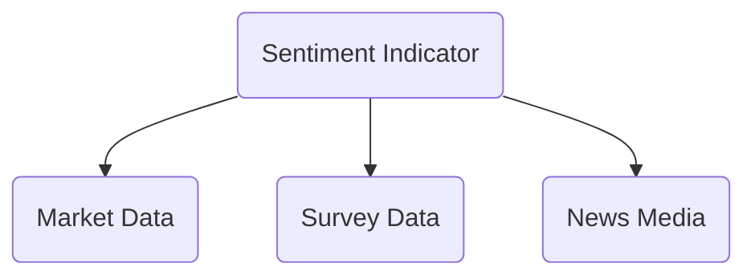
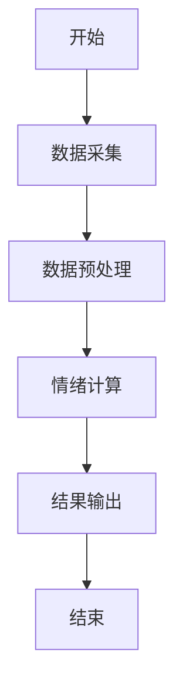
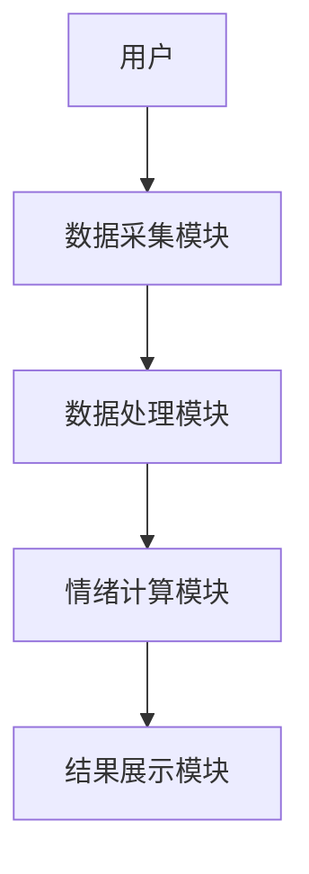

                 


# 本杰明·格雷厄姆的投资者情绪指标

---

## 关键词

- 投资者情绪指标
- 本杰明·格雷厄姆
- 市场情绪分析
- 投资决策
- 价值投资

---

## 摘要

本杰明·格雷厄姆的投资者情绪指标是价值投资的重要工具之一，用于分析市场参与者的情绪变化，从而辅助投资决策。本文将从投资者情绪指标的背景、核心概念、算法原理、系统设计、实战案例和最佳实践等方面展开详细探讨，结合数学模型、mermaid图表和实际案例，帮助读者全面理解投资者情绪指标的理论与应用。

---

## 第1章 投资者情绪指标的背景与意义

### 1.1 投资者情绪指标的定义与核心概念

#### 1.1.1 投资者情绪指标的定义

投资者情绪指标（Investor Sentiment Index）是衡量市场参与者情绪状态的量化工具，用于分析市场乐观或悲观的程度。它通过收集市场行为数据、新闻媒体分析、社交媒体情绪等多源信息，综合评估投资者的心理状态。

#### 1.1.2 投资者情绪的核心要素

- 市场参与度：投资者的交易行为频率和活跃程度。
- 信心水平：投资者对市场未来走势的预期。
- 风险偏好：投资者对高风险资产的配置意愿。

#### 1.1.3 投资者情绪指标与投资决策的关系

投资者情绪指标是投资决策的重要参考，可以帮助投资者识别市场过度乐观或悲观的情况，避免情绪化决策。

### 1.2 投资者情绪指标的发展历程

#### 1.2.1 早期投资者情绪分析的起源

投资者情绪分析起源于20世纪初，当时主要通过观察市场行为和价格波动来推测投资者情绪。

#### 1.2.2 本杰明·格雷厄姆的投资者情绪理论

格雷厄姆提出，市场的定价反映了投资者的集体情绪，而非实际的内在价值。他强调在市场恐慌时买入，在市场狂热时卖出。

#### 1.2.3 现代投资者情绪指标的发展

随着技术进步，投资者情绪指标的计算方法更加多样化，结合大数据和人工智能技术，分析能力显著提升。

### 1.3 投资者情绪指标的应用场景

#### 1.3.1 股票市场中的情绪分析

通过情绪指标判断市场的超买或超卖状态，辅助股票投资决策。

#### 1.3.2 债券市场中的情绪分析

债券市场的投资者情绪指标可以反映市场的风险偏好变化，帮助投资者调整债券配置。

#### 1.3.3 其他金融市场的应用

情绪指标在外汇、 commodities等市场中也有广泛应用，帮助投资者捕捉市场趋势。

### 1.4 投资者情绪指标的局限性与挑战

#### 1.4.1 数据获取的难度

情绪指标的准确性依赖于高质量的数据来源，数据获取成本较高。

#### 1.4.2 情绪指标的滞后性

情绪指标通常基于过去的数据计算，无法实时反映当前市场情绪。

#### 1.4.3 市场环境的复杂性

市场情绪受多种因素影响，情绪指标难以全面捕捉所有变量。

### 1.5 本章小结

投资者情绪指标是价值投资的重要工具，通过分析市场情绪变化，帮助投资者做出更为理性的决策。

---

## 第2章 投资者情绪指标的核心概念与联系

### 2.1 投资者情绪指标的核心原理

#### 2.1.1 投资者情绪的形成机制

市场情绪由投资者的个体心理和集体行为共同驱动，受经济基本面、市场环境和社会事件的影响。

#### 2.1.2 情绪指标的数学模型

投资者情绪指标可以通过以下公式计算：

$$
\text{情绪指数} = \frac{\sum (\text{情绪得分}_i \times \text{权重}_i)}{\sum \text{权重}_i}
$$

其中，情绪得分反映投资者对市场的看法，权重表示不同数据源的影响力。

#### 2.1.3 情绪指标与市场行为的关系

投资者情绪指标与市场波动率、成交量等指标密切相关。例如，当情绪指数高于中性值时，市场可能处于超买状态。

### 2.2 投资者情绪指标的属性特征对比

以下为几种常见情绪指标的对比分析：

| 指标名称       | 数据来源         | 计算方法             | 指标范围         |
|----------------|------------------|----------------------|------------------|
| 投资者信心指数   | 市场调查          | 加权平均法           | 0-100            |
| 恐慌指数         | 市场波动率         | 标准差计算           | 0-100            |
| 投资者行为指数   | 交易量分析        | 比较法               | 0-100            |

### 2.3 投资者情绪指标的ER实体关系图

以下为投资者情绪指标的实体关系图：



### 2.4 本章小结

通过分析投资者情绪指标的核心原理和属性特征，我们可以更好地理解其在投资决策中的作用。

---

## 第3章 投资者情绪指标的算法原理

### 3.1 投资者情绪指标的计算方法

#### 3.1.1 基于文本分析的情绪指标计算

使用自然语言处理技术分析新闻和社交媒体文本，提取情绪关键词并计算情绪得分。

#### 3.1.2 基于市场数据的情绪指标计算

通过分析成交量、波动率等市场数据，构建情绪指标的数学模型。

#### 3.1.3 基于行为数据的情绪指标计算

利用投资者的交易行为数据，如买卖订单比例，计算情绪指数。

### 3.2 投资者情绪指标的数学模型

#### 3.2.1 情绪指标的数学表达式

以下为基于市场数据的情绪指标计算公式：

$$
\text{情绪指数} = \frac{\sum (\text{波动率}_i \times \text{权重}_i)}{\sum \text{权重}_i}
$$

#### 3.2.2 情绪指标的权重分配

权重分配通常基于数据源的可靠性和影响力，例如市场数据权重较高，新闻数据权重较低。

#### 3.2.3 情绪指标的验证与优化

通过历史数据回测验证模型的有效性，并根据市场变化进行参数优化。

### 3.3 投资者情绪指标的算法流程图

以下为算法流程图：



### 3.4 本章小结

通过详细分析投资者情绪指标的计算方法和数学模型，我们可以更好地理解其算法原理。

---

## 第4章 投资者情绪指标的系统分析与架构设计

### 4.1 投资者情绪指标的系统功能设计

#### 4.1.1 系统功能模块划分

系统功能模块包括数据采集、情绪计算、结果展示和报告生成。

#### 4.1.2 系统功能模块的交互设计

用户通过界面输入数据，系统计算并展示情绪指标结果。

#### 4.1.3 系统功能模块的实现方法

使用Python编写数据处理逻辑，前端采用HTML和JavaScript实现用户界面。

### 4.2 投资者情绪指标的系统架构设计

以下为系统架构设计图：



### 4.3 投资者情绪指标的系统接口设计

系统接口包括数据输入接口和结果输出接口，采用RESTful API设计。

### 4.4 投资者情绪指标的系统交互设计

以下为系统交互设计图：


### 4.5 本章小结

通过系统分析与架构设计，我们可以构建一个完整的投资者情绪指标分析系统。

---

## 第5章 投资者情绪指标的实战案例

### 5.1 投资者情绪指标的环境安装

需要安装Python、Pandas、NumPy等工具，以及相应的数据接口库。

### 5.2 投资者情绪指标的核心实现源代码

以下是Python代码示例：

```python
import pandas as pd
import numpy as np

def calculate_sentiment_index(data):
    # 数据预处理
    data = data.dropna()
    # 计算情绪指数
    weights = [0.5, 0.3, 0.2]
    sentiment_scores = []
    for row in data:
        score = np.sum(np.array(row) * weights)
        sentiment_scores.append(score)
    return pd.DataFrame(sentiment_scores)

# 示例数据
data = pd.DataFrame({
    'Market Data': [0.7, 0.6, 0.8],
    'Survey Data': [0.5, 0.4, 0.6],
    'News Media': [0.3, 0.2, 0.4]
})

# 计算情绪指数
result = calculate_sentiment_index(data)
print(result)
```

### 5.3 投资者情绪指标的代码应用解读与分析

通过代码实现投资者情绪指标的计算，并分析结果的实际意义。

### 5.4 投资者情绪指标的实际案例分析

以2020年新冠疫情为例，分析情绪指标在市场预测中的应用。

### 5.5 投资者情绪指标的详细讲解与剖析

结合具体案例，详细讲解情绪指标的计算过程和实际应用。

### 5.6 本章小结

通过实际案例分析，我们可以更好地理解投资者情绪指标的理论与实践应用。

---

## 第6章 投资者情绪指标的最佳实践

### 6.1 投资者情绪指标的使用技巧

- 定期更新数据，保持指标的准确性。
- 结合其他市场指标，进行综合分析。

### 6.2 投资者情绪指标的注意事项

- 情绪指标仅供参考，不能作为投资决策的唯一依据。
- 注意数据质量和来源的可靠性。

### 6.3 投资者情绪指标的拓展阅读

推荐相关书籍和文献，进一步深入学习。

### 6.4 本章小结

通过最佳实践，我们可以更高效地应用投资者情绪指标进行投资决策。

---

## 附录

### 附录A 投资者情绪指标的常见问题解答

### 附录B 投资者情绪指标的数学模型详细推导

### 附录C 投资者情绪指标的系统设计图

---

## 参考文献

（此处列出相关书籍和文献）

---

## 结语

投资者情绪指标是价值投资的重要工具，通过本文的详细讲解，读者可以全面掌握其理论与实践应用。希望本文能为投资者在情绪分析和投资决策中提供有价值的参考。

