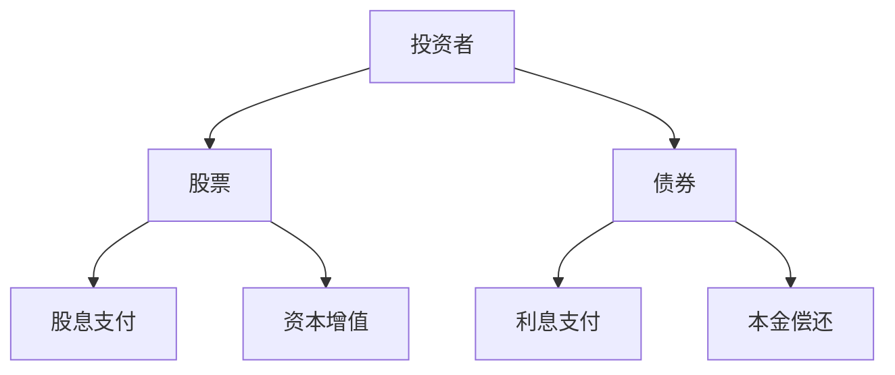
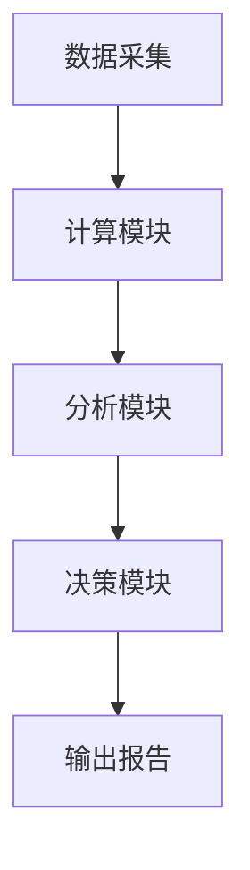
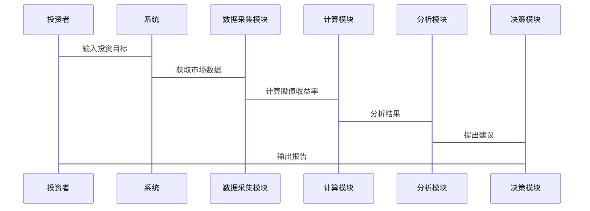

                 


# 本杰明·格雷厄姆的股债收益率比较分析

## 关键词：股债收益率，股票收益率，债券收益率，投资分析，价值投资

## 摘要：本文通过分析本杰明·格雷厄姆的经典投资理论，详细探讨股票和债券收益率的计算方法、优劣势对比，以及在不同市场环境下的表现。结合实际案例和数学模型，深入解读股债收益率的差异，并提供投资决策建议。

---

# 第一部分: 股债收益率的基本概念与背景

## 第1章: 股票与债券的定义与特点

### 1.1 股票的定义与特点
股票是公司发行的股份凭证，代表持有人对公司的所有权。其特点包括：
- **收益不稳定**：受公司业绩和市场波动影响较大。
- **高风险**：潜在收益高，但也伴随着较高的本金损失风险。
- **流动性高**：可以在二级市场上随时买卖。

### 1.2 债券的定义与特点
债券是借款人（政府或企业）向债权人借款的书面承诺，承诺按期还本付息。其特点包括：
- **收益稳定**：通常有固定的利息支付。
- **风险较低**：相对于股票，债券的风险较小，尤其是国债。
- **流动性较高**：二级市场交易活跃。

### 1.3 股债收益率的核心概念
收益率是指投资某资产在一定时期内的收益与投入本金的比率。股票收益率通常指股息收益率或资本增值收益率，而债券收益率则指到期收益率或当前收益率。

---

## 第2章: 股债收益率的计算方法

### 2.1 股票收益率的计算
股票收益率可以通过以下公式计算：

$$
\text{股票收益率} = \frac{\text{股息} + \text{资本增值}}{\text{初始投资}}
$$

其中，资本增值为股票卖出价格减去买入价格。

### 2.2 债券收益率的计算
债券的到期收益率（YTM）计算较为复杂，公式如下：

$$
\text{YTM} = \frac{C + \frac{F - P}{n}}{n}
$$

其中：
- \( C \) 是每年的利息支付
- \( F \) 是债券面值
- \( P \) 是债券的市场价格
- \( n \) 是剩余期限（年）

### 2.3 股债收益率的对比分析
股票收益率受市场波动影响较大，而债券收益率相对稳定。股票的长期收益率通常高于债券，但波动性也更大。

---

## 第3章: 股债收益率的理论基础

### 3.1 股票收益率的理论模型
股票收益率的理论模型包括：
- **CAPM模型**：计算股票的期望收益率。
- **市盈率与市净率分析**：通过估值指标判断股票的内在价值。

### 3.2 债券收益率的理论模型
债券收益率的理论模型包括：
- **到期收益率**：考虑债券的面值、价格、期限和利息。
- **信用评级影响**：评级越低，收益率越高。

### 3.3 股债收益率的理论对比
股票和债券收益率的差异主要体现在风险、收益和流动性上。股票的风险更高，但长期收益潜力更大。

---

## 第4章: 股债收益率的核心概念与联系

### 4.1 股票与债券的对比分析
股票和债券的对比可以通过以下表格展示：

| 对比维度 | 股票 | 债券 |
|----------|------|------|
| 收益 | 股息+资本增值 | 固定利息+本金偿还 |
| 风险 | 高 | 低 |
| 流动性 | 高 | 高 |

### 4.2 股债收益率的ER实体关系图



---

## 第5章: 股债收益率的算法原理

### 5.1 股票收益率的计算算法
股票收益率的计算公式为：

$$
\text{股息收益率} = \frac{\text{每股股息}}{\text{股票价格}}
$$

例如，某股票每股股息为1元，股价为10元，则股息收益率为10%。

### 5.2 债券收益率的计算算法
债券到期收益率的计算公式为：

$$
\text{YTM} = \frac{C + \frac{F - P}{n}}{n}
$$

例如，面值为100元，价格为90元，期限为5年，每年利息为10元，则YTM为11.11%。

### 5.3 股债收益率的对比算法
通过比较股票和债券的收益率，投资者可以根据自身风险承受能力选择合适的投资标的。

---

## 第6章: 股债收益率的系统分析与架构设计

### 6.1 投资决策系统的功能设计
投资决策系统的功能模块包括：
- 数据采集模块：收集股票和债券的市场数据。
- 计算模块：计算股债收益率。
- 分析模块：对比分析股债收益率。

### 6.2 系统架构图



### 6.3 系统交互图



---

## 第7章: 股债收益率的项目实战

### 7.1 项目环境与工具安装
- 环境：Python 3.8+
- 工具：Pandas、Matplotlib

### 7.2 核心代码实现

```python
import pandas as pd
import matplotlib.pyplot as plt

# 示例数据
stocks = pd.DataFrame({
    '股票': ['A', 'B', 'C'],
    '股息收益率': [0.05, 0.03, 0.08],
    '股价': [10, 20, 15]
})

bonds = pd.DataFrame({
    '债券': ['X', 'Y', 'Z'],
    '到期收益率': [0.06, 0.04, 0.07],
    '期限': [5, 10, 15]
})

# 计算股票收益率
stocks['股息收益率'] = stocks['股息收益率'] * stocks['股价']

# 可视化对比
plt.figure(figsize=(10, 6))
plt.plot(stocks['股票'], stocks['股息收益率'], 'ro-', label='股票')
plt.plot(bonds['债券'], bonds['到期收益率'], 'b*-', label='债券')
plt.xlabel('标的')
plt.ylabel('收益率')
plt.title('股债收益率对比')
plt.legend()
plt.show()
```

### 7.3 代码解读与分析
上述代码计算了股票和债券的收益率，并通过可视化工具对比了两者的收益率差异。

---

## 第8章: 总结与最佳实践

### 8.1 小结
股票和债券的收益率各有优劣，投资者应根据自身风险偏好选择合适的投资标的。

### 8.2 注意事项
- 定期复盘和调整投资组合。
- 注意市场环境的变化对股债收益率的影响。

### 8.3 拓展阅读
- 《投资学》
- 《股票与债券市场分析》

---

通过以上分析，我们可以清晰地理解股债收益率的差异及其在投资决策中的应用。希望本文能为投资者提供有价值的参考。

