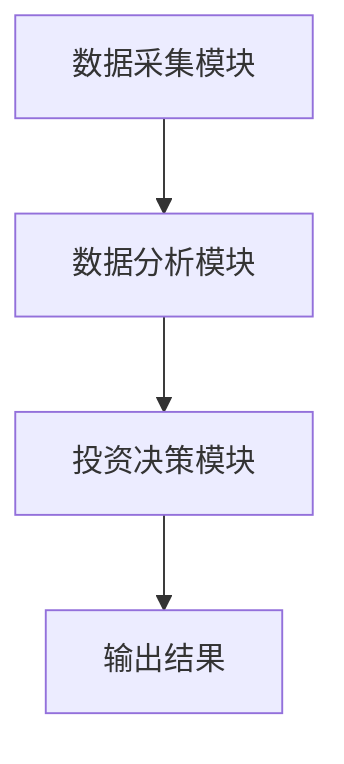

                 


# 本杰明格雷厄姆的财务分析方法

> 关键词：本杰明·格雷厄姆，价值投资，财务分析，安全边际，内在价值，现金流折现法，投资策略

> 摘要：本杰明·格雷厄姆是价值投资的鼻祖，他的财务分析方法强调通过基本面分析来确定股票的内在价值，并通过安全边际来降低投资风险。本文将详细探讨格雷厄姆的财务分析方法，包括其核心概念、算法原理、系统设计和实际案例分析。

---

## 第一部分：引言

### 第1章：投资学的基础与本杰明·格雷厄姆的贡献

#### 1.1 投资学的基本概念
投资是将资金投入到资产中以获取未来收益的行为。投资可以分为不同类型，包括股票、债券、房地产等。投资的基本原则包括分散投资、长期持有和价值评估。

#### 1.2 本杰明·格雷厄姆的生平与贡献
本杰明·格雷厄姆（1897-1976）是美国著名的投资学家，被誉为“价值投资之父”。他在《证券分析》一书中提出了许多经典的财务分析方法，如内在价值计算、安全边际等。他的投资理念深刻影响了后来的投资者，包括沃伦·巴菲特。

---

## 第二部分：核心概念与联系

### 第2章：安全边际与内在价值

#### 2.1 安全边际的概念与重要性
安全边际是指股票的市场价格低于其内在价值的部分。通过安全边际，投资者可以降低投资风险，确保在市场波动中仍能获得收益。

| 安全边际 | 内在价值 | 市场价格 |
|----------|-----------|----------|
| 高       | 高        | 低于内在价值 |

#### 2.2 内在价值的计算方法
内在价值是通过分析公司的财务状况、盈利能力等因素，计算出股票的真正价值。公式为：

$$\text{内在价值} = \sum_{t=1}^{n} \frac{\text{现金流}}{(1 + r)^t}$$

其中，\( r \) 是折现率，\( t \) 是时间。

#### 2.3 安全边际与内在价值的关系
安全边际 = 内在价值 - 市场价格

---

## 第三部分：财务报表分析

### 第3章：如何通过财务报表评估公司价值

#### 3.1 财务报表分析的基础知识
财务报表包括资产负债表、利润表和现金流量表。通过分析这些报表，可以了解公司的财务状况、盈利能力和发展潜力。

#### 3.2 格雷厄姆的财务指标分析方法
格雷厄姆常用市盈率、市净率和股息率等指标来评估公司价值。

- 市盈率 = 股价 / 每股收益
- 市净率 = 股价 / 每股净资产
- 股息率 = 每股股息 / 股价

#### 3.3 如何通过财务报表计算内在价值
格雷厄姆的现金流折现法是一种常用的内在价值计算方法。公式为：

$$\text{内在价值} = \sum_{t=1}^{n} \frac{\text{现金流}}{(1 + r)^t} + \text{终值}$$

其中，终值是未来现金流的终值。

---

## 第四部分：投资策略

### 第4章：格雷厄姆的投资策略与实施步骤

#### 4.1 格雷厄姆的投资策略概述
格雷厄姆的投资策略包括以下步骤：

1. 确定投资目标。
2. 选择具有安全边际的股票。
3. 长期持有优质股票。

#### 4.2 格雷厄姆投资策略的实施步骤
1. 分析财务报表，计算内在价值。
2. 选择市场价格低于内在价值的股票。
3. 长期持有，避免频繁交易。

---

## 第五部分：数学模型

### 第5章：内在价值的计算方法

#### 5.1 现金流折现法
现金流折现法是一种常用的内在价值计算方法。公式为：

$$\text{内在价值} = \sum_{t=1}^{n} \frac{\text{现金流}}{(1 + r)^t}$$

其中，\( r \) 是折现率，\( t \) 是时间。

#### 5.2 格雷厄姆的过滤器方法
格雷厄姆的过滤器方法是一种通过筛选财务指标来选择股票的方法。具体步骤如下：

1. 选择市盈率低于行业平均水平的股票。
2. 选择市净率低于行业平均水平的股票。

---

## 第六部分：系统设计

### 第6章：构建基于格雷厄姆方法的投资分析系统

#### 6.1 系统架构设计
系统架构包括数据采集模块、数据分析模块和投资决策模块。



#### 6.2 系统功能设计
系统功能包括：

1. 数据采集：从财务报表中提取数据。
2. 数据分析：计算内在价值和安全边际。
3. 投资决策：根据分析结果做出投资决策。

---

## 第七部分：项目实战

### 第7章：具体案例分析与实际操作过程

#### 7.1 项目环境安装
需要安装Python和相关的数据分析库。

#### 7.2 核心实现代码
以下是Python代码示例：

```python
def calculate_intrinsic_value(cash_flow, discount_rate, horizon):
    iv = 0
    for t in range(1, horizon + 1):
        iv += cash_flow[t] / (1 + discount_rate) ** t
    return iv

cash_flow = [100, 120, 150, 200]
discount_rate = 0.1
horizon = 4

intrinsic_value = calculate_intrinsic_value(cash_flow, discount_rate, horizon)
print("内在价值为：", intrinsic_value)
```

#### 7.3 案例分析与解读
以微软为例，计算其内在价值和安全边际。

---

## 第八部分：最佳实践与总结

### 第8章：总结经验、注意事项与拓展阅读

#### 8.1 最佳实践
1. 长期持有优质股票。
2. 定期重新评估投资组合。

#### 8.2 小结
本杰明·格雷厄姆的财务分析方法是一种有效的投资策略，通过计算内在价值和安全边际，投资者可以降低风险并获得长期收益。

#### 8.3 注意事项
1. 投资需谨慎，避免盲目跟风。
2. 定期重新评估投资组合。

#### 8.4 拓展阅读
建议阅读《证券分析》和《聪明的投资者》等书籍，深入理解格雷厄姆的投资理念。

--- 

# 结语

本杰明·格雷厄姆的财务分析方法是一种经典的投资策略，通过基本面分析和安全边际的概念，投资者可以更好地进行投资决策。希望本文能为您提供有价值的投资思路和方法。

