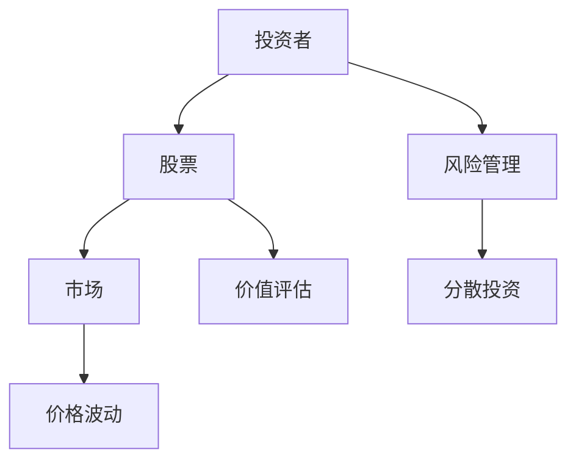
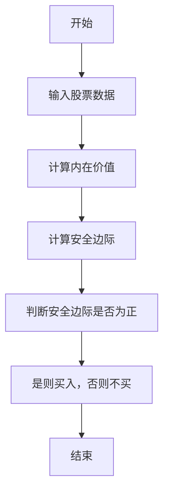
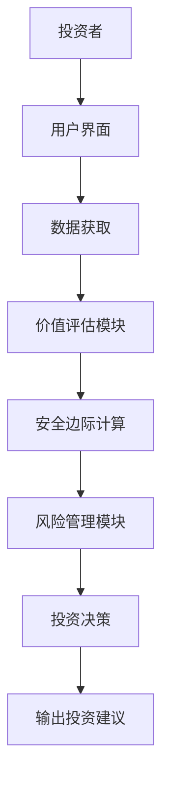
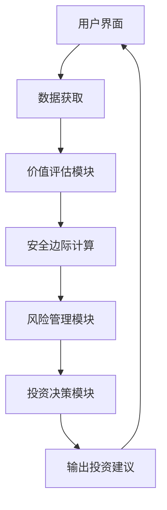

                 


# 本杰明格雷厄姆的防御型投资者策略

> 关键词：防御型投资，安全边际，价值评估，风险管理，投资组合

> 摘要：本杰明·格雷厄姆的防御型投资者策略是一种以安全边际为核心，注重长期稳健投资的策略。本文将详细分析该策略的核心概念、算法原理、系统架构、项目实战及最佳实践，帮助投资者更好地理解如何在复杂多变的市场环境中构建稳健的投资组合。

---

# 第一部分: 防御型投资的背景与核心概念

## 第1章: 防御型投资的起源与核心原则

### 1.1 本杰明·格雷厄姆的生平与投资理念

#### 1.1.1 本杰明·格雷厄姆的生平简介
- **出生与早年经历**：本杰明·格雷厄姆（1897-1976）出生于美国纽约，早年经历了经济大萧条的洗礼，这使得他对稳健投资的重要性有深刻的认识。
- **学术与职业成就**：他曾在哥伦比亚大学学习，并与戴维·多德共同开发了基本面分析方法，后来成为纽约证券交易所的资深分析师和投资顾问。
- **投资哲学**：格雷厄姆主张“安全边际”投资法，强调以低于内在价值的价格买入优质资产，以降低投资风险并确保长期收益。

#### 1.1.2 格雷厄姆的投资哲学与核心思想
- **价值投资**：格雷厄姆认为，市场的波动是投资者的机遇，而不是风险。投资者应关注企业的内在价值，而非市场短期波动。
- **安全边际**：他提出，投资者应以低于内在价值的价格买入资产，以确保在市场下跌时仍有足够的安全空间。
- **长期投资**：格雷厄姆主张长期持有优质资产，避免频繁交易，以减少交易成本和市场波动的影响。

#### 1.1.3 格雷厄姆与巴菲特的师徒关系
- **巴菲特的学习经历**：巴菲特是格雷厄姆的学生，深受其影响，并将格雷厄姆的投资理念发扬光大。
- **格雷厄姆对巴菲特的影响**：格雷厄姆的防御型投资策略为巴菲特的“价值投资”奠定了基础。

### 1.2 防御型投资的定义与特点

#### 1.2.1 防御型投资的定义
- 防御型投资是一种以稳健为核心，注重长期收益的投资策略。它强调以低于内在价值的价格买入优质资产，以降低市场波动带来的风险。

#### 1.2.2 防御型投资的核心特点
- **注重安全边际**：防御型投资者关注资产的内在价值，确保以合理的价格买入。
- **长期导向**：防御型投资注重长期收益，而非短期市场波动。
- **稳健风险控制**：防御型投资通过分散投资和风险控制，降低投资组合的整体波动性。

#### 1.2.3 防御型投资与进攻型投资的对比
| 特性                | 防御型投资                     | 进攻型投资                     |
|---------------------|-------------------------------|-------------------------------|
| 投资目标            | 稳健收益，降低波动性           | 高收益，高风险               |
| 投资策略            | 买入低估资产，长期持有         | 短期交易，追求市场波动收益     |
| 风险承受能力        | 低风险承受能力                | 高风险承受能力                |
| 适合场景            | 稳定增长，避免大幅波动         | 快速增长，愿意承担高风险       |

### 1.3 防御型投资的适用场景与边界

#### 1.3.1 防御型投资的适用场景
- **经济不确定性**：在经济衰退或市场波动剧烈时，防御型投资策略能够提供一定的保护。
- **长期稳健收益**：适合那些追求长期稳健收益，而非短期暴利的投资者。
- **风险厌恶型投资者**：适合风险承受能力较低的投资者。

#### 1.3.2 防御型投资的边界与外延
- **边界**：防御型投资并非万能策略，它适用于市场波动较大、资产价格被低估的环境，但不适用于市场长期牛市或资产价格已被高估的情况。
- **外延**：防御型投资策略可以与其他策略结合使用，如与成长型投资结合，形成混合型投资策略。

#### 1.3.3 防御型投资与其它投资策略的关系
- 防御型投资策略可以作为投资组合的一部分，与其他策略（如成长型、价值型）结合使用，以平衡风险和收益。

---

## 第2章: 防御型投资的核心概念与联系

### 2.1 核心概念原理

#### 2.1.1 安全边际的定义与计算
- **安全边际**：安全边际是指资产的市场价格与内在价值之间的差额。公式为：
  $$ \text{安全边际} = \text{内在价值} - \text{市场价格} $$
- **计算方法**：
  1. 评估资产的内在价值。
  2. 计算资产的市场价格。
  3. 计算两者之差，即安全边际。

#### 2.1.2 价值评估的核心模型
- **格雷厄姆的估值模型**：格雷厄姆提出了多种估值方法，包括：
  - 市盈率法：$$ P/E = \frac{\text{股价}}{\text{每股收益}} $$
  - 市净率法：$$ P/B = \frac{\text{股价}}{\text{每股净资产}} $$
  - 现金流量折现法：通过现金流折现计算内在价值。

#### 2.1.3 市场心理与行为对防御型投资的影响
- 市场心理：投资者情绪的波动会影响市场定价，防御型投资者应避免被市场情绪左右，坚持基于价值的投资。

### 2.2 核心概念属性特征对比表格

| 概念                | 特征                     |
|---------------------|--------------------------|
| 安全边际           | 确保投资的安全性，降低风险 |
| 价值评估           | 确定资产的真实价值       |
| 市场心理           | 影响市场定价，需避免情绪化 |

### 2.3 ER实体关系图



---

## 第3章: 防御型投资的算法原理

### 3.1 算法原理流程图



### 3.2 算法实现代码

```python
def calculate_margin_of_safety(stock_price, intrinsic_value):
    return intrinsic_value - stock_price

def defensive_investment_strategy(stocks):
    selected_stocks = []
    for stock in stocks:
        mos = calculate_margin_of_safety(stock['price'], stock['intrinsic_value'])
        if mos > 0:
            selected_stocks.append(stock)
    return selected_stocks
```

### 3.3 数学公式与详细讲解

- **安全边际计算公式**：
  $$ \text{安全边际} = \text{内在价值} - \text{市场价格} $$
- **价值评估公式**：
  $$ \text{内在价值} = \sum_{t=1}^{n} \frac{\text{现金流}}{(1 + r)^t} $$
  其中，\( r \) 是折现率，\( t \) 是时间周期。

---

## 第4章: 防御型投资的系统架构与实现

### 4.1 系统架构设计



### 4.2 系统功能设计

- **数据获取模块**：获取股票的历史数据和财务数据。
- **价值评估模块**：计算股票的内在价值。
- **安全边际计算模块**：计算安全边际。
- **风险管理模块**：评估投资组合的风险并进行调整。
- **投资决策模块**：根据计算结果生成投资建议。

### 4.3 系统交互设计



---

## 第5章: 项目实战与案例分析

### 5.1 实战环境安装

```bash
pip install pandas numpy matplotlib
```

### 5.2 核心代码实现

```python
import pandas as pd
import numpy as np

def calculate_intrinsic_value(stock_data, discount_rate):
    cash_flows = stock_data['cash_flow'].values
    present_value = np.npv(discount_rate, cash_flows)
    return present_value

def main():
    # 获取股票数据
    stock_data = pd.read_csv('stock_data.csv')
    # 计算内在价值
    intrinsic_value = calculate_intrinsic_value(stock_data, 0.1)
    # 计算市场价格
    market_price = stock_data['price'].values[-1]
    # 计算安全边际
    margin_of_safety = intrinsic_value - market_price
    print(f"安全边际: {margin_of_safety}")
    if margin_of_safety > 0:
        print("建议买入该股票")
    else:
        print("建议卖出该股票")

if __name__ == "__main__":
    main()
```

### 5.3 案例分析与解读

假设某股票的历史数据如下：

| 日期    | 收盘价 | 每股收益 | 每股净资产 | 现金流 |
|--------|-------|----------|------------|--------|
| 2023-01 | 50    | 10       | 20         | 100    |
| 2023-02 | 52    | 12       | 22         | 120    |
| 2023-03 | 55    | 15       | 25         | 150    |

假设折现率为10%，计算内在价值：

$$ \text{内在价值} = \frac{100}{1.1} + \frac{120}{1.1^2} + \frac{150}{1.1^3} \approx 240.94 $$

市场价格为55，计算安全边际：

$$ \text{安全边际} = 240.94 - 55 = 185.94 $$

由于安全边际为正，建议买入该股票。

---

## 第6章: 最佳实践与总结

### 6.1 最佳实践

- **长期持有**：防御型投资者应长期持有优质资产，避免频繁交易。
- **分散投资**：通过分散投资降低风险。
- **定期评估**：定期评估投资组合，调整安全边际。

### 6.2 总结

本杰明·格雷厄姆的防御型投资者策略是一种以安全边际为核心，注重长期稳健投资的策略。通过合理评估资产的内在价值，避免市场波动带来的风险，投资者可以在复杂多变的市场环境中实现稳健收益。

---

# 结语

通过本文的详细分析，读者可以更好地理解防御型投资的核心概念、算法原理和系统架构。希望本文能为投资者在实际操作中提供有价值的参考和指导。

