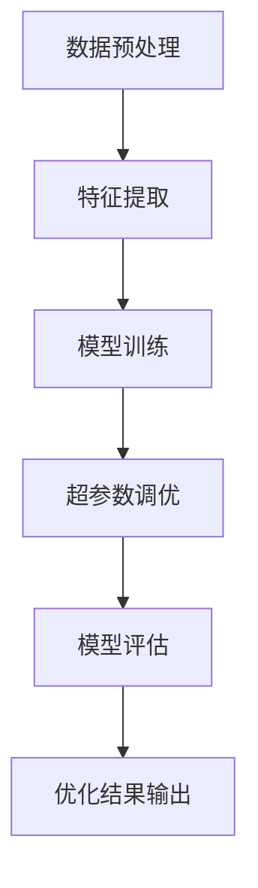
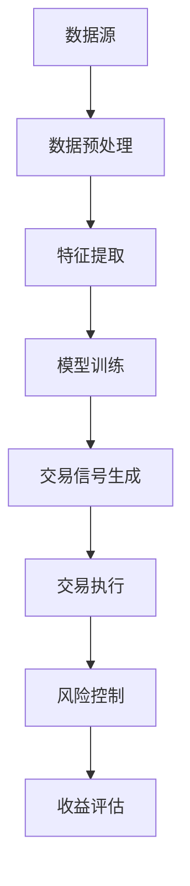
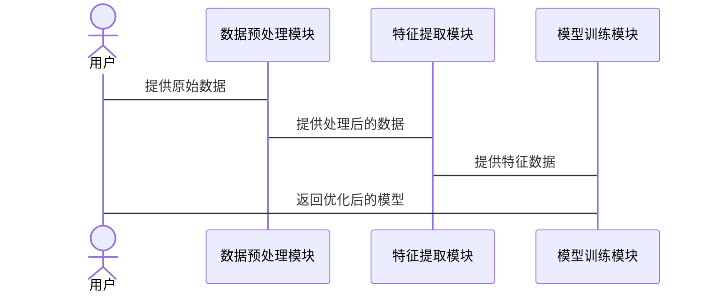

                 


# 《机器学习优化价值平均法交易策略》

## 关键词：机器学习，价值平均法，交易策略，优化，金融投资

## 摘要：本文详细探讨了如何利用机器学习技术优化价值平均法交易策略。通过分析传统价值平均法的局限性，结合机器学习算法的优势，提出了一种新的优化方法。文章从背景介绍、核心概念、算法原理、数学模型、系统架构设计、项目实战等多个维度展开，详细阐述了机器学习在优化价值平均法中的应用，并通过实际案例展示了优化后的策略效果。最后，本文总结了优化过程中的关键点，并展望了未来的研究方向。

---

# 第一部分: 机器学习优化价值平均法交易策略概述

## 第1章: 机器学习与价值平均法交易策略的背景介绍

### 1.1 问题背景与描述
#### 1.1.1 传统价值平均法交易策略的局限性
价值平均法是一种常见的交易策略，其核心思想是通过计算资产的平均价值来确定买入或卖出的时机。然而，传统价值平均法在实际应用中存在以下问题：
- 市场波动性较大时，策略的鲁棒性不足。
- 无法有效捕捉市场趋势的变化。
- 交易成本和滑点问题未被充分考虑。

#### 1.1.2 机器学习在金融交易中的应用潜力
机器学习作为一种强大的数据分析工具，已经在金融领域得到了广泛应用。其在金融交易中的优势包括：
- 能够从海量数据中提取非线性特征。
- 具备自适应学习能力，能够根据市场变化调整策略。
- 可以实现高频交易和实时决策。

#### 1.1.3 机器学习优化价值平均法的必要性
结合机器学习与价值平均法，可以充分发挥两者的优点，克服传统价值平均法的局限性。通过机器学习算法的优化，价值平均法能够在复杂多变的市场环境中实现更优的交易效果。

### 1.2 核心概念与问题解决
#### 1.2.1 价值平均法交易策略的核心要素
价值平均法的核心要素包括：
- 资产的平均价值计算方法。
- 交易信号的生成逻辑。
- 交易执行的规则。

#### 1.2.2 机器学习在优化中的作用
机器学习在价值平均法优化中的作用体现在以下几个方面：
- 提供更复杂的特征提取方法。
- 建模市场波动性，提高策略的适应性。
- 实现自适应参数调整。

#### 1.2.3 问题解决的边界与外延
优化价值平均法的边界包括：
- 数据范围的限制。
- 算法的适用场景。
- 风险控制的范围。

优化价值平均法的外延包括：
- 多策略组合优化。
- 跨市场应用。
- 动态调整策略参数。

### 1.3 概念结构与核心要素组成
#### 1.3.1 价值平均法的数学模型
价值平均法的基本公式为：
$$ V = \frac{1}{n} \sum_{i=1}^{n} p_i $$
其中，\( V \) 表示资产的平均价值，\( p_i \) 表示第 \( i \) 个价格，\( n \) 表示价格的数量。

#### 1.3.2 机器学习算法的特征提取
机器学习算法通过提取特征来捕捉数据中的有用信息。常用的特征提取方法包括：
- 主成分分析（PCA）。
- 线性判别分析（LDA）。
- Word2Vec等嵌入方法。

#### 1.3.3 优化目标与评价指标
优化目标包括：
- 提高交易收益。
- 降低交易风险。
- 减少交易成本。

评价指标包括：
- 净收益（Net Profit）。
- 收益率（Return Rate）。
- 风险调整后收益（Sharpe Ratio）。

---

## 第2章: 价值平均法与机器学习的核心概念联系

### 2.1 核心概念原理
#### 2.1.1 价值平均法的基本原理
价值平均法通过计算资产的平均价值来确定交易信号。例如，当当前价格低于平均价值时，策略建议买入；当当前价格高于平均价值时，策略建议卖出。

#### 2.1.2 机器学习算法的分类与选择
常用的机器学习算法包括：
- 线性回归。
- 支持向量机（SVM）。
- 神经网络。
- 随机森林。

#### 2.1.3 两者的结合与协同作用
价值平均法提供了一个基础框架，而机器学习算法则通过优化特征提取和模型训练来提升策略的性能。

### 2.2 核心概念属性特征对比
#### 2.2.1 价值平均法的特征分析
| 特征 | 描述 |
|------|------|
| 计算方式 | 简单平均或加权平均 |
| 响应时间 | 较慢，依赖历史数据计算 |
| 鲁棒性 | 较低，受极端值影响较大 |

#### 2.2.2 机器学习算法的特征分析
| 特征 | 描述 |
|------|------|
| 计算复杂度 | 较高，依赖大量数据 |
| 响应时间 | 较快，支持实时决策 |
| 鲁棒性 | 较高，能够捕捉非线性关系 |

#### 2.2.3 对比分析与优化方向
通过对比分析可以发现，机器学习算法在计算复杂度和非线性捕捉方面具有优势，而价值平均法则在简单性和易实现性方面具有优势。优化方向包括：
- 结合机器学习算法提升价值平均法的计算效率。
- 利用机器学习算法捕捉市场趋势，增强策略的适应性。

### 2.3 ER实体关系图架构
```mermaid
er
actor: 用户
goal: 优化交易策略
strategy: 价值平均法
algorithm: 机器学习算法
feature: 特征
target: 优化目标
```

---

## 第3章: 机器学习优化价值平均法的算法原理

### 3.1 算法原理概述
#### 3.1.1 特征工程
特征工程是机器学习优化价值平均法的关键步骤。常用的特征包括：
- 历史价格数据。
- 技术指标（如MACD、RSI）。
- 市场情绪指标。

#### 3.1.2 模型选择
选择合适的模型是优化策略的重要一步。常用的模型包括：
- 线性回归。
- 神经网络。
- 支持向量回归。

#### 3.1.3 超参数调优
超参数调优是优化模型性能的重要手段。常用的调优方法包括：
- 网格搜索（Grid Search）。
- 随机搜索（Random Search）。
- 贝叶斯优化（Bayesian Optimization）。

### 3.2 算法流程图


### 3.3 代码实现
#### 3.3.1 数据预处理
```python
import pandas as pd
data = pd.read_csv('data.csv')
```

#### 3.3.2 特征提取
```python
from sklearn.feature_selection import SelectKBest
selector = SelectKBest(k=10)
selected_features = selector.fit_transform(data)
```

#### 3.3.3 模型训练
```python
from sklearn.ensemble import RandomForestRegressor
model = RandomForestRegressor(n_estimators=100, random_state=42)
model.fit(selected_features, target)
```

#### 3.3.4 超参数调优
```python
from sklearn.model_selection import GridSearchCV
param_grid = {'n_estimators': [100, 200], 'max_depth': [None, 10]}
grid_search = GridSearchCV(RandomForestRegressor(), param_grid, cv=5)
grid_search.fit(selected_features, target)
best_model = grid_search.best_estimator_
```

### 3.4 算法的数学模型
优化后的价值平均法交易策略的数学模型如下：
$$ \text{交易信号} = \text{机器学习模型}(\text{输入特征}) $$

其中，输入特征包括：
- 历史价格数据。
- 技术指标。
- 市场情绪指标。

---

## 第4章: 数学模型与系统架构设计

### 4.1 数学模型的推导
优化后的价值平均法数学模型如下：
$$ V_{\text{优化}} = \alpha V_{\text{原始}} + (1-\alpha) V_{\text{机器学习}} $$
其中，\( \alpha \) 是调整系数，\( V_{\text{原始}} \) 是原始价值平均法计算的平均价值，\( V_{\text{机器学习}} \) 是机器学习模型预测的平均价值。

### 4.2 系统架构设计
#### 4.2.1 系统功能设计
系统功能包括：
- 数据采集与处理。
- 特征提取与模型训练。
- 交易信号生成与执行。
- 风险控制与收益评估。

#### 4.2.2 系统架构图


#### 4.2.3 系统交互序列图


---

## 第5章: 项目实战与案例分析

### 5.1 环境安装与配置
#### 5.1.1 安装必要的库
```bash
pip install numpy pandas scikit-learn matplotlib
```

#### 5.1.2 配置开发环境
推荐使用Jupyter Notebook或VS Code进行开发。

### 5.2 核心代码实现
#### 5.2.1 数据预处理
```python
import pandas as pd
data = pd.read_csv('data.csv')
data = data.dropna()
```

#### 5.2.2 特征提取
```python
from sklearn.feature_selection import SelectKBest
selected_features = SelectKBest(k=10).fit_transform(data[['feature1', 'feature2', ...]])
```

#### 5.2.3 模型训练与优化
```python
from sklearn.ensemble import RandomForestRegressor
from sklearn.model_selection import GridSearchCV

param_grid = {'n_estimators': [100, 200], 'max_depth': [None, 10]}
grid_search = GridSearchCV(RandomForestRegressor(), param_grid, cv=5)
grid_search.fit(selected_features, target)
best_model = grid_search.best_estimator_
```

#### 5.2.4 交易信号生成
```python
import numpy as np
predicted_values = best_model.predict(selected_features)
交易信号 = np.where(predicted_values > selected_features.mean(), '买入', '卖出')
```

### 5.3 案例分析
以某股票为例，假设历史数据如下：
| 日期 | 收盘价 |
|------|-------|
| 2023-01-01 | 100 |
| 2023-01-02 | 101 |
| 2023-01-03 | 99 |

经过机器学习优化后，模型预测未来的价格为102。因此，策略生成买入信号。

---

## 第6章: 最佳实践与总结

### 6.1 最佳实践
- 数据预处理是关键，确保数据质量。
- 特征工程要结合具体业务场景。
- 模型选择要基于实际数据表现。

### 6.2 小结
本文详细探讨了机器学习优化价值平均法交易策略的实现过程，通过理论分析和实践案例展示了优化后的策略效果。

### 6.3 注意事项
- 风险控制是交易策略的核心。
- 交易成本和滑点问题不可忽视。
- 模型的可解释性需要关注。

### 6.4 拓展阅读
建议进一步研究以下内容：
- 高频交易算法。
- � 强化学习在金融交易中的应用。
- 多资产组合优化策略。

