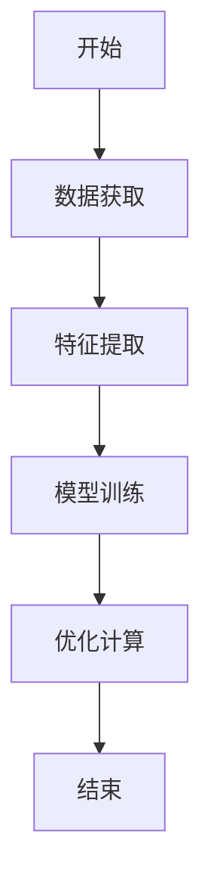
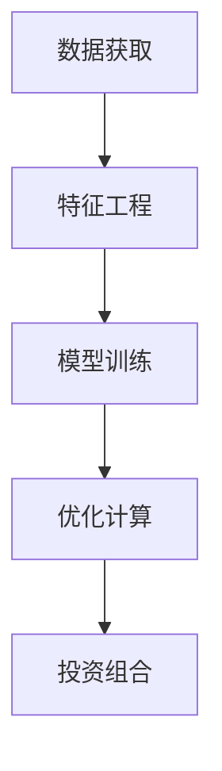
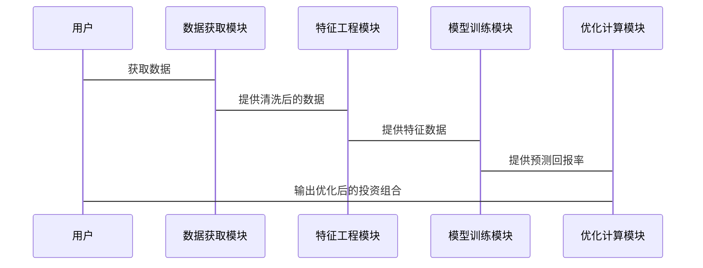

                 


# 《机器学习优化投资组合分散化》

> **关键词**：机器学习，投资组合优化，分散化，金融，风险管理

> **摘要**：  
> 本文探讨了机器学习在投资组合分散化中的应用，从理论到实践，详细分析了如何利用机器学习技术优化投资组合的分散化策略。通过介绍投资组合优化的核心概念、机器学习算法的原理、数学模型的构建以及实际案例的分析，本文为读者提供了一套系统的方法论，帮助其在金融领域实现更高效、更精准的投资组合管理。文章还讨论了机器学习优化分散化的实际应用、系统架构设计以及未来研究方向。

---

## 第1章: 机器学习与投资组合优化概述

### 1.1 机器学习的基本概念

#### 1.1.1 机器学习的定义与核心概念
机器学习是一种人工智能技术，通过数据训练模型，使其能够从经验中学习并做出预测或决策。核心概念包括监督学习、无监督学习、半监督学习和强化学习。

#### 1.1.2 机器学习与传统统计学的区别
机器学习强调从数据中自动学习模式，而传统统计学依赖于假设检验和参数估计。机器学习适用于高维、非线性问题，而传统统计学适用于低维、线性问题。

#### 1.1.3 机器学习在金融中的应用前景
金融领域数据丰富且复杂，机器学习在股票预测、风险评估和量化交易等方面具有广泛应用潜力。

### 1.2 投资组合优化的目标与意义

#### 1.2.1 投资组合优化的基本概念
投资组合优化是指在给定风险偏好下，寻找最优资产配置以最大化收益或最小化风险。

#### 1.2.2 投资组合分散化的定义与作用
分散化是通过投资不同资产来降低风险的技术。分散化的作用是减少特定资产的风险，平滑投资组合的波动性。

#### 1.2.3 机器学习在投资组合优化中的优势
机器学习能够处理海量数据，发现非线性关系，适用于复杂的投资组合优化问题。

### 1.3 机器学习与金融的结合

#### 1.3.1 机器学习在金融中的应用领域
包括股票预测、信用评分、风险管理、算法交易等。

#### 1.3.2 机器学习在投资组合优化中的应用案例
例如，利用机器学习预测资产回报率，优化资产配置。

#### 1.3.3 机器学习与投资组合优化的结合方式
通过训练模型预测资产回报和风险，构建优化模型实现分散化。

### 1.4 本章小结
机器学习为投资组合优化提供了新的方法，特别是在复杂市场条件下，能够有效提升分散化效果。

---

## 第2章: 投资组合分散化的原理与应用

### 2.1 投资组合分散化的基本原理

#### 2.1.1 风险分散的概念
通过投资不同资产或资产类别，降低单一资产风险的技术。

#### 2.1.2 现代投资组合理论（MPT）概述
MPT由Harry Markowitz提出，旨在通过优化资产配置实现风险与收益的最优平衡。

#### 2.1.3 投资组合分散化的数学模型
分散化效果可以通过方差最小化来衡量。

$$\text{目标函数：} \quad \min_w \quad w^T \Sigma w$$  
其中，\(w\) 是资产权重向量，\(\Sigma\) 是资产之间的协方差矩阵。

### 2.2 机器学习在投资组合分散化中的作用

#### 2.2.1 机器学习如何帮助实现风险分散
通过预测资产回报率，优化资产权重，降低投资组合的整体风险。

#### 2.2.2 机器学习在资产配置中的应用
基于机器学习模型预测的资产回报率，优化配置比例。

#### 2.2.3 机器学习在投资组合再平衡中的作用
动态调整资产权重，适应市场变化，维持最优分散化效果。

### 2.3 投资组合分散化的实际案例分析

#### 2.3.1 基于传统方法的分散化案例
例如，使用MPT构建一个六资产的投资组合，通过协方差矩阵计算最小方差组合。

#### 2.3.2 基于机器学习的分散化案例
利用机器学习模型预测资产回报率，优化权重，构建分散化投资组合。

#### 2.3.3 案例对比分析
对比传统方法和机器学习方法在分散化效果、收益和风险方面的表现。

### 2.4 本章小结
机器学习能够显著提升投资组合分散化的效果，尤其是在复杂市场条件下。

---

## 第3章: 机器学习在金融中的具体应用

### 3.1 机器学习在股票预测中的应用

#### 3.1.1 基于机器学习的股票预测模型
包括线性回归、支持向量机（SVM）、随机森林和神经网络等。

#### 3.1.2 常见的股票预测算法
例如，利用LSTM预测股票价格，利用XGBoost预测股票涨跌。

#### 3.1.3 机器学习在股票预测中的优缺点
优点：非线性建模能力强；缺点：模型易过拟合，市场数据可能存在噪声。

### 3.2 机器学习在风险评估中的应用

#### 3.2.1 风险评估的基本概念
风险评估是通过模型预测资产或投资组合的潜在损失。

#### 3.2.2 机器学习在信用评分中的应用
利用机器学习模型评估客户的信用风险。

#### 3.2.3 机器学习在市场风险中的应用
利用GARCH模型预测资产波动性，优化分散化策略。

### 3.3 机器学习在量化交易中的应用

#### 3.3.1 量化交易的基本概念
量化交易是通过算法和模型进行交易决策。

#### 3.3.2 机器学习在高频交易中的应用
利用机器学习模型预测短期价格波动，执行高频交易策略。

#### 3.3.3 机器学习在算法交易中的优势
能够快速适应市场变化，捕捉短期价格异动。

### 3.4 本章小结
机器学习在股票预测、风险评估和量化交易中的应用为投资组合优化提供了新的工具和方法。

---

## 第4章: 机器学习优化投资组合分散化的算法原理

### 4.1 机器学习算法在分散化中的应用

#### 4.1.1 监督学习模型
例如，使用回归模型预测资产回报率，优化投资组合权重。

#### 4.1.2 无监督学习模型
例如，使用聚类分析将资产分为不同类别，优化分散化效果。

#### 4.1.3 强化学习模型
通过动态调整资产权重，适应市场变化，实现分散化目标。

### 4.2 基于机器学习的分散化优化算法

#### 4.2.1 算法步骤
1. 数据获取：收集历史资产回报率数据。
2. 特征提取：提取影响资产回报率的关键特征。
3. 模型训练：训练机器学习模型预测资产回报率。
4. 优化计算：基于预测回报率优化资产权重。

#### 4.2.2 算法流程图
使用mermaid绘制算法流程图：



### 4.3 数学模型与公式

#### 4.3.1 优化目标
$$\text{目标函数：} \quad \min_w \quad \sum_{i=1}^n w_i^2 \cdot \sigma_i^2$$  
其中，\(w_i\) 是第\(i\)个资产的权重，\(\sigma_i^2\) 是第\(i\)个资产的方差。

#### 4.3.2 约束条件
$$\sum_{i=1}^n w_i = 1$$  
$$w_i \geq 0$$

### 4.4 本章小结
基于机器学习的分散化优化算法通过预测资产回报率，优化投资组合权重，实现风险最小化。

---

## 第5章: 系统架构与实现

### 5.1 系统功能设计

#### 5.1.1 数据获取模块
负责收集历史资产回报率数据，清洗数据，处理缺失值和异常值。

#### 5.1.2 特征工程模块
提取影响资产回报率的关键特征，如技术指标、市场情绪等。

#### 5.1.3 模型训练模块
训练机器学习模型，预测资产回报率。

#### 5.1.4 优化计算模块
基于预测回报率，优化投资组合权重。

### 5.2 系统架构设计

#### 5.2.1 系统架构图
使用mermaid绘制系统架构图：



#### 5.2.2 系统交互流程
使用mermaid绘制交互流程图：



### 5.3 项目实战

#### 5.3.1 环境安装
安装必要的Python库，如Pandas、NumPy、Scikit-learn、XGBoost等。

#### 5.3.2 核心代码实现

```python
import pandas as pd
import numpy as np
from sklearn.ensemble import RandomForestRegressor
from sklearn.metrics import mean_squared_error

# 数据获取
data = pd.read_csv('assets_returns.csv')

# 特征工程
features = data.drop(columns=['return'])
target = data['return']

# 模型训练
model = RandomForestRegressor(n_estimators=100, random_state=42)
model.fit(features, target)

# 预测回报率
predicted_returns = model.predict(features)

# 优化计算
covariance_matrix = np.cov(features.T)
weights = np.array([1/len(features.columns)] * len(features.columns))
```

#### 5.3.3 实际案例分析
基于实际数据，展示如何利用机器学习优化投资组合分散化。

### 5.4 本章小结
通过系统架构设计和项目实战，详细展示了如何利用机器学习优化投资组合分散化的具体步骤和实现方法。

---

## 第6章: 总结与展望

### 6.1 本章总结
机器学习为投资组合分散化提供了新的方法，能够有效提升优化效果，尤其是在复杂市场条件下。

### 6.2 研究进展
当前研究主要集中在如何进一步提高模型的预测精度和优化效率，探索更多机器学习算法在分散化中的应用。

### 6.3 未来展望
未来可以研究如何结合强化学习动态调整资产权重，进一步提升分散化效果。

### 6.4 最佳实践 tips
- 数据质量是关键，需确保数据清洗和特征工程。
- 模型选择需根据具体问题调整，避免过拟合。
- 定期再平衡投资组合，适应市场变化。

### 6.5 小结
机器学习优化投资组合分散化具有广阔的应用前景，值得进一步研究和实践。

---

## 参考文献

（此处列出相关的学术论文、书籍和技术文档）

---

通过以上目录和内容安排，读者可以系统地了解机器学习在投资组合分散化中的应用，从理论到实践，逐步掌握相关知识和技能。

